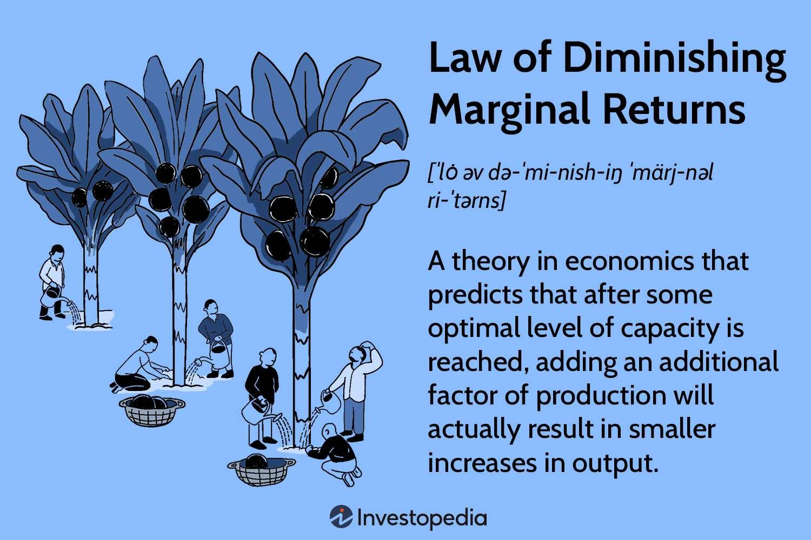

Algorithmic trading (algo trading) has fundamentally transformed financial markets by enhancing trading efficiency and execution speed. This transformation is underpinned by complex algorithms that analyze market data and execute trades at speeds and frequencies impossible for human traders. Despite these advancements, algorithmic trading is not immune to the fundamental economic principles that govern all market activities. Among these principles is the law of diminishing returns, which traders frequently encounter, especially when they attempt to scale their trading strategies or optimize resource utilization.

The law of diminishing returns posits that as more effort or resources are invested in a particular area, the incremental benefits of these investments will eventually decrease. For traders, this means that increasing investment—whether in the form of capital allocation, computational power, or data acquisition—does not consistently result in proportional gains. Recognizing and understanding how diminishing and marginal returns manifest in the context of algorithmic trading is crucial for effective decision-making and strategic optimization.



Economic principles like these are not just theoretical—they have concrete implications for trading algorithms and strategies. As such, an analysis of these principles can provide valuable insights for traders, enabling them to optimize their approaches to achieve better results. This article explores these aspects, focusing on real-world applications and insights that can help traders refine their tactics and make more informed decisions about their algorithmic strategies. Traders equipped with this knowledge can enhance their trading methodologies, ensuring more robust performance and maximizing profitability over the long term.

## Table of Contents

## Understanding the Law of Diminishing Returns

The law of diminishing returns is a fundamental economic principle describing a situation where, after a certain threshold, continuous investment in a particular area yields progressively smaller incremental gains. Initially, as more resources or inputs are allocated, the output or benefit significantly increases. However, a point is eventually reached where each additional unit of input yields less and less additional output, culminating in a decline of efficiency and productivity gains.

In theoretical terms, consider a production process where inputs are added to a fixed resource. Initially, the additional output, $\Delta Y$, from each new unit of input, $\Delta X$, increases, meaning the marginal product of input, $\frac{\Delta Y}{\Delta X}$, rises. Yet, once we surpass an optimal input level, $X^*$, this marginal product begins to fall, reflecting the onset of diminishing returns:

$$

\frac{\Delta Y}{\Delta X} = \text{maximized at } X^* \quad \text{and then declines as } X > X^*.
$$

Manufacturing and agriculture are classic examples where diminishing returns are observed: adding more workers or fertilizer initially increases output, but beyond a certain point, these additions result in overcrowding or over-saturation, decreasing efficiency and productivity.

Financial markets are not immune to this principle. In trading, particularly [algorithmic trading](/wiki/algorithmic-trading), continuously pouring more capital into a single strategy or increasing computational power will not linearly increase returns. Instead, the additional profits generated from these extra investments dwindle as other factors such as market [liquidity](/wiki/liquidity-risk-premium), competition, and strategy saturation come into play.

Recognizing when diminishing returns initiate is crucial for resource allocation. It helps traders and investors make informed decisions about when to halt or reconsider further investments to avoid wasteful expenditure on strategies already at peak efficiency. This awareness also prompts resource reallocation towards more productive areas, optimizing the overall impact of investments.

## The Concept of Marginal Returns

Marginal returns refer to the additional output resulting from an extra unit of input in a production process. In algorithmic trading, this concept is pivotal to understanding the profitability and efficiency associated with incremental investments or efforts. Marginal returns help in quantifying the benefit gained from investing additional resources, whether these are in terms of capital, computational power, or refined algorithms.

For traders, analyzing marginal returns is crucial for determining the optimal level of investment in their trading strategies. The main objective is to identify the point at which an extra investment's return is most lucrative before the onset of diminishing returns. This involves examining how additional capital affects the performance metric of the algorithm, such as the Sharpe ratio, average return, or risk-adjusted return.

In practice, traders often employ quantitative methods to evaluate marginal returns. Consider a scenario where a trader increases their capital by a [factor](/wiki/factor-investing) of $k$ and observes the resulting change in average returns. The marginal return can be understood through the formula:

$$
MR = \frac{\Delta R}{\Delta I}
$$

where $\Delta R$ represents the change in returns and $\Delta I$ represents the change in investment. A positive $MR$ suggests increased efficiency, while a decreasing $MR$ signals that returns are starting to level off relative to investments, indicating that the strategy is approaching its optimal capacity.

To automate this analysis, one might use a Python script to simulate various levels of investment and their corresponding returns. Here's a simple way to structure such a simulation:

```python
import numpy as np

# Simulate returns for different levels of investment
investment_levels = np.linspace(1, 10, num=10)  # Simulate scaling up investment
base_return = 0.05  # Base return for a unit investment

# Hypothetical function modeling diminishing marginal returns
def calculate_return(investment):
    return base_return * np.log1p(investment)  # Logarithmic growth to simulate diminishing returns

# Calculate marginal returns
marginal_returns = []

for i in range(1, len(investment_levels)):
    marginal_return = (calculate_return(investment_levels[i]) - calculate_return(investment_levels[i-1])) / (investment_levels[i] - investment_levels[i-1])
    marginal_returns.append(marginal_return)

print("Investment Levels:", investment_levels[1:])
print("Marginal Returns:", marginal_returns)
```

This practical approach enables traders to visualize how their strategies perform under different conditions and adjust accordingly to maximize output. Understanding and calculating marginal returns—both theoretically and through empirical simulations—are indispensable for aligning investment strategies with market dynamics and enhancing algorithmic trading outcomes.

## Applying Diminishing and Marginal Returns to Algo Trading

Algorithmic trading incorporates a blend of economic principles and advanced computing to optimize trading strategies and increase profitability. However, scaling up these strategies isn't always directly proportional to profit increase due to diminishing and marginal returns. 

As traders allocate more capital or leverage greater computational resources, they may notice a decline in effectiveness. This phenomenon can be explained through the lens of the law of diminishing returns, where increased inputs lead to reduced incremental gains. In the context of algorithmic trading, this might manifest as more complex algorithms that demand extensive computational resources resulting in higher costs without a proportionate increase in trade execution success or profit margins.

For instance, consider a trading algorithm initially designed to operate with a capital of $100,000. Scaling this algorithm to $1,000,000 might not yield ten times the profits due to increased transaction costs, market liquidity constraints, and the algorithm's inability to exploit market inefficiencies at a larger scale. The diminishing returns become evident when additional capital only marginally increases profitability, meaning the additional input resources do not enhance output as expected.

To concretely model this, let's say the profit function $P$ in terms of input investment $I$ is characterized as:

$$
P(I) = a \cdot \log(b + I)
$$

Where $a$ and $b$ are constants that describe the algorithm's performance parameters. With this logarithmic function, the initial increment in investment might significantly boost profits, but subsequent increases yield progressively smaller output gains, illustrating diminishing returns.

The principle of marginal returns also plays a critical role in assessing algorithmic trading strategies. Marginal return in this context can be defined as the additional profit gained from an incremental dollar invested in the trading algorithm. Monitoring marginal returns helps traders determine the optimal level of investment, thereby maximizing profit.

Understanding these economic principles aids traders in deciding when additional investments are no longer beneficial. For example, if incremental computational power fails to improve an algorithm's predictive accuracy due to algorithmic saturation or market conditions, it might be more strategic to diversify into new algorithms or markets.

By recognizing and analyzing when additional investments lead to lower marginal gains, traders can optimize their portfolios and allocation of resources, ensuring their trading strategies remain effective and profitable.

## Optimization Strategies in the Face of Diminishing Returns

Traders seeking to mitigate the effects of diminishing returns in algorithmic trading can adopt a variety of optimization strategies to enhance performance and profitability. One effective method is the diversification of algorithms. By deploying multiple trading algorithms that vary in strategy and market focus, traders can reduce the impact of diminishing returns from any single strategy. Diversification allows the allocation of resources across different approaches, thereby increasing the overall robustness of the trading system.

Periodic strategy reviews are another crucial component. These reviews involve assessing the performance of each algorithm over time, ensuring that they remain aligned with current market conditions. Market dynamics can change swiftly, rendering previously successful strategies less effective. Regular evaluations and modifications help traders adapt to these changes, maintaining the relevance and effectiveness of their trading algorithms.

Backtesting is a powerful technique employed to anticipate diminishing returns. By testing trading algorithms using historical data, traders can gain insights into how a strategy would have performed under various market conditions. This process not only aids in understanding potential weaknesses but also helps in refining algorithms by identifying parameters that might lead to suboptimal performance. Backtesting serves as a crucial step in validating the strategies before deploying them in live markets.

Monitoring and adjusting algorithmic parameters are also vital to maintaining a competitive edge. Algorithms need to be dynamic, with parameters tuned to respond to evolving market conditions. This might involve adjusting risk controls, execution speeds, and other critical factors that influence trading outcomes. The process can be automated using programming languages like Python, enabling real-time parameter adjustments based on predefined metrics.

Python code for [backtesting](/wiki/backtesting) and parameter adjustment might look like this:

```python
import pandas as pd

# Load historical data
data = pd.read_csv('historical_data.csv')

# Define strategy parameters
initial_capital = 100000
strategy_parameters = {'short_window': 40, 'long_window': 100}

# Backtesting function
def backtest_strategy(data, initial_capital, params):
    data['short_mavg'] = data['Close'].rolling(window=params['short_window'], min_periods=1).mean()
    data['long_mavg'] = data['Close'].rolling(window=params['long_window'], min_periods=1).mean()

    # Generate signals
    data['signal'] = 0
    data['signal'][params['short_window']:] = \
        np.where(data['short_mavg'][params['short_window']:] > data['long_mavg'][params['short_window']:], 1, 0)

    # Calculate returns
    data['returns'] = data['Close'].pct_change()
    data['strategy_returns'] = data['signal'].shift(1) * data['returns']

    # Calculate cumulative returns
    data['cumulative_strategy_returns'] = (1 + data['strategy_returns']).cumprod()*initial_capital

    return data['cumulative_strategy_returns'][-1]  # Final portfolio value

# Run backtest
final_returns = backtest_strategy(data, initial_capital, strategy_parameters)
print(f"Final Portfolio Value: ${final_returns:.2f}")
```

This sample Python code demonstrates how traders can conduct backtesting, providing valuable insights into the strategy's performance over historical data, therefore informing parameter adjustments. Such adjustments can help prevent diminishing returns by keeping the algorithms finely tuned and responsive to market conditions.

## Case Studies and Examples

Algorithmic trading strategies are often subject to diminishing and marginal returns, which can significantly affect a trader's profitability. To better understand the practical implications of these economic principles, let us examine real-world examples that showcase how successful traders and firms navigate these challenges.

### Case Study 1: High-Frequency Trading Firm

Consider a high-frequency trading ([HFT](/wiki/high-frequency-trading-strategies)) firm specializing in [arbitrage](/wiki/arbitrage) opportunities across different exchanges. Initially, with a moderate level of computational resources and capital, the firm experiences substantial returns due to minimal competition. However, as the firm scales its operations by investing in more servers and capital, it observes a stark reality: returns on incremental investments start to diminish.

For example, if the firm's initial investment of $1 million yields a 20% return, an additional $1 million investment might only generate a 15% return due to increased market impact and competition. This scenario is explained by the formula for marginal return, $MR = \frac{\Delta TR}{\Delta Q}$, where $TR$ is the total return and $Q$ is the quantity of investment.

### Case Study 2: Quantitative Hedge Fund

A quantitative [hedge fund](/wiki/hedge-fund-trading-strategies) employs complex algorithms to trade equity markets using a factor-based strategy. Initially, the strategy capitalizes well on small-cap stocks due to their higher [volatility](/wiki/volatility-trading-strategies) and mispricing opportunities. However, as fund assets grow, large trades start impacting stock prices, leading to slippage and execution costs that erode profitability.

The fund addresses these diminishing returns by diversifying its strategies and investments across different asset classes. This not only mitigates the market impact on small-cap stocks but also opens new avenues for profitability. Moreover, the fund regularly conducts backtesting and calibrates algorithmic parameters to adapt to changing market conditions.

### Case Study 3: Retail Trader Algorithm Adjustment

A retail trader developed an algorithm focusing on [momentum](/wiki/momentum) trading in [forex](/wiki/forex-system) markets. Initially, the algorithm achieved exceptional returns due to precise entry and [exit](/wiki/exit-strategy) points. Yet, upon scaling up the investment capital, the trader noticed a reduction in returns. The diminished marginal returns were attributable to increased slippage and latency issues in trade execution.

To counteract these effects, the trader adjusted the algorithm's parameters, including reducing trade frequency and optimizing latency by changing brokers to one with faster execution speeds. Additionally, the trader applied [machine learning](/wiki/machine-learning) techniques to refine the prediction model, which restored some level of profitability.

### Lessons Learned

These case studies highlight the importance of understanding economic principles when engaging in algorithmic trading. Traders and firms must be vigilant in recognizing the onset of diminishing returns and be prepared to adapt strategies accordingly. This may involve diversifying trading strategies, optimizing trade execution, or incorporating advanced data analytics for better prediction models. By doing so, they can strive to maintain a competitive edge and harness the full potential of their algorithmic investments.

## Conclusion

The principles of diminishing and marginal returns significantly affect the performance and profitability of algorithmic trading. By grasping these economic concepts, traders can make informed decisions that optimize their strategies and resources. In algorithmic trading, the law of diminishing returns implies that while increasing inputs like capital or computational resources can initially lead to higher profits, there is a point beyond which the incremental benefits start to wane. Recognizing this threshold allows for more effective resource allocation, avoiding unnecessary expenses without corresponding uplifts in trading outcomes.

Awareness of these dynamics is crucial because the financial markets are inherently competitive, with constant technological advancements and strategic iterations. By evaluating marginal returns, traders gain insights into the maximum potential of additional investments before returns start to marginally decline. This understanding not only aids in setting optimal investment levels but also informs the design and adjustment of trading algorithms to ensure they remain effective under changing conditions.

For example, traders can leverage this knowledge to diversify their algorithmic strategies, ensuring not all resources are allocated to a single, possibly over-optimized strategy. They can also use tools such as backtesting to simulate different scenarios and identify the point of diminishing returns, thus enabling smarter strategic pivots. Thus, cultivating an awareness of when additional investments no longer yield significant returns is crucial for achieving long-term success in algorithmic trading. This proactive approach facilitates not only the preservation of gains but also the continual enhancement of trading efficiency and performance over time.

## References & Further Reading

[1]: Bergstra, J., Bardenet, R., Bengio, Y., & Kégl, B. (2011). ["Algorithms for Hyper-Parameter Optimization."](https://papers.nips.cc/paper/4443-algorithms-for-hyper-parameter-optimization) Advances in Neural Information Processing Systems 24.

[2]: ["Advances in Financial Machine Learning"](https://www.amazon.com/Advances-Financial-Machine-Learning-Marcos/dp/1119482089) by Marcos Lopez de Prado

[3]: ["Evidence-Based Technical Analysis: Applying the Scientific Method and Statistical Inference to Trading Signals"](https://www.amazon.com/Evidence-Based-Technical-Analysis-Scientific-Statistical/dp/0470008741) by David Aronson

[4]: ["Machine Learning for Algorithmic Trading"](https://github.com/stefan-jansen/machine-learning-for-trading) by Stefan Jansen

[5]: ["Quantitative Trading: How to Build Your Own Algorithmic Trading Business"](https://books.google.com/books/about/Quantitative_Trading.html?id=j70yEAAAQBAJ) by Ernest P. Chan