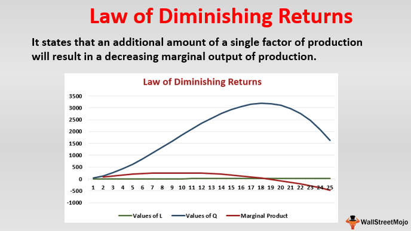

Algorithmic trading, a practice that leverages computer algorithms to execute trades at speeds and efficiencies unattainable by human traders, has fundamentally transformed financial markets. By automating the trading process, algorithmic trading facilitates the rapid buying and selling of financial instruments, exploiting minor pricing discrepancies and liquidity gaps. This methodology has revolutionized market dynamics by increasing trading volumes, narrowing bid-ask spreads, and enhancing market liquidity. The profound impact of algorithmic trading has led to significant improvements in market efficiency, while also presenting challenges such as increased market volatility and the potential for systemic risk.

In the context of economic theory, the concepts of diminishing marginal returns and returns to scale are pivotal. Diminishing marginal returns describe the phenomenon where, after a certain point, each additional unit of input yields progressively smaller increments of output. Mathematically, if $f(x)$ represents the production function, diminishing marginal returns are observed when the second derivative ($f''(x)$) is negative. Conversely, returns to scale examine how the change in output corresponds to a proportional change in all inputs. If doubling inputs results in doubling the output, this is described as constant returns to scale; more than doubling the output indicates increasing returns to scale, while less than doubling suggests decreasing returns to scale.



These economic principles are crucial in understanding and optimizing algorithmic trading strategies. As traders scale their operations, they may encounter diminishing marginal returns, where additional capital or computational resources do not proportionately increase profitability. This occurs due to factors such as market capacity constraints, increased competition, and the limitations of existing trading algorithms. Understanding returns to scale helps traders assess whether increasing trading scale leads to efficiency gains or merely amplifies costs. Thus, integrating these concepts into trading strategy development facilitates the design of more efficient and adaptable trading systems, ensuring sustained competitive advantage in dynamic financial markets.

## Table of Contents

## Understanding Economic Concepts: Returns to Scale and Diminishing Marginal Returns

Returns to scale and diminishing marginal returns are foundational concepts in economic theory, particularly within production environments. These concepts are integral to understanding how inputs influence output levels and the efficiency of resource allocation.

### Returns to Scale

Returns to scale refer to the changes in output as all input factors are scaled up or down proportionally. In mathematical terms, if production function $F(K, L)$ denotes capital $K$ and labor $L$, then it expresses returns to scale as follows:

- **Constant Returns to Scale (CRS):** If output increases by the same proportion as inputs, i.e., $F(aK, aL) = aF(K, L)$.

- **Increasing Returns to Scale (IRS):** If output increases by a greater proportion than the inputs, i.e., $F(aK, aL) > aF(K, L)$.

- **Decreasing Returns to Scale (DRS):** If output increases by a lesser proportion than inputs, i.e., $F(aK, aL) < aF(K, L)$.

In a production environment, understanding these concepts helps businesses determine how to efficiently scale operations. For example, firms experiencing increasing returns to scale may benefit from expanding production since larger operations lead to lower average costs.

### Diminishing Marginal Returns

Diminishing marginal returns describe a phenomenon where the increment of an input, while keeping other inputs constant, leads to smaller increases in output. It typically kicks in when optimal capacity utilization is exceeded. Mathematically, consider the production function $F(K, L)$, where the marginal product of labor $MP_L$ is $\frac{\partial F}{\partial L}$. If $\frac{\partial^2 F}{\partial L^2} < 0$, diminishing marginal returns sets in.

This principle is critical for resource allocation and productivity as it implies that adding more of a single [factor](/wiki/factor-investing), such as labor or capital, leads to less proportional output. Consequently, firms must strategically allocate resources to maximize productivity efficiently.

### Short-term vs. Long-term Production Metrics

In the short term, firms encounter fixed factors of production, leading to diminishing marginal returns as variable inputs increase. This period helps analyze immediate output impacts and optimize short-term resource deployment.

Conversely, in the long term, all production factors are variable, and firms can adjust all inputs to achieve optimal production levels. In this scenario, firms can exploit returns to scale to strategically expand their operations and achieve greater efficiency. Long-term analysis aids in planning and investment decisions, enabling better-prepared handling of industry shifts and economic changes.

Understanding returns to scale and diminishing marginal returns allows businesses to make informed decisions on scaling and operation modifications, optimizing production for both immediate and strategic gains.

## Application of Returns to Scale and Diminishing Marginal Returns in Algo Trading

Algorithmic trading, or algo trading, has significantly transformed the landscape of financial markets by leveraging computer algorithms to automate complex trading strategies. However, as traders endeavor to enhance returns, they may encounter challenges related to diminishing returns when scaling their strategies. This phenomenon can obstruct profitability and efficiency as traders increase inputs such as capital or computational resources.

### Diminishing Returns in Algo Trading

Diminishing returns in [algorithmic trading](/wiki/algorithmic-trading) occur when incremental resources, whether capital or computational power, lead to progressively smaller increases in profit. Initially, additional investments might yield substantial gains, but beyond a certain point, the ratio of input to output becomes less favorable.

### Impact on Profitability

**1. Capital Allocation**

In algorithmic trading, an increase in capital can lead to a proportional increase in order size. However, markets have limited depth, and large orders can lead to slippage—where the execution price deviates from the expected price. Slippage increases transaction costs, diminishing the additional profit that extra capital is supposed to generate. For instance, consider a scenario where doubling the trading capital results in a 10% increase in profit rather than the expected 100%, indicating diminishing marginal returns.

**2. Computational Resources**

Enhancing computational resources might improve the speed and complexity of trading strategies. However, beyond a certain point, improvements in latency or computational power may have negligible effects on profitability. For instance, transitioning from a latency of 1 millisecond to 0.5 milliseconds might not significantly impact execution quality if market conditions do not offer corresponding opportunities.

### Recognizing Unsustainable Investments

Traders can identify when further investments in capital or technology are yielding diminishing returns through systematic analysis and metrics tracking. Key indicators include:

- **Return on Investment (ROI) Analysis:** Regularly calculating ROI can help determine the effectiveness of additional investments. If ROI decreases with increased investment, it suggests diminishing returns.

- **Performance Metrics:** Measuring metrics such as slippage, execution speed, and transaction costs in relation to capital size or computational inputs can provide insights. Aconsistent increase in these metrics with higher levels of input indicates diminishing effectiveness.

- **Backtesting Results:** Conducting detailed backtesting by simulating various capital levels or computational configurations can reveal points where performance plateaus or declines.

```python
# Example: Simple illustration of diminishing returns due to slippage
capital_sizes = [100000, 200000, 500000, 1000000]  # Capital in USD
expected_returns_without_slippage = [0.10, 0.10, 0.10, 0.10]  # 10% return without slippage
recorded_returns_with_slippage = [0.10, 0.095, 0.085, 0.07]  # Recorded return due to slippage

# Calculate ROI with slippage
roi_with_slippage = [(capital * return_) for capital, return_ in zip(capital_sizes, recorded_returns_with_slippage)]

# Output
for (capital, roi) in zip(capital_sizes, roi_with_slippage):
    print(f"Capital: {capital}, ROI with Slippage: {roi:.2f}")
```

As traders analyze the effects of increasing capital and computational resources, they must recognize when scaling efforts become burdensome rather than beneficial. By doing so, they can allocate resources more effectively, prioritizing optimizations that truly enhance strategy performance and maintain profitability in the competitive environment of algorithmic trading.

## Optimization Strategies in Algo Trading

Diversification in trading strategies is crucial for mitigating the effects of diminishing marginal returns in algorithmic trading. By deploying a diverse set of strategies, traders can distribute risk and potentially enhance their return on investment. Diversifying across multiple asset classes, time frames, and trading algorithms decreases the dependency on any single strategy's performance. This approach not only stabilizes returns but also provides a buffer against market [volatility](/wiki/volatility-trading-strategies) and unexpected changes in market conditions.

Backtesting is an essential component for ensuring the effectiveness of trading strategies. It involves simulating a trading strategy using historical data to evaluate its performance. Backtesting allows traders to test their strategies against various market conditions and identify potential weaknesses. A well-structured [backtesting](/wiki/backtesting) process enables traders to predict the future performance of their strategies with greater accuracy. However, it's essential to conduct periodic strategy reviews to accommodate changes in market dynamics and ensure that the strategies remain relevant and effective. These reviews should focus on the performance metrics of the strategies, such as the Sharpe ratio, maximum drawdown, and return on investment.

Parameter adjustments play a crucial role in maintaining competitiveness in algorithmic trading. As market conditions evolve, the assumptions and parameters underpinning trading algorithms may become obsolete. Regularly updating these parameters ensures that the algorithms are responsive to current market signals. To streamline this process, traders can automate parameter adjustments using [machine learning](/wiki/machine-learning) techniques. Automation can involve optimizing hyperparameters within the algorithms or adjusting the weights of different strategies in a portfolio dynamically.

For instance, a trader might use Python programming to implement an automated system that adjusts strategy parameters based on real-time market data. The system could leverage libraries such as `NumPy` for numerical computations, `pandas` for data manipulation, and `scikit-learn` for machine learning tasks. Here is a simple example of how such automation might be coded in Python:

```python
import numpy as np
import pandas as pd
from sklearn.model_selection import GridSearchCV
from sklearn.ensemble import RandomForestClassifier

# Example data: features and target
data = pd.DataFrame(...)
features = data[['feature1', 'feature2', 'feature3']]
target = data['target']

# Define model and parameters for optimization
model = RandomForestClassifier()
param_grid = {
    'n_estimators': [100, 200, 300],
    'max_depth': [5, 10, 15],
    'min_samples_split': [2, 5, 10]
}

# Set up grid search for parameter tuning
grid_search = GridSearchCV(model, param_grid, cv=5, scoring='accuracy')
grid_search.fit(features, target)

# Best parameters for the model
best_params = grid_search.best_params_
print("Optimized parameters:", best_params)

# Update trading strategy parameters
trading_strategy.update_params(best_params)
```

This code snippet illustrates automating the parameter optimization process during strategy development. It employs a grid search to find the optimal hyperparameters for a random forest model based on historical data, which can then be applied to refine trading strategies.

Overall, diversification, systematic backtesting, and automated parameter adjustments constitute a comprehensive approach to strategy optimization in algorithmic trading. These practices enable traders to enhance performance, manage risks effectively, and adapt dynamically to shifting market conditions, thereby addressing the challenges posed by diminishing marginal returns.

## Case Studies: Lessons from the Real World

### Case Studies: Lessons from the Real World

The application of algorithmic trading in financial markets has faced challenges, notably from diminishing returns as strategies scale. This section analyzes the experiences of different types of market participants, including high-frequency trading firms, quantitative hedge funds, and retail traders, highlighting their strategies for addressing diminishing returns.

**High-Frequency Trading Firm: Handling Diminishing Returns**

High-frequency trading ([HFT](/wiki/high-frequency-trading-strategies)) firms rely heavily on speed and [volume](/wiki/volume-trading-strategy) to execute numerous transactions within microseconds. An HFT firm noticed a plateau in profitability as they scaled their operations, attributed to network latency and increased competition. The firm's approach to manage diminishing returns involved technology upgrades to reduce latency and enhance execution speed. Another tactic involved optimizing data centers' geographic placement to minimize communication lag with major exchanges. Additionally, the firm diversified its strategies by incorporating machine learning models that adapt to market changes, thus reducing dependency on any single trading strategy.

**Quantitative Hedge Fund: Strategies for Sustaining Profitability**

A quantitative [hedge fund](/wiki/hedge-fund-trading-strategies) focused on statistical [arbitrage](/wiki/arbitrage) strategies identified a decline in marginal gains as they increased capital deployment. To address this, the fund diversified its portfolio across multiple asset classes and geographic markets, diluting concentration risk and discovering new arbitrage opportunities. The fund also employed advanced algorithmic techniques, such as [reinforcement learning](/wiki/reinforcement-learning), to optimize decision-making processes dynamically. Regular backtesting and simulation of strategies enabled the fund to recalibrate its algorithms, ensuring alignment with market conditions.

Python code snippet for a basic reinforcement learning model used in trading:

```python
import numpy as np

class TradingEnvironment:
    def __init__(self, prices):
        self.prices = prices
        self.position = 0
        self.cash = 10000 
        self.inventory = []

    def step(self, action):
        current_price = self.prices[self.position]
        reward = 0

        if action == "buy" and self.cash >= current_price:
            self.inventory.append(current_price)
            self.cash -= current_price
            reward = -current_price  
        elif action == "sell" and len(self.inventory) > 0:
            purchase_price = self.inventory.pop(0)
            reward = current_price - purchase_price
        self.position += 1
        done = self.position == len(self.prices)
        return reward, done

    def reset(self):
        self.position = 0
        self.cash = 10000
        self.inventory = []

# Simulation of trading environment would follow, using the defined environment
prices = np.random.random(100) * 100  
env = TradingEnvironment(prices)
```

**Retail Trader: Algorithm Adjustments**

Retail traders, operating on a smaller scale, often encounter diminishing marginal gains more swiftly due to limited resources. A retail trader optimized their algorithm by focusing on niche markets where competition was less intense. This trader utilized trend-following algorithms to exploit price movements in less liquid stocks. They also implemented periodic reviews and adjustments to their trading parameters, ensuring the algorithm remained responsive to specific market conditions. By leveraging cloud-based solutions for computational power, the trader effectively managed the cost of scaling while maintaining algorithm efficacy.

In summary, differing strategies are required to cope with diminishing returns in algorithmic trading depending on the player's scale and resources. High-frequency trading firms enhance technology and strategy diversification, quantitative hedge funds expand asset classes and refine algorithmic techniques, and retail traders concentrate on niche markets and adaptive parameterization.

## Conclusion

Understanding economic concepts such as returns to scale and diminishing marginal returns is critical in optimizing algorithmic trading strategies. Returns to scale describe how output changes when the scale of all inputs is altered proportionally. Recognizing this helps traders design strategies that efficiently utilize resources while accommodating increased trading volume. Diminishing marginal returns highlight the reduction in output per additional unit of input, underscoring the importance of monitoring and adjusting strategies as resources like capital or computational power are increased.

Algorithmic traders face the challenge of balancing these dynamics to maintain profitability. Continuous adaptation and optimization are essential to ensure long-term success. This involves regularly evaluating the performance and effectiveness of trading strategies, adapting to market changes, and integrating new data feeds or technologies. Employing advanced data analysis and machine learning techniques can automate these adjustments, ensuring strategies remain competitive.

Recognizing diminishing returns is pivotal for effective resource allocation and strategic decision-making. By identifying the point at which additional resources do not proportionately increase performance, traders can optimize their resource management, avoiding wasteful investments. This strategic insight fosters an environment of sustainability and growth, essential in the fast-paced landscape of financial markets.

## References & Further Reading

[1]: Bergstra, J., Bardenet, R., Bengio, Y., & Kégl, B. (2011). ["Algorithms for Hyper-Parameter Optimization."](https://papers.nips.cc/paper/4443-algorithms-for-hyper-parameter-optimization) Advances in Neural Information Processing Systems 24.

[2]: ["Advances in Financial Machine Learning"](https://www.amazon.com/Advances-Financial-Machine-Learning-Marcos/dp/1119482089) by Marcos Lopez de Prado

[3]: ["Evidence-Based Technical Analysis: Applying the Scientific Method and Statistical Inference to Trading Signals"](https://www.amazon.com/Evidence-Based-Technical-Analysis-Scientific-Statistical/dp/0470008741) by David Aronson

[4]: ["Machine Learning for Algorithmic Trading"](https://github.com/stefan-jansen/machine-learning-for-trading) by Stefan Jansen

[5]: ["Quantitative Trading: How to Build Your Own Algorithmic Trading Business"](https://www.amazon.com/Quantitative-Trading-Build-Algorithmic-Business/dp/1119800064) by Ernest P. Chan