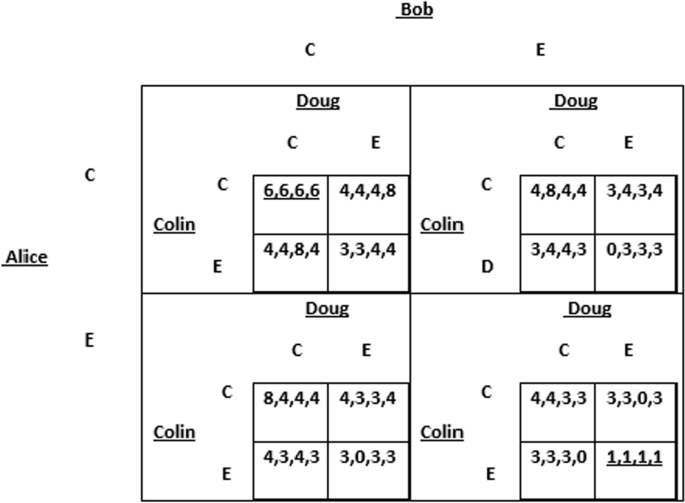

## Table of Contents

## What is the Diner's Dilemma?

The Diner's Dilemma is a situation where two people are trying to decide what to eat at a restaurant. They both want to pick something they will enjoy, but they also want to try new things. The problem is that if they both pick something new and it turns out to be bad, they will both be unhappy. But if one picks something new and the other picks something safe, at least one of them will be happy.

This dilemma shows how people can be afraid to take risks when they are not sure what will happen. It is like other situations where people have to make choices without knowing the outcome. The Diner's Dilemma helps us understand how people make decisions when they are unsure and want to balance trying new things with staying safe.

## How does the Diner's Dilemma relate to game theory?

The Diner's Dilemma is a lot like a game in game theory. In game theory, people are called players, and they make choices that affect each other. In the Diner's Dilemma, the two diners are the players. They have to decide whether to pick a new dish or a safe dish. Their choices affect how happy they will be with their meal. If both pick a new dish and it's bad, they both lose. If one picks a new dish and the other picks a safe dish, at least one of them wins.

This situation is similar to the famous Prisoner's Dilemma in game theory. In the Prisoner's Dilemma, two prisoners have to decide whether to confess or stay silent. If both stay silent, they get a light sentence. If one confesses and the other stays silent, the one who confesses gets off free while the other gets a heavy sentence. If both confess, they both get a heavy sentence. Just like in the Diner's Dilemma, the choices the prisoners make affect each other's outcomes. Both situations show how people can be afraid to take risks because they don't know what the other person will do.

## What are the basic components of the Diner's Dilemma?

The Diner's Dilemma involves two people who need to choose what to eat at a restaurant. They can pick something new or something they know is safe. The problem is they don't know if the new dish will be good or bad. If they both pick a new dish and it's bad, they will both be unhappy. If one picks a new dish and the other picks a safe dish, at least one of them will be happy with their meal.

This situation shows how people make choices when they are unsure about the outcome. They have to think about what the other person might choose and how that will affect their own happiness. It's like a game where each person's decision impacts the other. The Diner's Dilemma helps us understand how people balance the risk of trying something new with the safety of sticking to what they know.

## Can you explain the payoff matrix in the context of the Diner's Dilemma?

The payoff matrix in the Diner's Dilemma is a way to show how happy or unhappy each diner will be with their meal, depending on what they both choose to eat. Imagine a grid with two rows and two columns. The rows show what one diner chooses - either a new dish or a safe dish. The columns show what the other diner chooses - also either a new dish or a safe dish. Each box in the grid shows the happiness level for both diners based on their choices.

For example, if both diners choose a new dish and it turns out to be bad, the box might show low happiness for both of them. If one diner picks a new dish and it's bad, but the other picks a safe dish, the box might show low happiness for the one who tried the new dish and high happiness for the one who played it safe. This matrix helps us see that the best choice for each diner depends on what they think the other diner will do. It shows how their decisions affect each other and how they might try to guess what the other will choose to make the best decision for themselves.

## What strategies can players use in the Diner's Dilemma?

In the Diner's Dilemma, one strategy players can use is communication. Before deciding what to eat, the diners can talk about what they are thinking. They might agree to both try a new dish or both stick with something safe. By talking, they can make sure they are happy with their meal, no matter what they choose.

Another strategy is to take turns. One diner can pick a new dish this time, and the other can pick a new dish next time. This way, they both get to try new things without the risk of both being unhappy if the new dish is bad. It spreads out the risk and makes sure they both have a chance to enjoy something different.

A third strategy is to compromise. One diner might pick a new dish, but choose something that is not too different from what they usually eat. This way, they are trying something new but not taking a big risk. The other diner can then pick a safe dish, knowing that their friend is not taking a huge chance. This strategy helps balance the desire to try new things with the need to be safe.

## How does the Diner's Dilemma differ from the Prisoner's Dilemma?

The Diner's Dilemma and the Prisoner's Dilemma are both about choices and how they affect other people. In the Diner's Dilemma, two people at a restaurant have to decide if they want to try a new dish or stick with something safe. Their happiness depends on what they both choose. If they both try something new and it's bad, they are both unhappy. But if one tries something new and the other picks something safe, at least one of them will be happy. It's all about balancing the risk of trying something new with the safety of sticking to what you know.

The Prisoner's Dilemma is different because it's about two people who are in trouble with the law. They have to decide if they want to confess to a crime or stay silent. If both stay silent, they get a light sentence. If one confesses and the other stays silent, the one who confesses gets off free while the other gets a heavy sentence. If both confess, they both get a heavy sentence. The big difference is that in the Prisoner's Dilemma, the best choice for each person is to confess, even though they would both be better off if they stayed silent. In the Diner's Dilemma, there isn't a clear best choice, and it depends a lot on what the other person does.

## What are the Nash equilibria in the Diner's Dilemma?

In the Diner's Dilemma, Nash equilibria are situations where neither diner can be happier by changing their choice if the other diner's choice stays the same. There are two possible Nash equilibria in this scenario. The first one is when both diners pick a safe dish. If one diner switches to a new dish and it's bad, they will be less happy, so sticking with the safe dish is the best choice for both. The second Nash equilibrium happens when both diners pick a new dish, and it turns out to be good. If one diner switches to a safe dish, they might miss out on a good new dish, so picking the new dish is the best choice for both if it's good.

These Nash equilibria show that the best choice for each diner depends on what they think the other diner will do and how the new dish turns out. If both diners think the new dish will be bad, they will both pick a safe dish. If they both think the new dish will be good, they will both pick the new dish. The Diner's Dilemma helps us see how people make choices when they are not sure about the outcome and how they try to guess what the other person will do.

## How does the concept of fairness play into the Diner's Dilemma?

In the Diner's Dilemma, fairness is about making sure both diners are happy with their meal. If one diner always picks a new dish and the other always picks a safe dish, it might not seem fair. The diner who always tries new things takes all the risk, while the other diner always plays it safe. To make things fair, they could take turns trying new dishes. This way, both diners get a chance to try something different and share the risk of picking a bad dish.

Fairness also comes into play when the diners talk about what they want to eat. If they agree to both try a new dish or both pick a safe dish, they are making a fair choice together. If one diner feels like they are always giving in to what the other wants, it might not seem fair. By talking and making decisions together, they can find a fair way to choose their meals that makes both of them happy.

## What real-world scenarios can be modeled using the Diner's Dilemma?

The Diner's Dilemma can be used to understand many real-world situations where people have to make choices without knowing what will happen. For example, think about two friends who want to try a new restaurant. They don't know if the food will be good or bad. If they both try the new place and it's bad, they will both be unhappy. But if one goes to the new place and the other goes to a place they know is good, at least one of them will have a good meal. This is just like the Diner's Dilemma, where they have to decide if they want to take a risk on something new or stick with what they know is safe.

Another real-world scenario is when two business partners are thinking about investing in a new project. They don't know if the project will make money or lose money. If they both invest and the project fails, they both lose money. But if one invests in the new project and the other sticks with a safe investment, at least one of them will be happy with their choice. This situation is a lot like the Diner's Dilemma because it's about balancing the risk of trying something new with the safety of sticking to what you know.

## How do repeated interactions affect outcomes in the Diner's Dilemma?

When two people play the Diner's Dilemma over and over, it changes how they make choices. If they know they will eat together again, they might be more willing to try new dishes. They can take turns picking new or safe dishes, so both get a chance to try something different without always taking a big risk. This way, they can share the risk and make sure both are happy with their meals over time. They might also talk more about what they want to eat, making it easier to agree on trying new things or sticking to safe choices.

Repeated interactions also help build trust between the diners. If one diner always picks a safe dish and the other always tries something new, it might not seem fair. But if they keep eating together, they can find a way to balance their choices. They might agree to both try a new dish one time and both pick a safe dish the next time. This trust can make them more willing to take risks because they know the other person will help balance things out. Over time, this can lead to both diners being happier with their meals because they work together to make fair and fun choices.

## What are the limitations of the Diner's Dilemma as a model?

The Diner's Dilemma is a good way to think about choices, but it has some limits. It assumes that both diners only care about their own happiness and not about each other's. In real life, people often care about making their friends happy too. Also, the Diner's Dilemma doesn't think about other things that might affect choices, like how much money they have or if they have food allergies. These things can make a big difference in what they choose to eat.

Another limit is that the Diner's Dilemma makes it seem like the only choices are new or safe dishes. In real life, there are lots of other things to think about, like how hungry they are or what kind of food they like. The Diner's Dilemma also doesn't say much about what happens if they keep eating together. Over time, they might learn more about each other's tastes and be more willing to try new things. So, while the Diner's Dilemma helps us understand choices, it doesn't cover everything that can affect what people decide to eat.

## How can advanced mathematical models enhance the analysis of the Diner's Dilemma?

Advanced mathematical models can help us understand the Diner's Dilemma better by looking at more than just what each diner picks to eat. These models can think about things like how much each diner likes trying new things, how much they trust each other, and how much they care about the other person's happiness. By adding these details, the models can show us how different choices might lead to different outcomes over time. For example, if one diner really likes trying new food and the other doesn't, the model can help us see how they might work together to make choices that make them both happy.

These models can also look at what happens if the diners eat together many times. They can show how the diners might start to trust each other more and be willing to take bigger risks with their food choices. By using numbers and equations, these models can predict how happy the diners will be with their meals over many dinners. This can help us see that it's not just about one meal, but about how they make choices together over time. Advanced models make the Diner's Dilemma more like real life, where people learn from each other and change their choices based on what happens.

## What is the relationship between Game Theory and the Diner's Dilemma?

Game theory is a branch of mathematics that studies the strategic interactions between individuals or entities, where the success of each participant's decision depends critically on the choices made by others. In economic contexts, such as the diner's dilemma, game theory helps explore the consequences of rational decision-making in scenarios where individual self-interest leads to less than optimal outcomes for all parties involved.

In the classic diner's dilemma, individuals agree to split the bill equally before deciding their orders. Given this setup, each participant is incentivized to indulge in more expensive dishes, hoping others will subsidize their choices. This results in a collectively higher bill, a situation worse for everyone than if each had ordered modestly, reflecting a suboptimal equilibrium. Game theory categorizes such scenarios where individual rationality leads to collective irrationality under the concept of Nash equilibrium, a state where no player can benefit by unilaterally changing their strategy assuming others' strategies remain unchanged.

Mathematically, consider $n$ diners and a set of strategies $S$ for each diner, where a strategy $s_i \in S$ dictates their meal choice. The payoff for each diner, $u_i(s_1, s_2, \ldots, s_n)$, depends on the collective strategy profile. A Nash equilibrium $(s_1^*, s_2^*, \ldots, s_n^*)$ is reached when:

$$
u_i(s_1^*, s_2^*, \ldots, s_n^*) \geq u_i(s_1, s_2, \ldots, s_n)
$$

for all possible strategies $s_i$. In the diner's dilemma, this equilibrium is inefficient from a group perspective, illustrating a key insight of game theory: the existence of strategic dominance where one strategy results in greater benefit over others regardless of opponents’ actions, often leading to inferior results for all.

Understanding the dynamics of the diner's dilemma is particularly significant in trading where individual actions can influence collective market outcomes. For instance, traders who act purely on self-interest may drive prices toward suboptimal levels, similar to the shared but inflated bill in the diner’s scenario. Recognizing such patterns allows traders to anticipate potential market movements and devise more effective strategies.

By emphasizing cooperative over competitive strategies, traders can potentially foster market conditions that improve overall outcomes. In aligning their strategies with those that avoid mutual detriments, such as bandwagon effects or price wars, traders can enhance market stability. Implementing cooperative strategies can mitigate the risk of self-interested actions leading to overall losses, encouraging a more collaborative approach to trading. This reflects the broader applications of game theory concepts, steering traders towards strategies that mitigate collective irrationality and achieve more sustainable outcomes.

## References & Further Reading

[1]: Osborne, M. J., & Rubinstein, A. (1994). ["A Course in Game Theory."](https://www.semanticscholar.org/paper/A-Course-in-Game-Theory-Osborne-Rubinstein/ef336fe9c04559654936413f4910a54b7ae5028c) The MIT Press.

[2]: Schelling, T. C. (1980). ["The Strategy of Conflict."](https://www.hup.harvard.edu/books/9780674840317) Harvard University Press.

[3]: Camerer, C. F. (2003). ["Behavioral Game Theory: Experiments in Strategic Interaction."](https://psycnet.apa.org/record/2003-06054-000) Princeton University Press.

[4]: Lopez de Prado, M. (2018). ["Advances in Financial Machine Learning."](https://www.amazon.com/Advances-Financial-Machine-Learning-Marcos/dp/1119482089) Wiley.

[5]: Aronson, D. R. (2007). ["Evidence-Based Technical Analysis: Applying the Scientific Method and Statistical Inference to Trading Signals."](https://onlinelibrary.wiley.com/doi/book/10.1002/9781118268315) Wiley.

[6]: Jansen, S. (2020). ["Machine Learning for Algorithmic Trading: Predictive Models to Extract Signals from Market and Alternative Data for Systematic Trading Strategies with Python."](https://github.com/stefan-jansen/machine-learning-for-trading) Packt Publishing.

[7]: Chan, E. (2008). ["Quantitative Trading: How to Build Your Own Algorithmic Trading Business."](https://github.com/ftvision/quant_trading_echan_book) Wiley Trading.