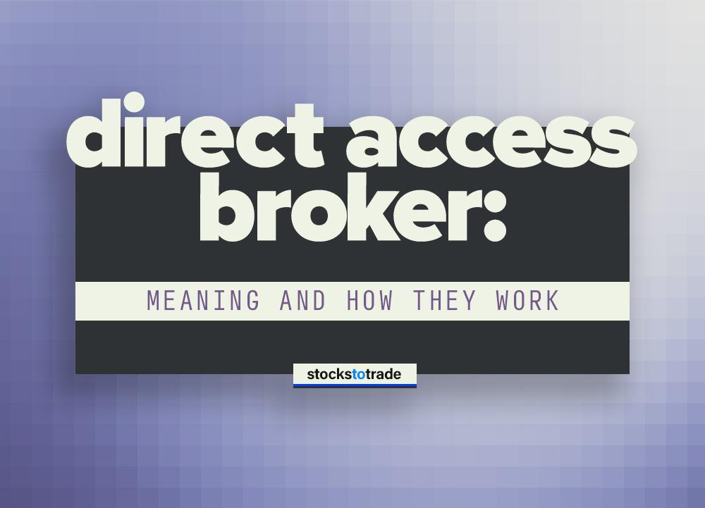

## Table of Contents

## What is a Direct Access Broker?

A Direct Access Broker is a type of brokerage firm that lets traders buy and sell stocks directly on the market. They use special software that helps traders make quick trades. This is different from regular brokers where you might have to wait longer to buy or sell.

These brokers are popular with people who trade a lot and want to do it fast. They can see the best prices and make trades in seconds. But, using a Direct Access Broker can be more complicated and might cost more than using a regular broker.

## How does a Direct Access Broker differ from a traditional broker?

A Direct Access Broker lets you trade stocks directly on the market using special software. This means you can see the best prices and make trades very quickly. It's like being right in the middle of the action, where you can choose exactly when and how to buy or sell. This is great for people who trade a lot and want to do it fast.

A traditional broker, on the other hand, acts more like a middleman. When you want to buy or sell a stock, you tell the broker, and they do it for you. This can take longer because you have to wait for the broker to make the trade. Traditional brokers are usually easier to use and might be cheaper, but they don't give you the same speed and control that a Direct Access Broker does.

## What are the key features of a Direct Access Broker?

A Direct Access Broker gives you fast and direct access to the stock market. It uses special software that lets you see the best prices for stocks and make trades very quickly. This is great for people who trade a lot and want to be in control of their trades. They can choose exactly when to buy or sell, and they don't have to wait for someone else to do it for them.

Using a Direct Access Broker can be more complicated than using a traditional broker. You need to learn how to use the software and understand the market well. It might also cost more because of the special tools and fast access you get. But for people who want speed and control, the benefits can be worth it.

## Who can benefit from using a Direct Access Broker?

People who trade a lot can really benefit from using a Direct Access Broker. If you like to buy and sell stocks often, this type of broker can help you do it quickly. You can see the best prices and make trades in seconds, which is important if you want to make money from small changes in stock prices.

Day traders, who buy and sell stocks within the same day, also find Direct Access Brokers very useful. They need to be fast and in control of their trades, and this type of broker gives them that. But, it's not just for professionals. Anyone who wants to learn more about trading and is willing to put in the time to understand how it works can benefit from using a Direct Access Broker.

## What are the typical fees associated with Direct Access Brokers?

Direct Access Brokers usually charge different kinds of fees. One common fee is the commission, which is what you pay every time you buy or sell a stock. This can be a flat fee or a percentage of the trade amount. Some brokers might charge less if you trade a lot, but it's still more than what you might pay with a traditional broker.

There can also be other fees like platform fees for using the special software, and data fees for getting real-time stock prices. These fees can add up, especially if you're trading a lot. It's important to check all the fees before you start using a Direct Access Broker so you know what you're paying for.

## How does one open an account with a Direct Access Broker?

Opening an account with a Direct Access Broker is a bit like opening a bank account, but with a few extra steps. First, you need to choose a Direct Access Broker that fits your needs. You can do this by looking at different brokers online, reading reviews, and comparing their fees and services. Once you've picked a broker, you'll go to their website and find the option to open an account. You'll need to fill out an application form with your personal information, like your name, address, and Social Security number.

After you submit your application, the broker will do a background check to make sure you're allowed to trade. This is called a "Know Your Customer" check, and it's something all brokers have to do. Once you're approved, you'll need to fund your account. This means you'll transfer money from your bank account to your new trading account. After your account is funded, you can start using the broker's special software to trade stocks directly on the market.

## What kind of trading platforms do Direct Access Brokers offer?

Direct Access Brokers offer special trading platforms that are designed to help you trade quickly and directly on the stock market. These platforms usually have a lot of tools and features that let you see real-time stock prices, make trades in seconds, and keep track of your trades. They often have charts and graphs that help you understand how stocks are doing, and you can set up alerts to notify you when a stock reaches a certain price.

Some popular trading platforms offered by Direct Access Brokers include platforms like DAS Trader, Sterling Trader, and Lightspeed Trader. These platforms are known for being fast and reliable, which is important when you're trying to make quick trades. They might look a bit complicated at first, but once you get used to them, you can use them to make smart trading decisions and manage your investments well.

## What are the risks involved in using a Direct Access Broker?

Using a Direct Access Broker can be risky because it lets you trade very quickly. If you make a mistake or don't understand the market well, you can lose money fast. The special software can be hard to use at first, and if you don't know how to use it right, you might make trades you didn't mean to make. Also, the fees can add up, especially if you trade a lot, and this can eat into your profits.

Another risk is that Direct Access Brokers give you a lot of control over your trades, but this also means you're responsible for everything that happens. If the market moves against you, you can lose money quickly. It's important to have a good plan and know what you're doing before you start trading with a Direct Access Broker. If you're not careful, the speed and control that make Direct Access Brokers useful can also make them dangerous.

## How can a Direct Access Broker help in executing complex trading strategies?

A Direct Access Broker can help you [carry](/wiki/carry-trading) out complex trading strategies by giving you fast and direct access to the stock market. With their special software, you can see real-time stock prices and make trades in seconds. This is really important if you want to use strategies like [scalping](/wiki/gamma-scalping), where you make lots of small trades to make money from small changes in stock prices. You can also use the software to set up stop-loss orders and take-profit orders, which help you manage your risk and lock in profits automatically.

Another way Direct Access Brokers help with complex strategies is by giving you tools to analyze the market. Their platforms often have charts, graphs, and other tools that let you study how stocks are doing and make smart trading decisions. For example, if you're using a strategy like pairs trading, where you buy one stock and sell another at the same time, you can use the platform to watch both stocks closely and make trades quickly when the time is right. This can make it easier to execute your strategy and potentially make more money.

## What regulatory considerations should be taken into account when using a Direct Access Broker?

When using a Direct Access Broker, it's important to know about the rules and regulations that apply. In the United States, the main regulator for stock trading is the Securities and Exchange Commission (SEC). They make sure that brokers follow the rules and that trading is fair. Direct Access Brokers have to follow these rules, like doing background checks on new customers and making sure they have enough money in their accounts before they can trade. They also have to report any suspicious activity to the authorities.

Another thing to think about is the Financial Industry Regulatory Authority (FINRA), which also oversees brokers and makes sure they follow the rules. FINRA checks that brokers are honest and that they treat their customers fairly. If you're using a Direct Access Broker, you should know that they are regulated by these organizations, and you can file a complaint with them if you think something is wrong. It's good to understand these regulations so you can trade safely and know your rights as a trader.

## How do Direct Access Brokers handle order routing and execution?

Direct Access Brokers handle order routing and execution by using special software that lets you send your trade orders directly to the stock market. When you want to buy or sell a stock, you use the broker's platform to choose the best price and send your order. The software then sends your order to the market very quickly, often in just a few seconds. This is different from traditional brokers, where your order might go through a middleman and take longer to reach the market.

The way Direct Access Brokers handle order routing can help you get better prices for your trades. Because you can see real-time prices and choose exactly where to send your order, you might be able to get a better deal than if you used a traditional broker. Some Direct Access Brokers also let you choose different ways to route your orders, like sending them to specific exchanges or using special trading algorithms. This can be useful if you have a complex trading strategy and want to make sure your orders are handled the way you want.

## What advanced tools and services do Direct Access Brokers provide to professional traders?

Direct Access Brokers give professional traders a lot of advanced tools and services to help them trade better. They offer special software with real-time data, charts, and graphs that help traders understand how stocks are doing. This software lets traders see the best prices and make trades very quickly, which is important for strategies like scalping or [day trading](/wiki/day-trading-spy). They also have tools for setting up stop-loss and take-profit orders, which can help manage risk and lock in profits automatically.

Another important service that Direct Access Brokers provide is the ability to route orders in different ways. Professional traders can choose where to send their orders, like to specific exchanges or through special trading algorithms. This can help them get better prices and execute their trading strategies more effectively. Plus, Direct Access Brokers often offer customer support from people who know a lot about trading, so professional traders can get help when they need it.

## References & Further Reading

[1]: Bergstra, J., Bardenet, R., Bengio, Y., & Kégl, B. (2011). ["Algorithms for Hyper-Parameter Optimization."](https://papers.nips.cc/paper/4443-algorithms-for-hyper-parameter-optimization) Advances in Neural Information Processing Systems 24.

[2]: ["Advances in Financial Machine Learning"](https://www.amazon.com/Advances-Financial-Machine-Learning-Marcos/dp/1119482089) by Marcos Lopez de Prado

[3]: ["Evidence-Based Technical Analysis: Applying the Scientific Method and Statistical Inference to Trading Signals"](https://www.amazon.com/Evidence-Based-Technical-Analysis-Scientific-Statistical/dp/0470008741) by David Aronson

[4]: ["Machine Learning for Algorithmic Trading"](https://github.com/stefan-jansen/machine-learning-for-trading) by Stefan Jansen

[5]: ["Quantitative Trading: How to Build Your Own Algorithmic Trading Business"](https://www.amazon.com/Quantitative-Trading-Build-Algorithmic-Business/dp/1119800064) by Ernest P. Chan