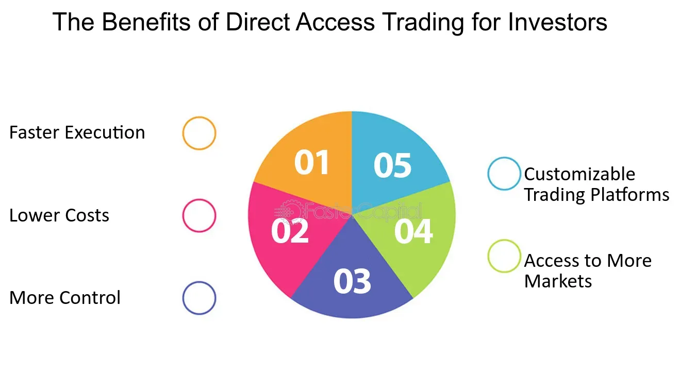

## Table of Contents

## What is Direct Access Trading?

Direct Access Trading, often called DAT, is a way for people to buy and sell stocks directly through electronic systems. Instead of using a traditional broker who might take a while to complete a trade, DAT lets you connect directly to the stock market. This means you can see the prices change in real-time and make your trades quickly. It's like being in the middle of the action, where you can decide exactly when to buy or sell.

DAT is popular among traders who want more control and speed. They use special software that shows them the best prices available from different places where stocks are traded. This can help them get better deals and make more money. However, DAT can be risky because it moves so fast and requires a good understanding of the market. It's not for everyone, but for those who know what they're doing, it can be a powerful tool.

## How does Direct Access Trading differ from traditional trading?

Direct Access Trading (DAT) and traditional trading are two different ways to buy and sell stocks. With traditional trading, you usually work with a broker who handles your trades for you. You tell them what you want to buy or sell, and they do it for you, often over the phone or through a slower online system. This can take some time, and you might not get the exact price you want because the broker might not act immediately.

On the other hand, Direct Access Trading lets you connect directly to the stock market using special software. This means you can see the prices changing in real-time and make your trades instantly. You have more control over when and at what price you buy or sell. DAT is faster and can help you get better prices, but it's also riskier because everything happens so quickly. You need to know what you're doing to use DAT effectively.

## What are the basic requirements to start Direct Access Trading?

To start Direct Access Trading, you need a few basic things. First, you need a computer with a good internet connection. This is because DAT uses special software that needs to work quickly to show you real-time prices and let you trade fast. You also need to open an account with a brokerage firm that offers direct access trading services. These firms give you the tools and access you need to trade directly on the stock market.

Second, you need to understand how the stock market works and be comfortable using the trading software. DAT can be tricky and moves very fast, so it's important to learn about trading strategies and how to manage risk. Some people take classes or practice with a demo account before they start trading with real money. Once you have these things in place, you can start using Direct Access Trading to buy and sell stocks directly.

## What platforms are commonly used for Direct Access Trading?

There are a few popular platforms that people use for Direct Access Trading. One of them is called [Interactive Brokers](/wiki/interactive-brokers-api). It's well-known because it gives traders a lot of tools and lets them connect to many different stock markets around the world. Another common platform is Lightspeed Trading. It's liked by many traders because it's fast and has good customer support. These platforms help traders see prices in real-time and make quick trades.

Another platform that's often used is E*TRADE Pro. It's good for people who want to trade directly but also want some help from their broker. E*TRADE Pro gives you the tools for DAT but also lets you talk to a broker if you need to. Lastly, there's Thinkorswim from TD Ameritrade. This platform is known for its powerful tools and the ability to customize it to fit how you like to trade. All these platforms make it easier for traders to get into Direct Access Trading and take control of their trades.

## What are the key features of Direct Access Trading platforms?

Direct Access Trading platforms have some key features that make them special. One important feature is real-time data. This means you can see the prices of stocks changing as they happen, which helps you make quick decisions. Another feature is the ability to route your orders directly to the stock market. This means you can choose exactly where and how your trades happen, which can help you get better prices. These platforms also often have tools for analyzing the market, like charts and indicators, which help you understand what's going on and make smarter trades.

Another key feature is speed. Direct Access Trading platforms are designed to be very fast, so your trades can happen almost instantly. This is important because in trading, even a few seconds can make a big difference. Many of these platforms also let you customize how they look and work, so you can set them up in a way that makes sense to you. This can make trading easier and more comfortable. Overall, these features help traders take control of their trades and try to make more money.

## How can Direct Access Trading improve trading speed and efficiency?

Direct Access Trading can make trading much faster and more efficient. When you use a Direct Access Trading platform, you connect directly to the stock market. This means you can see the prices of stocks changing right away, and you can make your trades very quickly. With traditional trading, you might have to wait for a broker to make your trade, which can take time. But with Direct Access Trading, you're in control, and you can act as soon as you see a good opportunity. This speed can help you get better prices and make more money.

Another way Direct Access Trading improves efficiency is by letting you choose exactly how and where your trades happen. You can pick the best place to buy or sell your stocks, which can save you money. The platforms also have tools that help you understand the market better, like charts and indicators. These tools can help you make smarter decisions faster. Overall, Direct Access Trading gives you more control and helps you trade more efficiently, which can lead to better results in the stock market.

## What are the potential cost savings associated with Direct Access Trading?

Direct Access Trading can help you save money in a few ways. One way is by letting you choose the best prices for your trades. When you use a Direct Access Trading platform, you can see prices from different stock markets and pick the one that's the cheapest. This can mean paying less to buy stocks and getting more money when you sell them. Also, since you're doing the trading yourself, you might not have to pay as much in broker fees. Traditional brokers often charge more because they do more work for you, but with Direct Access Trading, you're in control, so the fees can be lower.

Another way Direct Access Trading can save you money is by making your trades faster. In the stock market, even a few seconds can make a big difference in the price you get. With Direct Access Trading, you can act quickly when you see a good price, which can help you save money on each trade. Over time, these small savings can add up to a lot. Plus, the platforms often have tools that help you understand the market better, so you can make smarter trades and avoid losing money. All these things together can help you keep more of your money when you're trading stocks.

## What level of market access does Direct Access Trading provide?

Direct Access Trading gives you a lot of access to the stock market. When you use a Direct Access Trading platform, you can connect directly to different stock markets around the world. This means you can see prices changing in real-time and make your trades quickly. You can choose where to buy and sell your stocks, like on the New York Stock Exchange or NASDAQ, and pick the best price available. This level of access helps you get better deals and control your trades more closely.

With Direct Access Trading, you also get to see more of what's happening in the market. You can look at detailed information about the stocks you're interested in, like how many people are buying or selling them right now. This can help you make smarter decisions about when to trade. Plus, you can use special tools that show you charts and other data to understand the market better. This deep level of market access can make a big difference in how well you do when trading stocks.

## How does Direct Access Trading affect trade execution and order routing?

Direct Access Trading lets you control how your trades happen and where they go. When you use a Direct Access Trading platform, you can choose exactly where to send your order, like to the New York Stock Exchange or NASDAQ. This is called order routing. By [picking](/wiki/asset-class-picking) the best place to buy or sell, you can often get a better price for your stocks. It's like shopping around for the best deal, but you're doing it in seconds, not hours.

This control over order routing also makes your trades happen faster. With Direct Access Trading, you don't have to wait for a broker to make your trade. You can see the prices changing right away and make your move quickly. This speed can help you get the price you want before it changes. So, Direct Access Trading not only gives you more control over your trades but also helps you execute them faster and more efficiently.

## What are the risks involved in Direct Access Trading?

Direct Access Trading can be risky because it moves very fast. When you trade this way, you see prices changing in real-time and you have to make quick decisions. If you're not careful, you might buy or sell at the wrong time and lose money. It's easy to make mistakes when everything is happening so fast. Also, since you're in control, there's no broker to help you if you're not sure about something. This means you need to know a lot about the market to do well.

Another risk is that Direct Access Trading can be stressful. Watching the market all the time and making quick trades can make you feel nervous. If you let your feelings take over, you might make bad choices. Plus, the technology you use for trading can sometimes have problems. If your computer or internet connection isn't working right, you might miss out on good trades or make trades you didn't mean to. So, it's important to be ready for these risks and know how to handle them if you want to use Direct Access Trading.

## How can traders optimize their strategies using Direct Access Trading?

Traders can optimize their strategies using Direct Access Trading by taking advantage of the real-time data and fast trade execution. Since they can see prices changing right away, traders can spot good opportunities quickly. They can use this to buy or sell at the best possible times. The ability to route orders directly to different stock markets also helps. Traders can shop around for the best prices and save money on each trade. By using the tools that come with Direct Access Trading platforms, like charts and indicators, traders can make smarter decisions based on what's happening in the market.

Another way to optimize strategies is by practicing and learning. Direct Access Trading can be tricky, so it's a good idea to use a demo account to practice before trading with real money. This helps traders get used to the fast pace and learn how to manage their trades better. They can also take classes or read [books](/wiki/algo-trading-books) about trading to improve their skills. By combining this knowledge with the speed and control of Direct Access Trading, traders can create a plan that works well for them and helps them make more money in the stock market.

## What advanced tools and analytics are available in Direct Access Trading for expert traders?

Direct Access Trading platforms give expert traders a lot of advanced tools and analytics to help them trade better. One important tool is real-time market data, which lets traders see prices changing as they happen. This helps them make quick decisions and catch good opportunities right away. Another tool is Level II quotes, which show traders more details about the market, like how many people are buying or selling a stock at different prices. This can help traders understand what's going on and make smarter trades. There are also tools like hotkeys, which let traders make trades with just a few clicks, saving time and helping them act fast.

Expert traders also use advanced analytics like charting software, which shows them graphs and patterns in the market. These charts can help traders see trends and predict what might happen next. Many platforms have indicators and algorithms that can analyze the market and suggest when to buy or sell. These tools can make trading easier and help traders make better choices. By using all these advanced tools and analytics together, expert traders can create detailed strategies and improve their chances of making money in the stock market.

## References & Further Reading

[1]: Narang, R. K. (2013). ["Inside the Black Box: A Simple Guide to Quantitative and High-Frequency Trading."](https://onlinelibrary.wiley.com/doi/book/10.1002/9781118662717) Wiley.

[2]: Kissell, R. (Editor) (2013). ["The Science of Algorithmic Trading and Portfolio Management."](https://www.sciencedirect.com/book/9780124016897/the-science-of-algorithmic-trading-and-portfolio-management) Academic Press.

[3]: Aldridge, I. (2013). ["High-Frequency Trading: A Practical Guide to Algorithmic Strategies and Trading Systems."](https://onlinelibrary.wiley.com/doi/pdf/10.1002/9781119203803.fmatter) Wiley.

[4]: Hasbrouck, J., & Saar, G. (2013). ["Low-latency trading."](https://www.sciencedirect.com/science/article/abs/pii/S1386418113000165) The Review of Financial Studies, 26(9), 2095-2132.

[5]: Cartea, Á., Jaimungal, S., & Penalva, J. (2015). ["Algorithmic and high-frequency trading."](https://assets.cambridge.org/97811070/91146/frontmatter/9781107091146_frontmatter.pdf) Cambridge University Press.