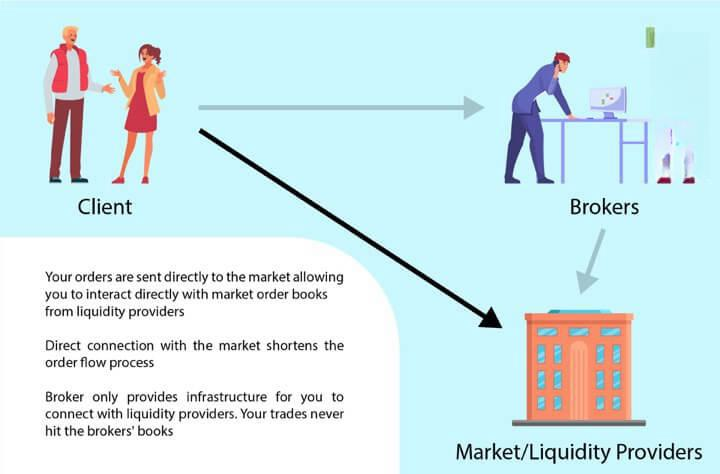

## Table of Contents

## What is a Direct Access Trading System?

A Direct Access Trading System, often called DAT, is a type of trading platform that lets people buy and sell stocks directly. Instead of using a regular broker, traders use this system to send their orders straight to the stock exchange. This can be faster and might help traders get better prices for their trades.

These systems are popular with people who trade a lot, like day traders. They need to react quickly to changes in the market. With a Direct Access Trading System, they can see real-time prices and make decisions fast. However, using these systems can be tricky and might not be the best choice for everyone, especially those new to trading.

## How does a Direct Access Trading System differ from traditional trading methods?

A Direct Access Trading System is different from traditional trading methods because it lets traders send their orders directly to the stock exchange without going through a regular broker. In traditional trading, you usually tell a broker what you want to buy or sell, and they do it for you. But with a Direct Access Trading System, you do it yourself. This can be faster and give you more control over your trades. You can see the prices changing in real time and make quick decisions.

Traditional trading methods can be slower because they involve more steps. When you use a broker, they might take some time to execute your order, and you might not get the exact price you wanted. With a Direct Access Trading System, you can often get better prices because you're acting quickly on the latest market information. However, using a Direct Access Trading System can be more complicated and risky, so it's usually better for experienced traders who know what they're doing.

## What are the main benefits of using a Direct Access Trading System for beginners?

For beginners, using a Direct Access Trading System can help them learn about the stock market faster. They get to see prices change in real time and can practice making quick decisions. This hands-on experience can be a good way to understand how trading works, even if they are not actually trading with a lot of money yet.

However, beginners should be careful because Direct Access Trading Systems can be tricky to use. They need to take time to learn how the system works and understand the risks. It's important for beginners to start small and maybe use the system's practice or simulation mode before they start trading with real money.

## Can you explain the basic components of a Direct Access Trading System?

A Direct Access Trading System has a few key parts that make it work. The first part is the trading platform itself, which is like a special computer program that lets you see the stock market in real time. This platform shows you the prices of stocks and lets you send your buy or sell orders directly to the stock exchange. Another important part is the connection to the stock exchange, which needs to be fast and reliable so your orders get there quickly.

The second part of a Direct Access Trading System is the tools it gives you to help with trading. These tools can include charts and graphs that help you understand how stock prices are moving, and they can also show you news and other information that might affect the market. Some systems even have special buttons or shortcuts that let you make trades faster. All these parts work together to help you trade more effectively and quickly.

## What are the typical costs associated with using a Direct Access Trading System?

Using a Direct Access Trading System can cost you in a few ways. First, you might have to pay a fee just to use the system. This could be a monthly fee or a yearly fee, depending on the platform. Some systems might also charge you a fee every time you make a trade. These fees can add up, especially if you trade a lot.

Another cost to think about is the price of the tools and features that come with the system. Some Direct Access Trading Systems offer extra tools like advanced charts or real-time data, and these might cost extra. It's important to look at all these costs and see if they fit into your budget before you start using a Direct Access Trading System.

## How do Direct Access Trading Systems handle order execution and routing?

Direct Access Trading Systems let you send your buy or sell orders straight to the stock exchange. When you decide to make a trade, you click a button on the trading platform, and your order goes to the exchange right away. This is different from traditional trading where your order might go through a broker first. Because your order goes directly to the exchange, it can be faster and you might get a better price.

These systems also let you choose where your order goes. This is called order routing. You can pick different exchanges or places where your order can be filled. Some systems even let you set rules for how your order should be handled, like if you want it to go to the exchange with the best price or the one that's fastest. This gives you more control over your trades and can help you get the best possible outcome.

## What are some popular Direct Access Trading platforms available in the market?

There are a few popular Direct Access Trading platforms that people use. One of them is called [Interactive Brokers](/wiki/interactive-brokers-api). It's known for being fast and having a lot of tools that help traders make good decisions. Another popular platform is Lightspeed Trading. It's good for people who trade a lot because it lets them send orders to the exchange very quickly. Both of these platforms are used by people who want to control their trades directly and get the best prices.

Another platform that's popular is E*TRADE Pro. It's a bit easier to use and has a lot of tools that help beginners learn how to trade. It still lets you send orders directly to the exchange, but it also has a lot of guides and help to make it less scary for new traders. Each of these platforms has different fees and features, so it's important to pick the one that fits what you need and how much you want to spend.

## What level of technical knowledge is required to effectively use a Direct Access Trading System?

Using a Direct Access Trading System well takes some technical know-how. You need to understand how to use the trading platform, which means knowing how to read charts, use the different tools it offers, and send orders to the exchange quickly. It's also important to know a bit about computers and the internet, because you need a fast and reliable connection to make sure your orders get to the exchange without delays.

For beginners, it might seem hard at first, but many platforms have guides and practice modes to help you learn. You don't need to be a computer expert, but you should be willing to learn and practice. As you get more comfortable with the system, you'll be able to make better and faster trading decisions.

## How can advanced traders optimize their strategies using Direct Access Trading Systems?

Advanced traders can use Direct Access Trading Systems to make their strategies better in many ways. They can use the fast order execution to buy and sell stocks quickly, which is important when the market is moving fast. They can also use the system's tools like charts and real-time data to see what's happening in the market and make smart choices. By setting up special rules for how their orders are handled, like choosing the best exchange or the fastest route, they can get the best prices for their trades.

Another way advanced traders can optimize their strategies is by using the system's automation features. Some Direct Access Trading Systems let you set up automatic trades based on certain conditions, like if a stock reaches a certain price. This can save time and help traders stick to their plans without getting distracted by emotions. By using all these features together, advanced traders can make their trading more efficient and effective.

## What are the regulatory considerations one should be aware of when using Direct Access Trading Systems?

When using Direct Access Trading Systems, it's important to know about the rules that come with them. These systems are watched closely by groups like the Securities and Exchange Commission (SEC) in the United States. They make sure that trading is fair and that no one is cheating. You need to follow their rules, like not using inside information or trying to trick the market. Also, some places might need you to pass a test or get a license before you can use these systems, so it's good to check what your local rules are.

Another thing to think about is how the platform itself is regulated. The company that runs the Direct Access Trading System has to follow certain rules too. They need to keep your information safe and make sure their system works well. If something goes wrong, like if the system crashes or if there's a problem with your orders, you might need to know who to talk to and what your rights are. It's a good idea to read up on these rules and maybe even talk to a lawyer or financial advisor to make sure you're doing everything right.

## Can you discuss the impact of Direct Access Trading Systems on market liquidity and volatility?

Direct Access Trading Systems can make the stock market more liquid. This means it's easier to buy and sell stocks because more people are trading. When traders use these systems, they can send their orders to the market quickly. This can attract more people to trade, which means there are more buyers and sellers. More people trading can help make sure there's always someone ready to buy or sell, which is good for the market.

These systems can also affect how much the market moves up and down, which is called [volatility](/wiki/volatility-trading-strategies). Because Direct Access Trading Systems let traders act fast, they can react to news or changes in the market right away. This quick trading can make the market move more than usual, especially if a lot of people are trading at the same time. But it's not all bad; the quick reactions can also help the market adjust to new information faster.

## What future developments can we expect in the field of Direct Access Trading Systems?

In the future, Direct Access Trading Systems are likely to become even faster and easier to use. Technology is always getting better, and this means that the systems will be able to send orders to the stock exchange even quicker than they do now. They might also use things like [artificial intelligence](/wiki/ai-artificial-intelligence) to help traders make better decisions. This could mean that the systems will be able to look at a lot of information and find patterns that people might miss. This could help traders know when to buy or sell stocks.

Another thing that might happen is that these systems will become more user-friendly. Right now, they can be hard for beginners to use, but in the future, they might have more guides and tools to help new traders learn. They might also be able to work on more devices, like phones and tablets, so people can trade from anywhere. This could make Direct Access Trading Systems more popular with more people, not just the ones who trade a lot.

## References & Further Reading

1. **Books:**
   - "Algorithmic Trading and DMA: An Introduction to Direct Access Trading Strategies" by Barry Johnson. This book provides a detailed understanding of algorithmic trading and direct market access strategies, emphasizing the importance of execution quality and market microstructure.
   - "Quantitative Trading: How to Build Your Own Algorithmic Trading Business" by Ernie Chan. This book is a comprehensive guide for those interested in developing their own trading algorithms and understanding the quantitative aspects behind them.
   - "Trading and Exchanges: Market Microstructure for Practitioners" by Larry Harris. It offers insights into the trading systems and the role of market participants, a useful text for understanding the foundational aspects of trading technology.

2. **Articles and Journals:**
   - *Journal of Financial Markets*: A valuable resource for peer-reviewed articles on the latest research and developments in trading and market behavior. Topics often include algorithmic trading and market microstructure.
   - "Flash Boys: A Wall Street Revolt" by Michael Lewis. While not a journal article, this piece provides a narrative investigation into the high-frequency trading world and its impact on markets.

3. **Online Platforms and Courses:**
   - **Coursera**: Various courses on algorithmic trading and financial markets are available from leading universities, including "Financial Markets" by Yale University, which covers market functionality and trading basics.
   - **MIT OpenCourseWare**: Offers free course materials from MIT's course on Algorithmic Trading and Quantitative Finance, providing educational resources for deeper knowledge.
   - **QuantConnect**: An algorithmic trading community that offers cloud-based backtesting and trading solutions, along with tutorials and a library of trading algorithms.

4. **Technical Documentation:**
   - **Interactive Brokers API Documentation**: For developers interested in creating custom trading strategies with Interactive Brokers, their API documentation provides necessary technical insights.
   - **MetaTrader 5 Documentation**: A resource for understanding the MetaTrader 5 platform's capabilities, including algorithmic trading and custom indicators.

5. **Websites and Forums:**
   - **Elite Trader**: An online community and forum where traders discuss strategies, platforms, and market conditions with a focus on both algorithmic and direct access trading.
   - **Quantitative Finance Stack Exchange**: A question-and-answer site for practitioners, academics, and students interested in quantitative finance.

These resources offer a blend of theoretical knowledge and practical insights, beneficial for anyone wanting to enhance their understanding of Direct Access Trading and [algorithmic trading](/wiki/algorithmic-trading).

