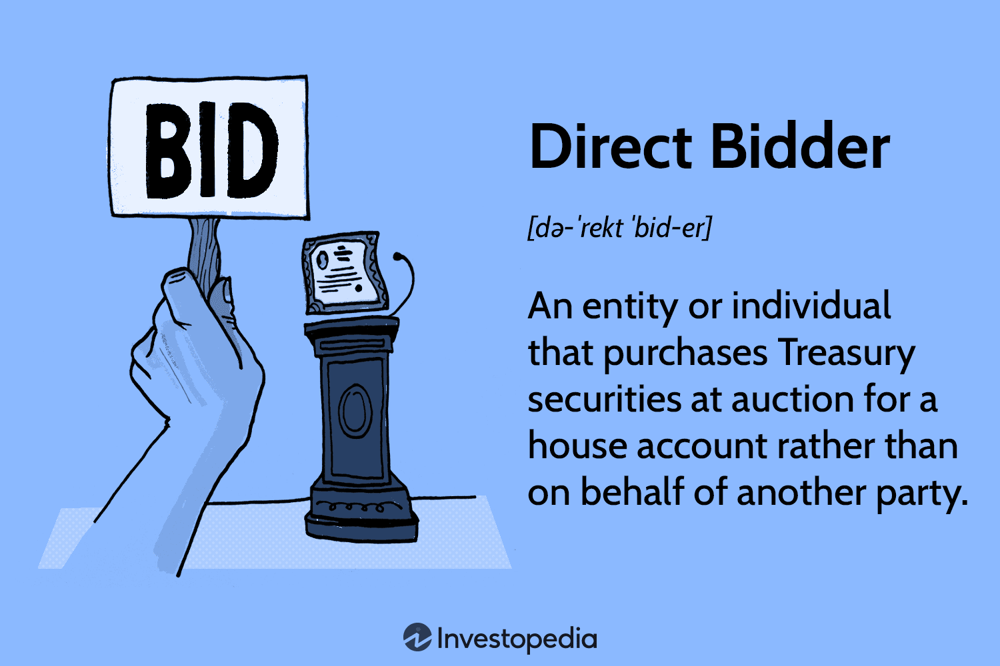

Bidding mechanisms are integral components in the world of trading and investments, serving as the cornerstone for conducting transactions. They define how prices and allocations of securities and assets are determined and are essential for ensuring liquidity and market efficiency.

This article examines the direct bidder auction, a traditional model where participants purchase Treasury securities directly for their accounts. While this method has been in use for decades, it presents certain limitations when juxtaposed with modern algorithmic trading technologies. The latter leverages advanced computer algorithms to automate and optimize trading decisions, significantly enhancing speed and accuracy. Understanding these mechanisms is crucial for traders, as they directly influence strategic decisions and investment outcomes.



As technological innovations reshape the financial landscape, there is an increasing need to critically evaluate how algorithmic trading can enhance traditional bidding processes. By leveraging technology, markets can achieve greater efficiencies, reduce costs, and improve access to information.

Throughout the article, we will explore various types of bids, such as competitive and noncompetitive auctions, and the intricacies involved in the bidding process. Additionally, the role of algorithmic trading in modern markets will be highlighted, underscoring its potential to transform and advance traditional bidding mechanisms.

Traders and investors are encouraged to understand these changes in order to adapt and strategize, optimizing their participation in increasingly complex financial markets. As these mechanisms continue to evolve, staying informed will be key to maintaining a competitive edge and achieving successful investment outcomes.

## Table of Contents

## Understanding Bidding Mechanisms

Bids play a crucial role in determining the price and allocation of assets in financial markets, forming the backbone of many trading activities. They serve as the expressions of interest or offers from buyers willing to purchase a specific asset at a particular price, affecting both how assets are bought and sold and how they are valued over time.

There are several types of bidding mechanisms utilized across various financial environments, each with unique implications for market dynamics. Among these are competitive and noncompetitive bids. Competitive bids are typically used in auction environments where participants specify the yield or return they are willing to accept, thus directly influencing the final price through market demand dynamics. Conversely, noncompetitive bids allow participants to submit offers without specifying a price, accepting the final auction price determined by competitive bidding. This approach ensures a guaranteed allocation, albeit usually within preset limits, enhancing accessibility for smaller investors.

Auction bids represent a prevalent mechanism where participants incrementally offer higher prices for an asset, creating a transparent price discovery process. This incremental approach is designed to maximize the asset's value and ensure it is awarded to the participant valuing it the most. Sealed bids, on the other hand, are submitted confidentially, where bidders are unaware of others' offers. This method can minimize the strategic advantage one might gain from observing competitors' bids, thus encouraging more genuine valuations based on individual assessments.

The rise of online bidding platforms has revolutionized traditional bidding procedures by increasing market access and participation. These platforms allow bidders from various regions to engage in markets that were once geographically bound, thus expanding the pool of participants and increasing competition. This democratization of bidding processes has also facilitated more fluid market mechanisms and has been instrumental in leveling the playing field for individual and institutional investors alike.

Understanding and mastering these bidding types is fundamental for traders looking to develop strategies that align with current market conditions. By analyzing the strengths and weaknesses of each bidding mechanism, traders can optimize their approaches, increasing the likelihood of achieving favorable outcomes in asset allocation and pricing strategies. Recognizing the nuances of how bids affect market operations can empower investors to make informed decisions, ultimately contributing to more efficient market behavior and enhanced financial performance.

## The Direct Bidder Auction: Mechanisms and Limitations

Direct bidders in Treasury auctions acquire securities directly for their accounts, distinguishing themselves from those purchasing on behalf of others, such as brokers or investment firms. This mechanism incorporates both competitive and noncompetitive bidding processes, which ultimately shape the allocation of securities in the market. 

In a competitive bid, participants specify the yield or discount rate they are willing to accept, competing for allocation based on these parameters. A higher number of competitive bids can result in better price discovery, as each participant's bid reflects their valuation of the security. This can be represented mathematically by the relationship:

$$
\text{Price} = \frac{\text{Face Value}}{(1 + \text{Yield})^{\text{Time}}}
$$

Noncompetitive bids, on the other hand, do not require a yield specification, allowing smaller investors to participate without the complexities of price negotiation. These bids are capped at $5 million per auction, providing them a guaranteed allocation but at the average yield of accepted competitive bids.

However, the direct bidder auction process is not without limitations. One of the challenges is the restricted bid amounts in noncompetitive bidding, limiting the extent to which smaller investors can secure securities without engaging in competitive bidding. Furthermore, potential inefficiencies arise due to the auction's allocation rules, which may not always reflect optimal market conditions.

Moreover, market participation has undergone significant changes. Historically, primary dealers dominated Treasury auctions, acting as intermediaries between the government and the broader market. Their prevalence has declined, reducing their influence on auction outcomes. This shift has introduced challenges, such as accurately gauging market interest, which is crucial for setting competitive yields and ensuring efficient allocations.

In summary, while the direct bidder auction remains a cornerstone of Treasury securities distribution, it must adapt to evolving market dynamics and technology-driven efficiencies to maintain its role in modern financial markets.

## Algo Trading: Revolutionizing the Bidding Process

Algorithmic trading employs advanced computer algorithms to automate bidding and trading activities, significantly boosting the speed and accuracy of these processes. This trading strategy leverages the ability of computational systems to process vast datasets in real-time, a capability that allows traders to swiftly respond to market fluctuations and optimize the execution of trades. These algorithms analyze market data, identify patterns, and execute orders more efficiently than manual trading.

A noteworthy mechanism within [algorithmic trading](/wiki/algorithmic-trading) is the 'Bid Wanted in Competition' (BWIC) process. This feature is designed to attain competitive pricing for securities by inviting multiple bidders to submit their bids on financial instruments. BWIC enhances price discovery and ensures better pricing dynamics, benefiting both buyers and sellers by promoting a more transparent and competitive bid environment.

Algorithmic trading significantly reduces transaction costs, as automated systems can execute trades rapidly, minimizing the bid-ask spread and slippage. This efficiency also enhances market [liquidity](/wiki/liquidity-risk-premium), allowing for smoother transactions and a more stable market environment. By reducing the time between order placements and execution, algorithmic trading mitigates market impact, thereby improving overall market efficiency.

The incorporation of Artificial Intelligence (AI) and [machine learning](/wiki/machine-learning) within algorithmic trading further refines these strategies. With AI, algorithms can predict market trends and adjust trading strategies dynamically. Machine learning models can analyze historical data to identify patterns and make predictive insights, offering traders a competitive edge by adapting to new market conditions swiftly. This integration allows for adaptive execution strategies that can learn and evolve from new data inputs, continuously optimizing trade outcomes.

Moreover, these technologies enable the creation of sophisticated trading models that can simulate various market scenarios and test different strategies. For instance, Python, with libraries like TensorFlow or scikit-learn, can be used to develop machine learning models that automate trading decisions. A simple linear regression model for predicting stock prices might look like this:

```python
from sklearn.linear_model import LinearRegression
import numpy as np

# Sample data: historical stock prices
X = np.array([[1], [2], [3], [4], [5]])  # Days
y = np.array([10, 20, 30, 40, 50])       # Prices

# Create and train the model
model = LinearRegression()
model.fit(X, y)

# Predict the price
predicted_price = model.predict(np.array([[6]]))
print(predicted_price)  # Output: array([60.])
```

This Python code demonstrates a basic implementation of a predictive model that could be part of a more extensive algorithmic trading system.

In conclusion, the evolution of algorithmic trading has revolutionized the bidding process, offering unprecedented speed, accuracy, and strategic capabilities. As these technologies continue to advance, they promise to further optimize trading operations, reducing costs and enhancing market fluidity.

## Challenges and Opportunities of Algo Trading in Bidding

Algorithmic trading, while revolutionary in its potential to streamline bidding processes, also introduces a set of challenges that market participants must navigate. One significant challenge lies in managing market [volatility](/wiki/volatility-trading-strategies). High-frequency trading, a subset of algorithmic trading, can exacerbate market fluctuations due to the sheer speed and [volume](/wiki/volume-trading-strategy) of trades. This can lead to "flash crashes," where rapid sell-offs cause drastic price drops in seconds. Algorithms must therefore be designed to mitigate these impacts, often requiring sophisticated analytics and risk management protocols.

Regulatory compliance poses another challenge for algorithmic trading, as financial markets are subject to a complex web of regulations that vary significantly across jurisdictions. Algorithms must be designed to adhere to these regulations, which may involve restrictions on trading frequencies, requirements for trade reporting, and compliance with market conduct rules. As regulations evolve, algorithms need continuous updates to remain compliant. An example is the European Union's Markets in Financial Instruments Directive II (MiFID II), which requires detailed reporting and transparency in automated trading systems.

Another critical challenge is the risk of technological errors, which can arise from coding mistakes, system malfunctions, or unanticipated market conditions. Such errors can have severe financial consequences, potentially wiping out trading profits or leading to regulatory fines. Rigorous testing and validation of algorithms are essential to minimize these risks. This includes stress testing under various market conditions and implementing robust fail-safes to halt trading activities in the event of a malfunction.

Despite these challenges, algorithmic trading offers substantial opportunities. The integration of [artificial intelligence](/wiki/ai-artificial-intelligence) (AI) and machine learning into trading algorithms enhances decision-making capabilities. AI models can analyze vast datasets to identify patterns and predict market trends more accurately than human traders. This capability allows for optimized trading strategies, potentially leading to higher returns and reduced risk. Machine learning algorithms can further adapt and improve over time, refining their predictive accuracy with each trade.

Looking ahead, the integration of blockchain technology presents future opportunities for algorithmic trading. Blockchain's decentralized and transparent nature can enhance the security and traceability of trades, addressing concerns about fraud and manipulation. Smart contracts—a key feature of blockchain technology—automate trade execution based on pre-defined criteria, which could reduce transaction costs and eliminate the need for intermediaries. The combination of blockchain with algorithmic trading could lead to more efficient and secure financial markets. 

In summary, while challenges such as market volatility, regulatory compliance, and technological errors persist in algorithmic trading, the opportunities offered by AI, machine learning, and blockchain technology promise to transform the bidding process. By leveraging these advances, traders can enhance their strategic positioning and capitalize on enhanced market efficiencies.

## Conclusion

Bidding mechanisms play a pivotal role in market operations and the formation of strategic trading decisions, particularly within the frameworks of direct bidder auctions and algorithmic trading. Understanding these mechanisms is essential for enhancing trade outcomes and improving financial performance. Historically, direct bidder auctions have served as a cornerstone of trade, facilitating the allocation and pricing of assets. However, they are now increasingly complemented by the rise of algorithmic trading, which offers new efficiencies and competitive advantages through automation and advanced data analysis.

The integration of technology in bidding processes enables market participants to optimize strategies, ensuring they remain competitive in a rapidly evolving financial landscape. The automation provided by algorithmic trading minimizes human error, processes vast amounts of data in real-time, and improves the precision of market execution. As such, the assimilation of these technologies into traditional bidding practices has presented significant opportunities for strategic enhancement, optimizing not only execution but also pricing and allocation efficiencies.

To fully harness these advancements, stakeholders must remain vigilant about technological and regulatory shifts. Engaging with innovations such as artificial intelligence and machine learning can further refine algorithmic strategies, predicting market trends and delivering adaptive execution. Meanwhile, evolving regulatory landscapes demand that stakeholders continually adapt to maintain compliance while exploiting new technological advantages.

As the financial ecosystem progresses, the synergy between traditional bidding mechanisms and cutting-edge technologies can substantially boost market performance. It is crucial for traders and investors to stay informed and adaptable, leveraging these innovations to achieve superior outcomes in modern trading environments.

## References & Further Reading

[1]: Bergstra, J., Bardenet, R., Bengio, Y., & Kégl, B. (2011). ["Algorithms for Hyper-Parameter Optimization."](https://dl.acm.org/doi/10.5555/2986459.2986743) Advances in Neural Information Processing Systems 24.

[2]: ["Advances in Financial Machine Learning"](https://www.amazon.com/Advances-Financial-Machine-Learning-Marcos/dp/1119482089) by Marcos Lopez de Prado

[3]: ["Evidence-Based Technical Analysis: Applying the Scientific Method and Statistical Inference to Trading Signals"](https://www.amazon.com/Evidence-Based-Technical-Analysis-Scientific-Statistical/dp/0470008741) by David Aronson

[4]: ["Machine Learning for Algorithmic Trading"](https://github.com/stefan-jansen/machine-learning-for-trading) by Stefan Jansen

[5]: ["Quantitative Trading: How to Build Your Own Algorithmic Trading Business"](https://www.amazon.com/Quantitative-Trading-Build-Algorithmic-Business/dp/1119800064) by Ernest P. Chan