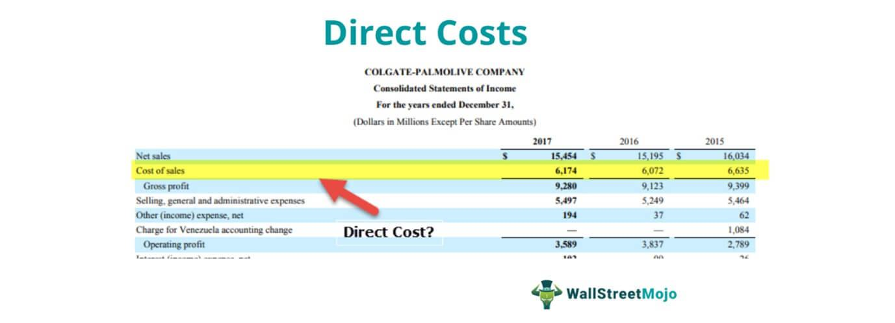

Understanding the role of business expenses is pivotal in ensuring operational efficiency and profitability. In algorithmic trading, precise cost management is essential due to the fast-paced and high-stakes nature of the industry. Though algorithmic trading utilizes sophisticated technologies and complex strategies to execute trades at speeds and frequencies impossible for a human trader, every operation in this domain entails costs that significantly impact overall performance and profitability. 

Algo trading firms must carefully budget for various business expenses to thrive. These expenses encompass a range of costs that are vital to maintain firm operations. Direct costs, such as the computational resources needed to run trading algorithms and the acquisition of market data, must be efficiently managed to maintain profitable trading operations. Meanwhile, indirect costs, such as administrative expenses, also play a crucial role in the financial health of these businesses.



Accurate cost accounting forms the backbone of successful financial strategy in algorithmic trading—helping firms not only manage transaction costs but also strategically invest in technology infrastructure. With the insights provided by this financial management approach, algo trading firms can effectively allocate resources, thereby maintaining their competitive edge in a constantly evolving marketplace.

By dissecting these elements, businesses can optimize financial strategies and thereby maintain a competitive edge. Understanding and managing business expenses effectively are not just about maintaining balance sheets but are crucial to ensuring sustainable operations in a competitive and technologically driven trading environment.

## Table of Contents

## Understanding Business Expenses

Business expenses are essential components of any company's financial ecosystem, impacting financial health and operational success. They are generally categorized into direct and indirect costs, each with distinct characteristics and implications.

Direct costs are directly tied to the production or provision of specific goods and services. Typical examples include raw materials and labor. These costs are easily identifiable and can be directly traced to the end product. For instance, in manufacturing, costs involving material procurement and assembly line worker wages fall under direct costs. In algorithmic trading, direct costs can involve expenses related to computational resources and data feeds necessary for executing trading algorithms. These costs are critical as they directly influence the profitability per transaction or service rendered.

Indirect costs, on the other hand, are broader expenses not directly linked to any single product or service. These include marketing, administrative overheads, utilities, and rent. Unlike direct costs, they are not directly attributable to production but are necessary for maintaining overall business operations. In an [algorithmic trading](/wiki/algorithmic-trading) firm, indirect costs could encompass expenses related to maintaining office space, administrative staffing, and general IT infrastructure upkeep. While these costs do not variably change with production [volume](/wiki/volume-trading-strategy), they are crucial for sustaining the firm's day-to-day operations.

For algorithmic trading firms, efficiently managing both direct and indirect costs is crucial to remaining profitable in a highly competitive and fast-paced environment. Direct costs need careful monitoring to ensure that each trade's marginal costs are minimized, thereby protecting trading profits. Meanwhile, controlling indirect costs through streamlined operations and strategic investments can result in significant savings and improved financial health. Understanding these expenses in detail allows firms to allocate their resources more effectively, adapt to industry trends, and ultimately maintain resilience against market fluctuations. This comprehensive approach to cost management not only supports operational efficiency but also bolsters strategic decision-making and long-term sustainability.

## Direct Costs Explained

Direct costs are specific expenses that can be directly attributed to the production process or provision of services. These costs represent the essential components of operational functions in a company, as they relate directly to creating goods or delivering services. In traditional industries, examples of direct costs include expenditures on direct labor, raw materials, and manufacturing supplies. For instance, in a manufacturing plant, the wages of the assembly line workers and the cost of raw materials utilized in production would constitute direct costs.

In the context of algorithmic trading, direct costs are particularly significant due to the industry's reliance on advanced computational capabilities and vast amounts of data. These costs encompass the expenditure on computational resources, such as high-performance servers and networking equipment, which are essential for running complex trading algorithms efficiently. Additionally, data acquisition represents another major direct cost, as algo trading firms require high-quality and real-time data to make informed trading decisions. This data often comes with substantial acquisition fees or subscription costs, reflecting its critical importance to the trading strategy.

Understanding and managing direct costs are crucial for algorithmic trading firms to maintain a competitive advantage. By closely monitoring these expenses, firms can ensure the efficient use of resources, enabling them to execute trades swiftly and accurately, thus optimizing their trading strategies for better profitability.

## Cost Accounting in Algo Trading

Cost accounting plays a significant role in algorithmic trading by providing detailed tracking and analysis of production costs, which are critical for strategic financial planning. In the fast-paced environment of algorithmic trading, firms deploy advanced algorithms and computational models to execute trades, often at high frequencies and significant volumes. The precision of these operations necessitates meticulous cost management, particularly concerning transaction costs and technology infrastructure investments.

Transaction costs in algorithmic trading encompass expenses such as broker fees, market impact costs, and slippage – the difference between the expected price of a trade and the actual price at which it is executed. Accurate cost accounting allows firms to monitor these expenses closely, offering insights into reducing friction and optimizing trade efficiency. By understanding transaction cost patterns, trading firms can refine their strategies to minimize these costs, thereby improving their overall profitability.

Investments in technology infrastructure form another substantial portion of direct costs for algo trading firms. This includes expenses related to acquiring and maintaining state-of-the-art hardware, software, and data services essential for executing high-frequency trading strategies. Cost accounting aids in evaluating the return on these investments, assisting firms in deciding whether to upgrade systems, integrate new technologies, or streamline existing processes. For instance, leveraging cloud computing resources can offer scalability and flexibility, but cost accounting helps in assessing whether these benefits outweigh the associated costs.

Furthermore, cost accounting supports effective budgeting and resource allocation by illuminating cost structures. It provides managers with the necessary data to allocate resources efficiently, ensuring that capital is directed toward initiatives that offer the most strategic value. Insight into cost structures enables slight adjustments in resource deployment, potentially leading to substantial improvements in operational efficiency and cost savings.

Overall, the application of cost accounting in algo trading not only aids in the meticulous tracking of expenses but also serves as a foundation for strategic decision-making. It empowers firms to adopt a proactive approach in managing their financial resources, aligning investment strategies with business goals, and maintaining a competitive edge in the highly dynamic trading environment.

## Direct Costs vs Indirect Costs

Direct costs refer to expenses that can be directly attributed to the production of specific goods or the provision of services. These costs include direct labor, raw materials, and manufacturing supplies. For example, in a manufacturing setting, the wages paid to assembly line workers and the cost of raw materials like steel or plastic used in production are considered direct costs. In algorithmic trading, similar direct expenses would encompass the costs associated with computational resources and the acquisition of real-time data feeds necessary for executing trading strategies. The traceability of direct costs to distinct products or services is crucial, as it helps firms determine the actual cost of production and pricing strategies.

Indirect costs, commonly known as overheads, include expenses that are not easily traceable to a specific product or service. These costs include administrative salaries, utility bills, and marketing expenses. These overhead costs coexist and support the operations of a business but are incurred regardless of the output. For example, in a corporate office setting, utilities and administrative officer salaries are required for daily operations but cannot be directly linked to production activities. In algorithmic trading, indirect costs might encompass the broader information technology infrastructure expenses and the general administrative support required to maintain trading operations.

Understanding the distinction between direct and indirect costs is essential for businesses to achieve accurate financial reporting and informed decision-making. In financial statements, direct costs are typically captured under the cost of goods sold (COGS), directly impacting the gross profit. Indirect costs, however, fall under operating expenses, influencing operating profit. This differentiation aids in budgeting, controlling, and optimizing resource allocation, enabling businesses to accurately assess profitability and operational efficiency.

In Python, data analysis of direct and indirect costs can utilize libraries such as pandas for more efficient calculation and categorization of expenses, allowing for real-time financial analysis and reporting. Here is a simplified example of how you might categorize costs using pandas:

```python
import pandas as pd

# Sample data with expense types and their amounts
data = {
    'Expense_Type': ['Direct_Labor', 'Materials', 'Utilities', 'Admin_Salaries'],
    'Amount': [5000, 3000, 2000, 4000]
}

# Create DataFrame
df = pd.DataFrame(data)

# Categorize expenses
def categorize_expense(expense_type):
    if expense_type in ['Direct_Labor', 'Materials']:
        return 'Direct'
    else:
        return 'Indirect'

df['Category'] = df['Expense_Type'].apply(categorize_expense)

# Sum expenses by category
expense_summary = df.groupby('Category')['Amount'].sum()

print(expense_summary)
```

This script helps to categorize expenses into direct and indirect, providing a clear view of where the bulk of expenditures are directed, facilitating better financial insights and strategic planning.

## The Role of SG&A Expenses

SG&A (Selling, General, and Administrative) expenses represent a significant portion of a business's operational costs, playing a vital role in the financial management strategies of algorithmic trading firms. These expenses encompass costs not directly tied to the production of goods or services but are essential for maintaining core operations and supporting business growth. 

Managing SG&A expenses effectively is crucial for algo trading firms to enhance profit margins and facilitate strategic resource allocation. By optimizing these costs, firms can improve their operational efficiency and allocate resources more strategically towards revenue-generating activities. Key components of SG&A expenses include marketing, executive salaries, and utilities, each contributing distinctly to the overall cost structure.

Marketing expenses within SG&A are essential for promoting services and establishing a strong brand presence in a competitive market. Effective marketing strategies can drive customer acquisition and retention, directly impacting an algo trading firm's revenue potential. Executive salaries represent compensation to senior management who are pivotal in strategic decision-making, including technology investments and risk management, crucial for maintaining competitiveness in a volatile trading environment. Utilities, while often seen as a fixed cost, can influence operational efficiency. For instance, optimizing energy consumption in data centers can lead to cost savings and contribute to sustainability goals.

In algorithmic trading, where margins can be razor-thin, meticulous management of SG&A costs allows firms to allocate more resources toward enhancing their technology infrastructure, improving algorithms, and reducing latency. This strategic allocation not only improves profitability but also positions firms to better adapt to market fluctuations and technological advancements.

Understanding the dynamics of SG&A expenses is essential for formulating comprehensive financial strategies. These strategies should aim to balance cost minimization with investment in critical operational areas, ensuring long-term sustainability and competitive advantage in the fast-paced algo trading industry.

## Impact of Cost Accounting on Financial Strategy

Cost accounting is a pivotal mechanism for understanding cost behavior, offering algorithmic trading firms critical insights for constructing effective financial strategies. By meticulously analyzing transaction activities and operational expenditures, cost accounting assists these firms in optimizing their transaction efficiencies and technological investments.

In algorithmic trading, the need for efficient transaction processing is paramount due to the high volume and rapid nature of trades. Cost accounting enables firms to assess the costs associated with each transaction, including brokerage fees, slippage, and market impact costs, allowing them to enhance execution efficiency. A formula that might be used in this cost analysis could include:

$$
\text{Total Transaction Cost} = \text{Brokerage Fees} + \text{Slippage} + \text{Market Impact Costs}
$$

By understanding these components, firms can improve their execution strategies, reduce unnecessary expenditure, and optimize their trading algorithms for cost efficiency.

In addition to transaction efficiency, cost accounting facilitates strategic investments in technological infrastructure, which is vital for maintaining a competitive edge in algo trading. By providing detailed insights into cost structures, cost accounting aids firms in identifying technology investments that offer the highest returns. For instance, upgrading server capabilities or acquiring faster data feeds might be evaluated based on the cost-benefit analyses derived from accounting data.

Furthermore, thorough cost analysis can help algorithmic trading firms uncover areas for potential cost reduction. By identifying and minimizing unnecessary overheads or optimizing resource allocation, these firms can enhance their operational efficiency. For example, cost accounting might reveal that specific algorithms are consuming a disproportionate amount of computational resources without yielding proportional returns. Consequently, firms can reallocate resources to more profitable strategies.

In summary, cost accounting serves as an essential tool for algorithmic trading firms, allowing them to formulate strategic financial plans through enhanced understanding of cost behavior. By leveraging cost accounting insights, these firms can optimize transactions, strategically invest in technology, uncover cost-reduction opportunities, and ultimately strengthen their competitive position in the market.

## Conclusion

Efficient management of business expenses and accurate cost accounting are foundational components for the success of algorithmic trading firms. The ability to meticulously track and analyze costs allows these firms to enhance their operational efficiency and strategic financial planning. By understanding and optimizing costs, businesses can significantly improve their profitability while maintaining sustainability in a competitive market environment.

In algorithmic trading, the rapid pace and the complexity of transactions necessitate a deep comprehension of cost structures. An optimized cost strategy enables firms to allocate resources more effectively, reduce unnecessary expenditures, and invest intelligently in technological advancements that support algorithm development and execution. These strategies not only optimize existing operations but also prepare firms to meet future market demands.

Furthermore, precise financial strategies, supported by detailed cost accounting, are vital for adapting to technological shifts and evolving market conditions. With technology at the forefront of algorithmic trading, staying ahead requires investing in robust technological infrastructure while maintaining cost-effectiveness. Accurate cost management provides the clarity needed to make informed decisions about such investments.

In conclusion, a comprehensive approach to expense management and cost accounting empowers algorithmic trading firms to sustain their competitive position. By strategically optimizing costs, these firms bolster their profitability, ensure compliance with evolving financial regulations, and position themselves to exploit new opportunities presented by technological innovation.

## References & Further Reading

[1]: Bergstra, J., Bardenet, R., Bengio, Y., & Kégl, B. (2011). ["Algorithms for Hyper-Parameter Optimization."](https://dl.acm.org/doi/10.5555/2986459.2986743) Advances in Neural Information Processing Systems 24.

[2]: ["Advances in Financial Machine Learning"](https://www.amazon.com/Advances-Financial-Machine-Learning-Marcos/dp/1119482089) by Marcos Lopez de Prado

[3]: ["Evidence-Based Technical Analysis: Applying the Scientific Method and Statistical Inference to Trading Signals"](https://www.amazon.com/Evidence-Based-Technical-Analysis-Scientific-Statistical/dp/0470008741) by David Aronson

[4]: ["Machine Learning for Algorithmic Trading"](https://github.com/stefan-jansen/machine-learning-for-trading) by Stefan Jansen

[5]: ["Quantitative Trading: How to Build Your Own Algorithmic Trading Business"](https://www.amazon.com/Quantitative-Trading-Build-Algorithmic-Business/dp/1119800064) by Ernest P. Chan