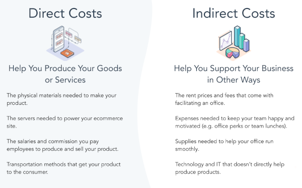

## Table of Contents

## What are direct costs?

Direct costs are expenses that can be directly linked to a specific product, project, or activity. These costs are easy to trace and assign because they are directly related to the production or delivery of a specific item or service. For example, the cost of raw materials used to make a product, or the wages of workers who are directly involved in manufacturing, are direct costs.

Understanding direct costs is important for businesses because it helps them accurately calculate the cost of producing a product or delivering a service. By knowing these costs, a company can set the right price for its products to ensure they cover all expenses and make a profit. Direct costs are different from indirect costs, which are harder to assign to a specific product or service, like rent or utilities for a factory.

## How do direct costs differ from indirect costs?

Direct costs are the expenses that you can easily connect to making a specific product or doing a specific job. For example, if you're making a cake, the cost of the flour, eggs, and sugar you use are direct costs because you can see exactly how they go into the cake. These costs are important because they help businesses figure out how much it costs to make one item, which helps them set the right price for it.

Indirect costs, on the other hand, are expenses that are not as easy to link to a single product or job. These are costs that help the whole business run but don't go directly into making one thing. For example, the rent for the bakery where you make the cake is an indirect cost because it's needed for the whole business, not just for one cake. Knowing the difference between direct and indirect costs helps businesses understand all their expenses and manage their money better.

## Can you provide examples of direct costs in a manufacturing business?

In a manufacturing business, direct costs are the expenses that you can easily connect to making a specific product. For example, if a factory makes bicycles, the cost of the metal used to build the bike frames is a direct cost. This is because you can see exactly how the metal goes into making each bicycle. Another direct cost would be the wages paid to the workers who assemble the bicycles. Their time and effort go straight into making the product, so their wages are directly linked to the production of each bike.

Other examples of direct costs in manufacturing include the cost of screws, paint, or any other materials that are used specifically to make the product. If the factory uses special machines to shape the metal for the bike frames, the cost of operating those machines, like the electricity they use, can also be a direct cost. These costs are important because they help the business figure out how much it costs to make one bicycle, which helps them set the right price to sell it and make a profit.

## How are direct costs calculated in a service industry?

In a service industry, direct costs are the expenses that you can easily connect to providing a specific service. For example, if a cleaning company sends a worker to clean a house, the cost of the worker's time and the cleaning supplies they use are direct costs. These costs go straight into providing the cleaning service, so you can see exactly how they are used.

Calculating direct costs in the service industry involves adding up all these expenses that are directly linked to the service. If the cleaning company charges by the hour, the direct cost would include the hourly wage of the cleaner plus the cost of any cleaning products used during the job. By knowing these direct costs, the company can set the right price for their service to cover these expenses and make a profit.

## What role do direct costs play in pricing strategies?

Direct costs are really important when businesses figure out how much to charge for their products or services. These costs are the money spent on things like materials or worker's time that go straight into making a product or doing a job. By knowing how much these direct costs are, a business can make sure they set a price that covers these expenses. If they don't, they might lose money on every item they sell or every service they provide.

For example, if a bakery makes cakes, they need to know how much the flour, eggs, and sugar cost to make one cake. They also need to know how much it costs to pay the bakers who make the cakes. By adding up these direct costs, the bakery can set a price for the cake that is high enough to cover these costs and still make some profit. This way, the bakery can stay in business and keep making cakes that people want to buy.

## How do direct costs impact a company's profitability?

Direct costs are really important for a company's profitability. They are the costs that go straight into making a product or doing a job, like the cost of materials or the wages of workers who make the product. If a company can keep these direct costs low, it can make more money because it doesn't have to charge as much to cover these expenses. For example, if a company makes toys and finds a cheaper way to get the plastic they use, their direct costs go down. This means they can sell the toys for less money or keep the same price and make more profit.

On the other hand, if direct costs go up, it can hurt a company's profitability. If the cost of materials or labor increases, the company might have to raise the price of their products to cover these costs. But if customers don't want to pay more, the company might have to sell fewer products or make less money on each one. This can make it harder for the company to stay profitable. So, managing direct costs carefully is key to keeping a business successful and profitable.

## What methods are used to allocate direct costs to specific products or services?

To allocate direct costs to specific products or services, businesses often use a method called direct tracing. This means they look at each cost and see exactly which product or service it goes into. For example, if a company makes different types of cakes, they can see how much flour, sugar, and eggs go into each cake. They can also track the time workers spend making each type of cake. By doing this, they can figure out the direct cost for each cake and make sure they charge enough to cover these costs.

Another method is using cost drivers, which are things that cause costs to happen. For example, if a company provides cleaning services, the cost driver might be the number of hours a cleaner works. The company can then allocate the cost of the cleaner's wages to each cleaning job based on how many hours were spent on that job. This helps the company see how much it costs to provide each service and set the right price to make a profit. Both methods help businesses understand their direct costs better and manage their money more effectively.

## How can businesses track and manage direct costs effectively?

Businesses can track and manage direct costs effectively by using a good accounting system. This system can help them keep track of every dollar spent on things like materials and workers' time that go straight into making a product or providing a service. By keeping a close eye on these costs, businesses can make sure they know exactly how much it costs to make each item or do each job. They can use special software or even just a simple spreadsheet to record these costs and see how they change over time.

Once businesses have a good way to track direct costs, they can start managing them better. They can look for ways to spend less money on materials by finding cheaper suppliers or using less material without hurting the quality of the product. They can also train workers to work more efficiently, which can help lower the cost of labor. By managing direct costs carefully, businesses can set prices that cover these costs and make a profit, which is important for staying successful and growing.

## What are the challenges in accurately identifying direct costs?

One challenge in accurately identifying direct costs is that some costs might seem direct but are actually shared among different products or services. For example, if a bakery makes cakes and cookies, the cost of the oven used to bake them might seem like a direct cost. But since the oven is used for both cakes and cookies, it's hard to say exactly how much of the oven's cost should go to each product. This can make it tricky to figure out the true direct cost of making each item.

Another challenge is that some direct costs can change over time. The cost of materials like wood or metal can go up or down depending on what's happening in the market. This means that businesses have to keep a close eye on these costs and update their records often. If they don't, they might end up thinking a product costs less to make than it really does, which can lead to setting the wrong price and losing money. Keeping track of these changing costs takes a lot of work and attention to detail.

## How do direct costs affect financial reporting and tax obligations?

Direct costs are important for financial reporting because they help businesses show how much it costs to make each product or do each job. When a company makes its financial statements, like the income statement, it needs to know the direct costs to figure out how much profit it made. If the direct costs are not correct, the profit numbers will be wrong too. This can make the business look like it's doing better or worse than it really is. So, it's really important for businesses to keep track of direct costs carefully and make sure they are right in their financial reports.

Direct costs also affect a company's tax obligations. When a business figures out how much tax it owes, it can often subtract its direct costs from its income. This means that if the direct costs are higher, the business might pay less in taxes because it has less profit to tax. But if the direct costs are not reported correctly, the business might end up paying too much or too little in taxes. This can cause problems with the tax authorities, like fines or audits. So, it's important for businesses to make sure their direct costs are accurate when they are doing their taxes.

## What advanced techniques can be used to analyze the behavior of direct costs?

One advanced technique to analyze the behavior of direct costs is using regression analysis. This method helps businesses see how direct costs change when they make more or fewer products. By looking at past data, they can find patterns and predict how costs might change in the future. For example, if a company sees that the cost of materials goes up every time they make more products, they can use regression analysis to figure out how much the cost will increase if they decide to make even more. This helps them plan better and set prices that will cover their costs.

Another technique is activity-based costing (ABC). This method looks at all the different activities that go into making a product or doing a job and figures out how much each activity costs. By breaking down the costs this way, businesses can see which activities are causing their direct costs to go up. For example, if a company finds that the cost of setting up machines is a big part of their direct costs, they can look for ways to do this more efficiently. This can help them lower their direct costs and make more profit.

## How do direct costs influence decision-making in project management and budgeting?

Direct costs play a big role in project management and budgeting because they help managers figure out how much it will cost to do a project. When planning a project, managers need to know the costs of materials and labor that will go straight into the work. By knowing these direct costs, they can make a budget that covers all these expenses. If they don't keep track of direct costs carefully, they might not have enough money to finish the project, or they might spend more than they need to. This can lead to problems like running out of money or not being able to finish the project on time.

In budgeting, direct costs are important because they help managers decide where to spend money. If a project has a lot of direct costs, managers might look for ways to lower these costs, like finding cheaper materials or figuring out how to use less of them. This can help them stay within their budget and make sure the project is profitable. By understanding how direct costs affect the project, managers can make better decisions about how to use their resources and plan for the future.

## What is the impact of cost accounting on financial strategy?

Cost accounting is a pivotal mechanism for understanding cost behavior, offering [algorithmic trading](/wiki/algorithmic-trading) firms critical insights for constructing effective financial strategies. By meticulously analyzing transaction activities and operational expenditures, cost accounting assists these firms in optimizing their transaction efficiencies and technological investments.

In algorithmic trading, the need for efficient transaction processing is paramount due to the high [volume](/wiki/volume-trading-strategy) and rapid nature of trades. Cost accounting enables firms to assess the costs associated with each transaction, including brokerage fees, slippage, and market impact costs, allowing them to enhance execution efficiency. A formula that might be used in this cost analysis could include:

$$
\text{Total Transaction Cost} = \text{Brokerage Fees} + \text{Slippage} + \text{Market Impact Costs}
$$

By understanding these components, firms can improve their execution strategies, reduce unnecessary expenditure, and optimize their trading algorithms for cost efficiency.

In addition to transaction efficiency, cost accounting facilitates strategic investments in technological infrastructure, which is vital for maintaining a competitive edge in algo trading. By providing detailed insights into cost structures, cost accounting aids firms in identifying technology investments that offer the highest returns. For instance, upgrading server capabilities or acquiring faster data feeds might be evaluated based on the cost-benefit analyses derived from accounting data.

Furthermore, thorough cost analysis can help algorithmic trading firms uncover areas for potential cost reduction. By identifying and minimizing unnecessary overheads or optimizing resource allocation, these firms can enhance their operational efficiency. For example, cost accounting might reveal that specific algorithms are consuming a disproportionate amount of computational resources without yielding proportional returns. Consequently, firms can reallocate resources to more profitable strategies.

In summary, cost accounting serves as an essential tool for algorithmic trading firms, allowing them to formulate strategic financial plans through enhanced understanding of cost behavior. By leveraging cost accounting insights, these firms can optimize transactions, strategically invest in technology, uncover cost-reduction opportunities, and ultimately strengthen their competitive position in the market.

## References & Further Reading

[1]: Bergstra, J., Bardenet, R., Bengio, Y., & Kégl, B. (2011). ["Algorithms for Hyper-Parameter Optimization."](https://dl.acm.org/doi/10.5555/2986459.2986743) Advances in Neural Information Processing Systems 24.

[2]: ["Advances in Financial Machine Learning"](https://www.amazon.com/Advances-Financial-Machine-Learning-Marcos/dp/1119482089) by Marcos Lopez de Prado

[3]: ["Evidence-Based Technical Analysis: Applying the Scientific Method and Statistical Inference to Trading Signals"](https://www.amazon.com/Evidence-Based-Technical-Analysis-Scientific-Statistical/dp/0470008741) by David Aronson

[4]: ["Machine Learning for Algorithmic Trading"](https://github.com/stefan-jansen/machine-learning-for-trading) by Stefan Jansen

[5]: ["Quantitative Trading: How to Build Your Own Algorithmic Trading Business"](https://www.amazon.com/Quantitative-Trading-Build-Algorithmic-Business/dp/1119800064) by Ernest P. Chan