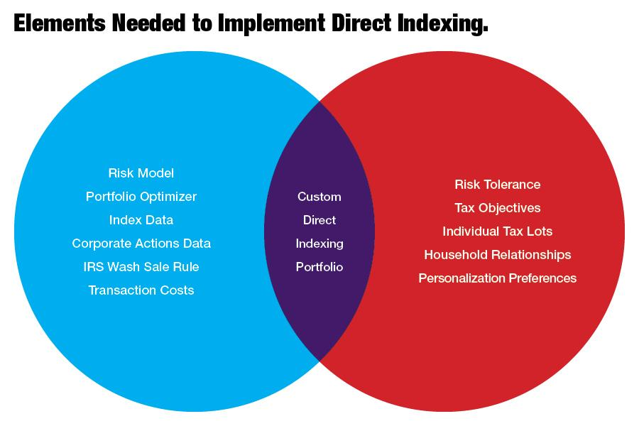

## Table of Contents

## What is direct indexing?

Direct indexing is a way for investors to own individual stocks directly, instead of buying a mutual fund or an exchange-traded fund (ETF) that holds a basket of stocks. When you use direct indexing, you can pick and choose the specific stocks you want in your portfolio, which lets you customize it to fit your own investment goals and values. It's like building your own custom puzzle, where each piece is a stock that you select.

One big advantage of direct indexing is the ability to manage taxes better. With direct indexing, you can sell stocks that have lost value to offset gains from other investments, a strategy known as tax-loss harvesting. This can help lower the amount of taxes you have to pay. Plus, because you own the stocks directly, you have more control over when to buy and sell, which can be important for managing your investments over time.

## How does direct indexing work?

Direct indexing works by letting you own individual stocks instead of buying a fund that holds many stocks. Imagine you want to invest in the stock market but you want to pick the exact companies you believe in. With direct indexing, you can do that. You can choose stocks from a specific index, like the S&P 500, and build your own portfolio. This way, you have control over which companies you invest in, and you can make changes whenever you want.

One of the big benefits of direct indexing is tax management. When you own stocks directly, you can use a strategy called tax-loss harvesting. This means you can sell stocks that have gone down in value to offset the gains from other stocks. By doing this, you can reduce the amount of taxes you have to pay. It's like finding a way to save money on your taxes by being smart about when you buy and sell your stocks.

## What are the basic requirements for implementing direct indexing?

To start using direct indexing, you need a few basic things. First, you need to have a brokerage account where you can buy and sell individual stocks. This is like having a bank account but for stocks. Next, you need to choose which stocks you want to buy. You can pick stocks from a specific index, like the S&P 500, or you can choose stocks that match your own investment goals and values. It's important to have a clear idea of what you want to achieve with your investments.

Once you have your stocks, you need a way to manage them. This can be done through a special type of investment account that allows for direct indexing. Some financial companies offer tools and software that help you keep track of your stocks and make it easier to do things like tax-loss harvesting. This means you can sell stocks that have lost value to offset gains from other stocks, which can help you pay less in taxes. Having the right tools and a good understanding of how to use them is key to making direct indexing work well for you.

## What are the primary advantages of direct indexing for individual investors?

Direct indexing gives individual investors a lot of control over their investments. Instead of buying a fund that holds many stocks, you can pick the exact stocks you want. This means you can choose companies that match your values or goals. For example, if you care about the environment, you can invest in companies that are good for the planet. This kind of control lets you build a portfolio that feels right for you.

Another big advantage is the ability to save on taxes. With direct indexing, you can use a strategy called tax-loss harvesting. This means you can sell stocks that have lost value to offset gains from other stocks. By doing this, you can lower the amount of taxes you have to pay. It's like finding a way to keep more of your money by being smart about when you buy and sell your stocks.

## How does direct indexing help in tax management?

Direct indexing helps with tax management by letting you use a strategy called tax-loss harvesting. This means you can sell stocks that have gone down in value to offset the gains from other stocks you own. When you do this, you can lower the amount of taxes you have to pay. It's like finding a way to save money on your taxes by being smart about when you buy and sell your stocks.

Because you own the stocks directly, you have more control over when to do this. You can keep an eye on your stocks and decide the best time to sell the ones that have lost value. This control can make a big difference in how much you pay in taxes over time. It's like having the power to choose when to use your tax-saving tool, which can help you keep more of your money.

## Can direct indexing improve portfolio customization?

Direct indexing lets you pick the exact stocks you want in your portfolio. This means you can choose companies that match your values or goals. For example, if you care about the environment, you can invest in companies that are good for the planet. Or if you like a certain industry, you can focus on stocks from that sector. This kind of control lets you build a portfolio that feels right for you, instead of just buying a fund that holds a bunch of stocks you might not care about.

This customization can make a big difference in how you feel about your investments. When you have a portfolio that matches your values or goals, you might feel more connected to your money. It's like building your own puzzle, where each piece is a stock that you believe in. Plus, as your goals or values change over time, you can easily adjust your portfolio to keep it in line with what's important to you.

## What are the potential disadvantages of direct indexing?

Direct indexing can be a bit more complicated than just buying a fund. You need to pick each stock yourself, which means you have to spend time researching and keeping track of them. This can be a lot of work, especially if you're not used to managing your own investments. Plus, if you make a mistake and pick the wrong stocks, it could hurt your portfolio.

Another thing to think about is the cost. While direct indexing can help you save on taxes, it might also come with fees for the tools and services you need to manage your stocks. These costs can add up, and you need to make sure they don't eat into the money you're trying to save on taxes. It's important to weigh these potential costs against the benefits to see if direct indexing is right for you.

## How does direct indexing compare to traditional index funds or ETFs?

Direct indexing lets you own individual stocks instead of buying a traditional index fund or [ETF](/wiki/etf-trading-strategies), which holds a basket of stocks. With direct indexing, you can pick the exact stocks you want, so you can build a portfolio that matches your values or goals. For example, if you care about the environment, you can choose companies that are good for the planet. This kind of control is not possible with traditional index funds or ETFs, where you just buy a piece of the whole fund.

One big advantage of direct indexing is the ability to save on taxes through a strategy called tax-loss harvesting. This means you can sell stocks that have lost value to offset gains from other stocks, which can lower the amount of taxes you have to pay. Traditional index funds and ETFs don't give you this level of control over your taxes. However, direct indexing can be more work because you have to pick and manage each stock yourself, and it might come with extra costs for the tools and services you need. So, while direct indexing offers more customization and tax benefits, it also requires more effort and might be more expensive than just buying a traditional index fund or ETF.

## What are the costs associated with direct indexing?

Direct indexing can come with some costs that you need to think about. One cost is the fees for the tools and services you need to manage your stocks. These might include software that helps you keep track of your portfolio and do things like tax-loss harvesting. These fees can add up, so it's important to see if they are worth it compared to the money you might save on taxes.

Another cost is the time and effort you have to put in. With direct indexing, you have to pick each stock yourself and keep an eye on how they're doing. This can be a lot of work, especially if you're not used to managing your own investments. If you make a mistake and pick the wrong stocks, it could hurt your portfolio. So, while direct indexing can help you save on taxes and customize your investments, it also comes with these extra costs that you need to consider.

## How can technology enhance the effectiveness of direct indexing?

Technology can make direct indexing a lot easier and better. With special software and tools, you can keep track of all your stocks in one place. This software can also help you do things like tax-loss harvesting, which means selling stocks that have lost value to save on taxes. It can do this automatically, so you don't have to spend a lot of time figuring it out yourself. This can save you a lot of work and help you make smarter choices about when to buy and sell your stocks.

Plus, technology can help you make sure your portfolio stays in line with what you want. If you care about certain values or goals, the software can help you pick stocks that match those. It can also keep an eye on your portfolio and suggest changes if things aren't going the way you want. This means you can have a portfolio that feels right for you, without having to spend all your time managing it.

## What are the advanced strategies used in direct indexing for optimizing returns?

Direct indexing lets you use advanced strategies to make your investments do better. One important strategy is tax-loss harvesting. This means selling stocks that have lost value to save on taxes. With technology, you can do this automatically and often, which can really help lower the amount of taxes you have to pay. Another strategy is rebalancing your portfolio. This means making sure your investments stay in line with your goals. If some stocks do better than others, you might need to sell some and buy others to keep everything balanced.

Another advanced strategy is [factor](/wiki/factor-investing) investing. This means [picking](/wiki/asset-class-picking) stocks based on certain things, like how big the company is or how much it's growing. By focusing on these factors, you can try to pick stocks that might do better than the average. You can also use sector rotation, which means moving your money into different parts of the market at different times. For example, if you think technology stocks will do well, you can put more money into them. These strategies can help you make more money over time, but they need careful planning and the right tools to work well.

## What future trends might impact the use of direct indexing?

In the future, technology will likely make direct indexing even easier and more popular. As more people learn about the benefits of picking their own stocks and saving on taxes, they might want to try direct indexing. New tools and software will help people do this without spending a lot of time and effort. These tools can automatically find ways to save on taxes and keep your investments in line with what you want. This could mean more people will use direct indexing because it's easier and can help them make more money.

Another trend that might affect direct indexing is changes in tax laws. If the rules about taxes change, it could make tax-loss harvesting more or less useful. This means people might need to adjust how they use direct indexing to save on taxes. Also, as more people care about things like the environment and social issues, they might want to use direct indexing to pick stocks that match their values. This could make direct indexing more popular among people who want to invest in a way that feels right for them.

## What is an Investment Strategy: A Holistic Approach?

Investment strategy development involves a comprehensive assessment of various financial instruments, including stocks, bonds, and exchange-traded funds (ETFs). Each asset class offers distinct characteristics, making it essential to align them with an individual's or institution's financial objectives and risk profile. A robust investment strategy considers three primary elements: risk evaluation, growth potential, and prevailing market conditions.

Risk evaluation is pivotal in strategy formulation and requires investors to assess their risk tolerance—often a function of their financial goals, investment horizon, and comfort with market volatility. Tools such as the Sharpe Ratio, which measures risk-adjusted return, can assist investors in determining the viability of different asset allocations.

$$
\text{Sharpe Ratio} = \frac{R_p - R_f}{\sigma_p}
$$

where $R_p$ is the expected portfolio return, $R_f$ is the risk-free rate, and $\sigma_p$ is the standard deviation of the portfolio's excess return.

An evaluation of growth potential requires analyzing historical performance, expected future earnings, and macroeconomic indicators like GDP growth and interest rates, which influence asset price trends. Investors need to consider economic cycles and sectoral shifts that could affect asset performance.

Market conditions, including interest rates, inflation, and geopolitical events, also impact investment decisions. Investors might use contemporary tools like scenario analysis and stress testing to anticipate market movements and their potential impact on a portfolio.

Modern investment strategies are leveraging technology to enhance decision-making and operational efficiency. Data analytics offer profound insights into vast datasets, helping investors identify emerging trends and optimize asset selection. Automation, through robo-advisors and [algorithmic trading](/wiki/algorithmic-trading) (not covered in this section), introduces efficiency and removes potential emotional biases in investment decisions. These technologies can adapt portfolios in real-time, considering market shifts and investor preferences.

In formulating a holistic investment strategy, investors should also emphasize diversification—a strategy to mitigate risk by allocating investments across various asset classes to minimize the impact of any single asset's poor performance on the overall portfolio. The basic principle is that diversification can potentially lead to higher returns with lower [volatility](/wiki/volatility-trading-strategies) over time.

In conclusion, a well-rounded investment strategy requires a balance between theoretical frameworks and practical implementation, integrating both qualitative judgments and quantitative metrics. This balanced approach enables investors to build resilient portfolios that align with their financial objectives and adjust dynamically to market changes. As technology advances, the integration of sophisticated analytics and automation into investment strategies will likely continue to evolve, further refining how strategies are developed and executed.

## References & Further Reading

[1]: ["Direct Indexing Gains Favor as ETFs and Mutual Funds Face Increased Pressure"](https://www.kiplinger.com/investing/604846/move-over-etfs-direct-indexing-is-an-investment-strategy-worth-paying-attention-to) - The Wall Street Journal

[2]: ["The Impact of Direct Indexing on Portfolio Construction"](https://indexone.io/directindexing) - Research Affiliates

[3]: Narang, R. K. (2013). ["Inside the Black Box: A Simple Guide to Quantitative and High-Frequency Trading"](https://onlinelibrary.wiley.com/doi/book/10.1002/9781118662717) - Wiley

[4]: Pardo, R. (2011). ["The Evaluation and Optimization of Trading Strategies"](https://onlinelibrary.wiley.com/doi/book/10.1002/9781119196969) - Wiley

[5]: Haslett, W. F. (2011). ["Essentials of Investment Management"](https://www.mheducation.com/highered/product/Essentials-of-Investments-Bodie.html) - Wiley

[6]: Fabozzi, F. J., & Focardi, S. M. (2010). ["Quantitative Equity Investing: Techniques and Strategies"](https://www.semanticscholar.org/paper/Quantitative-Equity-Investing%3A-Techniques-and-Fabozzi-Focardi/1c49a2a53919f7e65cb96f16691b8ff726fd3cd7) - Wiley