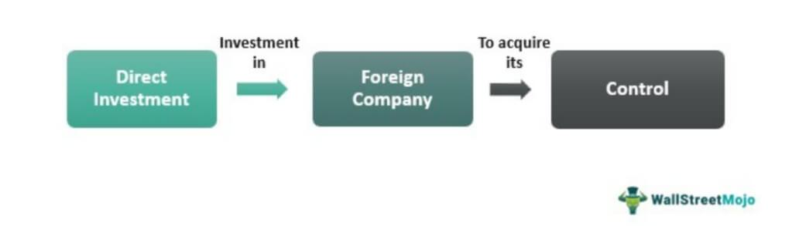

In today's globalized economy, investment strategies are undergoing significant transformations, embracing diverse methodologies such as Direct Investment and Algorithmic Trading. Direct Investment, often referred to as Foreign Direct Investment (FDI), involves acquiring a controlling interest in foreign enterprises. This strategy is key for corporations aiming to drive growth by entering new markets, accessing strategic resources, and diversifying their portfolios. Unlike portfolio investments, which involve passive stakes in companies, direct investments entail active management and oversight, thus fostering deeper engagement with the foreign market and contributing to long-term profitability.

Algorithmic trading represents a frontier in trading practices, utilizing complex algorithms and high-speed computing to make trading decisions with precision and speed unattainable by human traders alone. These systems analyze vast datasets to predict market movements, executing trades automatically when optimal conditions are detected. This form of trading has become integral to the financial landscape, enabling traders to capitalize on fleeting opportunities and maintain competitive advantages through rapid decision-making and minimized human error.



Together, Direct Investment and Algorithmic Trading play vital roles in enhancing market growth and financial stability. While FDI fosters industrial expansion and economic integration across borders, algorithmic trading bolsters market efficiency, liquidity, and transparency. The intersection of these strategies allows for a nuanced understanding of their individual and collective impacts on global financial markets. As technological advancements continue to shape finance, the relationship between direct investment and algorithmic trading is expected to deepen, offering robust pathways for economic expansion and financial innovation.

## Table of Contents

## Understanding Direct Investment

Direct investment refers to a form of capital allocation by an individual or corporation that results in acquiring significant influence or outright control over a business entity situated outside the investor's domestic jurisdiction. This investment category is characterized by its focus on long-term engagement and active participation in the management of the foreign business, distinguishing it from portfolio investment, which involves holding equity stakes without the intent or capability of influencing the company’s decisions.

The primary motivations driving direct investment are multi-faceted. One key incentive is market expansion, where businesses seek to access and capitalize on new consumer bases in foreign markets. Such expansion can mitigate risks linked to domestic market saturation and tap into diverse growth opportunities. Another motivation is the acquisition of strategic assets, such as technology, specialized skills, or raw materials, that can provide a competitive edge in global markets. Direct investment also offers the prospect of long-term profitability, where investors anticipate steady returns on their investments through dividends, reinvested earnings, or appreciation of the enterprise value.

Direct investments are typically classified into three categories: horizontal, vertical, and conglomerate. Horizontal foreign direct investment (FDI) occurs when a company replicates its home country operations in a foreign nation. A common example is a fast-food chain opening new outlets in overseas markets, thereby extending its brand and operational practices.

Vertical FDI involves investment in a foreign company that is part of the investor's supply chain. This can manifest as forward vertical investment, where an enterprise invests in a foreign company that operates at a later stage of the supply chain, like a retailer purchasing a foreign manufacturer. Conversely, backward vertical investment involves acquiring firms engaged in an earlier stage, such as suppliers of raw materials or specialized components.

Conglomerate FDI represents a more complex and often riskier form of direct investment. It entails entering into a foreign market by investing in businesses that are unrelated to the investor's existing operations. This form of investment can diversify business risks and exploit unexplored avenues, though it requires comprehensive cross-industry knowledge and integration strategies.

Understanding the nuances of direct investment and its categories underscores its importance in shaping global business landscapes and contributing to the economic interconnectedness characteristic of today's globalized world.

## Types and Examples of Direct Investment

Direct investment, commonly referred to as Foreign Direct Investment (FDI), manifests in several forms, each characterized by its strategic purpose and the nature of its engagement in foreign markets. These investments are primarily categorized into three types: horizontal FDI, vertical FDI, and conglomerate FDI.

**Horizontal FDI** occurs when a business duplicates its home country operations by establishing the same operations in a foreign country. This type of investment is typically seen in industries where firms can leverage their established competitive advantages internationally. For instance, a global fast-food chain may open outlets in various countries, replicating its successful business model. By doing so, companies benefit from brand recognition and economies of scale, ensuring consumer familiarity and reducing market entry risks.

**Vertical FDI** encompasses investments aimed at different stages of a company's supply chain or production process in an overseas location. This falls into two subtypes: backward vertical FDI, where a firm acquires or merges with foreign suppliers, and forward vertical FDI, where a firm invests in wholesaling or retailing aspects in the foreign market. For example, a car manufacturer might invest in a foreign country to gain direct access to parts suppliers, reducing production costs and mitigating supply chain risks. Such strategic positioning helps firms streamline operations and maintain competitive advantage through cost efficiencies.

**Conglomerate FDI** represents the most complex form of direct investment, involving entry into foreign markets through investment in unrelated business areas. This type of FDI is relatively rare due to the high risks associated with managing diverse business activities and the lack of industry-specific expertise. It usually requires substantial research and understanding of the new market dynamics, legal frameworks, and consumer behaviors. A typical instance would be a textiles manufacturer venturing into the financial services sector in a foreign country. Despite its challenges, conglomerate FDI can offer companies significant diversification benefits and access to entirely new revenue streams.

Notable examples of multinational corporations actively employing these types of FDI strategies include companies like Toyota and McDonald's. Toyota, for instance, engages in vertical FDI by acquiring local parts suppliers in regions where it has manufacturing plants, enhancing its production efficiency and supply chain reliability. In contrast, McDonald's exemplifies horizontal FDI through its widespread establishment of restaurants across the globe, capitalizing on its brand identity and operational expertise.

Overall, direct investment strategies are crucial for multinational corporations seeking to bolster their international presence. By carefully selecting the type of FDI that aligns with their strategic goals, these companies can optimize their global operations, penetrate new markets effectively, and achieve sustainable growth.

## Algorithmic Trading: A New Frontier

Algorithmic trading employs automated systems that execute trades based on sophisticated predictive models and comprehensive market data analytics. This approach enhances the efficiency of trading by minimizing human errors and executing transactions at speeds that would be impossible for manual trading systems. The algorithms used are designed to analyze and process vast quantities of financial data quickly, identifying market trends and trading opportunities with a precision that significantly optimizes profitability.

High-frequency trading ([HFT](/wiki/high-frequency-trading-strategies)) is one prevalent method within [algorithmic trading](/wiki/algorithmic-trading), characterized by rapid trade execution and high turnover rates. These trades capitalize on minute price movements and typically involve holding positions for very short durations. The strategy requires minimal latency and advanced computing capabilities to stay ahead of market fluctuations, often executed within milliseconds. Another common approach is statistical [arbitrage](/wiki/arbitrage), which relies on complex mathematical models to identify price discrepancies between securities that are statistically correlated. By exploiting these inconsistencies, traders can achieve profits with controlled risk exposure.

Algorithmic trading's integration into the financial ecosystem is indispensable, largely due to its capacity to process large datasets at exceptional speeds. This capability aids decision-making by providing real-time insights into market conditions, allowing traders to respond promptly to new information or shifts in the market. The use of algorithmic systems enables the execution of trades that are calculated with respect to factors such as timing, price, and [volume](/wiki/volume-trading-strategy), making them highly effective tools in modern financial markets.

Python has emerged as the preferred programming language for developing algorithmic trading strategies due to its simplicity and rich ecosystem of libraries and tools. For example, the use of libraries such as NumPy for numerical calculations, Pandas for data manipulation, and SciPy for statistical analysis facilitates the development of sophisticated trading algorithms. Here is a basic example of how Python can be used to simulate a simple moving average crossover strategy, which is a common algorithmic trading strategy:

```python
import pandas as pd
import numpy as np

# Sample data: time series of stock prices
data = {'Date': ['2023-01-01', '2023-01-02', '2023-01-03', '2023-01-04', '2023-01-05'],
        'Price': [100, 102, 101, 105, 107]}
df = pd.DataFrame(data)
df['Date'] = pd.to_datetime(df['Date'])
df.set_index('Date', inplace=True)

# Calculate moving averages
short_window = 2
long_window = 3
df['Short_MA'] = df['Price'].rolling(window=short_window, min_periods=1).mean()
df['Long_MA'] = df['Price'].rolling(window=long_window, min_periods=1).mean()

# Generate signals
df['Signal'] = 0
df['Signal'][short_window:] = np.where(df['Short_MA'][short_window:] > df['Long_MA'][short_window:], 1, 0)
df['Position'] = df['Signal'].diff()

print(df)
```

This script creates a simple moving average crossover, which signals when to buy or sell based on the crossover of short- and long-term moving averages of stock prices. Such automation exemplifies the efficiency and precision achievable in algorithmic trading, contributing to its essential role in contemporary financial markets.

## Impact of Algorithmic Trading on Direct Investment

Algorithmic trading significantly enhances the analytical capabilities required for evaluating direct investment opportunities. This enhancement stems largely from its ability to process vast amounts of data at unprecedented speeds, offering real-time insights into market conditions. Such insights are crucial for mitigating the risks associated with cross-border transactions, where market dynamics can change rapidly due to currency fluctuations, regulatory changes, or geopolitical events.

The automation provided by algorithmic trading systems allows for a more effective and rapid assessment of these investment opportunities. Algorithms can continually analyze data from multiple sources, including financial statements, economic indicators, and market trends, to identify potential investments that align with strategic objectives. This ability to quickly and accurately evaluate opportunities ensures that investment decisions are based on the most current and comprehensive data available, reducing the likelihood of errors or missed opportunities.

Moreover, algorithmic trading aligns with global digitalization trends by facilitating more integrated and responsive investment management. As financial markets become increasingly digitized, the demand for methods that can efficiently handle and analyze large data sets grows. Algorithmic trading meets this need by providing tools that not only automate trading but also offer predictive analytics and simulation models. These tools are indispensable for cross-border investors who need to navigate complex international markets efficiently.

In summary, the integration of algorithmic trading with direct investment strategies significantly enhances the quality and speed of investment decisions. By leveraging real-time data and automation, investors can optimize their strategies and respond swiftly to market changes, ultimately leading to more informed and effective investment outcomes.

## Advantages and Challenges of Combining Direct Investment and Algo Trading

Combining direct investment and algorithmic trading offers a significant advantage in enhancing capital efficiency and improving market responsiveness. This combination allows investors to employ data-driven insights for identifying profitable cross-border investments and refining market entry strategies. By leveraging advanced algorithms, investors can process vast datasets rapidly, uncovering patterns and trends that might elude traditional analytical methods.

One of the primary benefits is the ability to optimize investment decisions. Algorithmic trading systems can analyze real-time market data, economic indicators, and other relevant data points, facilitating more informed and precise investment strategies. For instance, algorithmic trading can integrate complex predictive models to forecast market movements, thereby pinpointing optimal entry and [exit](/wiki/exit-strategy) points for direct investments.

However, there are significant challenges that come with blending these two investment strategies. A key concern is the regulatory landscape, which varies widely across different jurisdictions. Navigating these regulatory requirements can be complex, as it involves compliance with cross-border investment rules and algorithmic trading regulations. Investors must remain vigilant to ensure their strategies conform to the differing legal standards in multiple countries.

Additionally, there is an inherent risk of algorithmic errors or potential market manipulations. Algorithms, while powerful, can sometimes execute trades based on erroneous data or incorrect model predictions. These errors can lead to substantial financial losses. There's also the potential for algorithms to be exploited for market manipulation, necessitating robust surveillance mechanisms to detect and mitigate such activities.

Maximizing the advantages of combining direct investment with algorithmic trading necessitates both technological proficiency and strategic foresight. Investors should focus on developing adaptable systems that can adjust to market fluctuations quickly. This includes investing in technology infrastructure capable of handling high-frequency data analysis and maintaining algorithms that are both efficient and resilient against errors or market anomalies.

In conclusion, while the merger of direct investment methodologies with algorithmic trading presents novel opportunities for optimizing capital allocation and responsiveness to market changes, it also requires cautious navigation of legal, technical, and operational challenges. Investing in the right technological tools and fostering a strategic approach to market operations will enable investors to fully exploit the potential benefits of this investment synergy.

## Conclusion

The synergy between direct investment and algorithmic trading offers robust pathways for market expansion and financial growth. By integrating the unique benefits of both strategies, investors can effectively navigate the complexities of global markets. Direct investment's focus on long-term ownership and control is complemented by algorithmic trading's capacity for rapid data processing and decision-making. This combination provides a comprehensive approach to identifying and capitalizing on investment opportunities.

Technological advancements continue to shape these strategies, promising increased integration and efficiency. Innovations in [machine learning](/wiki/machine-learning) and data analytics, for example, allow investors to process vast datasets with unprecedented speed and accuracy, resulting in more informed investment decisions. This technological evolution facilitates the seamless blending of direct investment and algorithmic trading, enabling investors to respond swiftly to market dynamics and optimize returns.

To fully leverage the potential of these investment strategies, investors should maintain a balanced approach. This involves combining strategic planning with technological tools to harness the strengths of both direct investment and algorithmic trading. A well-balanced approach allows investors to adapt to market fluctuations and mitigate risks, ensuring stability and growth in the global market landscape.

In summary, the interplay between direct investment and algorithmic trading marks a significant advancement in investment strategy, driven by technological innovation and strategic foresight. As these methodologies continue to evolve, their joint application promises enhanced efficiency and expanded market opportunities for investors globally.

## References & Further Reading

Bergstra, J., et al. (2011). Algorithms for Hyper-Parameter Optimization – This work explores methodologies for optimizing hyper-parameters in machine learning algorithms, a critical aspect in developing efficient trading algorithms. The paper's insights into optimization techniques can enhance algorithmic trading models by improving predictive accuracy and execution efficiency.

Advances in Financial Machine Learning by Marcos Lopez de Prado – This book provides comprehensive coverage of machine learning techniques specifically tailored to financial markets. It emphasizes methodologies for developing predictive models and algorithmic trading strategies that are grounded in rigorous quantitative analysis.

Evidence-Based Technical Analysis by David Aronson – Aronson's work focuses on applying scientific methods to technical analysis, providing a robust framework for testing and validating trading strategies. This resource is invaluable for practitioners looking to base their investment decisions on empirical evidence rather than intuition.

Machine Learning for Algorithmic Trading by Stefan Jansen – A practical guide to implementing machine learning techniques in trading, this book covers a broad spectrum of strategies, from data sourcing and processing to model implementation and [backtesting](/wiki/backtesting). Jansen's insights can help traders leverage machine learning for developing adaptive and automated trading systems.

Quantitative Trading by Ernest P. Chan – Chan's book demystifies [quantitative trading](/wiki/quantitative-trading) by offering practical advice on designing and deploying trading systems. It covers essential topics like [statistical arbitrage](/wiki/statistical-arbitrage) and risk management, providing a solid foundation for investors seeking to enhance their trading through quantitative methods.

