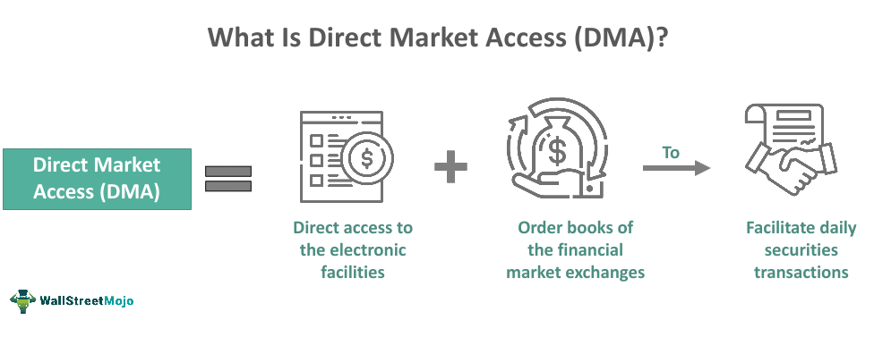

## Table of Contents

## What is Direct Market Access (DMA)?

Direct Market Access, or DMA, is a way for traders to buy and sell stocks directly on an exchange's order book. Instead of going through a traditional broker, traders can use electronic trading systems to place their orders. This means they can see the best available prices and execute trades more quickly. DMA is often used by institutional investors like hedge funds and investment banks, but it's also becoming more popular with individual traders.

Using DMA can have several benefits. It can reduce the cost of trading because there's no middleman taking a commission. It also allows for more control over trades, as users can set their own parameters for buying and selling. However, DMA also comes with risks. Because trades are executed so quickly, there's a chance of making mistakes or experiencing sudden market changes. It's important for users to understand these risks and have the right tools and knowledge to manage them effectively.

## How does Direct Market Access differ from traditional trading methods?

Direct Market Access (DMA) and traditional trading methods are different in how they let you buy and sell stocks. With traditional trading, you use a broker who acts as a middleman. You tell the broker what you want to do, and they place the order for you on the exchange. This can be slower and might cost more because the broker charges a fee for their service. On the other hand, DMA lets you place your orders directly on the exchange's order book without a broker. This can be faster and cheaper because you're not paying a middleman.

Another big difference is the level of control and speed you get with DMA. When you use traditional methods, you might not get to see all the available prices or execute trades as quickly as you want. With DMA, you can see the best prices available and make your trades almost instantly. This gives you more control over your trades and can help you take advantage of market opportunities faster. However, DMA also means you need to be careful and know what you're doing because there's more risk involved without a broker's guidance.

## What are the basic requirements to use Direct Market Access?

To use Direct Market Access (DMA), you need a few basic things. First, you need to have an account with a brokerage firm that offers DMA services. Not all brokers provide this, so you'll need to find one that does. Second, you'll need a computer with a good internet connection. DMA uses electronic trading systems, so a stable and fast internet connection is important to make sure your trades go through quickly and correctly.

Once you have the right account and technology, you also need to know how to use the trading software. This software can be complex, so you might need to learn how it works or even take a course. Lastly, it's important to understand the risks of DMA. Since you're trading directly on the exchange, you need to be aware of market changes and be ready to act fast. If you're not careful, you could lose money quickly.

## Can you explain the process of executing a trade using DMA?

When you want to use Direct Market Access (DMA) to execute a trade, you start by logging into your trading account through the brokerage firm's platform. Once you're in, you'll see the trading software where you can see the current prices of stocks. You decide which stock you want to buy or sell, and you enter the details like the number of shares and the price you're willing to pay or accept. Then, you send your order directly to the exchange's order book through the DMA system.

After you send your order, it goes straight to the exchange where it's matched with other orders. If someone else is willing to sell at the price you want to buy, or buy at the price you want to sell, the trade happens right away. The exchange confirms the trade and sends the details back to your trading account. This whole process can happen very quickly, often in seconds, because there's no middleman slowing things down.

## What types of financial instruments can be traded using Direct Market Access?

Direct Market Access (DMA) can be used to trade many types of financial instruments. The most common ones are stocks. Stocks are shares in a company that you can buy and sell on stock exchanges. With DMA, you can trade stocks directly on these exchanges, which can be faster and cheaper than using a traditional broker.

Besides stocks, you can also use DMA to trade other financial instruments like bonds, futures, and options. Bonds are loans you give to a government or company, and they pay you back with interest. Futures are agreements to buy or sell something at a future date, like commodities or currencies. Options give you the right, but not the obligation, to buy or sell an asset at a certain price. All these can be traded directly through DMA, giving you more control and speed in your trading.

## What are the primary benefits of using Direct Market Access for traders?

Direct Market Access (DMA) offers several important benefits for traders. One of the main advantages is speed. With DMA, traders can place orders directly on the exchange's order book, which means trades can happen much faster than if you were using a traditional broker. This quick execution can be crucial in fast-moving markets where prices change rapidly. Another big benefit is cost. Since you're not using a middleman, you can save money on trading fees and commissions, making it cheaper to trade.

In addition to speed and cost savings, DMA gives traders more control over their trades. You can see all the available prices and decide exactly when and how to buy or sell. This level of control can help you make better trading decisions and take advantage of market opportunities as they arise. However, with this control comes more responsibility. You need to be knowledgeable about the markets and the trading software to use DMA effectively and safely.

## How does DMA improve the speed and efficiency of trading?

Direct Market Access (DMA) improves the speed and efficiency of trading by letting you place orders directly on the exchange's order book. This means you don't have to go through a broker, which can slow things down. With DMA, your orders go straight to the exchange, so they can be filled much faster. This is really important in fast-moving markets where prices can change in seconds. If you can trade quickly, you might be able to buy or sell at better prices before the market moves against you.

DMA also makes trading more efficient because it cuts out the middleman. When you use a traditional broker, they charge you fees for placing your orders. With DMA, you don't have to pay those fees, so it can be cheaper to trade. Plus, you have more control over your trades. You can see all the available prices and decide exactly when and how to buy or sell. This can help you make better decisions and save time and money in the long run.

## What are the potential risks associated with Direct Market Access?

Using Direct Market Access (DMA) can be risky because you're trading directly on the exchange without a broker. This means you have to be very careful and quick. If you make a mistake, like entering the wrong price or number of shares, your trade can go through before you can fix it. Also, because DMA is so fast, you might not have time to think things through. If the market suddenly changes, you could lose money quickly if you're not ready.

Another risk is that you need to know a lot about trading and the markets to use DMA well. If you don't understand how it works, you might make bad decisions. Plus, the software can be hard to use, and if you don't know how to use it right, you could mess up your trades. Even though DMA can save you money by not using a broker, if you're not careful, the risks can cost you more than you save.

## How can traders manage the risks when using Direct Market Access?

To manage the risks of using Direct Market Access (DMA), traders need to be very careful and learn a lot about trading and the markets. It's important to take the time to understand how DMA works and how to use the trading software properly. If you're new to DMA, you might want to start with small trades to get used to how fast everything happens. This way, if you make a mistake, you won't lose too much money. Also, always double-check your orders before you send them to make sure you've entered the right price and number of shares.

Another way to manage risks is to use tools like stop-loss orders. These are orders that automatically sell your stocks if the price drops to a certain level, which can help limit your losses if the market moves against you. It's also a good idea to keep an eye on the market all the time when you're trading with DMA. The market can change quickly, so being ready to act fast can help you avoid big losses. Remember, even though DMA can save you money by not using a broker, the risks can be high, so always be careful and prepared.

## What advanced features does DMA offer to experienced traders?

Direct Market Access (DMA) gives experienced traders some cool tools to make their trading better. One of these tools is called algorithmic trading. This means you can use computer programs to make trades for you based on rules you set up. It's like having a robot that can buy and sell stocks really fast, even when you're not watching. Another feature is the ability to see the full order book. This lets you know exactly what prices people are willing to buy and sell at, so you can make smarter choices about when to trade.

DMA also lets you use advanced order types. For example, you can set up iceberg orders, which hide part of your order so other traders can't see how much you really want to buy or sell. This can help you get better prices without everyone knowing what you're doing. Plus, DMA gives you the chance to trade in different markets all over the world from one platform. This means you can take advantage of opportunities no matter where they are, making your trading more flexible and powerful.

## How does Direct Market Access integrate with algorithmic trading strategies?

Direct Market Access (DMA) works really well with algorithmic trading because it lets you trade directly on the exchange. This means your computer programs can send orders super fast without a middleman slowing things down. When you use algorithmic trading with DMA, your computer can follow the rules you set up to buy and sell stocks at just the right time. This can help you make better trades and take advantage of small price changes that happen really quickly.

With DMA, your algorithms can see all the prices on the exchange's order book. This helps your computer make smarter decisions about when to trade. For example, your algorithm might look for patterns in the prices and then decide to buy or sell based on those patterns. Because DMA is so fast, your algorithms can react to the market almost instantly, which can make your trading strategies more effective and help you make more money.

## What future developments can we expect in Direct Market Access technology?

In the future, Direct Market Access technology is likely to become even faster and easier to use. As technology keeps getting better, we can expect DMA systems to handle more trades at the same time and process them even quicker. This means traders will be able to make decisions and act on them almost instantly. Also, the software might become simpler and more user-friendly, so more people can use DMA without needing to be experts in trading.

Another thing we might see is more advanced features being added to DMA platforms. These could include better tools for analyzing the market and making trading decisions. Artificial intelligence might play a bigger role, helping traders by suggesting the best times to buy or sell based on lots of data. Plus, as more types of financial instruments become available for trading, DMA systems will probably support a wider range of these, making it easier for traders to diversify their portfolios and take advantage of new opportunities.

## References & Further Reading

[1]: Bergstra, J., Bardenet, R., Bengio, Y., & Kégl, B. (2011). ["Algorithms for Hyper-Parameter Optimization."](https://papers.nips.cc/paper/4443-algorithms-for-hyper-parameter-optimization) Advances in Neural Information Processing Systems 24.

[2]: ["Advances in Financial Machine Learning"](https://www.amazon.com/Advances-Financial-Machine-Learning-Marcos/dp/1119482089) by Marcos Lopez de Prado

[3]: ["Evidence-Based Technical Analysis: Applying the Scientific Method and Statistical Inference to Trading Signals"](https://www.amazon.com/Evidence-Based-Technical-Analysis-Scientific-Statistical/dp/0470008741) by David Aronson

[4]: ["Machine Learning for Algorithmic Trading"](https://github.com/stefan-jansen/machine-learning-for-trading) by Stefan Jansen

[5]: ["Quantitative Trading: How to Build Your Own Algorithmic Trading Business"](https://www.amazon.com/Quantitative-Trading-Build-Algorithmic-Business/dp/1119800064) by Ernest P. Chan