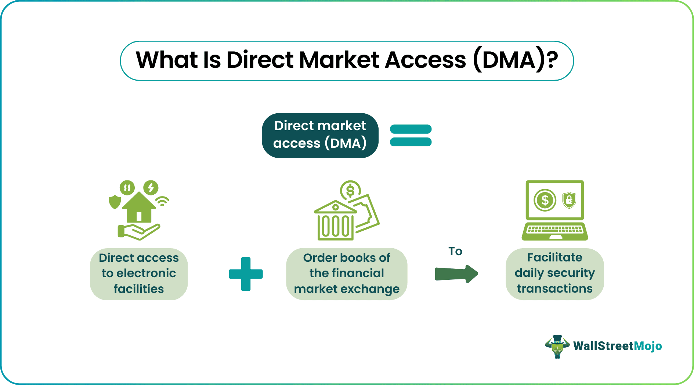

## Table of Contents

## What is direct market access (DMA)?

Direct Market Access (DMA) is a way for traders to directly interact with the financial markets. Instead of using a middleman like a broker, traders can place their buy and sell orders directly into the market's order book. This means they can see real-time prices and trade at the exact moment they want, which can be faster and more efficient.

DMA is often used by big investors and professional traders because it gives them more control over their trades. They can use advanced trading tools and strategies that might not be available through regular brokers. However, DMA also comes with more risks because traders are responsible for their own decisions and mistakes, without the safety net of a broker's advice.

## How does direct market access differ from traditional trading methods?

Direct market access (DMA) and traditional trading methods are different in how they let you buy and sell things in the market. With traditional trading, you use a broker. A broker is like a middleman who helps you make trades. You tell the broker what you want to do, and they do it for you. This can be slower because you have to wait for the broker to act on your instructions. Also, brokers might charge you more fees for their services.

On the other hand, with DMA, you don't need a broker. You can place your orders directly into the market yourself. This can be faster because you're in control and can act right away when you see a good opportunity. DMA also often costs less because you're not paying a broker's fees. But, it can be riskier because you have to make all the decisions on your own without a broker's advice.

In summary, DMA gives you more control and can be quicker and cheaper, but it's also more responsibility. Traditional trading with a broker is slower and might cost more, but it comes with the help and guidance of a professional. Which one you choose depends on your trading skills, how much risk you're willing to take, and what kind of help you need.

## What are the benefits of using direct market access for traders?

Using direct market access (DMA) can really help traders in a few big ways. First, it lets them trade faster. Without a broker in the middle, traders can put their orders right into the market as soon as they see a good chance to buy or sell. This can make a big difference, especially in markets where prices change quickly. Also, DMA usually costs less because traders don't have to pay extra fees to a broker for each trade they make. This means they can keep more of their money.

Another big benefit is that DMA gives traders more control over their trades. They can use special tools and strategies that might not be available if they were using a broker. This can help them make better decisions and maybe even make more money. But, it's important to remember that with more control comes more responsibility. Traders need to know what they're doing because they won't have a broker to help them if they make a mistake.

## What are the potential risks associated with direct market access?

Using direct market access (DMA) can be risky because you're doing everything on your own. Without a broker to help you, you might make mistakes that could cost you money. For example, if you're not quick enough or if you enter the wrong numbers, you could end up buying or selling at a bad price. Also, because you're trading directly in the market, you might face sudden changes in prices that can be hard to handle if you're not ready.

Another risk is that you might not know all the rules and tricks of trading. Brokers usually have a lot of experience and can guide you, but with DMA, you're on your own. This means you need to learn a lot and stay updated on everything happening in the market. If you don't, you could miss important information or make decisions based on wrong ideas. So, while DMA can be great for experienced traders, it's a lot to handle for someone just starting out.

## Who can use direct market access and what are the requirements?

Direct market access (DMA) is mostly used by big investors and professional traders. These are people who trade a lot and know a lot about the markets. They might work for big companies, like banks or investment firms, or they might trade on their own but with a lot of experience. Regular people can sometimes use DMA too, but they usually need to meet certain rules set by the trading platform or the company that offers DMA.

To use DMA, you usually need to show that you know what you're doing. This might mean passing a test or showing that you have enough money to trade. Some places might also ask you to have a certain amount of money in your trading account before they let you use DMA. It's important to check with the specific platform or company because the rules can be different everywhere.

## What types of financial instruments can be traded using DMA?

Direct market access (DMA) lets you trade a lot of different financial things. You can use it to buy and sell stocks, which are pieces of companies. You can also trade bonds, which are like loans you give to companies or governments. Another thing you can trade with DMA is futures, which are agreements to buy or sell something at a set price in the future. Options are also popular; these give you the right, but not the obligation, to buy or sell something at a certain price.

Besides these, you can trade currencies with DMA, which means buying and selling different kinds of money. This is often called [forex](/wiki/forex-system) trading. Some people also use DMA to trade commodities, like gold, oil, or wheat. These are things that come from the earth or farming. So, DMA is really flexible and can be used for many different types of trading, depending on what you're interested in and what the trading platform allows.

## How does the technology behind direct market access work?

The technology behind direct market access (DMA) is all about making trading faster and easier. When you use DMA, you connect directly to the market's [order book](/wiki/order-book-trading-strategies) through a computer system. This order book is like a list where all the buy and sell orders are shown. Your trading software talks to this order book using special computer languages and fast internet connections. This way, when you want to buy or sell something, your order goes straight into the market without any delays.

DMA systems often use something called an Application Programming Interface (API). Think of an API as a translator that helps your trading software talk to the market's computers. This API makes sure that your orders are sent quickly and correctly. Also, DMA uses high-speed data feeds to give you real-time information about prices and trades. This helps you make quick decisions based on the latest market news. So, the technology behind DMA is all about speed, accuracy, and giving you direct control over your trades.

## What is the role of a broker in direct market access?

In direct market access (DMA), a broker's role is different from traditional trading. Instead of being the middleman who places your orders for you, a broker in DMA mainly helps you get connected to the market. They provide the technology and tools you need to trade directly. This means they give you access to their trading platforms and the APIs that let your orders go straight into the market's order book.

Even though you're doing the trading yourself, a broker can still offer some support. They might give you training or customer service to help you use their DMA system. But, they don't make the trading decisions for you. You're in charge of when and what to buy or sell. So, in DMA, the broker's job is more about setting you up with the right tools and less about guiding your trades.

## Can direct market access be used for algorithmic trading?

Yes, direct market access (DMA) can be used for [algorithmic trading](/wiki/algorithmic-trading). Algorithmic trading means using computer programs to make trading decisions. With DMA, these programs can send orders straight into the market without a middleman. This makes it easier for the computer to act fast and take advantage of small price changes that might happen very quickly.

Using DMA for algorithmic trading can be a big help because it lets the computer do the work without delays. The computer can look at a lot of data and make trades based on rules you set up. This can be good for people who want to trade a lot or use complicated strategies. But, it's important to know that with DMA, you're still responsible for what the computer does, so you need to make sure your trading program is set up right and follows the rules.

## How do regulations affect the use of direct market access?

Regulations play a big role in how direct market access (DMA) can be used. Different countries have different rules about who can use DMA and how it can be used. These rules are there to make sure that trading is fair and safe for everyone. For example, some places might say that only people with a lot of money or experience can use DMA. This is to stop people from making big mistakes that could hurt them or the market. Also, there might be rules about what kinds of trades you can make with DMA, and you have to follow them or you could get in trouble.

Another way regulations affect DMA is by setting standards for the technology and systems used. Regulators want to make sure that the platforms and tools used for DMA are safe and work well. This means that the companies offering DMA have to meet certain requirements to make sure they're not putting traders at risk. For example, they might need to have good security to stop hackers, or they might need to keep good records of all the trades that happen. So, while DMA can give you a lot of freedom and control over your trading, you still have to follow the rules set by regulators.

## What are some best practices for managing risk with DMA?

When using direct market access (DMA), it's really important to manage your risk well. One good way to do this is by setting clear limits on how much you're willing to lose on each trade. This means using stop-loss orders, which automatically sell your investment if the price drops too much. Another thing you can do is to not put all your money into one trade. Instead, spread it out over different investments. This is called diversification, and it can help protect you if one of your trades goes bad.

It's also a good idea to keep learning and staying updated on the market. The more you know, the better you can predict what might happen and make smart choices. Using tools like simulations or paper trading can help you practice without risking real money. This way, you can test your strategies and see how they work before using them for real. Remember, with DMA, you're in control, so taking the time to plan and prepare can make a big difference in managing your risks.

## How has direct market access evolved and what might future developments look like?

Direct market access (DMA) has changed a lot over the years. At first, only big banks and professional traders could use it because it needed special technology and a lot of money. But as computers got better and the internet became faster, more people started using DMA. Now, even regular people can use it if they meet certain rules. The technology behind DMA has also gotten better, making it easier and faster to trade. Companies have made new tools and software to help traders use DMA more easily and safely.

In the future, DMA is likely to keep getting better. One big thing that might happen is more use of [artificial intelligence](/wiki/ai-artificial-intelligence) (AI) and [machine learning](/wiki/machine-learning). These can help traders make better decisions by looking at a lot of data really quickly. Another thing is that DMA might become even more available to regular people as technology keeps improving. We might also see new rules and ways to make sure trading is fair and safe for everyone. So, while DMA has come a long way, it's still changing and growing to meet the needs of traders.

## References & Further Reading

[1]: Aitken, M., Comerton-Forde, C., & Frino, A. (2004). ["Direct Market Access: Implications for Volatility and Market Integrity."](https://www.researchgate.net/profile/Michael-Aitken/publication/279182030_HIGH_FREQUENCY_TRADING_AND_END-OF-DAY_PRICE_DISLOCATION/links/558cc7ca08ae591c19da122f/HIGH-FREQUENCY-TRADING-AND-END-OF-DAY-PRICE-DISLOCATION.pdf) The Review of Financial Studies, 17(1), 221-243.

[2]: Hasbrouck, J., & Saar, G. (2013). ["Low-latency Trading."](https://www.sciencedirect.com/science/article/abs/pii/S1386418113000165) Journal of Financial Markets, 16(4), 646-679.

[3]: Aldridge, I. (2013). ["High-Frequency Trading: A Practical Guide to Algorithmic Strategies and Trading Systems."](https://onlinelibrary.wiley.com/doi/pdf/10.1002/9781119203803.fmatter) Wiley.

[4]: Domowitz, I. (2002). ["Liquidity, Transaction Costs, and Reintermediation in Electronic Markets."](https://link.springer.com/article/10.1023/A:1016077023185) The Journal of Financial Services Research, 22(1), 141-157.

[5]: O'Hara, M. (2015). ["High Frequency Market Microstructure."](https://www.sciencedirect.com/science/article/pii/S0304405X15000045) Journal of Finance, 70(3), 1013-1053.

[6]: Hendershott, T., Jones, C. M., & Menkveld, A. J. (2011). ["Does Algorithmic Trading Improve Liquidity?"](https://onlinelibrary.wiley.com/doi/full/10.1111/j.1540-6261.2010.01624.x) The Journal of Financial Economics, 24(3), 1416-1450.

[7]: Chlistalla, M. (2011). ["High-frequency trading: Better than its reputation?"](https://www.finextra.com/finextra-downloads/featuredocs/prod0000000000269468.pdf) Deutsche Bank Research.