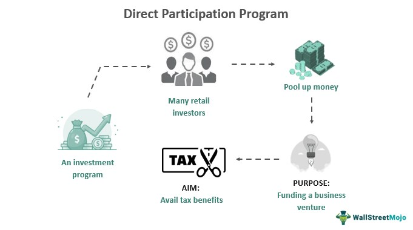

Direct Participation Programs (DPPs) present investors with a distinct opportunity to gain direct exposure to the cash flows and tax benefits of various business ventures without taking on management roles. These programs have a structured approach, particularly prominent in sectors like real estate and energy, allowing investors to achieve substantial returns. As they offer both financial advantages and the potential for significant portfolio diversification, DPPs are attracting attention for their unique investment attributes.

The structure of DPPs typically involves non-traded entities that pass income and tax benefits directly to the investors, avoiding double taxation. This pass-through taxation makes DPPs particularly attractive for those looking to optimize their tax position. However, investing in DPPs comes with specific requirements and considerations. Investors generally need to meet certain financial thresholds to qualify, ensuring that they are prepared for the associated risks.

This article will cover the necessary requisites for investing in DPPs and describe the distinct types available. It will also discuss the innovative role of algorithmic trading in enhancing investment strategies within DPPs, providing insights into how these technologies can optimize decision-making processes. Furthermore, the discussion will highlight both the benefits and the potential drawbacks of DPP investments, giving a detailed view for investors to evaluate whether DPPs align with their financial goals. Understanding these aspects will help investors make informed choices about including DPPs in their diversified investment portfolios.

## Table of Contents

## Understanding Direct Participation Programs (DPPs)

Direct Participation Programs (DPPs) operate as non-traded entities, allowing investors to access the cash flows and tax advantages of a business venture without engaging in active management. Unlike traditional investment vehicles, DPPs are structured to offer an indirect form of investment in specific sectors, primarily real estate and energy ventures. They are established as limited partnerships, subchapter S corporations, or general partnerships, providing a legal framework that supports passive investment.

In a DPP, investors attain partial ownership of physical assets and derive tax advantages, as the allocated income is transferred to them on a pre-tax basis. This is achieved through a mechanism called "pass-through taxation," where the income or loss from the venture is passed directly to the investors, thereby minimizing or potentially eliminating corporate-level tax liabilities. By passing the gains or losses directly to the individual investor, the tax implications align with the investor's tax situation rather than being subject to corporate tax rates.

DPPs primarily cater to affluent investors due to their higher entry requirements. These programs often require significant initial investment and a level of financial acumen to navigate the complexities involved, making them accessible predominantly to accredited investors who meet specific financial thresholds. For these investors, DPPs offer an opportunity to engage with high-value investments that are typically reserved for entities with substantial capital.

Understanding the structure and operating principles of DPPs is essential for potential investors. Typically, the partnership or corporation manages the venture on behalf of the investors, allowing them to participate indirectly. As a result, investors do not need to handle the day-to-day management, which is handled by the entity managing the DPP, providing a unique combination of ownership and operational outsourcing.

For investors seeking diversified portfolio strategies, DPPs offer an attractive model, blending ownership benefits with tax efficiency while mitigating direct involvement in management. Recognizing and navigating these unique characteristics can enable investors to leverage DPPs effectively, aligning their investments with long-term financial goals.

## Investment Requirements for Direct Participation Programs

Investing in Direct Participation Programs (DPPs) requires adherence to specific financial thresholds, primarily to ensure that only individuals with sufficient financial acumen and capacity engage with such investment vehicles. The criteria for participation often align with those outlined by regulatory authorities to classify "accredited investors." Generally, the foundational requirement is a net worth of at least $1 million, excluding the value of the primary residence. Alternatively, individuals can qualify with an income threshold, typically requiring an annual income exceeding $200,000 for individuals or $300,000 for couples in the two most recent years, with expectations of maintaining such income levels in the current year.

These financial prerequisites serve a dual purpose. Firstly, they safeguard less experienced investors from the inherent risks of DPPs. DPPs, by nature of their structure, expose investors to potential losses higher than many traditional investments, necessitating a sophisticated understanding of financial risk management. By limiting investment eligibility to those meeting specific thresholds, regulators aim to minimize financial risk among unprepared investors.

While these requirements might seem restrictive, they open lucrative opportunities for those who qualify. Access is provided to high-value projects, often in sectors such as energy and real estate, which traditionally yield significant returns. The exclusivity of these thresholds ensures a more stable and informed investor base, reducing the [volatility](/wiki/volatility-trading-strategies) often caused by inexperienced market participants. This stability is beneficial for the sustained growth and success of the venture, aligning investor and project interests.

Potential investors must thoroughly understand these requirements as they form the entry point for participation in DPPs. Moreover, being well-informed about these prerequisites aids in strategic financial planning, helping investors make informed decisions regarding portfolio diversification and risk exposure. Hence, evaluating personal financial standing against these criteria is an initial yet crucial step for any individual or entity considering engagement in Direct Participation Programs.

## Leveraging Algorithmic Trading in DPPs

Algorithmic trading, a technological advancement using computer algorithms for trade execution, significantly enhances the operational framework of Direct Participation Programs (DPPs). By leveraging sophisticated algorithms, investors can automate various processes, leading to increased precision and efficiency in managing their portfolios. These algorithms can process vast amounts of data swiftly, providing insights into market trends that influence DPP investments.

A key advantage of [algorithmic trading](/wiki/algorithmic-trading) in DPPs is the automation of complex tasks like asset allocation and risk management. Automating these tasks reduces human error and ensures consistent execution of investment strategies. For instance, an algorithm can be designed to rebalance the portfolio based on predefined criteria, thus optimizing asset allocation in accordance with the fluctuating market conditions.

Integrating algorithmic trading strategies allows investors to base their decisions on comprehensive data analysis, aligning their investments more closely with broader market dynamics. For example, an algorithm could analyze historical data and identify patterns, predicting future market movements which can then inform strategic decisions regarding the timing and structuring of DPP investments. This is particularly beneficial for adjusting investment strategies in response to economic indicators that may impact the real estate or energy sectors, where DPPs commonly operate.

While DPPs are not typically traded on open markets, the utilization of algorithmic insights can enhance their management by providing a framework for better timing of cash flow optimization and leveraging tax benefits effectively. For example, an algorithm might suggest optimal timing for allocating resources to new energy projects based on projected commodity prices or regulatory changes.

Understanding and implementing algorithmic trading in DPP investments not only enhances decision-making but also maximizes potential returns. Investors can benefit from strategies that allow rapid adaptation to changing market conditions, a crucial [factor](/wiki/factor-investing) in the success of any investment plan tailored towards DPPs. This underscores the necessity for investors to grasp the role of algorithmic trading within DPPs, as it provides a substantial competitive edge in optimizing investment outcomes.

## Advantages and Disadvantages of Direct Participation Programs

Direct Participation Programs (DPPs) present various advantages that make them attractive to certain investors, prominently featuring pass-through taxation. This tax structure allows income and deductions to be passed directly to investors, avoiding the double taxation typically associated with corporate income. As a result, investors can benefit from more favorable tax conditions that enhance overall returns.

Additionally, DPPs provide a means for investors to gain exposure to business ventures without necessitating active management. This characteristic makes them suitable for investors who wish to benefit from specific sectors, like real estate and energy, without the responsibility of direct management. The indirect approach also allows for professional management of the assets, which can potentially yield higher returns due to expert handling.

However, DPPs also present significant disadvantages. One notable issue is their illiquidity. As non-traded entities, DPPs often have restrictive [exit](/wiki/exit-strategy) options, making it challenging for investors to access their capital quickly if needed. This lack of [liquidity](/wiki/liquidity-risk-premium) can pose a substantial risk, particularly for those requiring quick access to their investments.

Moreover, entering the DPP space demands meeting stringent investment criteria. These requirements are designed to protect less experienced investors but inherently limit participation to accredited individuals. This exclusivity might exclude potential investors who do not meet the financial prerequisites but are otherwise interested in the opportunities DPPs offer.

Another critical point to consider is the management risk associated with DPPs. Although investors do not manage the business directly, decisions made by managerial teams can significantly impact investment performance. Poor management decisions could result in suboptimal returns or even losses, emphasizing the importance of diligence when selecting DPPs to invest in.

Overall, while DPPs offer distinct tax benefits and investment access to sought-after sectors, potential investors need to thoroughly assess the associated illiquidity, management risks, and entry requirements. Balancing these considerations can guide investors in determining whether DPPs align with their investment goals and risk tolerance.

## Conclusion

Direct Participation Programs (DPPs) present a distinctive avenue for investment, particularly appealing to those focused on sectors such as real estate and energy. The structural benefits, coupled with tax advantages, make these programs attractive to qualified investors seeking substantial returns. Specifically, DPPs enable investors to partake in revenue from business ventures while enjoying favorable tax treatment through mechanisms like pass-through taxation, which mitigates corporate tax liabilities.

Despite these advantages, the accessibility of DPPs is restricted by rigorous entry requirements, typically necessitating that investors are accredited, often with a substantial net worth or significant income. This exclusivity serves as a safeguard against the inherent risks within these investment vehicles but simultaneously restricts participation to a narrower investor pool. The illiquid nature of DPPs, along with the potential for poor management decisions, highlights the need for meticulous due diligence and evaluation by prospective investors.

Incorporating algorithmic trading into DPP strategies introduces potential for enhanced returns and more effective decision-making. Algorithmic trading leverages sophisticated algorithms to analyze market data, allowing for optimized portfolio management that aligns investments with prevailing market conditions. By automating processes and minimizing human error, algorithmic trading can be a valuable tool for investors looking to maximize profits from DPPs.

Ultimately, navigating the complexities of Direct Participation Programs requires a thorough understanding of their structure, benefits, and risks. Qualified investors who can adeptly manage these factors stand to benefit significantly from the unique opportunities DPPs present. Comprehensive research and strategic integration of algorithmic trading can further enhance investment outcomes, making DPPs a worthwhile consideration for an investment portfolio.

## References & Further Reading

[1]: Jurik, J. (2021). ["Direct Participation Programs: Investment Structure and Tax Advantages."](https://financefacts101.com/understanding-direct-participation-programs-dpps-a-comprehensive-guide-for-institutional-investors/) Thomson Reuters Tax and Accounting.

[2]: Peters, G. & Kannan, R. (2018). ["Real Estate Partnerships: The Role of DPPs."](https://onlinelibrary.wiley.com/doi/abs/10.1111/issj.12181) Journal of Property Investment & Finance, 36(3), 238-254.

[3]: Bianchi, D., & Drew, M. (2014). ["Algorithmic Trading and Market Efficiency."](https://www.researchgate.net/profile/Robert-Bianchi-5/publication/5171379_A_test_of_momentum_trading_strategies_in_foreign_exchange_markets_evidence_from_the_G7/links/02e7e533eae7389e9c000000/A-test-of-momentum-trading-strategies-in-foreign-exchange-markets-evidence-from-the-G7.pdf) Journal of Financial Markets, 18, 63-91.

[4]: SEC.gov. (2021). ["Accredited Investors – Updated Investor Bulletin."](https://www.sec.gov/Archives/edgar/data/1427722/000165495421013625/0001654954-21-013625-index.htm) U.S. Securities and Exchange Commission.

[5]: Layton, S. & Scherlis, S. (2016). ["Tax Strategies for Direct Participation Programs."](https://www.investopedia.com/terms/d/dpp.asp) Tax Management Financial Planning Journal.