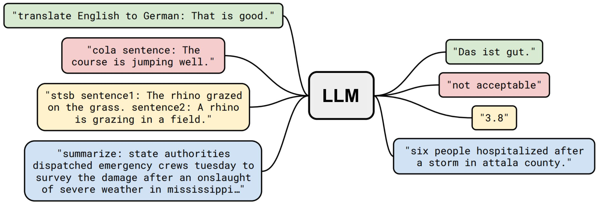

## Table of Contents

## What is direct prompting in machine learning?

Direct prompting in machine learning is when you give a model a clear instruction or question and expect it to respond directly to that. Think of it like asking a friend a specific question and expecting a straightforward answer. In machine learning, this method is often used with large language models, where you might ask the model to perform a task or answer a query in a certain way. For example, you could ask a model to translate a sentence from English to Spanish, and it would respond with the translated text.

This technique is popular because it's simple and effective for many tasks. By giving the model a direct prompt, you're guiding it to focus on the specific information or action you need. This can be especially useful in applications like customer service bots, where quick and accurate responses are important. However, the success of direct prompting depends a lot on how well the model has been trained and how clear and specific the prompt is. If the prompt is vague or the model isn't trained well for the task, the response might not be as useful or accurate.

## How does direct prompting differ from other prompting techniques?

Direct prompting is like giving a clear instruction to a machine learning model, expecting a straightforward answer. It's simple and works well for many tasks. For example, if you ask a model to translate a sentence from English to Spanish, it will directly give you the translated text. This method is popular because it's easy to use and often gets the job done quickly. It's especially useful in situations where you need quick and accurate answers, like in customer service bots.

Other prompting techniques can be more complex and indirect. For instance, few-shot prompting involves giving the model a few examples of what you want it to do before asking it to perform the task. This helps the model understand the context and perform better on new examples. Another technique is chain-of-thought prompting, where you guide the model through a series of steps or reasoning processes to arrive at an answer. These methods can be more effective for complex tasks where a simple direct prompt might not provide enough context or guidance for the model to give a good answer.

## What are the basic components of a direct prompt?

A direct prompt has two main parts: the instruction and the context. The instruction is what you want the model to do, like translating a sentence or answering a question. The context gives the model more information to help it understand what you need. For example, if you're asking the model to translate a sentence, the context might be the language you want to translate to.

These two parts work together to make sure the model gives you the right answer. The instruction tells the model what to do, and the context helps the model do it correctly. If you give a clear instruction and enough context, the model can usually give you a good answer. But if the instruction is not clear or the context is missing, the model might not understand what you want and give you a wrong answer.

## Can you explain how direct prompting is used in natural language processing?

In natural language processing, direct prompting is used to make a language model understand and respond to a user's request in a straightforward way. For example, if you want the model to translate a sentence from English to Spanish, you would give it a direct prompt like "Translate this sentence to Spanish: 'Hello, how are you?'" The model then processes this prompt and gives you the translated text, "Hola, ¿cómo estás?" This method is simple and effective because it clearly tells the model what to do, making it easier for the model to give the right answer.

Direct prompting is also used in other tasks like answering questions or summarizing text. For instance, if you ask the model, "What is the capital of France?" it will directly respond with "Paris." This approach is widely used in applications like chatbots and virtual assistants, where quick and accurate responses are important. By using direct prompts, these systems can efficiently handle user queries without needing complex instructions or additional context, making them user-friendly and efficient.

## What are some common applications of direct prompting in machine learning?

Direct prompting is often used in customer service chatbots. When someone asks a question like "What are your store hours?" the chatbot uses direct prompting to understand the question and give a quick answer. This helps customers get the information they need without waiting. It's simple and effective, making it a popular choice for businesses that want to improve their customer service.

Another common use of direct prompting is in language translation apps. If you want to translate a sentence from English to Spanish, you can type "Translate this to Spanish: 'Hello, how are you?'" The app will directly give you the translated text, "Hola, ¿cómo estás?" This makes it easy for people to communicate in different languages without needing to learn them.

Direct prompting is also useful in virtual assistants like Siri or Alexa. When you ask, "What's the weather like today?" the assistant uses direct prompting to understand your question and give you a straightforward answer. This makes everyday tasks easier and helps people get information quickly.

## How can direct prompting improve the performance of machine learning models?

Direct prompting can help [machine learning](/wiki/machine-learning) models work better by giving them clear instructions. When you use direct prompting, you tell the model exactly what you want it to do, like translating a sentence or answering a question. This makes it easier for the model to understand what you need and give you the right answer. For example, if you ask a model to translate "Hello, how are you?" to Spanish, it will directly give you "Hola, ¿cómo estás?" This clear instruction helps the model perform the task correctly without getting confused.

Using direct prompting also makes the model faster and more efficient. When the model knows exactly what to do, it doesn't have to spend time figuring out the task. This is really helpful in applications like customer service bots or virtual assistants, where people need quick answers. By giving the model a direct prompt, you help it focus on the task at hand and give you a good answer quickly. This can make the model more useful and improve the user experience.

## What are the challenges faced when implementing direct prompting?

One challenge with direct prompting is that it relies on the model understanding the instruction clearly. If the prompt is not clear or specific enough, the model might get confused and give the wrong answer. For example, if you ask a model to "Translate this," without saying which language, it won't know what to do. This can lead to mistakes and make the model less useful. To avoid this, it's important to give clear and specific instructions when using direct prompting.

Another challenge is that direct prompting might not work well for complex tasks. Some tasks need more context or examples to be done correctly. For instance, if you want a model to write a story, a simple prompt like "Write a story" might not give the model enough information. It might need more details about the characters or the setting. In these cases, other prompting techniques like few-shot prompting or chain-of-thought prompting might be better because they give the model more guidance and help it perform better on complex tasks.

## How does the choice of prompt affect the outcome in direct prompting?

The choice of prompt in direct prompting can make a big difference in the outcome. When you give a clear and specific instruction, the model is more likely to understand what you want and give you a correct answer. For example, if you say "Translate this sentence to Spanish: 'Hello, how are you?'" the model knows exactly what to do and will give you "Hola, ¿cómo estás?" But if your prompt is not clear, like just saying "Translate this," the model might get confused and give the wrong answer or not respond at all.

The prompt also needs to match the task's complexity. Simple tasks like translating a sentence or answering a basic question work well with direct prompting. But for more complex tasks, a simple prompt might not give the model enough information. For instance, if you want the model to write a story, saying "Write a story" might not be enough. The model might need more details about the characters or the setting to do a good job. So, choosing the right prompt is important to get the best results from the model.

## What are some best practices for designing effective direct prompts?

When designing effective direct prompts, it's important to be clear and specific. Make sure your prompt tells the model exactly what you want it to do. For example, instead of saying "Translate this," you should say "Translate this sentence to Spanish: 'Hello, how are you?'" This way, the model knows what language to translate to and what sentence to use. Being clear helps the model understand your request and give you the right answer.

Another best practice is to match the prompt to the task's complexity. Simple tasks like translating a sentence or answering a basic question work well with direct prompts. But for more complex tasks, like writing a story, you might need to give more details. Instead of just saying "Write a story," you could say "Write a short story about a dog who goes on an adventure." This gives the model more context and helps it create a better story. By choosing the right level of detail, you can make sure the model performs well on the task you give it.

## How can direct prompting be optimized for different types of machine learning tasks?

To optimize direct prompting for different types of machine learning tasks, it's important to tailor the prompt to the task's complexity. For simple tasks like translation or basic question answering, a clear and concise prompt works best. For example, if you want to translate a sentence, you might say "Translate this to Spanish: 'Hello, how are you?'" This gives the model a straightforward instruction that it can easily follow. By keeping the prompt simple and specific, you help the model focus on the task and give you the right answer quickly.

For more complex tasks, like generating a story or solving a problem, you might need to provide more context or details in the prompt. Instead of just saying "Write a story," you could say "Write a short story about a dog who goes on an adventure." This gives the model more information to work with, helping it create a better and more relevant story. By adjusting the level of detail in the prompt based on the task's complexity, you can improve the model's performance and make sure it understands what you need.

## What advanced techniques can be used to enhance direct prompting?

One advanced technique to enhance direct prompting is called few-shot prompting. This involves giving the model a few examples of what you want it to do before asking it to perform the task. For example, if you want the model to translate sentences, you might show it a few translations first, like "Hello, how are you?" to "Hola, ¿cómo estás?" and "Thank you" to "Gracias." Then, when you ask it to translate a new sentence, it has a better understanding of what you need. This can make the model's answers more accurate and helpful, especially for tasks that are a bit more complex than simple translation.

Another technique is chain-of-thought prompting. This guides the model through a series of steps or reasoning processes to arrive at an answer. For instance, if you want the model to solve a math problem, you might break it down into smaller steps and ask the model to explain its thinking along the way. This can help the model give more detailed and correct answers, especially for tasks that require logical reasoning or problem-solving. By using these advanced techniques, you can make direct prompting more effective and improve the model's performance on a wider range of tasks.

## How does direct prompting integrate with other machine learning methodologies?

Direct prompting can be combined with other machine learning methods to make models work better. For example, it can be used with [reinforcement learning](/wiki/reinforcement-learning), where the model learns from feedback. You can use direct prompts to tell the model what to do and then give it rewards or penalties based on how well it does. This helps the model learn faster and give better answers. Another way to combine direct prompting with other methods is through transfer learning. Here, you start with a model that's already good at one task and use direct prompts to help it learn a new task. This can save time and make the model more useful for different kinds of jobs.

Another important way to integrate direct prompting with other machine learning methodologies is through ensemble methods. In ensemble methods, you use several models together to get better results. Direct prompting can help guide these models to work together more effectively. For instance, you might use direct prompts to tell each model in the ensemble what part of a task to focus on. This can lead to more accurate and reliable answers. By combining direct prompting with these other methods, you can make machine learning models more powerful and versatile, helping them handle a wider range of tasks and give better results.

## References & Further Reading

[1]: Brown, T. B., Mann, B., Ryder, N., Subbiah, M., Kaplan, J., Dhariwal, P., ... & Amodei, D. (2020). ["Language Models are Few-Shot Learners."](https://arxiv.org/abs/2005.14165) arXiv preprint arXiv:2005.14165.

[2]: Vaswani, A., Shazeer, N., Parmar, N., Uszkoreit, J., Jones, L., Gomez, A. N., ... & Polosukhin, I. (2017). ["Attention is All You Need."](https://arxiv.org/abs/1706.03762) Advances in Neural Information Processing Systems 30.

[3]: Radford, A., Wu, J., Child, R., Luan, D., Amodei, D., & Sutskever, I. (2019). ["Language Models are Unsupervised Multitask Learners."](https://cdn.openai.com/better-language-models/language_models_are_unsupervised_multitask_learners.pdf) OpenAI.

[4]: Raffel, C., Shazeer, N., Roberts, A., Lee, K., Narang, S., Matena, M., ... & Liu, P. J. (2020). ["Exploring the Limits of Transfer Learning with a Unified Text-to-Text Transformer."](https://arxiv.org/abs/1910.10683) Journal of Machine Learning Research, 21(140), 1-67.

[5]: Dong, L., Wang, W., Addanki, R., Bapna, A., He, X., Zhou, B., ... & Zhou, M. (2021). ["CogView: Mastering Text-to-Image Generation via Transformers."](https://www.sciencedirect.com/science/article/pii/S221128552030567X) arXiv preprint arXiv:2105.13290.

[6]: ["Deep Learning"](https://en.wikipedia.org/wiki/Deep_learning) by Ian Goodfellow, Yoshua Bengio, and Aaron Courville. MIT Press.