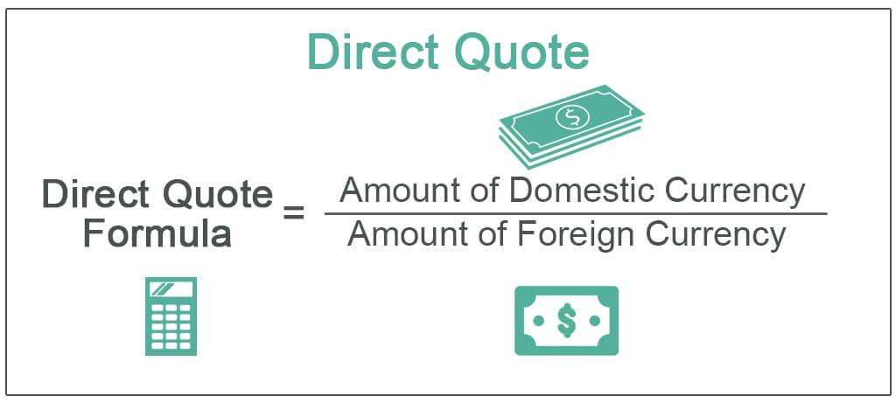

Currency trading significantly impacts the global financial ecosystem by influencing economic stability and facilitating international trade. Central to this system are exchange rates, the values at which one currency can be exchanged for another, which serve as indicators of economic health and guides for international transactions. Among the ways exchange rates are represented, direct quotes hold particular importance for both traders and businesses. A direct quote denotes the amount of domestic currency needed to purchase a unit of foreign currency, providing a straightforward method to understand currency valuation.

In recent years, algorithmic trading, or algo trading, has revolutionized the forex market. This method utilizes computer algorithms to execute trades at speeds that far surpass human capability, efficiently leveraging exchange rate fluctuations. This technological advancement allows traders to achieve faster, more accurate execution of trades, and it plays a crucial role in navigating the complexities of forex markets.



This article offers insights into the utilization of direct quotes in currency trading, explores the essential role of exchange rates, and examines the transformative impact of algorithmic trading. These concepts are fundamental for those involved in forex trading or anyone aiming to better understand the dynamic nature of market trends and exchange rate fluctuations. Understanding these elements is not only essential for trading success but also for grasping the broader implications of currency movements on the global economy.

## Table of Contents

## Understanding Exchange Rates

Exchange rates represent the valuation at which one currency can be converted into another and play a critical role in a nation's economic framework. They are pivotal as they have direct implications on a country's trade balance, inflation rates, and even economic policy decisions. Exchange rates can influence the competitiveness of a nation’s goods and services in the global market. For instance, a weaker domestic currency can make exports cheaper and more competitive internationally, while a stronger currency might reduce export demand but make imports more affordable.

Exchange rates are commonly stated through two primary types of currency quotes: direct and indirect. These quotes provide a method of expressing the exchange rate between domestic and foreign currencies, allowing market participants to navigate the forex landscape effectively.

A direct quote specifies the amount of domestic currency required to purchase one unit of foreign currency. This makes it particularly straightforward for individuals and businesses dealing primarily with the domestic currency to understand foreign exchange transactions. For example, in the United States, a direct quote of USD/EUR = 1.1 means that 1.1 USD is needed to buy 1 Euro. Here, the Euro is treated as the base currency, while the USD is the quote currency. 

This method is intuitive, especially for locales or currencies that are considered strong or stable, as it simplifies the valuation of foreign currencies in terms of the domestic currency. It fundamentally answers the question, "How much is one unit of foreign currency worth in my local currency?" Such clarity is beneficial not only for seasoned traders but also for businesses engaged in international trade, as they can make more informed decisions about pricing, cost management, and risk assessment based on how currency fluctuations impact their operations.

Understanding exchange rates and these types of quotes is essential for participants in the [forex](/wiki/forex-system) market, as they provide a basis for making informed trading and business decisions.

## What is a Direct Quote?

A direct quote is a way to express exchange rates, where the value of a foreign currency is represented in terms of the domestic currency. This form of quotation simplifies understanding for traders, as it clearly states how much domestic currency is required to obtain a unit of a foreign currency. For instance, if the USD/EUR exchange rate is depicted as 1.1, this indicates that 1.1 USD is necessary to purchase 1 Euro. In this scenario, the Euro acts as the foreign or base currency, while the USD is considered the domestic or quote currency.

Direct quotes are particularly prevalent in regions where the domestic currency is perceived as strong or stable. The strength of a currency facilitates a more straightforward comparison of foreign currency values, allowing for easier interpretation of international financial transactions. This can be of particular advantage in the context of currency trading, as it enables traders to more readily respond to currency fluctuations and make informed trading decisions.

This quotation method assumes a critical role in trading activities when the domestic currency is preferred for valuation, as it can provide a more intuitive sense of how foreign exchange impacts prices and costs in the domestic market. By offering clarity in financial dealings, direct quotes help traders and businesses to operate with greater confidence and precision in their assessment of international markets.

## Direct Quotes in Comparison to Indirect Quotes

Direct quotes and indirect quotes present two different methods for expressing exchange rates, each providing unique perspectives on the value of currencies. In a direct quote, the focus is on how much of the domestic currency is required to purchase a unit of foreign currency. This approach is particularly intuitive for traders within a country as it measures foreign currency value in local terms. For example, a direct quote of USD/EUR = 1.1 signifies that 1.1 USD is needed to obtain 1 Euro, making the U.S. dollar the domestic or quote currency and the Euro the foreign or base currency.

Conversely, an indirect quote operates on the principle that the foreign currency is presented in terms of the domestic currency. This method asks how much of the foreign currency is necessary to acquire a single unit of the domestic currency. For instance, if EUR/USD = 0.91, it indicates that 0.91 Euros are required to purchase 1 U.S. dollar.

Understanding these two forms of currency quotes is crucial for interpreting market trends and making informed trading decisions. Traders must effectively navigate between direct and indirect quotes to assess potential currency strengths or weaknesses, enabling them to strategize effectively. For example, switching from a direct quote to an indirect quote provides insight into the appreciation or depreciation of domestic purchasing power relative to foreign currency strength.

Here's a simple Python function to demonstrate converting a direct quote to an indirect quote:

```python
def convert_to_indirect_quote(direct_quote):
    return 1 / direct_quote

# Example usage:
direct_quote_usd_eur = 1.1
indirect_quote_eur_usd = convert_to_indirect_quote(direct_quote_usd_eur)
print(f"Indirect Quote (EUR/USD): {indirect_quote_eur_usd:.2f}")
```

In this example, a direct quote of 1.1 (USD/EUR) is transformed into an indirect quote of approximately 0.91 (EUR/USD), illustrating the reciprocal relationship between these two quoting methods. Such calculations, vital for currency traders, highlight the dual nature of exchange rate representation and its significance in evaluating economic strategies.

## Algo Trading in Currency Markets

Algorithmic trading, often referred to as algo trading, involves the use of computer programs to automate the trading process in financial markets, including currency markets. These programs are designed to follow a defined set of instructions or algorithms for placing a trade. Implementing pre-programmed strategies, algo trading can process vast amounts of market data and execute trades with blistering speed and accuracy, a task beyond the capability of human traders.

One of the primary advantages of algo trading is its ability to take advantage of real-time exchange rate fluctuations. These algorithms can continuously monitor the market, identifying profitable trading opportunities that arise from these fluctuations. By acting on small price differences quickly and efficiently, [algorithmic trading](/wiki/algorithmic-trading) can enhance the chance of generating profitable trades.

In the context of currency trading, algo trading can capitalize on direct quotes, which express the value of foreign currency in terms of the domestic currency. This capability is significant because it enables traders to quickly respond to favorable changes in exchange rates. For instance, when a direct quote indicates a sudden depreciation of a foreign currency, algo trading systems can automatically execute buy orders to leverage potentially beneficial prices, reducing the time lag in decision-making and action.

The integration of sophisticated mathematical models and [artificial intelligence](/wiki/ai-artificial-intelligence) in algo trading further enhances the analysis and prediction of market trends. Algorithms are designed to evaluate historical data, discern patterns, and anticipate future movements in currency prices. Such advanced computational methods allow traders to refine their strategy and improve efficiency continually.

Here's a simplified example of a basic algorithmic trading strategy written in Python:

```python
from forex_python.converter import CurrencyRates

def automated_trading_algorithm(base_currency, quote_currency, threshold):
    cr = CurrencyRates()
    current_rate = cr.get_rate(base_currency, quote_currency)
    print(f"Current {base_currency}/{quote_currency} rate: {current_rate}")

    if current_rate < threshold:
        execute_buy_order(base_currency, quote_currency)
    else:
        print(f"Rate exceeds threshold of {threshold}. Hold position.")

def execute_buy_order(base_currency, quote_currency):
    # Placeholder for order execution logic
    print(f"Executing buy order for {base_currency}/{quote_currency}.")

# Example usage
automated_trading_algorithm('USD', 'EUR', 0.9)
```

This script checks the current exchange rate between two currencies. If the rate is below a specified threshold, it triggers a buy order. While this is a simplistic illustration, real-world algo trading operations involve far more complex decision rules and wider market data considerations.

Overall, the role of algo trading in currency markets is pivotal. It not only enables more precise and faster trading decisions but also enhances the ability to manage a vast array of trades simultaneously across different markets and time zones. As such, algo trading stands as a cornerstone technology driving modern forex markets, allowing for increased [liquidity](/wiki/liquidity-risk-premium) and improved market efficiency.

## Benefits of Algo Trading with Direct Quotes

Algo trading with direct quotes offers significant advantages in currency trading, primarily due to its precision and efficiency. By utilizing pre-programmed instructions, algorithmic trading minimizes the risk of human error when interpreting forex market data. This is especially beneficial in a domain characterized by rapid fluctuations and volatile market conditions. The incorporation of algorithms enables traders to process large volumes of data and make swift decisions, which are pivotal in capturing profitable opportunities.

One of the key benefits of utilizing algo trading with direct quotes is the elimination of delays in trade execution. Unlike manual trading, which may suffer from lag due to human intervention, algorithmic trading ensures that trades are executed instantly as favorable conditions arise. This immediacy can make a substantial difference in the forex market, where exchange rates can shift in a matter of seconds.

Furthermore, algorithmic strategies facilitate the automation of trading processes, leading to consistent and systematic decision-making. By programming specific strategies, traders can avoid the pitfalls associated with emotional biases, such as fear and greed, which can often lead to suboptimal trading choices. This consistency is crucial for maintaining a disciplined approach in a highly dynamic market.

In terms of implementation, the precision of algo trading is further augmented by its ability to employ mathematical and statistical models to forecast market trends and determine optimal trading points. For example, a simple moving average (SMA) crossover strategy, which involves buying and selling based on the crossover of short-term and long-term moving averages, can be coded as follows in Python:

```python
def sma_crossover_strategy(data, short_window, long_window):
    short_sma = data['Close'].rolling(window=short_window, min_periods=1).mean()
    long_sma = data['Close'].rolling(window=long_window, min_periods=1).mean()

    signals = (short_sma > long_sma).astype(int)  # 1 for buy, 0 for sell
    return signals

# Example usage with a DataFrame 'data' containing historical price data
signals = sma_crossover_strategy(data, short_window=40, long_window=100)
```

This strategy automatically generates signals for buying and selling based on historical price data, ensuring timely and emotion-free trades. It exemplifies how algorithmic trading can leverage mathematical techniques to enhance decision-making processes.

In summary, the benefits of algorithmic trading with direct quotes lie in its ability to execute trades precisely and consistently, thereby optimizing performance in the forex market. By reducing human error and emotional interference, and by maximizing opportunities through swift execution, algo trading serves as a powerful tool for modern traders.

## Challenges and Considerations

Market [volatility](/wiki/volatility-trading-strategies) is a critical [factor](/wiki/factor-investing) to consider in currency trading, particularly when employing algorithmic trading strategies. The inherent fluctuations in exchange rates can pose significant risks, even with the most sophisticated automated systems. Therefore, traders must be vigilant in monitoring and adjusting their algorithms to ensure optimal performance and risk management.

Maintaining the effectiveness of trading algorithms requires continuous oversight and refinement. Algorithmic models should be regularly evaluated against current market conditions and performance metrics, ensuring they adapt to dynamic market environments. This involves analyzing their performance, identifying patterns, and recalibrating the algorithm parameters accordingly. For instance, techniques such as [machine learning](/wiki/machine-learning) can be employed to enhance the adaptive capabilities of trading algorithms by providing them with the ability to learn from new data and adjust their strategies in real time.

Additionally, traders must be aware of the limitations inherent in algorithmic models. One significant challenge is the reliance on historical data for model training and strategy development. This reliance can lead to strategies that perform well under past market conditions but may falter in the face of unforeseen market scenarios. Consequently, it is essential to incorporate robust testing and validation processes, using diverse datasets to assess the resilience of trading strategies.

To illustrate, consider the implementation of a simple moving average crossover strategy:

```python
def moving_average_cross_strategy(prices, short_window=10, long_window=50):
    short_mavg = prices.rolling(window=short_window, min_periods=1).mean()
    long_mavg = prices.rolling(window=long_window, min_periods=1).mean()

    signals = pd.DataFrame(index=prices.index)
    signals['signal'] = 0.0
    signals['signal'][short_window:] = np.where(short_mavg[short_window:] > long_mavg[short_window:], 1.0, 0.0)

    signals['positions'] = signals['signal'].diff()

    return signals
```

This code exemplifies a basic strategy whereby buy signals are generated when a short-term moving average exceeds a long-term moving average. However, its effectiveness depends on the chosen parameters and market conditions. Regular optimization of such models is necessary to cater to the shifting nature of market patterns.

In conclusion, while algorithmic trading offers distinct advantages in precision and speed, traders must account for volatility, continuously update algorithms, and recognize the limitations posed by historical data reliance. Such practices ensure the development of resilient, robust trading strategies in an ever-evolving market landscape.

## Conclusion

Direct quotes offer a clear and uncomplicated method for traders to engage with the forex market, enhancing the precision necessary for effective currency trading. By representing the amount of domestic currency required to purchase one unit of foreign currency, direct quotes provide traders with an intuitive understanding of currency valuations. This straightforward approach facilitates accurate market assessments and strategic financial planning, which are essential to optimizing forex transactions.

Algorithmic trading plays an instrumental role in maximizing the utility of direct quotes, particularly in the fast-paced environment of modern forex markets. By leveraging advanced algorithms, traders can process large volumes of market data at unprecedented speeds, ensuring that they can promptly capitalize on favorable exchange rate movements. This not only reduces the potential for human error but also allows for the deployment of consistent trading strategies free from emotional bias, thus enhancing trading efficiency and effectiveness.

The integration of direct quotes and algorithmic trading exemplifies significant breakthroughs in trading technology. These concepts serve as key tools for contemporary market participants, who seek to navigate the complexities of global forex markets successfully. Embracing these advancements is paramount for traders who aspire to maintain a competitive edge and achieve enduring success in today's dynamic financial landscape.

## References & Further Reading

[1]: ["Advances in Financial Machine Learning"](https://www.amazon.com/Advances-Financial-Machine-Learning-Marcos/dp/1119482089) by Marcos Lopez de Prado

[2]: ["Machine Learning for Algorithmic Trading"](https://www.amazon.com/Machine-Learning-Algorithmic-Trading-alternative/dp/1839217715) by Stefan Jansen

[3]: ["Quantitative Trading: How to Build Your Own Algorithmic Trading Business"](https://github.com/LucindaYa/quant-resources/blob/master/Quantitative%20Trading%20How%20to%20Build%20Your%20Own%20Algorithmic%20Trading%20Business.pdf) by Ernest P. Chan

[4]: ["Evidence-Based Technical Analysis: Applying the Scientific Method and Statistical Inference to Trading Signals"](https://www.amazon.com/Evidence-Based-Technical-Analysis-Scientific-Statistical/dp/0470008741) by David Aronson

[5]: ["Forex Trading: The Basics Explained in Simple Terms"](https://www.amazon.com/FOREX-TRADING-Explained-Beginners-Strategies/dp/1535198567) by Jim Brown