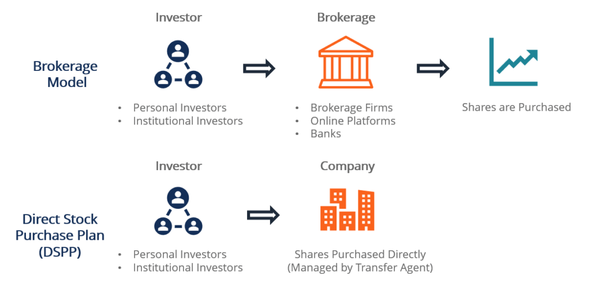

## Table of Contents

## What is a direct stock purchase plan (DSPP)?

A direct stock purchase plan (DSPP) is a way for people to buy shares of a company directly from the company itself, without using a broker. This can be a good option for people who want to invest in a specific company they like, but don't want to pay the fees that brokers sometimes charge. Companies offer DSPPs to make it easier for individual investors to own their stock, and it can be a more affordable way to start investing.

To participate in a DSPP, you usually need to sign up through the company's investor relations website. Once enrolled, you can buy shares by sending money directly to the company. Some plans also let you set up automatic investments, where a certain amount of money is taken from your bank account each month to buy more shares. This can help you build your investment over time without having to remember to make purchases.

## How does a direct stock purchase differ from buying stocks through a broker?

When you buy stocks through a direct stock purchase plan (DSPP), you are buying the shares directly from the company. This means you don't need to use a broker or a middleman. You can usually sign up for a DSPP on the company's website and send them money to buy shares. Sometimes, you can even set up automatic investments, so a certain amount of money is taken from your bank account each month to buy more shares. This can be a good way to slowly build up your investment without having to pay extra fees to a broker.

On the other hand, when you buy stocks through a broker, you are using a service that helps you buy and sell stocks on the stock market. Brokers can offer a lot of different services, like research tools and trading platforms, but they usually charge fees for their services. These fees can add up, especially if you are making a lot of trades or if you don't have a lot of money to invest. So, while using a broker can give you more options and flexibility, it can also be more expensive than buying stocks directly from the company through a DSPP.

## Which companies offer direct stock purchase plans?

Many big companies offer direct stock purchase plans (DSPPs). Some of these companies are well-known names like Walmart, Coca-Cola, and McDonald's. These plans let you buy shares directly from the company without needing a broker. This can be a good way to start investing if you like a specific company and want to own part of it.

Other companies that offer DSPPs include Ford, ExxonMobil, and Johnson & Johnson. Each company has its own rules for how their DSPP works. Some might let you start with a small amount of money, while others might have a higher minimum. It's always a good idea to check the company's investor relations website to learn more about their specific plan and how you can join.

## What are the benefits of participating in a direct stock purchase plan?

One big benefit of joining a direct stock purchase plan is that it can save you money. When you buy stocks through a broker, you often have to pay fees for each trade. These fees can add up, especially if you are just starting to invest and don't have a lot of money. With a direct stock purchase plan, you buy the shares directly from the company, so you don't have to pay those extra fees. This can make it easier and cheaper to start building your investment.

Another benefit is that it can be a simple way to invest in a company you like. Many people feel a connection to certain brands or companies, and a direct stock purchase plan lets you own a piece of those companies without needing to use a broker. Some plans also let you set up automatic investments, where a set amount of money is taken from your bank account each month to buy more shares. This can help you slowly grow your investment over time without having to think about it too much.

## Are there any risks associated with direct stock purchases?

Yes, there are risks with direct stock purchases. One risk is that the value of the stock can go down. If you buy shares in a company and the stock price falls, you could lose money. This is true for any stock investment, but it's important to remember when you're buying directly from the company. Another risk is that direct stock purchase plans might not offer as much flexibility as buying through a broker. For example, you might not be able to sell your shares as quickly, or you might have to wait longer to get your money.

Also, not all companies offer direct stock purchase plans. So, if you want to invest in a specific company, you might not be able to use a DSPP to do it. And even if a company does offer a DSPP, there could be rules about how much you need to invest to start or how often you can buy more shares. It's always a good idea to read the details of the plan carefully before you decide to join.

## How can someone enroll in a direct stock purchase plan?

To enroll in a direct stock purchase plan, you first need to find out if the company you're interested in offers one. You can usually do this by visiting the company's investor relations website. Once you find the DSPP section, you'll need to read through the plan's details to understand the rules, like how much money you need to start and how often you can buy more shares. After you've decided to join, you'll need to fill out an enrollment form. This form will ask for your personal information and details about how you want to pay for the shares.

Once you've submitted the enrollment form, you'll need to send money to the company to buy your first shares. This can usually be done through a bank transfer or by mailing a check. Some plans also let you set up automatic investments, where a certain amount of money is taken from your bank account each month to buy more shares. This can help you build your investment over time without having to remember to make purchases. Always make sure to keep track of your investments and check the company's website for any updates or changes to the plan.

## What are the minimum investment requirements for direct stock purchase plans?

The minimum investment requirements for direct stock purchase plans can be different for each company. Some companies let you start with as little as $25 or $50, which is good for people who don't have a lot of money to invest right away. Other companies might need you to invest more, like $250 or even $500, to join their plan. It's important to check the company's investor relations website to find out what their specific minimum investment is.

Once you know the minimum investment, you can decide if it's something you can afford. Some plans also let you buy more shares over time, so you don't have to come up with all the money at once. For example, you might be able to set up automatic investments where a small amount of money is taken from your bank account each month to buy more shares. This can help you slowly build your investment without having to worry about the minimum investment amount all at once.

## Can dividends be automatically reinvested in a direct stock purchase plan?

Yes, many direct stock purchase plans let you automatically reinvest your dividends. This means that instead of getting cash from the company when they pay dividends, the money is used to buy more shares of the company's stock. This can be a good way to grow your investment over time without having to do anything extra. 

To set up automatic dividend reinvestment, you usually need to choose this option when you enroll in the plan or update your account settings later. Not all companies offer this feature, so it's important to check the details of the plan on the company's investor relations website. If it's available, it can help you build your investment more easily by using the dividends to buy more shares automatically.

## How do fees and commissions compare between direct stock purchases and traditional brokerage accounts?

Direct stock purchase plans often have lower fees and commissions than traditional brokerage accounts. With a DSPP, you might have to pay a small fee for each purchase or sale of shares, but these fees are usually less than what you would pay through a broker. Some DSPPs even let you buy shares without any fees at all, which can save you a lot of money, especially if you are just starting to invest and don't have a lot of money to spend on fees.

On the other hand, traditional brokerage accounts often charge fees for each trade you make. These fees can add up quickly, especially if you are buying and selling stocks often. Some brokers also charge account maintenance fees or fees for using their research tools and trading platforms. While these services can be helpful, they can make investing more expensive than using a direct stock purchase plan, where you buy shares directly from the company without a middleman.

## What are the tax implications of investing through a direct stock purchase plan?

When you invest through a direct stock purchase plan, you need to think about taxes. If you make money from your investment, like when the stock price goes up or you get dividends, you might have to pay taxes on that money. The tax you pay depends on how long you hold the stock. If you sell the stock after owning it for less than a year, you pay a short-term capital gains tax, which is the same as your regular income tax rate. If you hold the stock for more than a year before selling, you pay a long-term capital gains tax, which is usually lower.

Dividends you get from the stock are also taxable. If the company pays you dividends, you have to report that money on your taxes. There are two kinds of dividends: qualified and non-qualified. Qualified dividends are taxed at the lower long-term capital gains rate, while non-qualified dividends are taxed at your regular income tax rate. It's a good idea to keep track of your investments and talk to a tax advisor to make sure you understand how much you might have to pay in taxes.

## How can one manage and track their investments in a direct stock purchase plan?

To manage and track your investments in a direct stock purchase plan, you need to keep an eye on the company's investor relations website. This website usually has a section where you can log in to your account and see how many shares you own, how much they are worth, and any dividends you have received. It's a good idea to check this regularly to make sure everything is going well with your investment. You can also set up alerts or notifications if the company offers them, so you get an email or a message when something important happens, like a dividend payment or a change in the stock price.

If you want to buy more shares or sell some of your shares, you can usually do this through the same website. Just follow the instructions to make a purchase or a sale, and make sure you understand any fees you might have to pay. It's also a good idea to keep records of all your transactions, like when you bought or sold shares and how much you paid or received. This can help you keep track of your investment and make it easier to do your taxes at the end of the year.

## What advanced strategies can be employed with direct stock purchase plans for experienced investors?

Experienced investors can use direct stock purchase plans to set up a dollar-cost averaging strategy. This means they invest a fixed amount of money at regular intervals, like every month. By doing this, they buy more shares when the price is low and fewer shares when the price is high. Over time, this can help lower the average cost of their investment and reduce the risk of investing a large amount of money at the wrong time. It's a smart way to build up an investment without trying to guess when the stock price will go up or down.

Another strategy is to use dividend reinvestment to grow their investment even faster. If the company offers this option, experienced investors can choose to automatically use their dividends to buy more shares instead of taking the money as cash. This can help their investment grow more quickly because they are buying more shares without having to add more money. Over many years, this can make a big difference in how much their investment is worth. It's a good way to take advantage of the power of compounding, where the money they earn from their investment starts to earn money too.

## What are 5 Effective Algo Trading Strategies?

### Trend Identification

Trend identification through algorithmic trading involves using algorithms to spot and capitalize on market trends or predict potential reversals based on a variety of indicators. Algorithms can analyze historical data, track price movements, and apply technical indicators like moving averages, Relative Strength Index (RSI), and Moving Average Convergence Divergence (MACD) to gauge market sentiment and direction. By processing large datasets quickly, algorithms enable traders to identify entry and [exit](/wiki/exit-strategy) points efficiently, maximizing potential returns. This strategy minimizes subjectivity, ensuring decisions are rooted in data-driven insights rather than emotional biases. 

For example, a Python algorithm could be implemented to track moving averages and generate trade signals:

```python
import pandas as pd

def moving_average_strategy(data, short_window, long_window):
    signals = pd.DataFrame(index=data.index)
    signals['price'] = data['price']
    signals['short_mavg'] = data['price'].rolling(window=short_window, min_periods=1).mean()
    signals['long_mavg'] = data['price'].rolling(window=long_window, min_periods=1).mean()
    signals['signal'] = 0.0
    signals['signal'][short_window:] = \
        np.where(signals['short_mavg'][short_window:] > signals['long_mavg'][short_window:], 1.0, 0.0)   
    signals['positions'] = signals['signal'].diff()
    return signals
```

### Delta Neutral Strategies

Delta neutral strategies aim to create a position where the overall delta (a measure of sensitivity to price changes) is zero, reducing exposure to market movements. By using options, traders can balance positive and negative deltas, achieving a hedged position. This strategy focuses on profiting from volatility changes rather than price direction. Calculating the delta of individual securities, traders adjust their portfolio to maintain a net delta of zero.

### Position Sizing

Position sizing calculates the optimal size of an investment to manage risk effectively. By adjusting the amount of capital allocated to each trade, traders maintain a balanced risk-reward ratio and protect their portfolio from significant losses. Algorithms consider factors such as account size, risk tolerance, and volatility to determine position size. Emotion is removed from decision-making, resulting in consistent and disciplined trading practices.

The formula commonly used in position sizing is:

$$
\text{Position Size} = \frac{\text{Account Risk \%} \times \text{Account Equity}}{\text{Trade Risk \%}}
$$

### Stop Loss Modification

Algorithms dynamically adjust stop loss orders as market conditions change to protect profits and limit losses. This strategy involves setting stop loss points based on volatility, fundamental changes, or technical indicators. By continuously monitoring market conditions, algorithms modify stop losses to secure gains and minimize risk, ensuring trades remain aligned with market trends and reducing exposure to adverse price movements.

### Scalping

Scalping involves executing a large [volume](/wiki/volume-trading-strategy) of high-frequency trades to profit from small price fluctuations. This strategy requires quick buy/sell actions, often taking advantage of tiny spreads or market inefficiencies. Scalping relies on speed and high trade volumes, staying in positions for very short durations. Algorithms are perfect for this due to their ability to process information and execute orders at a speed unmatched by human traders, capturing gains from minimal price changes efficiently.

## References & Further Reading

[1]: Bergstra, J., Bardenet, R., Bengio, Y., & Kégl, B. (2011). ["Algorithms for Hyper-Parameter Optimization."](https://dl.acm.org/doi/10.5555/2986459.2986743) Advances in Neural Information Processing Systems 24.

[2]: ["Advances in Financial Machine Learning"](https://www.amazon.com/Advances-Financial-Machine-Learning-Marcos/dp/1119482089) by Marcos Lopez de Prado

[3]: ["Evidence-Based Technical Analysis: Applying the Scientific Method and Statistical Inference to Trading Signals"](https://www.amazon.com/Evidence-Based-Technical-Analysis-Scientific-Statistical/dp/0470008741) by David Aronson

[4]: ["Machine Learning for Algorithmic Trading"](https://github.com/stefan-jansen/machine-learning-for-trading) by Stefan Jansen

[5]: ["Quantitative Trading: How to Build Your Own Algorithmic Trading Business"](https://www.amazon.com/Quantitative-Trading-Build-Algorithmic-Business/dp/1119800064) by Ernest P. Chan