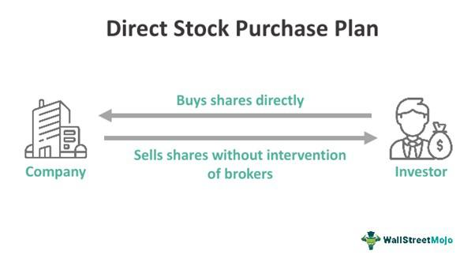

In the rapidly evolving world of finance, direct stock purchase plans, shares buying, and algorithmic trading represent pivotal concepts for modern investors. These investment tools provide alternatives to traditional methods, allowing investors to maximize their portfolio’s potential by bypassing conventional broker fees and enhancing transaction efficiency. Direct stock purchase plans (DSPPs) enable investors to acquire shares directly from the issuing company, which can be particularly advantageous for those seeking to reduce costs and increase engagement with their investments.

Moreover, the advent of algorithmic trading has revolutionized how trades are executed within the stock markets. By relying on pre-defined algorithms, investors can make rapid, data-driven decisions, thus enhancing the ability to optimize their trading strategies. This integration of technology in trading processes reflects a broader trend towards automation and data analytics in finance, contributing to increased precision and efficiency in market participation.



These mechanisms offer significant strategic advantages, especially in curating a diversified investment portfolio tailored to individual risk profiles and financial goals. With advancements in technology, investors today have unprecedented flexibility and choice. They can leverage a variety of methods to navigate the complexities of the stock market, thereby democratizing access to investment opportunities for both novice and seasoned investors.

This article will explore the various facets of direct stock purchases, strategies for acquiring company shares, and the role of algorithmic trading in contemporary markets. By understanding these elements, investors can not only boost their portfolios but also gain a deeper insight into the dynamic nature of modern financial markets.

## Table of Contents

## Direct Stock Purchase Plans (DSPPs)

Direct Stock Purchase Plans (DSPPs) offer a straightforward mechanism for investors to acquire shares directly from a corporation without involving an intermediary broker. This direct engagement can significantly reduce transaction costs, as DSPPs typically feature low or no fees. This cost-effectiveness makes them particularly appealing to small-scale investors who aim to minimize expenses while building their portfolio. 

DSPPs are primarily administered by a third-party transfer agent; however, the actual purchase and ownership process involves a direct relationship between the investor and the issuing company. This direct association encourages transparency and aligns the investor's interests with those of the company, fostering a stronger investment relationship.

Many large corporations promote DSPPs to cultivate a dedicated base of individual shareholders. By doing so, these companies not only broaden their shareholder base but also enhance shareholder loyalty. Furthermore, DSPPs can provide a sense of personal investment in the company's success, aligning the growth objectives of both the company and its investors.

DSPPs may also offer investors the opportunity to make recurring investments, allowing for a disciplined and systematic accumulation of equity in a company. This feature can be particularly beneficial for investors seeking to regularly increase their holdings over time, without the need to execute frequent individual transactions. Such systematic investments could be equated to the concept of dollar-cost averaging, where investors mitigate the impact of [volatility](/wiki/volatility-trading-strategies) by spreading out their stock purchases over regular intervals.

Overall, DSPPs present an efficient and accessible way for investors to engage actively with their investments. Through their cost-saving structure and direct purchase model, DSPPs serve as a valuable tool in aligning investors' portfolios with a company's long-term growth trajectory.

## Dividend Reinvestment Plans (DRIPs)

Dividend Reinvestment Plans (DRIPs) enable investors to use dividends received from their stock holdings to automatically purchase more shares, often at a favorable price. This mechanism represents an effective way to enhance portfolio growth without additional transaction costs, allowing returns to compound over time. In essence, DRIPs provide a seamless method for investors to effectively increase their stake in a particular company without cash-based transactions, aligning with long-term investment strategies.

The elimination of commission fees often associated with DRIPs enhances their attractiveness, especially for investors focused on maximizing return on investment. Since no extra cash is required to purchase additional shares, investors can steadily accumulate stock over time, ensuring stable growth of their equity. For instance, if an investor holds shares in Company X and Company X pays a dividend, the investor can reinvest these dividends to acquire more shares. Over multiple dividend payouts, the additional shares acquired can significantly increase the overall holding in the company, leveraging the power of compound growth.

DRIPs mimic direct stock purchase plans (DSPPs) in administration, often facilitated by either the issuing corporation or a third-party financial service provider. This framework offers investors a degree of flexibility and control that is advantageous in consistently building an accumulation of stock. Depending on the plan's specifics, DRIPs may also offer discounts on the share purchase, which further incentivizes shareholders to reinvest dividends.

The practical utility of DRIPs can be illustrated through a simple Python snippet for computing the growth of shares over time. Below is a conceptual representation:

```python
def drips_share_growth(initial_shares, dividend, share_price, periods, discount=0):
    shares = initial_shares
    for _ in range(periods):
        additional_shares = (dividend * shares) / (share_price * (1 - discount))
        shares += additional_shares
    return shares

# Example usage:
# Initial shares: 100, annual dividend: $2 per share, share price: $40, periods: 5 years
# Discount on shares: 5%
final_shares = drips_share_growth(100, 2, 40, 5, 0.05)
print(f"Final shares after 5 years: {final_shares:.2f}")
```

The example shown demonstrates how dividends reinvested can lead to an increase in the total number of shares owned, showcasing the compounding effect over multiple periods. By reinvesting dividends, investors can leverage DRIPs to create a robust portfolio growth mechanism, ensuring that the increased equity stake aligns with both their investment aspirations and the company's growth potential.

## Employee Stock Purchase Plans (ESPPs)

Employee Stock Purchase Plans (ESPPs) are company-sponsored benefits enabling employees to buy company stock at a discounted price. These plans aim to incentivize employees to accumulate shares, enhancing their savings through systematic payroll deductions. Typically, the discount offered on stock purchases ranges from 5% to 15%, providing an immediate potential return on investment, thus fostering a sense of ownership and aligning employee interests with those of the shareholder.

The structure of ESPPs is designed to accommodate both short-term and long-term investment goals. Employees often choose to buy stock during offering periods, which can last from 6 months to a year. At the end of this period, employees can purchase stocks at the lower of the price at the beginning or end of the offering period, often referred to as the "lookback" feature. This mechanism can enhance the expected value of the stock purchase for employees, particularly in volatile markets, by ensuring that they benefit from favorable price movements.

Consider the following Python snippet to calculate potential savings in an ESPP, given an initial stock price, a discount rate, and the number of shares purchased:

```python
def calculate_espp_savings(initial_price, discount, shares_purchased):
    discount_price = initial_price * ((100 - discount) / 100)
    savings_per_share = initial_price - discount_price
    total_savings = savings_per_share * shares_purchased
    return total_savings

# Example usage:
initial_price = 100  # hypothetical stock price
discount = 10  # 10% discount
shares_purchased = 50

savings = calculate_espp_savings(initial_price, discount, shares_purchased)
print(f"Total savings from ESPP: ${savings}")
```

ESPPs are governed by various regulations to ensure fairness and transparency. In the United States, Section 423 of the Internal Revenue Code stipulates specific conditions under which the plans operate, such as purchase limits and eligibility requirements. Participation often requires minimal administrative effort from the employee, usually limited to enrolling in the plan and deciding on the contribution amount, making it an attractive investment vehicle.

In conclusion, Employee Stock Purchase Plans are a valuable tool for employees to augment their savings and invest in their company's success efficiently. They provide a straightforward method for employees to gain exposure to equity markets while fostering loyalty and commitment to their employer.

## Algorithmic Trading in Stock Markets

Algorithmic trading, commonly known as "algo trading," leverages computer algorithms to execute trades at rapid speeds and large scales, bypassing the limitations faced by human traders. This approach to trading has gained significant traction due to its proficiency in processing vast amounts of market data and executing high-frequency trades with precision.

One of the primary advantages of [algorithmic trading](/wiki/algorithmic-trading) is its potential to substantially reduce transaction costs. By automating the trading process, it minimizes the bid-ask spreads and takes advantage of even minor price inefficiencies at speeds that human traders cannot achieve. This efficiency not only cuts costs but also aligns with more profitable trading outcomes.

Additionally, algorithmic trading removes emotional bias from investment decisions. Human traders can be swayed by emotions such as fear and greed, leading to impulsive trading actions. Algorithms, however, operate on predefined criteria and logic, ensuring that every trade is executed according to a set strategy, free from emotional distortion. This objectivity is crucial in maintaining consistency in trading performance.

Key algorithmic trading strategies include trend identification, delta-neutral strategies, position sizing, stop loss modification, and [scalping](/wiki/gamma-scalping). Each of these strategies serves distinct purposes. For instance, trend identification involves algorithms that analyze market indicators to forecast future movements and capitalize on emerging trends. Delta-neutral strategies focus on balancing the positives and negatives of a position, aiming to create a portfolio that mitigates the impact of market movements.

Position sizing is a critical component, involving the calculation of optimal trade amounts to manage risk efficiently. Algorithms can adjust the position size dynamically based on current market conditions, investor objectives, and tolerance levels. This ensures that capital is allocated in a way that aligns with overall investment goals.

Stop loss modification involves the adjustment of stop loss orders to protect accumulated profits as market conditions evolve. By dynamically updating stop loss levels, algorithms help in safeguarding gains while allowing for [momentum](/wiki/momentum)-based strategies to transpire.

Scalping is another prominent technique, where algorithms execute a vast number of trades in quick succession, capitalizing on small price fluctuations. Despite the minimal gain per trade, the cumulative effect of numerous successful trades can yield significant profits.

In summary, algorithmic trading empowers investors and financial institutions to act swiftly on market data, optimizing trading outcomes through enhanced efficiency and reduced emotional influence. As technology continues to evolve, the sophistication and effectiveness of algorithmic trading are expected to expand, further solidifying its role in modern financial markets.

## 5 Effective Algo Trading Strategies

### Trend Identification

Trend identification through algorithmic trading involves using algorithms to spot and capitalize on market trends or predict potential reversals based on a variety of indicators. Algorithms can analyze historical data, track price movements, and apply technical indicators like moving averages, Relative Strength Index (RSI), and Moving Average Convergence Divergence (MACD) to gauge market sentiment and direction. By processing large datasets quickly, algorithms enable traders to identify entry and [exit](/wiki/exit-strategy) points efficiently, maximizing potential returns. This strategy minimizes subjectivity, ensuring decisions are rooted in data-driven insights rather than emotional biases. 

For example, a Python algorithm could be implemented to track moving averages and generate trade signals:

```python
import pandas as pd

def moving_average_strategy(data, short_window, long_window):
    signals = pd.DataFrame(index=data.index)
    signals['price'] = data['price']
    signals['short_mavg'] = data['price'].rolling(window=short_window, min_periods=1).mean()
    signals['long_mavg'] = data['price'].rolling(window=long_window, min_periods=1).mean()
    signals['signal'] = 0.0
    signals['signal'][short_window:] = \
        np.where(signals['short_mavg'][short_window:] > signals['long_mavg'][short_window:], 1.0, 0.0)   
    signals['positions'] = signals['signal'].diff()
    return signals
```

### Delta Neutral Strategies

Delta neutral strategies aim to create a position where the overall delta (a measure of sensitivity to price changes) is zero, reducing exposure to market movements. By using options, traders can balance positive and negative deltas, achieving a hedged position. This strategy focuses on profiting from volatility changes rather than price direction. Calculating the delta of individual securities, traders adjust their portfolio to maintain a net delta of zero.

### Position Sizing

Position sizing calculates the optimal size of an investment to manage risk effectively. By adjusting the amount of capital allocated to each trade, traders maintain a balanced risk-reward ratio and protect their portfolio from significant losses. Algorithms consider factors such as account size, risk tolerance, and volatility to determine position size. Emotion is removed from decision-making, resulting in consistent and disciplined trading practices.

The formula commonly used in position sizing is:

$$
\text{Position Size} = \frac{\text{Account Risk \%} \times \text{Account Equity}}{\text{Trade Risk \%}}
$$

### Stop Loss Modification

Algorithms dynamically adjust stop loss orders as market conditions change to protect profits and limit losses. This strategy involves setting stop loss points based on volatility, fundamental changes, or technical indicators. By continuously monitoring market conditions, algorithms modify stop losses to secure gains and minimize risk, ensuring trades remain aligned with market trends and reducing exposure to adverse price movements.

### Scalping

Scalping involves executing a large [volume](/wiki/volume-trading-strategy) of high-frequency trades to profit from small price fluctuations. This strategy requires quick buy/sell actions, often taking advantage of tiny spreads or market inefficiencies. Scalping relies on speed and high trade volumes, staying in positions for very short durations. Algorithms are perfect for this due to their ability to process information and execute orders at a speed unmatched by human traders, capturing gains from minimal price changes efficiently.

## Conclusion

Direct stock purchase plans (DSPPs), dividend reinvestment plans (DRIPs), and algorithmic trading strategies provide investors with diverse alternatives to engage with the stock market more directly and cost-effectively. These mechanisms afford greater flexibility and potential benefits depending on the investor's objectives and resources.

For individuals aiming to minimize costs and maintain a closer connection to their investments, DSPPs and DRIPs are invaluable. DSPPs allow investors to purchase stocks directly from companies, avoiding broker fees and fostering increased ownership engagement. Similarly, DRIPs enable the reinvestment of dividends back into additional shares, leveraging compound interest without incurring extra commission fees. These tools are especially advantageous for long-term investors seeking steady accumulation and a more hands-on approach to growing their portfolios.

Conversely, algorithmic trading is ideal for those inclined towards leveraging technology and advanced data analytics to refine trading efficiency. By utilizing pre-defined computer algorithms, traders can execute a vast number of transactions at speeds beyond human ability. This method not only reduces transaction costs and eliminates emotional biases but also enhances the precision of trading decisions. Algorithmic strategies such as trend identification and delta-neutral strategies empower investors with the ability to swiftly respond to market fluctuations and optimize their trading strategies based on quantitative insights.

Ultimately, by understanding and strategically applying these concepts, investors can significantly improve their decision-making processes amidst the ever-evolving dynamics of contemporary markets. The judicious use of these strategies will enhance both the individual investor's capability to build a diversified portfolio and their overall financial acumen in the stock market.

## References & Further Reading

[1]: Bergstra, J., Bardenet, R., Bengio, Y., & Kégl, B. (2011). ["Algorithms for Hyper-Parameter Optimization."](https://dl.acm.org/doi/10.5555/2986459.2986743) Advances in Neural Information Processing Systems 24.

[2]: ["Advances in Financial Machine Learning"](https://www.amazon.com/Advances-Financial-Machine-Learning-Marcos/dp/1119482089) by Marcos Lopez de Prado

[3]: ["Evidence-Based Technical Analysis: Applying the Scientific Method and Statistical Inference to Trading Signals"](https://www.amazon.com/Evidence-Based-Technical-Analysis-Scientific-Statistical/dp/0470008741) by David Aronson

[4]: ["Machine Learning for Algorithmic Trading"](https://github.com/stefan-jansen/machine-learning-for-trading) by Stefan Jansen

[5]: ["Quantitative Trading: How to Build Your Own Algorithmic Trading Business"](https://www.amazon.com/Quantitative-Trading-Build-Algorithmic-Business/dp/1119800064) by Ernest P. Chan