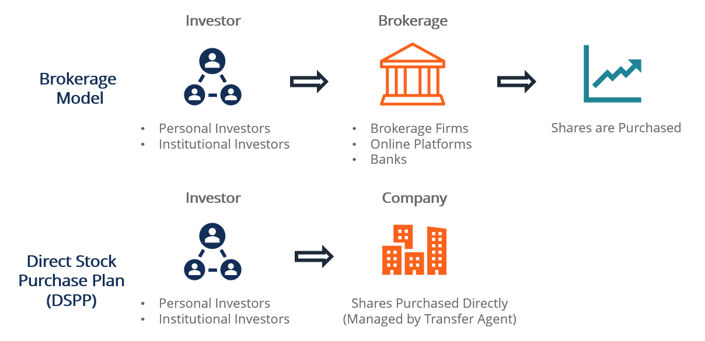

## Table of Contents

## What is a Direct Stock Purchase Plan (DSPP)?

A Direct Stock Purchase Plan (DSPP) is a way for people to buy stocks directly from a company without using a broker. This means you can invest in a company by buying its shares straight from them, which can sometimes be cheaper because you don't have to pay broker fees.

Many companies offer DSPPs to make it easier for the public to invest in them. To join a DSPP, you usually need to enroll through the company's investor relations website. Once enrolled, you can buy shares, and sometimes you can even set up automatic investments where a certain amount of money is taken from your bank account regularly to buy more shares.

## How does a DSPP differ from buying stocks through a broker?

When you use a DSPP, you buy stocks directly from the company. This means you don't need a middleman like a broker. Because of this, you might save money since you don't have to pay the fees that brokers usually charge. Also, some companies let you buy shares in smaller amounts than you might be able to through a broker, which can be good if you want to start investing with less money.

On the other hand, buying stocks through a broker means you use a service that helps you buy and sell stocks from different companies. Brokers can offer a wider range of investment options because they deal with many companies, not just one. However, using a broker usually comes with fees for their services, and you might need to buy a minimum number of shares, which could be more expensive to start with.

## What are the benefits of participating in a DSPP?

One big benefit of participating in a DSPP is that it can be cheaper. When you buy stocks directly from a company, you often don't have to pay the fees that brokers charge. This means more of your money goes toward buying shares, which can help your investment grow faster. Also, some DSPPs let you buy shares in smaller amounts, so you can start investing even if you don't have a lot of money to spend right away.

Another advantage is that DSPPs can make investing easier and more automatic. Many plans let you set up regular investments, where a fixed amount of money is taken from your bank account each month to buy more shares. This can help you build your investment over time without having to remember to buy more stocks yourself. Plus, since you're buying directly from the company, you might feel more connected to the business and its success.

## What are the potential drawbacks of a DSPP?

One potential drawback of a DSPP is that you might not have as many choices. When you use a DSPP, you can only buy stocks from that one company. If you want to invest in different companies or other types of investments, you'll need to find other ways to do that. Also, if the company you're investing in does not do well, your investment might not grow as much as you hoped.

Another thing to consider is that DSPPs might not be as flexible. Sometimes, it can take longer to sell your shares through a DSPP than it would through a broker. This means if you suddenly need your money back, you might have to wait. Plus, not all companies offer DSPPs, so your options might be limited based on which companies have these plans available.

## Which companies offer DSPPs?

Many big companies offer Direct Stock Purchase Plans (DSPPs). Some popular ones are Walmart, Coca-Cola, and ExxonMobil. These companies let people buy their stocks directly without using a broker. This can be a good way to invest if you like these companies and want to own a piece of them.

Other companies that offer DSPPs include McDonald's, PepsiCo, and Johnson & Johnson. Each of these companies has its own rules for how their DSPP works, so it's important to check their websites for details. By using a DSPP, you can sometimes buy shares in smaller amounts than you could through a broker, which can make investing easier if you're just starting out.

There are also smaller companies that offer DSPPs, like Duke Energy and Dominion Energy. These plans can be a good fit if you're interested in investing in specific industries like energy. Always make sure to read about the company and the plan before you decide to invest.

## How can someone enroll in a DSPP?

To enroll in a Direct Stock Purchase Plan (DSPP), you first need to find a company that offers one. You can check the company's investor relations website to see if they have a DSPP. Popular companies like Walmart, Coca-Cola, and ExxonMobil have these plans. Once you find a company you like, go to their website and look for a section about their DSPP. There, you'll find instructions on how to sign up.

After you decide on a company, you'll need to fill out an enrollment form. This form usually asks for your personal information and details about how you want to invest. You might need to set up a way to pay, like linking a bank account. Some plans let you set up automatic investments, where money is taken from your account regularly to buy more shares. Once you submit the form and it's approved, you're enrolled in the DSPP and can start buying shares directly from the company.

## What are the minimum investment requirements for DSPPs?

The minimum investment requirements for DSPPs can be different for each company. Some companies let you start with a small amount, like $25 or $50. This makes it easier for people who don't have a lot of money to begin investing. Other companies might ask for a bigger amount to start, like $250 or even $1000. It's important to check the specific rules of the DSPP you're interested in to know how much money you need to get started.

After you've made your first investment, many DSPPs let you add more money in smaller amounts. For example, you might be able to add $10 or $25 each time you want to buy more shares. This can help you keep investing little by little. Always look at the company's investor relations website to find out the exact minimums for starting and adding to your investment in their DSPP.

## How are dividends handled in a DSPP?

When you invest in a company through a DSPP, you can get dividends if the company pays them. Dividends are payments the company gives to its shareholders, usually from its profits. In a DSPP, you can often choose what to do with these dividends. You might get the money sent to your bank account, or you might choose to reinvest the dividends to buy more shares of the company.

Reinvesting dividends is a popular choice because it can help your investment grow over time. When you reinvest, the dividends are used to buy more shares without you having to pay extra money. This means you can own more of the company without spending more of your own money. Each company's DSPP might have different rules about dividends, so it's good to check the plan details to see how it works for the company you're investing in.

## Can you sell shares through a DSPP, and if so, how?

Yes, you can sell shares through a DSPP. To do this, you usually need to contact the plan administrator, which is often a transfer agent or a designated service provider for the company. You can find their contact information on the company's investor relations website. Once you reach out, you'll need to fill out a form or follow their specific process to request the sale of your shares. This might involve choosing how many shares you want to sell and how you want to receive the money, like a check or a direct deposit into your bank account.

The process of selling shares through a DSPP can take a bit longer than selling through a broker. It's not as quick because it goes directly through the company's system. You might need to wait a few days or even weeks to get your money. It's a good idea to check the company's rules about selling shares to know what to expect and how long it might take.

## What fees are associated with DSPPs?

When you join a DSPP, you might have to pay some fees. These can include an enrollment fee when you first sign up, which is usually a small amount like $10 or $15. There might also be a fee each time you buy more shares, often around $5 to $10 per transaction. Some plans charge a fee if you want to sell your shares, which can be a bit more, like $15 to $25. It's important to check the specific fees for the DSPP you're interested in because they can be different for each company.

Another fee you might see is for reinvesting dividends. If you choose to use your dividends to buy more shares, there could be a small fee for that, usually less than $5. Some DSPPs also have fees for maintaining your account, which might be charged yearly or quarterly. These fees can add up over time, so it's a good idea to understand all the costs before you start investing through a DSPP.

## How does a DSPP fit into a broader investment strategy?

A DSPP can be a good part of your overall investment plan because it lets you invest directly in a company you believe in. If you like a certain company and think it will do well, buying its stock through a DSPP can be a way to support that company and possibly make money if the stock price goes up. Plus, DSPPs often have lower fees than using a broker, which means more of your money goes into buying shares. This can be especially helpful if you're just starting to invest and want to keep costs down.

However, DSPPs might not be the best choice for your whole investment strategy. They usually only let you buy stock from one company, so if you want to spread your money across different investments to lower your risk, you'll need to look at other options too. Using a broker or other investment accounts can give you more choices and flexibility. So, while a DSPP can be a good way to invest in a specific company, it's often best to use it along with other investment methods to build a well-rounded portfolio.

## What are the tax implications of investing through a DSPP?

When you invest through a DSPP, you need to think about taxes. If you make money from selling your shares for more than you paid, you have to pay capital gains tax. How much you pay depends on how long you owned the shares. If you held them for more than a year, it's a long-term capital gain, and the tax rate is usually lower. If you sold them in less than a year, it's a short-term capital gain, and you'll pay at your regular income tax rate.

Dividends from your DSPP shares are also taxable. If you get cash dividends, you have to report them as income on your tax return. If you choose to reinvest your dividends to buy more shares, you still have to pay taxes on those dividends as if you received the cash. It's a good idea to keep track of all your DSPP transactions and talk to a tax professional to make sure you're doing everything right when it comes to taxes.

## What are the advantages of investing through DSPPs?

Direct Stock Purchase Plans (DSPPs) provide several advantages for individual investors looking to build a portfolio without the overhead costs associated with traditional brokerage services. These plans enable direct acquisition of company stock, often without the intermediary of a broker, making them an appealing option for cost-conscious and long-term investors.

A primary benefit of investing through DSPPs is the elimination of brokerage fees and commissions, which typically add financial burdens to investors. By purchasing shares directly from the issuing company, participants in DSPPs avoid these costs, allowing more of their capital to be allocated toward buying shares. This cost-effective approach can be especially advantageous for investors who regularly purchase small quantities of stock, as recurring fees would otherwise erode potential gains.

Another advantage is the potential for long-term investment growth. DSPPs often allow investors to purchase shares at a discounted rate or offer options for reinvesting dividends back into additional shares. This reinvestment feature supports the compound growth of investments; dividends paid out are used to purchase more shares, potentially yielding additional dividends in the future. This compounding effect can mathematically be expressed as:

$$
A = P \left(1 + \frac{r}{n}\right)^{nt}
$$

where:
- $A$ is the amount of money accumulated after n years, including interest.
- $P$ is the principal investment amount (initial deposit or investment).
- $r$ is the annual interest rate (decimal).
- $n$ is the number of times that interest is compounded per year.
- $t$ is the time the money is invested for in years.

DSPPs also play a significant role in fostering a sense of direct company ownership among shareholders. Unlike traditional stock acquisitions through brokerages, purchasing shares through DSPPs involves buying directly from the company. This direct link may cultivate a closer connection to the company, enhancing shareholder engagement and loyalty.

Flexibility and accessibility stand out as key attributes of DSPPs, particularly beneficial for small-scale investors. These plans often require minimal initial investment, sometimes as low as $100, making them accessible to individuals who may be unable to meet the higher minimums required by some brokerage accounts. Furthermore, the lack of account maintenance fees and the option for automatic periodic deductions allow investors to set up their investment schedules according to personal financial strategies, promoting a disciplined approach to saving and investing.

In sum, DSPPs offer a cost-effective, growth-oriented, and accessible path for investors interested in direct company ownership. Through the elimination of brokerage fees, opportunities for compound growth, and ease of entry, DSPPs provide a substantial advantage for investors seeking to maximize their investment returns over the long term while maintaining a personal stake in the companies they choose to support.

## References & Further Reading

[1]: Bergstra, J., Bardenet, R., Bengio, Y., & Kégl, B. (2011). ["Algorithms for Hyper-Parameter Optimization."](https://dl.acm.org/doi/10.5555/2986459.2986743) Advances in Neural Information Processing Systems 24.

[2]: ["Advances in Financial Machine Learning"](https://www.amazon.com/Advances-Financial-Machine-Learning-Marcos/dp/1119482089) by Marcos Lopez de Prado

[3]: ["Evidence-Based Technical Analysis: Applying the Scientific Method and Statistical Inference to Trading Signals"](https://www.amazon.com/Evidence-Based-Technical-Analysis-Scientific-Statistical/dp/0470008741) by David Aronson

[4]: ["Machine Learning for Algorithmic Trading"](https://github.com/PacktPublishing/Machine-Learning-for-Algorithmic-Trading-Second-Edition) by Stefan Jansen

[5]: ["Quantitative Trading: How to Build Your Own Algorithmic Trading Business"](https://books.google.com/books/about/Quantitative_Trading.html?id=j70yEAAAQBAJ) by Ernest P. Chan

[6]: Securities and Exchange Commission. ["Direct Stock Purchase Plans – No Broker Necessary."](https://www.sec.gov/) 

[7]: O'Shaughnessy, J.P. (2005). ["What Works on Wall Street, Fourth Edition: The Classic Guide to the Best-Performing Investment Strategies of All Time."](https://www.amazon.com/What-Works-Wall-Street-Fourth/dp/0071625763)

[8]: Aldridge, I. (2013). ["High-Frequency Trading: A Practical Guide to Algorithmic Strategies and Trading Systems."](https://books.google.com/books/about/High_Frequency_Trading.html?id=8QpIsVUMhmEC)