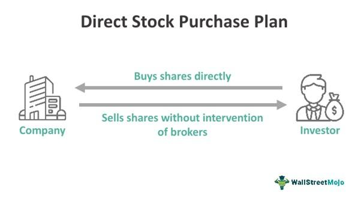

Direct Stock Purchase Plans (DSPPs) have become a significant mechanism within the financial market, allowing individual investors to purchase shares directly from a company without the mediation of brokers. This not only democratizes the investment process but also reduces costs typically associated with trading. DSPPs offer investors a direct avenue for participating in equity markets, facilitating ownership in companies and allowing them to capitalize on potential long-term growth. The appeal of DSPPs is particularly relevant for individuals seeking to invest smaller amounts incrementally, making it a suitable option for those aiming to bypass traditional brokerage accounts and associated fees.

Parallel to DSPPs, algorithmic trading has emerged as a cornerstone of modern investment strategies, characterized by the use of computer algorithms to execute trades at high speed and frequency. This technology-driven approach allows for the efficient handling of large volumes of trading data, enabling investors to swiftly react to market conditions with precision and reduced human error. Algorithmic trading not only optimizes trading strategies but also enhances liquidity and market efficiency, proving its worth particularly in fast-paced trading environments.



The intersection of DSPPs and algorithmic trading provides a compelling synergy, offering distinct advantages to stock investors. By integrating algorithmic tools with DSPPs, investors can automate and refine their investment strategies, capturing potential gains with reduced transactional overheads. This integration could pave the way for a tailored investment practice, focusing on cost-effectiveness and operational efficiency, ultimately advancing the prospects of individual investors both in terms of profitability and strategic decision-making.

This article aims to explore the dynamic intersection of DSPPs and algorithmic trading, highlighting how their integration can enhance investment strategies and outcomes. By examining the individual components and their combined potential, the article will provide a comprehensive view of how these elements can redefine traditional stock investment practices, encouraging investors to consider these modern methodologies as viable and beneficial components of their portfolios.

## Table of Contents

## What is a Direct Stock Purchase Plan (DSPP)?

A Direct Stock Purchase Plan (DSPP) is an investment mechanism that allows individual investors to buy shares directly from a company, bypassing traditional brokerage channels. The primary function of DSPPs is to enable investors to purchase company stock without the intermediation of brokers, thereby eliminating the necessity of brokerage fees and commissions. Typically, companies employ transfer agents to administer these plans, providing a cost-effective means for investors to engage directly in the equity market.

Historically, DSPPs emerged as a tool for companies to cultivate loyal investors and facilitate access to their stocks by reducing the barriers of entry associated with traditional brokerage accounts. During the early to mid-20th century, companies recognized the need to foster a direct relationship with their investors, leading to the development of programs that allowed stock purchases directly from the issuing company. This evolution mirrored the growing desire for more democratized investment approaches, aligning with broader financial industry trends towards providing affordable and accessible investment options.

The benefits of DSPPs for individual investors are significant. They offer a lower-cost structure as they forego typical brokerage commissions, making them highly attractive to cost-conscious investors. Additionally, DSPPs often allow for fractional share purchases, increasing investment flexibility and enabling individuals to invest smaller amounts regularly. This flexibility makes DSPPs particularly appealing to investors looking to build a position in a company over time. Furthermore, many DSPPs offer automatic reinvestment of dividends, enhancing the potential for compounded growth.

Unlike traditional brokerage accounts, DSPPs provide a more direct and intimate investment experience. While brokerage accounts offer a wide array of stock options and investment tools, they require intermediary involvement, which can introduce additional costs and complexities. In contrast, DSPPs focus on the direct relationship between the investor and the issuing company, streamlining the investment process and reducing associated costs.

Many well-established companies offer DSPPs to stock investors. These include large corporations with strong investor bases, such as The Coca-Cola Company, Johnson & Johnson, and ExxonMobil. These companies often value the stability and loyalty associated with direct shareholder relationships, making DSPPs an integral part of their corporate strategy. By providing DSPPs, these companies not only enhance accessibility to their stock but also encourage a committed investor community that can support the company's long-term objectives.

## Advantages of Investing Through DSPPs

Direct Stock Purchase Plans (DSPPs) provide several advantages for individual investors looking to build a portfolio without the overhead costs associated with traditional brokerage services. These plans enable direct acquisition of company stock, often without the intermediary of a broker, making them an appealing option for cost-conscious and long-term investors.

A primary benefit of investing through DSPPs is the elimination of brokerage fees and commissions, which typically add financial burdens to investors. By purchasing shares directly from the issuing company, participants in DSPPs avoid these costs, allowing more of their capital to be allocated toward buying shares. This cost-effective approach can be especially advantageous for investors who regularly purchase small quantities of stock, as recurring fees would otherwise erode potential gains.

Another advantage is the potential for long-term investment growth. DSPPs often allow investors to purchase shares at a discounted rate or offer options for reinvesting dividends back into additional shares. This reinvestment feature supports the compound growth of investments; dividends paid out are used to purchase more shares, potentially yielding additional dividends in the future. This compounding effect can mathematically be expressed as:

$$
A = P \left(1 + \frac{r}{n}\right)^{nt}
$$

where:
- $A$ is the amount of money accumulated after n years, including interest.
- $P$ is the principal investment amount (initial deposit or investment).
- $r$ is the annual interest rate (decimal).
- $n$ is the number of times that interest is compounded per year.
- $t$ is the time the money is invested for in years.

DSPPs also play a significant role in fostering a sense of direct company ownership among shareholders. Unlike traditional stock acquisitions through brokerages, purchasing shares through DSPPs involves buying directly from the company. This direct link may cultivate a closer connection to the company, enhancing shareholder engagement and loyalty.

Flexibility and accessibility stand out as key attributes of DSPPs, particularly beneficial for small-scale investors. These plans often require minimal initial investment, sometimes as low as $100, making them accessible to individuals who may be unable to meet the higher minimums required by some brokerage accounts. Furthermore, the lack of account maintenance fees and the option for automatic periodic deductions allow investors to set up their investment schedules according to personal financial strategies, promoting a disciplined approach to saving and investing.

In sum, DSPPs offer a cost-effective, growth-oriented, and accessible path for investors interested in direct company ownership. Through the elimination of brokerage fees, opportunities for compound growth, and ease of entry, DSPPs provide a substantial advantage for investors seeking to maximize their investment returns over the long term while maintaining a personal stake in the companies they choose to support.

## Understanding Algorithmic Trading

Algorithmic trading refers to the use of computer algorithms to manage the buying and selling of securities in financial markets. These sophisticated algorithms analyze vast amounts of market data at high speeds to identify trading opportunities and execute trades efficiently and accurately. The primary goal is to capitalize on short-lived market inefficiencies that are often imperceptible to human traders.

An algorithm in this context is a sequence of rules or a mathematical model designed to make decisions. These algorithms evaluate various market variables, such as price, [volume](/wiki/volume-trading-strategy), time, and other factors, to determine the optimal timing, price, and quantity for trades. For illustration, consider a basic example: an algorithm might be programmed to buy a stock when its moving average over the past 10 days surpasses its 30-day moving average, signifying upward [momentum](/wiki/momentum).

The efficiency in executing trading strategies is a fundamental advantage of [algorithmic trading](/wiki/algorithmic-trading). Algorithms can process enormous data quantities far quicker than a human can, leading to precise and fast order execution that reduces the chances of slippage—the difference between expected and actual transaction pricing. Additionally, algorithms help eliminate human emotional biases from trading decisions, ensuring that trades are conducted under predefined parameters and strategies.

One of the key benefits of algorithmic trading is the ability to trade at optimal conditions. Traders can program algorithms to take advantage of market strategies such as statistical [arbitrage](/wiki/arbitrage), [market making](/wiki/market-making), and trend-following, among others. This approach significantly improves [liquidity](/wiki/liquidity-risk-premium) and tightens spreads, benefiting investors and the market overall.

Technology and data play a pivotal role in influencing algorithmic trading decisions. Advancements in [machine learning](/wiki/machine-learning) and [artificial intelligence](/wiki/ai-artificial-intelligence) have empowered algorithms to adapt to changing market dynamics by learning from large datasets and refining strategies over time. High-frequency trading ([HFT](/wiki/high-frequency-trading-strategies)) is a prominent development, where algorithms execute a large number of trades at extremely high speeds, often within microseconds.

Current trends in algorithmic trading include the increased use of machine learning techniques to enhance predictive accuracy, the integration of [alternative data](/wiki/best-alternative-data) sources such as social media sentiment, and the development of more adaptive, self-learning algorithms. Additionally, regulatory developments are shaping the landscape, ensuring fair market practices and curbing manipulative strategies.

As technology continues to evolve, the impact of algorithmic trading on global financial markets is set to increase, offering new opportunities and challenges for investors and financial institutions.

## Combining DSPPs with Algorithmic Trading

Direct Stock Purchase Plans (DSPPs) and algorithmic trading represent two distinct but potentially complementary approaches in stock investment. Leveraging the advantages of both can result in optimized investment strategies for retail and institutional investors alike. 

**Synergy between DSPPs and Algorithmic Trading Strategies**

Fusion of DSPPs with algorithmic trading can optimize investment performance by automating the purchase of stocks directly from companies, allowing investors to take advantage of real-time market conditions. DSPPs traditionally offer a cost-effective entry point for investors, often eschewing brokerage fees, which aligns with the efficiency-driven nature of algorithmic trading. Algorithms can be designed to balance the distinct cash flow and purchasing mechanics of DSPPs with market trends to optimize performance outcomes.

**Optimization of DSPP Investments through Algorithmic Trading**

Algorithmic trading systems can be programmed to execute DSPP transactions based on a variety of market indicators. For instance, an algorithm might identify patterns or signals that suggest opportune moments to increase or decrease investment based upon historical data and predictive analytics. These algorithms can be tuned to automatically react to price trends, technical indicators, or macroeconomic signals, ensuring investments are made when they are most likely to be profitable. Python, with its robust libraries such as NumPy and pandas, can be used to develop such algorithms. A simplified example of an investing strategy could be:

```python
import pandas as pd

data = pd.read_csv('market_data.csv')  # Hypothetical market data
signal = data['Close'].rolling(window=20).mean() > data['Close'].rolling(window=50).mean()

actions = []

for index, is_buy_signal in enumerate(signal):
    if is_buy_signal:
        actions.append(f"Buy at index {index}")
    else:
        actions.append(f"Sell or Hold at index {index}")

print(actions)
```

**Examples of Successful Integration**

One notable instance of DSPPs and algorithmic trading integration involves high-frequency trading, where short-term trends and anomalies are exploited through rapid transaction execution. While DSPPs are generally less liquid due to purchase restrictions, advanced algorithms can identify the ideal cadence for investments, balancing DSPP schedules with market conditions. Companies like IBM and Coca-Cola, which offer DSPPs, could provide fertile ground for algorithmic strategies that optimize dividend reinvestments or periodic stock accumulations.

**Automated Strategies for Managing DSPP Portfolios**

Technologically-driven platforms can manage DSPPs by configuring parameters such as investment frequencies and thresholds for market entry and [exit](/wiki/exit-strategy). Automated strategies might include setting up an account to regularly invest predefined amounts or reinvest dividends based on projected growth calculations. Such automation helps maintain discipline, removing emotional elements from investment decisions, which is paramount for achieving long-term investment goals.

**Challenges and Considerations**

Despite the potential benefits, combining DSPPs with algorithmic trading presents unique challenges. Regulatory compliance must be rigorously observed as algorithmic trading introduces complexities concerning fairness and transparency. Additionally, DSPPs inherently lack the liquidity and flexibility of standard brokerage accounts, necessitating careful alignment with algorithmic strategies to avoid over-leverage or cash flow misalignments. Investors should also consider the potential for increased [volatility](/wiki/volatility-trading-strategies) due to rapid market shifts and the sophistication required to develop and maintain effective algorithms, emphasizing the importance of continuous monitoring and updating of algorithms to adjust to changing market dynamics.

## Risks and Challenges

Direct Stock Purchase Plans (DSPPs) and algorithmic trading introduce unique risks and challenges to stock investors. By understanding these risks and implementing effective strategies, investors can optimize their investment outcomes. 

**Inherent Risks in DSPPs and Algorithmic Trading**

DSPPs enable investors to buy stock directly from companies, bypassing traditional brokerage channels. While DSPPs are cost-effective, they lack the liquidity and speed associated with brokerage-based trading, potentially leading to slower reaction times in volatile markets. Additionally, the lack of a diversified portfolio, often seen in DSPP investments, might expose investors to idiosyncratic risks associated with individual firms.

Algorithmic trading, characterized by the use of complex algorithms to dictate trading strategies, is susceptible to technological risks. Errors in code or algorithms, often called "bugs," can lead to substantial financial losses if not identified promptly. There is also the risk of algorithms operating on outdated data, impacting decision accuracy.

**Potential Pitfalls of Algorithmic Trading in DSPP Investments**

Integrating algorithmic trading with DSPPs can enhance efficiency but also introduces pitfalls. One significant challenge is the potential for over-optimization, where algorithms are excessively tailored to historical data, causing poor performance in real-time market scenarios. Another potential issue is latency problems, where delays in executing trades can lead to unfavorable price changes that impact investment outcomes negatively.

**Regulatory Considerations for Investors Utilizing DSPPs**

Investors should be mindful of the regulatory environment surrounding DSPPs and algorithmic trading. The Securities and Exchange Commission (SEC) regulates DSPP offerings and algorithmic trading practices in the United States. It is crucial for investors to comply with disclosure and transparency requirements, including those related to the Sarbanes-Oxley Act, which mandates certain levels of corporate responsibility and disclosures.

**Risk Management Strategies**

Effective risk management is essential for investors dealing with both DSPPs and algorithmic trading. Investors should conduct thorough due diligence on the companies offering DSPPs, focusing on their financial health, market position, and governance practices. For algorithmic trading, regular [backtesting](/wiki/backtesting) and stress testing of algorithms can help identify weaknesses and optimize performance. Implementing real-time monitoring systems can alert investors to anomalies or unexpected market conditions.

**Importance of Continuous Monitoring and Adaptability**

Continuous monitoring of both DSPP investments and algorithmic trading actions is crucial. Investors should employ metrics such as the Sharpe Ratio or Value at Risk (VaR) to assess portfolio performance and risk. Python libraries like Pandas and NumPy can facilitate data analysis and monitoring:

```python
import pandas as pd
import numpy as np

# Example to calculate daily returns
prices = pd.Series([100, 102, 101, 104, 107])
returns = prices.pct_change().dropna()

# Calculate Sharpe Ratio assuming a risk-free rate of 0.02
risk_free_rate = 0.02
sharpe_ratio = (returns.mean() - risk_free_rate) / returns.std()

print(f'Sharpe Ratio: {sharpe_ratio}')
```

Finally, adaptability is key in an ever-evolving market landscape. Investors should be prepared to adjust their strategies based on new market data, technological advancements, and evolving regulatory frameworks. Regular re-assessment of both algorithmic models and investment portfolios ensures alignment with current market conditions and investor objectives.

## Future of DSPPs and Algorithmic Trading

Technological advancements continue to reshape the financial landscape, offering new opportunities for Direct Stock Purchase Plans (DSPPs) and algorithmic trading to evolve. The integration of cutting-edge technologies such as artificial intelligence, machine learning, and blockchain is set to enhance the functionality and appeal of DSPPs, making them more accessible and efficient for investors.

The future blending of DSPPs and algorithmic trading represents a significant evolution in investment strategies. Algorithmic trading can be leveraged to automate and optimize the investment process within DSPPs, potentially leading to more informed decision-making and increased returns for investors. For instance, machine learning algorithms can analyze historical stock performance and market indicators to predict future stock behavior, enabling investors to adjust their DSPP contributions accordingly.

As technology progresses, new financial products and services are expected to emerge from the intersection of DSPPs and algorithmic trading. One potential innovation is the development of platforms that offer personalized investment strategies based on an individual’s financial goals and risk tolerance. These platforms could allow investors to automate their DSPP contributions, ensuring regular investment while adjusting allocations in response to real-time market data.

Market trends and economic factors will inevitably influence this investment approach. The growing acceptance of digital platforms and the increased reliance on data analytics highlight the importance of seamless integration between DSPPs and algorithmic trading. Furthermore, economic factors such as [interest rate](/wiki/interest-rate-trading-strategies) fluctuations and global financial stability may impact investor confidence and the perceived benefits of using automated strategies in DSPPs.

In conclusion, the potential for innovation and growth in the integration of DSPPs and algorithmic trading is considerable. The ongoing advancements in technology promise to enhance investment strategies, making them more efficient, personalized, and accessible for a broader range of investors. As these developments continue, investors are encouraged to explore the benefits of integrating DSPPs and algorithmic trading into their portfolios, keeping abreast of new technologies and strategies that can optimize their stock investments.

## Conclusion

In summarizing the key points explored, our article has highlighted the substantial benefits Direct Stock Purchase Plans (DSPPs) and algorithmic trading bring to individual investors. DSPPs offer a cost-effective, accessible means of investing directly in companies, bypassing the traditional brokerage fees, and affording investors the opportunity to participate in long-term growth. Meanwhile, algorithmic trading provides a powerful tool for executing efficient and strategic investment transactions, utilizing advanced technology and data analytics to optimize trading outcomes.

The combination of DSPPs and algorithmic trading represents a promising approach to contemporary stock investment strategies. By leveraging the direct, fee-free investment path offered by DSPPs and the efficiency of algorithmic tools, investors can potentially enhance their returns while maintaining a higher degree of control over their portfolios. This synergy is particularly advantageous for small-scale investors looking to maximize their limited capital.

There is ample encouragement for investors to consider integrating these strategies into their financial plans. As technological advancements continue to drive innovation in fintech, the potential for enhanced tools and platforms to support this integration grows. Investors who remain informed and adaptable to these changes stand to benefit significantly.

The evolving landscape of stock investment suggests a future rich with opportunity, characterized by an amalgamation of traditional investment approaches and modern technological advancements. Engaging with these strategies not only broadens an investor's horizons but also aligns them with the future trajectory of financial markets.

Readers are invited to reflect on these discussions and to participate in further conversations about DSPPs and algorithmic trading. Your feedback is invaluable, and continued dialogue will serve to enhance understanding and implementation of these powerful investment strategies.

## References & Further Reading

[1]: Bergstra, J., Bardenet, R., Bengio, Y., & Kégl, B. (2011). ["Algorithms for Hyper-Parameter Optimization."](https://dl.acm.org/doi/10.5555/2986459.2986743) Advances in Neural Information Processing Systems 24.

[2]: ["Advances in Financial Machine Learning"](https://www.amazon.com/Advances-Financial-Machine-Learning-Marcos/dp/1119482089) by Marcos Lopez de Prado

[3]: ["Evidence-Based Technical Analysis: Applying the Scientific Method and Statistical Inference to Trading Signals"](https://www.amazon.com/Evidence-Based-Technical-Analysis-Scientific-Statistical/dp/0470008741) by David Aronson

[4]: ["Machine Learning for Algorithmic Trading"](https://github.com/PacktPublishing/Machine-Learning-for-Algorithmic-Trading-Second-Edition) by Stefan Jansen

[5]: ["Quantitative Trading: How to Build Your Own Algorithmic Trading Business"](https://books.google.com/books/about/Quantitative_Trading.html?id=j70yEAAAQBAJ) by Ernest P. Chan

[6]: Securities and Exchange Commission. ["Direct Stock Purchase Plans – No Broker Necessary."](https://www.sec.gov/) 

[7]: O'Shaughnessy, J.P. (2005). ["What Works on Wall Street, Fourth Edition: The Classic Guide to the Best-Performing Investment Strategies of All Time."](https://www.amazon.com/What-Works-Wall-Street-Fourth/dp/0071625763)

[8]: Aldridge, I. (2013). ["High-Frequency Trading: A Practical Guide to Algorithmic Strategies and Trading Systems."](https://books.google.com/books/about/High_Frequency_Trading.html?id=8QpIsVUMhmEC)