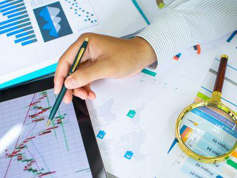

The evolution of financial markets over recent decades has significantly transformed trading methodologies. A pivotal aspect of this transformation has been the introduction and integration of advanced trade execution strategies, particularly directed orders and algorithmic trading. These methodologies are increasingly vital for investors and traders aiming to optimize their market strategies and achieve more efficient trade execution.

Directed orders, characterized by specific instructions regarding execution venues, have allowed traders to strategically select exchanges or trading platforms that offer the most favorable execution prices. This selective approach can result in cost savings and improved execution outcomes, reflecting a more tailored and intentional trading strategy. Algorithmic trading, on the other hand, utilizes sophisticated mathematical models to automate trading decisions, executing trades based on pre-set conditions such as market timing, price, and volume thresholds. This approach not only enhances the speed of trade execution but also minimizes the manual intervention required, thereby reducing the potential for human error.



Technological advancements have been central to these developments, providing the infrastructure necessary for efficient trade execution. High-speed computing, real-time data analysis, and reduced latency are among the technological factors leveraged to improve the precision and speed of both directed orders and algorithmic trading. Furthermore, the integration of these technologies with strategic trading insights allows market participants to navigate the complexities of contemporary financial markets more effectively.

Understanding the nuances of directed orders and algorithmic trading equips modern traders and investors with the tools needed to enhance their market engagement strategies. By embracing these methodologies, coupled with an awareness of the associated technological and regulatory landscapes, traders can enhance their competitive edge in dynamic financial environments.

## Table of Contents

## Understanding Directed Order Flow

Directed order flow refers to the practice where traders, whether individuals or financial entities, provide explicit instructions on the execution details of a trade. This specificity encompasses the venue where an order is executed, the timing, and other execution parameters that align with the trader’s strategic objectives. The critical aspect of directed order flow is its ability to optimize trading outcomes by leveraging market conditions such as liquidity, price, and volatility.

### Mechanism of Directed Orders

Directed orders are typically set up through trading platforms that allow the customization of order routing based on trader preferences. This is predominantly executed through a broker or a trading algorithm that is programmed to adhere to the specific directives provided by the trader. For instance, a trader might instruct their algorithm to route orders to Exchange A if it consistently offers narrower bid-ask spreads compared to other exchanges, thereby potentially reducing the execution cost.

To illustrate, consider the case where a trader specifies the execution of an order at a particular exchange, assuming the presence of better pricing:

```python
if exchange_price_A < exchange_price_B:
    execute_trade('Exchange A')
else:
    execute_trade('Exchange B')
```

In this simplified Python code, the logic directs the order to 'Exchange A' if the price is more favorable there compared to 'Exchange B'.

### Importance in Strategic Trading

Directed order flow is pivotal for traders who prioritize particular market conditions or have strategic preferences based on empirical data from past trading activities. Such directed strategies ensure that the execution of trades aligns with broader trading objectives, such as minimizing transaction costs or accessing better [liquidity](/wiki/liquidity-risk-premium). 

Moreover, directed order flow can also respond to the trader’s preference for mitigating market impact costs. By choosing an exchange or venue where the order can be absorbed with minimal market disruption, the trader effectively reduces the risk of slippage—a situation where the executed price deviates from the expected price due to market [volatility](/wiki/volatility-trading-strategies).

Overall, the strategic use of directed orders allows traders to capitalize on market inefficiencies and thus optimize their return on investment. This approach necessitates an in-depth understanding of market dynamics and a capability to leverage technological tools to execute these strategies efficiently.

## Algorithmic Trading: A Tech-Driven Approach

Algorithmic trading, often referred to as 'algo trading', is a sophisticated method of executing trades using automated, pre-programmed trading instructions. These instructions integrate variables such as timing, price, and [volume](/wiki/volume-trading-strategy), enabling the rapid and efficient execution of orders with minimal human intervention. The fundamental goal of [algorithmic trading](/wiki/algorithmic-trading) is to harness computational models to make systematic and profitable trading decisions, thereby reducing the impact of human emotions and errors.

Algo trading operates on mathematical models and algorithms that analyze market data in real-time. By identifying profitable opportunities based on predefined criteria, these algorithms execute trades at speeds and frequencies impossible for a human trader. A basic example in Python might look like this:

```python
# Simple moving average crossover strategy in Python
import numpy as np
import pandas as pd

def moving_average_crossover(data, short_window=40, long_window=100):
    signals = pd.DataFrame(index=data.index)
    signals['price'] = data['price']
    signals['short_ma'] = data['price'].rolling(window=short_window, min_periods=1).mean()
    signals['long_ma'] = data['price'].rolling(window=long_window, min_periods=1).mean()
    signals['signal'] = np.where(signals['short_ma'] > signals['long_ma'], 1.0, 0.0)
    signals['positions'] = signals['signal'].diff()
    return signals

# Mock price data
price_data = pd.DataFrame({'price': np.random.random(150) * 100})
signals = moving_average_crossover(price_data)

print(signals.tail())
```

In this example, the strategy uses a simple moving average crossover to generate buy (1) or sell (0) signals based on whether a shorter moving average has crossed above or below a longer one.

Algorithmic trading has significantly transformed trade execution efficiency by allowing for more precise market timing, increased order speed, and minimized errors associated with manual trading processes. By automating complex trading strategies, firms can execute large volumes of trades quickly and at lower cost, which helps in [scalping](/wiki/gamma-scalping) razor-thin margins in highly dynamic markets. Algo trading facilitates strategies like [market making](/wiki/market-making), statistical [arbitrage](/wiki/arbitrage), and arbitraging temporary price discrepancies.

Despite its numerous advantages, the efficiency of algorithmic trading also brings challenges such as amplification of systemic risks, occasional market anomalies, and the infamous 'flash crashes', incidents of rapid and deep market sell-offs and recoveries occurring within minutes. Consequently, while algorithmic trading plays a critical role in enhancing trade execution, it requires robust risk management strategies and regulatory oversight to safeguard market integrity.

## Benefits and Challenges of Directed Order and Algo Trading

Directed order and algorithmic trading have fundamentally reshaped the trading landscape by introducing both efficiency and complexity to the financial markets.

### Benefits

One of the primary advantages of directed order flow and algorithmic trading is the increased speed of execution. Algorithms can process and execute orders in milliseconds, far surpassing human capabilities. This speed is crucial in capitalizing on fleeting market opportunities and minimizing slippage, which refers to the difference between the expected price of a trade and the actual price at which it is executed.

Moreover, the use of algorithms can potentially lower transaction costs. By automating the trading process, market participants can reduce the expense associated with manual trading and the risk of human error. Algorithms can continuously monitor multiple market conditions and execute trades at optimal times, which can result in improved pricing and reduced impact costs.

The precision of algorithmic trading also enhances liquidity and market depth. As orders are efficiently matched, bid-ask spreads may narrow, benefiting all market participants. Additionally, directed order flow enables firms to specify execution preferences, such as choosing particular exchanges that offer specific advantages like rebate structures or liquidity pools, aligning execution with strategic objectives.

### Challenges

Despite these benefits, several challenges accompany directed order and algorithmic trading. One significant concern is market vulnerability. The reliance on algorithms can lead to systemic risks, such as those witnessed during the 2010 Flash Crash, where markets plummeted and recovered in minutes, partly due to algorithmic trading interactions that exacerbated volatility.

Another challenge is the complexity of modern trading environments. As algorithms become more sophisticated, understanding their mechanisms and potential unintended consequences becomes crucial. Market participants must ensure rigorous testing and risk management strategies are in place to prevent detrimental impacts on market integrity and investor confidence.

Furthermore, the competitive nature of algorithmic trading leads to an arms race in technology and resources. Firms invest heavily in high-speed computing and access to real-time data, creating barriers to entry for smaller or less technologically advanced entities, thus impacting market equality.

### Impact on Market Dynamics

The integration of directed order and algorithmic trading into financial markets results in dynamic interactions that continuously redefine market behavior. These mechanisms contribute to market efficiency by providing continuous price discovery; however, they can also exacerbate market anomalies during periods of stress. The balance between leveraging algorithmic capabilities and maintaining a fair, transparent market is crucial to ensuring the robustness of financial systems.

## Technological Infrastructure for Successful Execution

Successful trade execution in modern financial markets relies on a robust technological infrastructure that supports the speed and efficiency demanded by high-frequency and algorithmic trading. Two primary components essential for this infrastructure are high-speed computing and low-latency network connections.

High-speed computing allows traders to process vast amounts of information quickly, enabling the execution of trades at precisely the right moment. This capability is crucial because algorithmic trading strategies often depend on slight price movements or market inefficiencies that can only be identified and exploited with rapid data processing.

Low latency, the measure of how quickly data can travel from one point to another, is a critical [factor](/wiki/factor-investing) in trade execution. In financial markets, every millisecond counts, and low-latency connections ensure that traders can act on market data as soon as it becomes available, minimizing the risk of slippage—the difference between the expected price of a trade and the price at which it is executed.

To achieve these technological benchmarks, colocating trading servers near exchange data centers has become a standard practice. Co-location reduces the physical distance that data must travel, thereby minimizing latency and ensuring fast execution times. By having servers in close proximity to the stock exchange servers, traders gain a time advantage over competitors who may be physically further away, facilitating quicker reaction times to market events.

Additionally, access to real-time market data is a non-negotiable requirement for algorithmic trading. This involves subscribing to data feeds from exchanges that provide up-to-the-millisecond updates on order [books](/wiki/algo-trading-books), trade volumes, and other critical market indicators. The ability to swiftly analyze this data empowers trading algorithms to make informed decisions and execute orders efficiently.

Furthermore, robust risk management systems are integral to the technological setup. These systems continuously monitor trading activity to ensure adherence to predefined risk parameters and provide safeguards against adverse market conditions or potential technical failures.

Continual advancements in computing power and data transmission technologies promise further enhancements to trading infrastructure. As markets evolve, staying abreast of these technological trends will be crucial for maintaining a competitive edge in trade execution.

## Impact of Regulations and Transparency

Regulatory frameworks play a crucial role in ensuring transparency and fairness in financial markets. One pivotal regulation in the United States is the Securities and Exchange Commission's (SEC) Rule 606, which mandates disclosure of order routing practices. Adopted to provide greater transparency, Rule 606 requires broker-dealers to disclose material aspects of their order routing, thereby allowing clients to make informed decisions regarding their trading activities.

Rule 606 requires that broker-dealers provide quarterly reports disclosing the venues to which they route significant portions of customers' orders. These reports must include the percentage of total customer orders routed to various venues, the types of orders routed, and any material aspects of the broker's relationship with the venues, such as payment for order flow or internalization. This transparency allows traders to understand potential conflicts of interest that might affect how their orders are executed—information that is vital when optimizing trading strategies.

Understanding Rule 606 and similar regulations is fundamental for traders and brokers alike. For traders, it aids in evaluating whether their brokers are executing their orders in a manner that maximizes potential returns or minimizes costs. For brokers, compliance is not only a legal obligation but also a means of maintaining customer trust by demonstrating that their operations are conducted with fairness and integrity.

Apart from the SEC's regulations, the Financial Industry Regulatory Authority (FINRA) also imposes rules to ensure fair pricing and execution across financial markets. The combination of these regulatory frameworks forms a legal landscape that promotes market integrity and protects investors against practices that could manipulate market orders or compromise execution quality.

As trade execution continues to evolve with technology, regulators must adapt to new challenges, including those posed by high-frequency trading and other algorithmic trading strategies. Future regulatory developments will likely focus on balancing innovation with market stability and investor protection, ensuring that transparency and fairness remain central to all trading activities.

By staying informed of regulations such as SEC Rule 606, traders can enhance their understanding of the complexities of order routing and make better decisions in the ever-changing trading environment.

## Future Trends in Trade Execution

As technology continues to advance, trade execution strategies are undergoing significant transformations. One of the key emerging trends is the integration of [machine learning](/wiki/machine-learning) (ML) and [artificial intelligence](/wiki/ai-artificial-intelligence) (AI) in algorithmic and directed trading. These technologies are revolutionizing how traders and investors approach trade execution by enhancing predictive accuracy, optimizing strategies, and automating decision-making processes.

### Machine Learning and AI in Trade Execution

Machine learning algorithms are capable of analyzing vast amounts of historical and real-time data to identify patterns and predict price movements. This capability is increasingly used to refine trading algorithms, leading to more precise and efficient execution strategies. For instance, ML models can be trained to recognize market conditions under which specific trading strategies perform optimally, thereby enabling dynamic strategy adaptation in real-time.

AI technologies, particularly [deep learning](/wiki/deep-learning) models, can process complex and unstructured data—such as news articles and social media sentiment—which are influential in market movements. By integrating these data sources, AI-driven systems can make informed trading decisions, potentially outperforming traditional trading strategies that rely solely on numerical data.

### Algorithmic Trading Enhancements

Algorithmic trading is continuously evolving with the incorporation of sophisticated algorithms that leverage AI and ML. Some of the advancements include:

- **Adaptive Algorithms**: These algorithms can adjust their parameters dynamically based on changes in market conditions, optimizing trade execution without human intervention.

- **Predictive Analytics**: Machine learning models, such as neural networks, are used to forecast asset prices and trading volumes, providing an edge in anticipating market trends.

- **Risk Management**: AI systems can assess the risk profile of trades more accurately by analyzing a broader scope of data, helping in mitigating risks associated with market volatility.

### Directed Trading Innovations

In directed trading, AI and ML are being used to optimize order routing. Algorithms can consider multiple factors like transaction costs, available liquidity, and execution speed to determine the optimal venue for executing an order. This level of sophistication ensures that orders are executed at the best possible price and with minimal market impact.

Furthermore, smarter execution management systems (EMS) are being developed to enhance the efficiency of directed orders. These systems use AI to automate order placement and adjustment, reducing the cognitive load on traders and increasing the likelihood of achieving execution quality goals.

### The Role of Continual Learning

Continual learning is a promising area where models can evolve by learning from new data streams without forgetting previous knowledge. This capability is crucial for maintaining the relevance and accuracy of trading strategies in rapidly changing markets. Implementing continual learning algorithms could significantly improve the adaptability of trading systems, allowing them to respond adeptly to unexpected market events.

### Conclusion

The integration of machine learning and AI into trade execution strategies marks a pivotal evolution in financial markets. These technologies provide the tools necessary for more precise predictions, adaptive strategies, and efficient trade execution, offering a competitive edge to those who harness them effectively. As the technological landscape continues to evolve, staying updated with these trends will be essential for traders aiming to succeed in the dynamic and complex world of financial markets.

## Conclusion

The combination of directed order and algorithmic trading has become integral to modern financial markets. These methodologies not only automate and streamline trading processes but also offer a heightened level of precision and speed in executing trades. Directed orders allow traders to specify the venue and method of execution, leveraging strategic advantages associated with particular exchanges, such as reduced transaction costs or improved liquidity conditions.

Algorithmic trading, on the other hand, employs advanced mathematical models and technology to make split-second trading decisions. The core of this strategy is the ability to execute trades according to predefined criteria, such as timing, price, and volume, which significantly reduces the human element and potential for error in execution.

Understanding these mechanisms is vital for modern traders and investors. They enhance trading strategies by allowing for more nuanced control over trade execution, ensuring that trades are carried out in the most efficient manner possible. Additionally, the integration of technology in trading calls for continuous education about the evolving tools and techniques that drive these systems. For instance, advancements in machine learning and artificial intelligence are poised to further refine the capabilities and efficiencies of algorithmic trading, offering unprecedented insights and execution strategies.

Furthermore, staying informed about the regulatory landscape is crucial. Regulations such as the SEC's Rule 606 enhance transparency in order routing, ensuring that traders have access to vital information about how their trades are being executed. By understanding and adapting to these regulations, traders can navigate the legal intricacies of trade execution and maintain a competitive edge.

In summary, the fusion of directed order flow and algorithmic trading is reshaping the financial markets. By leveraging cutting-edge technology and adhering to regulatory standards, traders can optimize their strategies and remain agile in a fast-paced and ever-evolving financial landscape.

## References & Further Reading

[1]: ["Advances in Financial Machine Learning"](https://www.amazon.com/Advances-Financial-Machine-Learning-Marcos/dp/1119482089) by Marcos Lopez de Prado

[2]: Bergstra, J., Bardenet, R., Bengio, Y., & Kégl, B. (2011). ["Algorithms for Hyper-Parameter Optimization."](https://dl.acm.org/doi/10.5555/2986459.2986743) Advances in Neural Information Processing Systems 24.

[3]: Huang, W., Masulis, R., & Stoll, H. R. (1996). ["Dealer versus auction markets: A paired comparison of execution costs on NASDAQ and the NYSE."](https://www.sciencedirect.com/science/article/pii/0304405X9500867E) Journal of Financial Economics, 41(3), 313-357.

[4]: ["Machine Learning for Algorithmic Trading"](https://github.com/stefan-jansen/machine-learning-for-trading) by Stefan Jansen

[5]: ["Quantitative Trading: How to Build Your Own Algorithmic Trading Business"](https://www.amazon.com/Quantitative-Trading-Build-Algorithmic-Business/dp/1119800064) by Ernest P. Chan

[6]: Chaboud, A. P., Chiquoine, B., Hjalmarsson, E., & Vega, C. (2009). ["Rise of the Machines: Algorithmic Trading in the Foreign Exchange Market."](https://www.jstor.org/stable/43612951) Federal Reserve Board Working Paper.