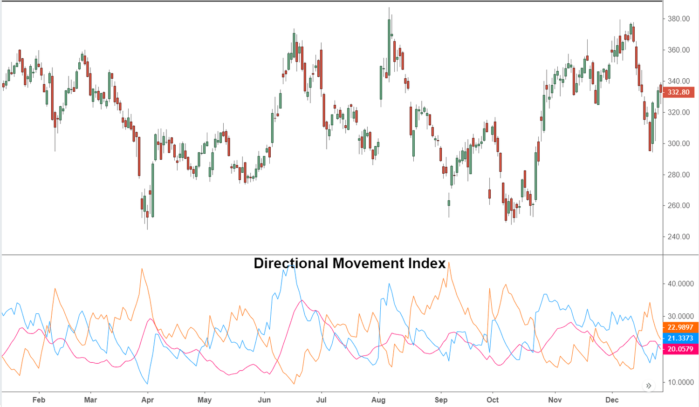

The Directional Movement Index (DMI) is a technical analysis indicator that serves a crucial role in evaluating the strength and direction of price trends within financial markets. Developed by J. Welles Wilder in 1978, the DMI aids traders in discerning the movement direction of an asset’s price, which is essential for making informed trading decisions. The DMI is composed of several key components that work together to assess whether a market is trending or moving sideways, thereby allowing traders to capitalize on potential opportunities.

The primary components of the DMI include the Positive Directional Indicator (+DI), the Negative Directional Indicator (-DI), and the Average Directional Index (ADX). These elements collectively enable the DMI to differentiate between bullish and bearish market conditions, providing insights into the current market environment. For example, a bullish trend is often suggested when the +DI line crosses above the -DI line, whereas the opposite crossover generally indicates a bearish trend.



The DMI is particularly valuable in trend-following strategies and algorithmic trading, offering a robust framework that reduces false signals and enhances decision-making processes. By providing clear signals, such as crossovers of the +DI and -DI lines, traders can adjust their positions accordingly, optimizing entries and exits based on trend strength. Additionally, the ADX component of the DMI measures the intensity of the trend, helping traders make informed decisions regarding their market strategies.

In conclusion, the Directional Movement Index is an indispensable tool for traders seeking to understand and capitalize on market trends. Its development by Wilder provided a systematic approach to evaluating market movements, making it a staple in both manual and automated trading systems. While it has its limitations, when used in conjunction with other tools, the DMI significantly enhances the ability to make prudent trading decisions.

## Table of Contents

## Understanding the DMI

The Directional Movement Index (DMI) is a key component of technical analysis, offering valuable insights into trend direction and strength in financial markets. Developed by J. Welles Wilder, the DMI is composed of three primary components: the Positive Directional Indicator (+DI), the Negative Directional Indicator (-DI), and the Average Directional Index (ADX).

The Positive Directional Indicator (+DI) measures the strength of upward movements by comparing the current high price to the previous high. Conversely, the Negative Directional Indicator (-DI) evaluates the strength of downward movements by comparing the current low to the previous low. A bullish trend is indicated when the +DI line exceeds the -DI line, implying upward price direction dominance. In contrast, a bearish trend is suggested when the -DI line is above the +DI line, indicating downward trend strength.

Mathematically, the +DI and -DI are expressed as percentages of the Average True Range (ATR):

$$
+DI = \left(\frac{+DM}{ATR}\right) \times 100
$$

$$
-DI = \left(\frac{-DM}{ATR}\right) \times 100
$$

where +DM is the positive directional movement and -DM is the negative directional movement.

The third component, the Average Directional Index (ADX), measures trend strength without specifying its direction. The ADX is calculated as the smoothed average of the Directional Movement Index (DX) values, which themselves are derived from the difference between +DI and -DI:

$$
\text{DX} = \left(\frac{|+DI - (-DI)|}{+DI + (-DI)}\right) \times 100
$$

A crucial feature of the ADX is its ability to quantify trend strength. An ADX value exceeding 25 typically indicates a strong trend, while a value below 20 points to a weak or non-trending market. This characteristic makes the ADX particularly useful for distinguishing trading conditions that necessitate different strategies.

In summary, by analyzing the interactions between +DI and -DI along with the ADX, traders can assess not only the directional movement of prices but also the robustness of the prevailing trend, thereby making more informed trading decisions.

## Calculating the Directional Movement Index

The Directional Movement Index (DMI) calculation centers around quantifying price movements to unveil trends. This involves deriving positive and negative directional movements (+DM and -DM) and using the Average True Range (ATR) for smoothing over a specified period, usually 14 days.

### Positive and Negative Directional Movement (+DM and -DM)

The +DM is calculated when the current high minus the previous high is greater than the previous low minus the current low, and the current high is above the previous high. Conversely, -DM is determined when the previous low minus the current low exceeds the current high minus the previous high, and the current low is below the previous low.

Mathematically, this can be expressed as:

- $+DM = \max((\text{Current High} - \text{Previous High}), 0)$
- $-DM = \max((\text{Previous Low} - \text{Current Low}), 0)$

If neither movement is larger, +DM and -DM are both zero.

### Average True Range (ATR)

The +DM and -DM values are subsequently smoothed using the ATR. This technique functions to average out [volatility](/wiki/volatility-trading-strategies) over the targeted period. The ATR itself is derived by averaging the True Range (TR), which is the greatest of the following three values:

- Current High minus Current Low
- Absolute value of Current High minus Previous Close
- Absolute value of Current Low minus Previous Close

ATR can be calculated using the exponential moving average or a simple moving average across a specified timeframe, typically 14 days.

### Calculating +DI and -DI

Next, +DI and -DI are computed by normalizing +DM and -DM by the ATR. These indicators highlight the strength of price movements:

- $+DI_{14} = \left(\frac{+DM_{14}}{ATR_{14}}\right) \times 100$
- $-DI_{14} = \left(\frac{-DM_{14}}{ATR_{14}}\right) \times 100$

### Average Directional Index (ADX)

The final component, the Average Directional Index (ADX), evaluates the strength of the trend. It involves calculating the Directional Index (DX), defined by the difference between +DI and -DI, normalized by their sum:

$$
DX = \frac{| +DI_{14} - -DI_{14} |}{| +DI_{14} + -DI_{14} |} \times 100
$$

The ADX itself is the smoothed moving average of the DX values over the same period. The ADX doesn't indicate trend direction, but the strength of the existing trend.

### Python Sample Code

Here's a simplified code snippet for calculating DMI:

```python
import pandas as pd
import numpy as np

def calculate_dmi(data, n=14):
    high = data['High']
    low = data['Low']
    close = data['Close']

    plus_dm = np.where(high.diff() > low.diff(), high.diff(), 0)
    minus_dm = np.where(low.diff() > high.diff(), low.diff(), 0)

    tr = pd.concat([high - low, abs(high - close.shift()), abs(low - close.shift())], axis=1).max(axis=1)
    atr = tr.rolling(n).mean()

    plus_di = 100 * (plus_dm.rolling(n).sum() / atr)
    minus_di = 100 * (minus_dm.rolling(n).sum() / atr)

    dx = 100 * abs(plus_di - minus_di) / (plus_di + minus_di)
    adx = dx.rolling(n).mean()

    return plus_di, minus_di, adx

# Usage example:
# df is your DataFrame with 'High', 'Low', 'Close' columns
df['+DI'], df['-DI'], df['ADX'] = calculate_dmi(df)
```

This calculation supports traders in gauging market trends, vital for decision-making in trading strategies.

## Using DMI in Algorithmic Trading

Algorithmic traders often incorporate the Directional Movement Index (DMI) into their trading strategies to automate buy and sell decisions based on trend signals. The DMI's components, namely the Positive Directional Indicator (+DI) and the Negative Directional Indicator (-DI), play crucial roles in these automated systems. Specifically, the crossover points of these indicators serve as potential triggers for trading actions. For instance, a buy signal is typically generated when the +DI line crosses above the -DI line, indicating a possible upward trend. Conversely, a sell signal is activated when the -DI line crosses above the +DI line, signaling a potential downward trend. These rules help in optimizing trading entries and exits by aligning them with prevailing market trends.

Incorporating DMI signals into algorithmic systems can be further enhanced by combining them with other technical indicators. For example, integrating the DMI with Moving Averages or the Relative Strength Index (RSI) can refine the accuracy of trend detection and decision points. Moving averages help smooth out price data, reducing noise, and confirming trend directions, while the RSI can provide insights into potential overbought or oversold conditions, adding an additional layer of analysis.

Here is an example of how a basic algorithm might be structured in Python to include DMI in trading decisions:

```python
import talib
import numpy as np

def compute_dmi(high, low, close, time_period=14):
    plus_di = talib.PLUS_DI(high, low, close, timeperiod=time_period)
    minus_di = talib.MINUS_DI(high, low, close, timeperiod=time_period)
    return plus_di, minus_di

def generate_signals(high, low, close, time_period=14):
    plus_di, minus_di = compute_dmi(high, low, close, time_period)
    signals = np.where(plus_di > minus_di, 'Buy', 'Sell')
    return signals

# Example usage
high = np.array([..])  # Array of high prices
low = np.array([..])   # Array of low prices
close = np.array([..])  # Array of close prices

signals = generate_signals(high, low, close)
print(signals)
```

This code utilizes the `talib` library to compute the +DI and -DI values using historical high, low, and close prices, generating buy or sell signals based on the crossover conditions.

Combining DMI with other indicators in an algorithmic framework allows traders to develop more robust trading strategies. By leveraging the strengths of multiple indicators, traders can potentially enhance the reliability of their trading systems and better adapt to various market conditions.

## Comparison with Other Indicators

The Directional Movement Index (DMI) and the Aroon Indicator are both pivotal tools in technical analysis, designed to identify trend changes in financial markets. The fundamental difference between the two lies in their approach and focus. The DMI employs high and low price points to ascertain the strength and direction of a trend. Its Positive Directional Indicator (+DI) and Negative Directional Indicator (-DI) focus on recent peak and trough movements to provide insights into potential price directions. In contrast, the Aroon Indicator centers on calculating the time since the highest high and lowest low within a particular period, providing a time-based measurement of trend changes.

Another well-regarded comparison is with the Moving Average Convergence Divergence (MACD), which operates on a distinct methodology. The MACD is primarily concerned with the convergence and divergence between two moving averages of an asset’s price, typically involving a short-term and long-term moving average. By assessing the differences, MACD spots [momentum](/wiki/momentum) changes, potentially indicating upcoming trend reversals. The MACD Line is computed as:

$$
\text{MACD Line} = \text{EMA}_{12\_day} - \text{EMA}_{26\_day}
$$

Where EMA is the exponential moving average. The MACD also includes a Signal Line: a 9-day EMA of the MACD Line, which traders use to forecast bullish or bearish signals based on crossovers.

While both DMI and MACD serve to gauge market trends, each has distinct strengths. The DMI is particularly effective in trend identification, making it suitable for confirming ongoing trends. Conversely, the MACD excels in signaling momentum shifts and probable trend reversals, beneficial for traders on the lookout for potential entry and [exit](/wiki/exit-strategy) points.

Combining these indicators can provide a comprehensive view of market conditions. For instance, when DMI confirms a strong trend while MACD signals a momentum shift, traders can derive insights not easily observable with a single indicator. This multi-indicator strategy can enhance the accuracy of financial decision-making processes, taking advantage of the unique strengths each tool offers to harmonize and strengthen overall trading strategies. 

By leveraging the nuanced insights each indicator provides, traders can develop a more nuanced understanding of market dynamics, leading to informed trading decisions.

## Limitations of the DMI

The Directional Movement Index (DMI) is a widely utilized technical analysis tool, but it is not without its limitations. One significant drawback is its reliance on historical price data to generate signals. This dependency introduces the risk of false signals, particularly in unpredictable market conditions. Since the DMI's calculations are based on past price points and the movement between them, it might not accurately predict future movements in all scenarios. This limitation is underscored in volatile or rapidly changing markets where price fluctuations are unpredictable.

The effectiveness of the DMI also diminishes in non-trending or sideways markets. Given that the DMI is designed to identify the strength and direction of trends, it performs optimally in trending markets. In contrast, during periods when the market lacks a clear direction or exhibits choppy behavior, the DMI can generate less reliable signals. These conditions can mislead traders, causing them to make flawed trading decisions based on noise rather than meaningful trends.

To mitigate these limitations and enhance the reliability of the signals generated by the DMI, traders are advised to couple it with other indicators. By doing so, they can create a more robust analytical framework. For example, combining the DMI with momentum indicators like the Relative Strength Index (RSI) or moving averages can help filter out noise and confirm signals, providing a broader view of market conditions. This multi-indicator approach can reduce the likelihood of acting on false signals and improve decision-making accuracy by providing corroborative data points.

## Conclusion

The Directional Movement Index (DMI) is a crucial tool in both manual and [algorithmic trading](/wiki/algorithmic-trading), facilitating the identification of market trends and informing trading decisions. By measuring both the direction and strength of price movements, the DMI offers a comprehensive view that is invaluable for traders seeking to optimize their strategies. Whether employed in a manual trading setup or integrated into algorithmic systems, the DMI provides a structured approach to understanding market dynamics.

Despite its utility, the DMI has intrinsic limitations, such as its dependence on historical price data, which can produce false signals, particularly in sideways or choppy markets. Therefore, to maximize its effectiveness, it is advisable to use the DMI in conjunction with complementary indicators. Combining it with other tools, such as Moving Averages or the Relative Strength Index (RSI), augments its predictive potential by providing additional layers of market analysis.

For traders looking to integrate the DMI effectively, ongoing research and [backtesting](/wiki/backtesting) are essential. These processes help in adjusting the DMI to specific market conditions and individual trading strategies, thus enhancing its contribution to successful trading outcomes. Adequate backtesting can reveal the optimal settings for the DMI, enabling it to adapt to diverse market behaviors and aligning it with personal risk tolerance and trading goals. By maintaining a robust testing environment, traders can ensure the DMI remains a reliable part of their trading toolkit.

## References & Further Reading

[1]: Wilder, J. W. (1978). ["New Concepts in Technical Trading Systems"](https://archive.org/details/newconceptsintec00wild). Trend Research.

[2]: Aronson, D. (2006). ["Evidence-Based Technical Analysis: Applying the Scientific Method and Statistical Inference to Trading Signals"](https://www.amazon.com/Evidence-Based-Technical-Analysis-Scientific-Statistical/dp/0470008741). John Wiley & Sons.

[3]: Achelis, S. B. (2000). ["Technical Analysis from A to Z"](https://archive.org/details/technicalanalysi00ache). McGraw Hill.

[4]: Elder, A. (1993). ["Trading for a Living: Psychology, Trading Tactics, Money Management"](https://www.amazon.com/Trading-Living-Psychology-Tactics-Management/dp/0471592242). John Wiley & Sons.

[5]: Murphy, J. J. (1999). ["Technical Analysis of the Financial Markets: A Comprehensive Guide to Trading Methods and Applications"](https://archive.org/details/technicalanalysi0000murp). New York Institute of Finance.