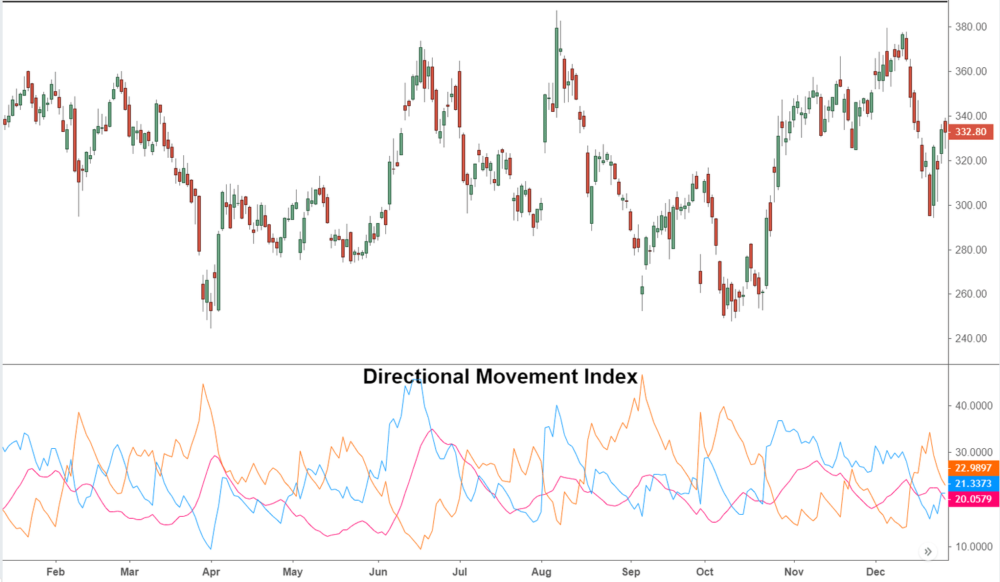

The world of trading is complex, encompassing various strategies and techniques that require robust tools for effective decision-making. Among these tools, the Directional Movement Index (DMI) stands out as a pivotal technical analysis indicator. Introduced by J. Welles Wilder Jr. in 1978, the DMI is designed to quantify both the strength and direction of price movements, offering traders invaluable insights into market trends.

The integral nature of DMI lies in its ability to provide clarity amidst the often chaotic fluctuations of market prices. Specifically, it aids traders in identifying reliable trends, thereby reducing the likelihood of false signals which can lead to misguided trades. This understanding is crucial, particularly in a domain where making informed decisions can significantly sway investment outcomes.



This article aims to thoroughly examine the intricacies of the DMI by exploring its formula, the processes involved in its calculation, and its practical applications within the trading environment, with particular attention to its integration into algorithmic trading systems. Algorithmic trading, known for its reliance on precision and automation, benefits immensely from indicators like the DMI, which can enhance trading algorithms' accuracy and reduce human emotional influence over trades.

Through a comprehensive understanding of DMI, traders can equip themselves with the knowledge necessary to navigate price movements and ensure they're making decisions grounded in data rather than speculation. This foundational understanding not only aids in more effective trading but also sets the stage for sophisticated strategies that leverage the full capabilities of technical analysis.

## Table of Contents

## Understanding the Directional Movement Index (DMI)

The Directional Movement Index (DMI) is a technical analysis indicator developed to evaluate market trends by examining price movements within a specific period. The DMI comprises three core components: the Positive Directional Indicator (+DI), the Negative Directional Indicator (-DI), and the Average Directional Index (ADX). These components collectively assess both the direction and strength of a market trend.

The Positive Directional Indicator (+DI) identifies the upward movement in price, essentially signaling when buyers are driving the market higher. Conversely, the Negative Directional Indicator (-DI) highlights downward price movement, indicating sellers are pushing the market lower. The calculation of both +DI and -DI starts with determining the raw directional movement (DM) for each trading period.

To calculate +DM and -DM:

- If the current high minus the previous high is greater than the previous low minus the current low, then:  
$$
  \text{+DM} = \max(\text{Current High} - \text{Previous High}, 0)

$$
- Conversely, if the previous low minus the current low is greater than the current high minus the previous high, then:
$$
  \text{-DM} = \max(\text{Previous Low} - \text{Current Low}, 0)

$$

The True Range (TR) is computed to normalize the directional movements. TR represents the largest of the following:
1. Current High - Current Low
2. Current High - Previous Close
3. Previous Close - Current Low

The smoothed averages of these values over a specified period, commonly 14 days, are used to calculate the +DI and -DI values:
$$
\text{+DI} = \left(\frac{\text{Smoothed } +\text{DM}}{\text{Smoothed TR}}\right) \times 100
$$
$$
\text{-DI} = \left(\frac{\text{Smoothed } -\text{DM}}{\text{Smoothed TR}}\right) \times 100
$$

The Average Directional Index (ADX) is derived from the difference between +DI and -DI, yet it measures the strength of the trend rather than its direction. The ADX helps traders assess the market trend's intensity, regardless of whether it is upward or downward:
$$
\text{ADX} = \left(\frac{\text{Smoothed } |\text{+DI} - \text{-DI}|}{\text{+DI} + \text{-DI}}\right) \times 100
$$

A vital application of the DMI is identifying trend direction and potential pivot points, which are crucial for successful trading strategies. Strong trends are generally indicated by an ADX value above 25, while a value below 20 often suggests a weak or non-existent trend. Traders can utilize the interplay between +DI, -DI, and ADX to make informed decisions regarding potential market entry or [exit](/wiki/exit-strategy) points, optimizing their trading performance.

## Formula and Calculations

The Directional Movement Index (DMI) calculations are intricate yet foundational for effective trading strategies. The process begins with determining the +DM and -DM values and the True Range (TR). 

1. **True Range (TR)**: This is the largest of the following:
   - Current high minus current low
   - Absolute value of the current high minus previous close 
   - Absolute value of the current low minus previous close

   TR is crucial as it accounts for gaps and limit moves.

2. **Positive Directional Movement (+DM)** and **Negative Directional Movement (-DM)**:
   - +DM is the difference between the current high and the previous high when the current high exceeds the previous high and is greater than the difference between the previous low and the current low. Otherwise, +DM is zero.
   - -DM is the difference between the previous low and the current low when the previous low exceeds the current low and is greater than the difference between the current high and the previous high. If not, -DM is zero.

3. **Smoothed Averages**: The +DI and -DI are calculated by smoothing the +DM and -DM over a specified period, typically 14 days. The smoothed averages help in defining the strength of positive and negative trends. Mathematically, this can be represented as:
$$
   +DI = \left(\frac{Smoothed \, +DM}{ATR}\right) \times 100

$$
$$
   -DI = \left(\frac{Smoothed \, -DM}{ATR}\right) \times 100

$$

   where ATR is the Average True Range over the same period.

4. **Average Directional Index (ADX)**: ADX quantifies the strength of a trend without considering its direction. It is computed by taking the absolute difference of +DI and -DI and then smoothing it:
$$
   ADX = \left(\frac{Smoothed \, |+DI - -DI|}{+DI + -DI}\right) \times 100

$$

   Continued smoothing over several periods provides a definitive ADX value. A higher ADX indicates a stronger trend.

Understanding these calculations is essential for traders implementing DMI in their strategies, as it enables the accurate assessment of market trends and potential turning points. In practice, traders use these computations to gauge the market's [momentum](/wiki/momentum) and make informed decisions regarding entries and exits, enhancing the precision of their trading approaches.

## Trading with DMI

Traders utilize the Directional Movement Index (DMI) as a tool for assessing the direction and strength of market trends, resulting in clearer buy or sell signals. The DMI consists of three main components: the Positive Directional Indicator (+DI), the Negative Directional Indicator (-DI), and the Average Directional Index (ADX). 

One of the key trading strategies involving DMI is the analysis of crossovers between the +DI and -DI lines. When the +DI crosses above the -DI, it signifies a potential buy signal, indicating that the positive momentum in the market is gaining strength. Conversely, when the -DI crosses above the +DI, it suggests a potential sell signal, implying that negative momentum might dominate.

The ADX, on the other hand, is used to evaluate the strength of the current trend, regardless of its direction. An ADX value above 25 is typically interpreted as an indication of a strong trend, empowering traders to execute trades with higher confidence. The stronger the trend, the more likely it is that momentum will persist, hence reducing the likelihood of false signals or whipsaws.

To apply DMI effectively, traders often analyze stock price movements over set periods, such as 14 days. This period is commonly used in the calculation of DMI components to ensure a balanced assessment of market trends, neither too sensitive to short-term fluctuations nor too insensitive to significant trend shifts.

Here's an example of how you might calculate the DMI using Python:

```python
import numpy as np

def dmi(high, low, close, n=14):
    high_diff = np.diff(high)
    low_diff = np.diff(low)

    plus_dm = np.where((high_diff > low_diff) & (high_diff > 0), high_diff, 0)
    minus_dm = np.where((low_diff > high_diff) & (low_diff > 0), low_diff, 0)

    tr = np.maximum(high[1:], close[:-1]) - np.minimum(low[1:], close[:-1])
    tr_smooth = np.convolve(tr, np.ones(n), 'valid')

    plus_di = 100 * np.convolve(plus_dm, np.ones(n), 'valid') / tr_smooth
    minus_di = 100 * np.convolve(minus_dm, np.ones(n), 'valid') / tr_smooth

    dx = 100 * np.abs(plus_di - minus_di) / (plus_di + minus_di)
    adx = np.convolve(dx, np.ones(n), 'valid') / n

    return plus_di, minus_di, adx

# Example usage with hypothetical price data
high_prices = np.array([...])  # replace with actual high prices
low_prices = np.array([...])   # replace with actual low prices
close_prices = np.array([...]) # replace with actual close prices

pdi, mdi, adx = dmi(high_prices, low_prices, close_prices)
```

This Python code snippet demonstrates the calculation of DMI, including +DI, -DI, and ADX values. While the default period is 14 days, traders can adjust this to suit their specific strategy or analysis needs. By integrating DMI into trading strategies, traders can better navigate market trends and make more informed decisions.

## DMI in Algorithmic Trading

Algorithmic trading leverages the precision of technical indicators like the Directional Movement Index (DMI) to automate trading decisions and strategies. DMI, by quantifying trend strength and direction, can be pivotal in developing algorithms that minimize the biases associated with manual trading, such as emotional decision-making and inconsistent execution.

To integrate DMI into [algorithmic trading](/wiki/algorithmic-trading) strategies, traders typically start by defining the trading logic that utilizes the key components of DMI: the Positive Directional Indicator (+DI), the Negative Directional Indicator (-DI), and the Average Directional Index (ADX). These components can be programmed to trigger automated buy or sell decisions based on pre-determined thresholds and conditions. For instance, one common automated strategy might execute a buy order when the +DI crosses above the -DI, particularly if the ADX value is above 25, indicating a strong trend.

Python, with libraries like pandas and NumPy, provides robust platforms for implementing such strategies. A basic implementation could look like this:

```python
import pandas as pd
import numpy as np

def calculate_dmi(data, period=14):
    # Compute directional movements
    delta = data['High'] - data['Low']
    plus_dm = np.where((data['High'] - data['High'].shift(1)) > (data['Low'].shift(1) - data['Low']), delta, 0)
    minus_dm = np.where((data['Low'].shift(1) - data['Low']) > (data['High'] - data['High'].shift(1)), delta, 0)

    # Calculate True Range
    tr1 = data['High'] - data['Low']
    tr2 = abs(data['High'] - data['Close'].shift(1))
    tr3 = abs(data['Low'] - data['Close'].shift(1))
    true_range = pd.DataFrame({'tr1': tr1, 'tr2': tr2, 'tr3': tr3}).max(axis=1)

    # Smooth the directional movements and true range
    smoothed_plus_dm = plus_dm.rolling(window=period).mean()
    smoothed_minus_dm = minus_dm.rolling(window=period).mean()
    smoothed_tr = true_range.rolling(window=period).mean()

    # Calculate +DI and -DI
    plus_di = 100 * smoothed_plus_dm / smoothed_tr
    minus_di = 100 * smoothed_minus_dm / smoothed_tr

    # Calculate ADX
    dx = (abs(plus_di - minus_di) / (plus_di + minus_di)) * 100
    adx = dx.rolling(window=period).mean()

    return plus_di, minus_di, adx

data = pd.read_csv('your_market_data.csv')  # Hypothetical market data with 'High', 'Low', 'Close' prices
plus_di, minus_di, adx = calculate_dmi(data)

# Automated trading logic based on DMI
buy_signals = (plus_di > minus_di) & (adx > 25)
sell_signals = (minus_di > plus_di) & (adx > 25)
```

Integrating [backtesting](/wiki/backtesting) frameworks, such as Backtrader or Zipline, allows traders to validate these strategies against historical data, providing key insights into the strategy's performance and risk profile. Backtesting helps in adjusting parameters, refining algorithms, and optimizing performance before actual deployment.

Overall, the algorithmic implementation of DMI not only streamlines the decision-making process but also enhances consistency and adapts seamlessly to various market conditions, making it a vital component in the toolkit of algorithmic traders.

## Comparing DMI with Other Indicators

The Directional Movement Index (DMI) and the Aroon Indicator are both valuable tools in technical analysis but serve different purposes and exhibit unique characteristics in their calculations and market applications.

The DMI, which consists of +DI, -DI, and the Average Directional Index (ADX), is primarily used to quantify the strength and direction of price movements in trending markets. The ADX, in particular, measures the strength of a trend regardless of its direction, allowing traders to identify robust market trends. The calculation involves smoothing the differences between the positive and negative directional movements, offering a clear signal when a strong trend is present.

In contrast, the Aroon Indicator focuses on identifying potential turnarounds and changes in trend direction rather than the strength of a trend. It consists of two lines: Aroon-Up and Aroon-Down, which measure the time since the highest high and lowest low within a particular period, usually measured in days. The formula for the Aroon-Up is:

$$
\text{Aroon-Up} = \left( \frac{\text{Number of periods since highest high}}{\text{Total periods}} \right) \times 100
$$

and similarly for Aroon-Down:

$$
\text{Aroon-Down} = \left( \frac{\text{Number of periods since lowest low}}{\text{Total periods}} \right) \times 100
$$

Aroon is highly effective in detecting when a market is starting to trend after a period of consolidation, making it suitable for identifying turnarounds rather than strong existing trends.

Beyond their individual applications, traders frequently use DMI in conjunction with other indicators like the Moving Average Convergence Divergence (MACD) and the Relative Strength Index (RSI) for a more comprehensive market analysis. For instance, while the MACD can provide insights into momentum and potential buy or sell signals, the RSI helps in assessing overbought or oversold conditions. By combining these indicators, traders can gain a multidimensional view of market conditions, identifying trends, direction, momentum shifts, and potential reversals more effectively. This can assist in refining trading strategies and improving decision-making accuracy.

Overall, while DMI offers a robust analysis of trend strength, pairing it with tools like the Aroon Indicator, MACD, and RSI provides a more holistic approach to analyzing market dynamics.

## Limitations and Considerations

The Directional Movement Index (DMI) serves as a valuable analytical tool for traders, yet it is essential to recognize its inherent limitations. One primary constraint is its tendency to provide lagging signals. This occurs because DMI calculations are based on past price data, which can delay the identification of emerging trends. Traders might see the onset of a trend after significant price movement has already occurred, potentially resulting in missed opportunities.

Moreover, DMI is not particularly reliable in flat or sideways markets. In such conditions, the indicator may generate false signals, leading traders to take positions that do not align with actual market movements. The lack of a definitive trend in these scenarios means that both the +DI and -DI components might frequently cross each other without confirming a robust directional move, increasing the complexity of decision-making for traders relying solely on DMI.

To address these weaknesses, traders can employ several strategic measures. First, synchronizing DMI with complementary indicators may enhance accuracy. For instance, pairing DMI with the Moving Average Convergence Divergence (MACD) or the Relative Strength Index (RSI) can provide additional layers of confirmation, thereby refining signal validity. By corroborating directional signals with momentum or strength indicators, traders can offset the lagging nature and improve predictive insights.

Additionally, adjusting the parameters in DMI calculations could accommodate different market conditions. By fine-tuning the period of the DMI calculations, traders might better capture trends specific to the asset being analyzed. For instance, a shorter period may reduce lag, offering quicker, albeit potentially noisier, responses.

Moreover, DMI demonstrates enhanced utility in trending markets. Adapting trading strategies to align with such conditions can optimize returns, suggesting that traders should be discerning when evaluating market dynamics. In non-trending or consolidated markets, reducing reliance on DMI in favor of oscillators specifically designed for such environments may be prudent.

In conclusion, while the DMI is a powerful tool, integrating it with other indicators and adjusting its application according to market conditions can help mitigate its limitations. This strategic implementation ensures that traders not only leverage the strengths of DMI but also reduce the impact of its drawbacks for informed and effective trading decisions.

## Conclusion

The Directional Movement Index (DMI) serves as a significant asset for traders seeking to interpret market trends more accurately. Its ability to determine both the direction and strength of a trend plays a crucial role in technical analysis as well as algorithmic trading. By identifying whether a market is trending and the intensity of that trend, DMI aids traders in making well-informed decisions, reducing the likelihood of false signals and uncalculated risks.

Understanding the underlying formulas and calculations of DMI is crucial to harness its full array of features. It involves the computation of the Positive Directional Indicator (+DI), Negative Directional Indicator (-DI), and Average Directional Index (ADX), which collectively help in assessing the dynamics of price movements accurately. Such knowledge empowers traders to better configure their trading strategies, ensuring they are responsive to authentic market shifts as opposed to noise.

Moreover, continuous education and rigorous market testing remain imperative for fully mastering DMI's application, especially within complex and data-driven trading environments. As markets evolve and new trading scenarios emerge, adapting one's approach to incorporate current data and insights gleaned from the market becomes essential. DMI’s integration into trading strategies, whether through manual assessments or algorithmic implementations, offers traders a robust tool to enhance their analysis and improve decision-making efficacy. By combining DMI with complementary indicators and regular backtesting, traders can develop a more nuanced understanding of market patterns and improve their overall performance in trading.

## References & Further Reading

[1]: Wilder, J. W. (1978). ["New Concepts in Technical Trading Systems."](https://archive.org/details/newconceptsintec00wild) Trend Research.

[2]: Achelis, S. (2001). ["Technical Analysis from A to Z."](https://archive.org/details/technicalanalysi00ache) McGraw-Hill.

[3]: Murphy, J. J. (1999). ["Technical Analysis of the Financial Markets: A Comprehensive Guide to Trading Methods and Applications."](https://archive.org/details/technicalanalysi0000murp) New York Institute of Finance.

[4]: Pring, M. J. (2002). ["Technical Analysis Explained: The Successful Investor's Guide to Spotting Investment Trends and Turning Points."](https://www.amazon.com/Technical-Analysis-Explained-Fifth-Successful/dp/0071825177) McGraw-Hill.

[5]: Elder, A. (2008). ["Trading for a Living: Psychology, Trading Tactics, Money Management."](https://www.amazon.com/Trading-Living-Psychology-Tactics-Management/dp/0471592242) Wiley.