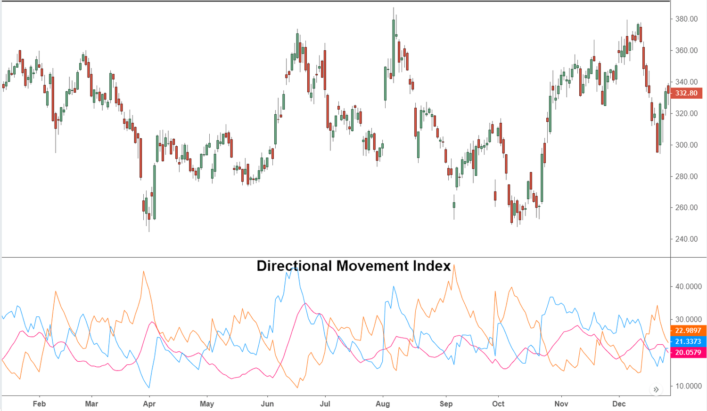

## Table of Contents

## What is the Directional Movement Indicator (DMI)?

The Directional Movement Indicator (DMI) is a technical analysis tool used by traders to determine the strength and direction of a trend in a financial market. It consists of three lines: the Positive Directional Indicator (+DI), the Negative Directional Indicator (-DI), and the Average Directional Index (ADX). The +DI measures the upward movement in price, while the -DI measures the downward movement. The ADX, on the other hand, helps traders understand the strength of the trend, regardless of its direction.

Traders use the DMI to make decisions about entering or exiting trades. When the +DI line crosses above the -DI line, it suggests that the market is trending upwards, which might be a good time to buy. Conversely, if the -DI line crosses above the +DI line, it indicates a downward trend, suggesting a possible time to sell. The ADX line is crucial because if it is above a certain level, usually 25, it indicates a strong trend. If the ADX is below 25, the market might be in a range or not trending strongly, which could affect trading decisions.

## How does the Directional Movement Indicator work?

The Directional Movement Indicator, or DMI, helps traders see if a market is going up or down and how strong that movement is. It uses three lines: the Positive Directional Indicator (+DI), the Negative Directional Indicator (-DI), and the Average Directional Index (ADX). The +DI line shows how much the price is going up, and the -DI line shows how much it's going down. When the +DI line goes above the -DI line, it means the market might be starting to go up, which could be a good time to buy. If the -DI line goes above the +DI line, it means the market might be starting to go down, and it could be a good time to sell.

The ADX line is important because it tells traders how strong the trend is, no matter if it's going up or down. If the ADX line is above 25, it means the trend is strong. If it's below 25, the market might not be moving much in one direction, and it might be better to wait before making a trade. By looking at all three lines together, traders can make better decisions about when to buy or sell in the market.

## What are the main components of the DMI?

The Directional Movement Indicator (DMI) has three main parts: the Positive Directional Indicator (+DI), the Negative Directional Indicator (-DI), and the Average Directional Index (ADX). The +DI shows how much the price is going up, while the -DI shows how much it's going down. Traders look at these two lines to see if the market is trending up or down. When the +DI line goes above the -DI line, it suggests the market might be starting to go up, which could be a good time to buy. On the other hand, if the -DI line goes above the +DI line, it means the market might be starting to go down, and it could be a good time to sell.

The third part, the ADX, is important because it tells traders how strong the trend is, whether it's going up or down. If the ADX line is above 25, it means the trend is strong. If it's below 25, the market might not be moving much in one direction, and it might be better to wait before making a trade. By looking at all three parts of the DMI together, traders can make better decisions about when to buy or sell in the market.

## How can the DMI be used to identify trends in the market?

The Directional Movement Indicator (DMI) helps traders see if a market is going up or down by looking at three lines: the Positive Directional Indicator (+DI), the Negative Directional Indicator (-DI), and the Average Directional Index (ADX). The +DI line shows how much the price is going up, and the -DI line shows how much it's going down. When the +DI line goes above the -DI line, it means the market might be starting to go up. This could be a good time to buy. On the other hand, if the -DI line goes above the +DI line, it means the market might be starting to go down. This could be a good time to sell.

The ADX line is important because it tells traders how strong the trend is, no matter if it's going up or down. If the ADX line is above 25, it means the trend is strong. This can help traders feel more confident about their decisions to buy or sell. If the ADX line is below 25, it means the market might not be moving much in one direction. In this case, it might be better to wait before making a trade. By looking at all three parts of the DMI together, traders can make better decisions about when to buy or sell in the market.

## What is the difference between the Positive Directional Indicator (+DI) and the Negative Directional Indicator (-DI)?

The Positive Directional Indicator (+DI) and the Negative Directional Indicator (-DI) are two parts of the Directional Movement Indicator (DMI) that help traders see if the market is going up or down. The +DI measures how much the price is going up. When the +DI line goes above the -DI line, it means the market might be starting to go up. This could be a good time for traders to buy because the trend is moving upwards.

The -DI, on the other hand, measures how much the price is going down. When the -DI line goes above the +DI line, it means the market might be starting to go down. This could be a good time for traders to sell because the trend is moving downwards. By comparing these two lines, traders can get a clear picture of the direction of the market trend.

## How do you calculate the Average Directional Index (ADX)?

The Average Directional Index (ADX) is a part of the Directional Movement Indicator (DMI) that helps traders see how strong a trend is in the market. To calculate the ADX, you first need to find the Positive Directional Movement (+DM) and the Negative Directional Movement (-DM). The +DM is the difference between the current high and the previous high if it's positive and greater than the difference between the previous low and the current low. The -DM is the difference between the previous low and the current low if it's positive and greater than the difference between the current high and the previous high. If neither condition is met, both +DM and -DM are set to zero.

Next, you calculate the True Range (TR), which is the greatest of the current high minus the current low, the absolute value of the current high minus the previous close, or the absolute value of the current low minus the previous close. Then, you smooth the +DM, -DM, and TR over a period, usually 14 days, to get the Smoothed +DM, Smoothed -DM, and Smoothed TR. The +DI and -DI are calculated by dividing the Smoothed +DM and Smoothed -DM by the Smoothed TR and multiplying by 100. Finally, the ADX is calculated by finding the difference between +DI and -DI, dividing it by the sum of +DI and -DI, and then smoothing this value over another period, usually 14 days, to get the final ADX value. This number tells traders how strong the trend is, with values above 25 indicating a strong trend.

## What does the ADX tell you about the strength of a trend?

The Average Directional Index (ADX) tells you how strong a trend is in the market. It's a part of the Directional Movement Indicator (DMI) and helps traders see if the market is moving strongly in one direction or not. The ADX is a number between 0 and 100. When the ADX is above 25, it means the trend is strong. This can help traders feel more confident about their decisions to buy or sell because the market is clearly moving in one direction.

When the ADX is below 25, it means the trend is not very strong. The market might be moving sideways or not moving much at all. In this case, traders might want to wait before making a trade because the market isn't showing a clear direction. By looking at the ADX, traders can decide if it's a good time to follow the trend or if they should wait for a stronger trend to appear.

## How can the DMI be integrated into a trading strategy to enhance profitability?

The Directional Movement Indicator (DMI) can be integrated into a trading strategy to help traders make better decisions about when to buy or sell, which can lead to more profitable trades. By using the DMI, traders can see if the market is going up or down and how strong that movement is. The Positive Directional Indicator (+DI) and the Negative Directional Indicator (-DI) help show the direction of the trend. When the +DI line goes above the -DI line, it's a sign that the market might be starting to go up, which could be a good time to buy. If the -DI line goes above the +DI line, it means the market might be starting to go down, suggesting a good time to sell. By following these signals, traders can enter and [exit](/wiki/exit-strategy) trades at the right times to increase their chances of making a profit.

The Average Directional Index (ADX) part of the DMI is also very useful because it tells traders how strong the trend is. If the ADX is above 25, it means the trend is strong, and traders can feel more confident about their decisions to buy or sell. But if the ADX is below 25, it means the trend is not very strong, and the market might be moving sideways. In this case, traders might want to wait before making a trade because the market isn't showing a clear direction. By combining the information from the +DI, -DI, and ADX, traders can create a strategy that helps them take advantage of strong trends and avoid trading in weak or unclear market conditions, which can lead to better profitability.

## What are common pitfalls to avoid when using the DMI for trading decisions?

One common pitfall when using the Directional Movement Indicator (DMI) is relying on it too much without considering other factors. The DMI can show if the market is going up or down and how strong that movement is, but it doesn't tell you everything. For example, it might not show important news or events that can affect the market. Traders need to use the DMI along with other tools and information to make the best decisions. If they only use the DMI, they might miss important signs and make bad trades.

Another mistake is not waiting for clear signals from the DMI before making a trade. The DMI has three lines: the Positive Directional Indicator (+DI), the Negative Directional Indicator (-DI), and the Average Directional Index (ADX). Traders should wait until the +DI line goes above the -DI line to buy, and wait until the -DI line goes above the +DI line to sell. They should also check if the ADX is above 25 to make sure the trend is strong. If traders rush into trades without waiting for these clear signals, they might buy or sell at the wrong times and lose money.

## Can the DMI be used effectively in conjunction with other technical indicators?

Yes, the Directional Movement Indicator (DMI) can be used effectively with other technical indicators to make better trading decisions. The DMI helps traders see if the market is going up or down and how strong that movement is. But it doesn't tell you everything. By using other indicators like the Moving Average Convergence Divergence (MACD) or the Relative Strength Index (RSI), traders can get more information about the market. For example, the MACD can show if the market's momentum is changing, which can help confirm the trend that the DMI is showing. The RSI can tell if a market is overbought or oversold, which can help traders decide if it's a good time to buy or sell.

Using the DMI with other indicators can help traders avoid common mistakes. For instance, if the DMI shows a strong upward trend but the RSI indicates the market is overbought, a trader might decide to wait before buying. This can help them avoid buying at the top of a trend and losing money when the market goes down. Similarly, if the DMI shows a strong downward trend and the MACD confirms that the momentum is still going down, a trader might feel more confident about selling. By combining the DMI with other tools, traders can get a fuller picture of the market and make more profitable trades.

## How does the DMI perform in different market conditions, such as bull, bear, or sideways markets?

The Directional Movement Indicator (DMI) works differently in different market conditions. In a bull market, where prices are going up, the DMI can help traders see this upward trend. The Positive Directional Indicator (+DI) will be above the Negative Directional Indicator (-DI), and if the Average Directional Index (ADX) is also above 25, it means the upward trend is strong. Traders can use this information to decide when it's a good time to buy and make money as the market keeps going up.

In a bear market, where prices are going down, the DMI can show this downward trend. The -DI will be above the +DI, and a high ADX (above 25) will show that the downward trend is strong. This can help traders know when it's a good time to sell and avoid losing money as the market goes down. In a sideways market, where prices aren't going up or down much, the ADX will usually be below 25. This tells traders that there isn't a strong trend, so it might be better to wait before making any trades. By understanding how the DMI works in these different conditions, traders can make better decisions and increase their chances of making a profit.

## What advanced techniques can be applied to the DMI to optimize trading outcomes?

One advanced technique to optimize trading outcomes with the Directional Movement Indicator (DMI) is to use it in combination with other indicators. For example, traders can use the DMI along with the Moving Average Convergence Divergence (MACD) to confirm trends. If the DMI shows a strong upward trend (with the +DI above the -DI and the ADX above 25), and the MACD also shows increasing momentum, this can give traders more confidence to buy. Similarly, if the DMI indicates a strong downward trend and the MACD confirms this with decreasing momentum, traders might feel more certain about selling. By using these indicators together, traders can get a clearer picture of the market and make better trading decisions.

Another technique is to apply different time frames when using the DMI. Traders can look at the DMI on both short-term and long-term charts to get a better understanding of the trend. For example, if the DMI on a daily chart shows a strong upward trend but the weekly chart also confirms this trend, it might be a good time to buy. This can help traders avoid false signals that might appear on just one time frame. Additionally, traders can use the DMI to set stop-loss and take-profit levels. If the ADX is high and the trend is strong, traders might set wider stop-losses to avoid being stopped out by small market fluctuations, and adjust their take-profit levels to capture more of the trend's movement. By using these advanced techniques, traders can optimize their trading outcomes and increase their chances of making profitable trades.

## What is the Directional Movement Index (DMI) and how does it work?

The Directional Movement Index (DMI), developed by J. Welles Wilder in 1978, is a crucial tool in trading, designed to measure the direction and strength of trends in financial markets. This indicator is particularly valuable for traders aiming to distinguish between periods of strong directional movement and periods with no clear trend, thereby informing more strategic trading decisions.

The DMI consists of two primary lines: the Positive Directional Indicator (+DI) and the Negative Directional Indicator (-DI). These indicators are calculated by comparing the differences between current high and low prices. Specifically, the formulas are as follows:

$$
+DI = \frac{{\text{Smoothed positive directional movement}}}{{\text{Average True Range (ATR)}}}
$$

$$
-DI = \frac{{\text{Smoothed negative directional movement}}}{{\text{Average True Range (ATR)}}}
$$

These +DI and -DI lines indicate bullish and bearish [momentum](/wiki/momentum), respectively, through a comparison of upward and downward price changes over a set period. When the +DI line is above the -DI line, it suggests a bullish trend, and vice versa for a bearish trend.

The DMI is often used in conjunction with the Average Directional Index (ADX), another component introduced by Wilder, which provides insights into the strength of the trend, regardless of its direction. The ADX is calculated as follows:

$$
\text{ADX} = \frac{{100}}{{\text{number of periods}}} \times \sum \left|\frac{{\text{+DI} - \text{-DI}}}{{\text{+DI} + \text{-DI}}}\right|
$$

The ADX ranges from 0 to 100, with higher values indicating a stronger trend. Traders typically consider readings above 20 to suggest an ongoing trend, while readings below this threshold imply a lack of a definitive trend.

Together, the components of the DMI provide a comprehensive view of market momentum and directionality. By using the DMI to identify whether a trend exists, traders can make informed decisions about potential entries and exits, ensuring they capitalize on significant price movements rather than getting caught in market noise.

## What is Backtesting and Optimization?

Backtesting is an essential component in assessing the effectiveness of Directional Movement Index (DMI)-based trading strategies. By simulating trades over historical data, traders can evaluate how a DMI strategy would have performed, offering insights into potential profitability and areas for improvement.

Over a 25-year period, analysis has demonstrated that DMI strategies can outperform popular market indices. This success is primarily due to the effective trend identification and momentum gauging features of the DMI, which allow traders to capitalize on significant market movements while avoiding periods of low [volatility](/wiki/volatility-trading-strategies) that commonly result in trading losses.

The Compound Annual Growth Rate (CAGR) and risk-adjusted returns are favorable for DMI strategies. These metrics offer a quantitative assessment of strategy performance. The CAGR reflects the mean annual growth rate of an investment over a specified time period longer than one year, assuming profits are reinvested at the end of each period. Mathematically, CAGR is expressed as:

$$
\text{CAGR} = \left( \frac{\text{Ending Value}}{\text{Beginning Value}} \right)^{\frac{1}{n}} - 1
$$

where $n$ is the number of years. Risk-adjusted returns, such as the Sharpe Ratio, evaluate a strategy's return while considering the risk taken, providing a clearer picture of potential returns relative to market volatility.

To facilitate efficient [backtesting](/wiki/backtesting) and strategy refinement, traders use platforms like Finviz and TrendSpider. These technologies offer robust tools for analyzing historical market data and optimizing DMI parameters, such as the periods used to calculate the +DI, -DI, and ADX components. By adjusting these parameters and aligning them with current market conditions, traders can devise strategies tailored to different asset classes and market environments.

Python, a versatile programming language, is often used in backtesting DMI strategies. Here's a basic example of a Python script using the `pandas` and `ta` libraries for implementing a DMI-based backtest:

```python
import pandas as pd
import ta

# Load historical market data
data = pd.read_csv('market_data.csv', parse_dates=True, index_col='Date')

# Calculate DMI
data['+DI'] = ta.trend.adx_pos(data['High'], data['Low'], data['Close'], n=14)
data['-DI'] = ta.trend.adx_neg(data['High'], data['Low'], data['Close'], n=14)
data['ADX'] = ta.trend.adx(data['High'], data['Low'], data['Close'], n=14)

# Determine trading signals
data['Signal'] = 0
data.loc[data['+DI'] > data['-DI'], 'Signal'] = 1  # Buy signal
data.loc[data['+DI'] < data['-DI'], 'Signal'] = -1  # Sell signal

# Backtest performance
# Assuming starting capital and transaction cost are predefined
# Implement strategy-based calculations to evaluate performance
```

The script demonstrates how to calculate DMI indicators and derive trading signals from them. Such automated systems enable the continuous monitoring and execution of trades, optimizing entry and exit points without the influence of human emotions.

Finally, the optimization of DMI-based strategies requires ongoing evaluation and adjustment to incorporate evolving market conditions. Traders should periodically backtest their strategies using updated data and adjust DMI parameters to enhance performance. Regular optimization ensures that DMI strategies remain competitive and capable of achieving consistent profitability over time.

## References & Further Reading

[1]: Wilder, J. W. (1978). ["New Concepts in Technical Trading Systems."](https://archive.org/details/newconceptsintec00wild) Trend Research.

[2]: Pring, M. J. (1991). ["Technical Analysis Explained: The Successful Investor's Guide to Spotting Investment Trends and Turning Points."](https://archive.org/details/technicalanalysi00prin) McGraw-Hill Education.

[3]: Chan, E. P. (2013). ["Algorithmic Trading: Winning Strategies and Their Rationale."](https://github.com/ftvision/quant_trading_echan_book) Wiley.

[4]: Kaufman, P. J. (2013). ["Trading Systems and Methods."](https://onlinelibrary.wiley.com/doi/book/10.1002/9781119202561) Wiley.

[5]: Aronson, D. R. (2006). ["Evidence-Based Technical Analysis: Applying the Scientific Method and Statistical Inference to Trading Signals."](https://www.amazon.com/Evidence-Based-Technical-Analysis-Scientific-Statistical/dp/0470008741) Wiley.