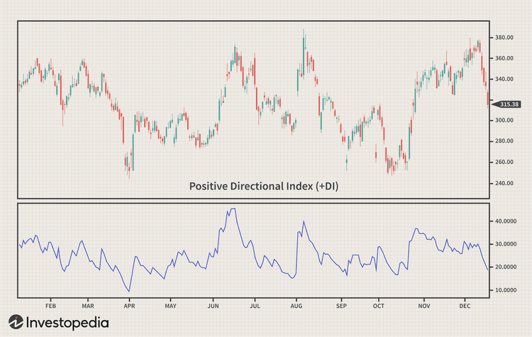

Understanding directional trading investment analysis and trading strategies is crucial for traders aiming to optimize their earnings. Directional trading involves predicting market price movements and making decisions based on these predictions. Optimization requires a keen understanding of market trend analysis and the strategic integration of algorithmic trading, commonly known as algo trading.

This article focuses on the relationship between directional trading and algo trading. Algo trading uses sophisticated algorithms to transact orders at high speeds, enhancing the precision and efficiency of trade executions. By integrating technology, traders can analyze vast datasets swiftly, identifying potential trading opportunities that may not be as apparent through manual techniques alone.



Manual trading involves a hands-on approach where traders rely on their analysis and intuition to make decisions. In contrast, algorithmic trading automates decision-making processes based on predetermined criteria, minimizing human error and speeding up execution. Understanding these techniques' differences is essential for traders to diversify their strategies effectively.

The combination of directional trading strategies with algorithmic approaches can revolutionize trading. By automating complex trading algorithms, traders can execute strategies such as trend-following or momentum trades with greater accuracy, adapting quickly to market fluctuations. This not only amplifies potential profitability but also mitigates risks associated with manual trading methods.

In summary, the fusion of directional and algorithmic trading methods empowers traders to make informed decisions, potentially transforming their investment outcomes. Harnessing these tools is pivotal to staying competitive and maximizing returns in today's fast-paced trading environment.

## Table of Contents

## What is Directional Trading?

Directional trading involves executing trades based on anticipated market price movements, rooted in a trader’s predictions about the direction—up or down—markets are expected to move. This trading philosophy hinges on proficiency in analyzing market dynamics, which are influenced by a myriad of factors, including economic indicators, market sentiment, and geopolitical events. To effectively employ directional trading, traders must cultivate a nuanced understanding of these market movements and recognize patterns that indicate potential shifts in market trends.

Directional trading finds utility across diverse markets such as stocks, commodities, and [forex](/wiki/forex-system). Each of these markets exhibits unique characteristics and [volatility](/wiki/volatility-trading-strategies) patterns, necessitating tailored approaches to analyzing market trends. For instance, the stock market may be heavily influenced by corporate earnings and macroeconomic data, while the forex market might respond more dynamically to [interest rate](/wiki/interest-rate-trading-strategies) changes or geopolitical tensions.

A pivotal component of successful directional trading is the accurate forecasting of market directions. Accurate predictions often rely on harnessing advanced analytical techniques and insights from historical data to identify potential future price actions. Traders frequently employ a combination of technical indicators—such as moving averages, relative strength index (RSI), and Bollinger Bands—and market analysis to guide their trading decisions. Technical indicators assist traders in interpreting past and current price movements to anticipate future trends, which is critical in determining optimal entry and [exit](/wiki/exit-strategy) points for trades.

For example, traders might utilize a simple moving average (SMA) to discern potential market reversals:

$$
\text{SMA} = \frac{\sum_{i=1}^{n} P_i}{n}
$$

Where $P_i$ is the price at each point in time and $n$ is the number of periods.

Incorporating rigorous market analysis, which includes examining corporate announcements, economic reports, and other external data, provides a holistic view of market conditions, aiding traders in balancing technical indicators with fundamental insights. Such comprehensive analysis enables traders to make informed decisions, aligning their strategies with underlying market forces and thus optimizing their trading outcomes.

In conclusion, directional trading demands a deep comprehension of market trends and masterful application of both technical indicators and fundamental market analysis. By doing so, traders can enhance their ability to predict market direction accurately and make informed trading decisions across various financial markets.

## The Role of Investment Analysis in Directional Trading

Investment analysis is integral to making informed trading decisions, especially within the scope of directional trading. This analysis encompasses both technical and fundamental facets, each contributing to a comprehensive understanding of market dynamics. Technical analysis involves examining historical market data, such as price, [volume](/wiki/volume-trading-strategy), and other statistical measures, to forecast future market movements. Key tools within this domain include moving averages, trend lines, and [momentum](/wiki/momentum) indicators such as the Relative Strength Index (RSI) or Moving Average Convergence Divergence (MACD). These indicators help identify potential trends and market reversals, essential for predicting price directions accurately.

Fundamental analysis, on the other hand, focuses on evaluating relevant economic, financial, and other qualitative and quantitative factors. For stocks, this could involve analyzing balance sheets, income statements, or market conditions affecting a company's performance. In commodity or forex markets, it might include macroeconomic indicators such as interest rates, inflation rates, and geopolitical events. By understanding these factors, traders can assess the intrinsic value of an asset and make predictions about its future price movements.

Combining technical and [fundamental analysis](/wiki/fundamental-analysis) is crucial for gaining a holistic view of the market. This dual approach can highlight discrepancies between an asset's intrinsic value and its current market price, presenting potential trade opportunities. For instance, identifying a technically oversold asset with strong fundamental growth indicators could signal a lucrative buying opportunity.

Advanced software plays a pivotal role in enhancing the precision and speed of investment analysis. These tools can process vast amounts of data more quickly and accurately than manual methods. Software platforms often incorporate [machine learning](/wiki/machine-learning) algorithms to identify patterns or anomalies in market data that may not be immediately visible to traders. Python, for instance, offers libraries like Pandas for data manipulation and Matplotlib and Seaborn for creating insightful visualizations. Moreover, machine learning libraries such as Scikit-learn or TensorFlow can be used to develop predictive models that aid in decision-making.

Here is a simple Python example that uses historical market data to plot a moving average, a common technical analysis technique:

```python
import pandas as pd
import matplotlib.pyplot as plt

# Load historical data
data = pd.read_csv('historical_prices.csv')  # Ensure the CSV contains 'Date' and 'Close'

# Calculate moving average
data['Moving Average'] = data['Close'].rolling(window=20).mean()

# Plotting the data
plt.figure(figsize=(10, 5))
plt.plot(data['Date'], data['Close'], label='Close Price')
plt.plot(data['Date'], data['Moving Average'], label='20-Day Moving Average', color='orange')
plt.title('Close Price and Moving Average')
plt.xlabel('Date')
plt.ylabel('Price')
plt.legend()
plt.xticks(rotation=45)
plt.show()
```

In summary, effective investment analysis in directional trading requires integrating multiple analytical approaches and leveraging advanced computational tools. This not only enhances the accuracy of predictions but also enables traders to respond swiftly to market changes, thereby optimizing their trading strategies.

## Trading Strategies for Directional Trading

Directional trading strategies offer traders methods to capitalize on market directions by employing a range of techniques. These strategies serve different risk profiles and trading objectives, and therefore, it's essential to comprehend and choose those that align with individual trading goals.

One popular directional trading strategy is momentum trading. This approach focuses on identifying securities that are exhibiting upward or downward trends with the expectation that these trends will continue in the near future. Momentum traders might use indicators such as the Relative Strength Index (RSI) or moving averages to gauge the strength of a price trend. For instance, when a stock consistently rises or falls in price with high trading volume, a momentum trader might opt to buy (in the case of an upward trend) or sell (in the case of a downward trend) anticipating continued momentum.

Breakout strategies are another favored technique in directional trading. These strategies involve entering a position when the price of a security moves beyond a specified resistance or support level, which is often indicative of a new trend forming. Traders utilizing [breakout](/wiki/breakout-trading) strategies often set stop-loss orders to manage risk if the breakout proves to be false. The concept is based on the idea that once the price breaks through a significant barrier, it will continue to move in the breakout direction owing to increased market interest and volume.

Reversal strategies focus on predicting price reversals at the end of a trend. Reversal traders look for indicators that a trend has lost momentum and a reverse is likely to occur. Tools like the Moving Average Convergence Divergence (MACD) or candlestick patterns can be valuable in spotting potential reversals. This strategy typically appeals to more experienced traders who have a comprehensive understanding of market behaviors since catching a reversal requires precise timing and can involve more risk.

Backtesting is instrumental in assessing the viability of any directional trading strategy. This process involves simulating a trading strategy on historical data to evaluate how it would have performed in past market conditions. Backtesting can highlight a strategy's strengths and weaknesses and provide insights into the potential success of the strategy—allowing traders to refine their approach before risking actual capital. In Python, [backtesting](/wiki/backtesting) can be performed using libraries such as `pandas` for data manipulation, and `[backtrader](/wiki/backtrader)` for strategy evaluation.

Diversification within directional trading is beneficial in risk management. By deploying multiple trading strategies across various market instruments and conditions, traders can reduce the risk inherent in relying on a single method. Diversification ensures that the performance of a particular strategy or market does not disproportionately impact the overall trading portfolio.

Selecting the appropriate directional trading strategy requires a thorough understanding of personal risk tolerance and market knowledge. A well-chosen strategy, supported by backtesting and diversification, can significantly improve a trader's ability to achieve consistent returns.

 to Algo Trading

Algorithmic trading, commonly referred to as algo trading, involves the use of automated algorithms to execute trades in financial markets. This method leverages computer programs to make trading decisions at speeds and frequencies impossible for a human trader. The core premise of algo trading is to minimize human intervention by employing pre-defined strategies that act on various financial data inputs.

At its foundation, algo trading uses mathematical models and complex algorithms to analyze historical and real-time data. These algorithms are typically programmed to execute trades when certain market conditions are met, such as price levels, chart patterns, or financial indicators. This process reduces human error and ensures that trades are executed based on objective criteria rather than emotional or subjective judgment.

One of the primary advantages of [algorithmic trading](/wiki/algorithmic-trading) is its ability to process vast quantities of market data to identify trading opportunities swiftly. For instance, algorithms can be designed to rapidly analyze the price movements of multiple stocks, commodities, or currencies, identifying patterns or trends that suggest profitable trades. These operations are conducted at speeds that often provide a competitive edge over traders relying solely on manual methods.

The popularity of algo trading in modern financial markets is primarily attributed to its speed, precision, and efficiency. It allows for the execution of complex strategies that would be challenging to manage manually. For example, statistical [arbitrage](/wiki/arbitrage), [market making](/wiki/market-making), and high-frequency trading are strategies that thrive on the ability to execute numerous trades simultaneously and with minimal latency.

Understanding the basics of algorithmic trading is crucial for incorporating it into directional trading strategies. Directional trading focuses on predicting the future direction of asset prices, and by automating these strategies through algorithms, traders can optimize their execution processes. This synergy between algorithmic and directional trading provides an enhanced trading framework that capitalizes on computational efficiency while adhering to a trader's strategic goals.

In summary, algorithmic trading represents a technological evolution in the trading landscape, enabling high-speed trades while minimizing the potential for human error. It harnesses the power of algorithms to analyze large datasets quickly and accurately, thereby offering traders a potent tool for executing complex and efficient trading strategies.

## Using Algorithms in Directional Trading

Algorithms play a pivotal role in modern trading strategies by automating complex trading processes and enhancing decision-making accuracy. In directional trading, these algorithms can be meticulously programmed to adhere to specific strategies, thus optimizing the trading process.

Algorithms utilize technical indicators and market signals to drive automation. By incorporating tools such as moving averages, relative strength index (RSI), or MACD (Moving Average Convergence Divergence), algorithms can systematically assess market conditions and execute trades accordingly. For instance, when a predefined set of criteria—like a breakout in price—are met, the algorithm can automatically initiate a buy or sell order, optimizing trade execution speed and minimizing manual intervention.

Machine learning models significantly bolster the adaptability of algorithms to evolving market conditions. These models can process vast arrays of historical and real-time data, enabling them to detect patterns and shifts in market behavior. For example, using a supervised learning approach, a machine learning model can be trained on past price movements to identify predictive signals indicative of future trends. This enhances the algorithm's ability to adjust trading decisions dynamically, improving performance in volatile markets.

Customization of algorithms is vital to align with individual trading goals and risk tolerance levels. Traders can define specific parameters, such as target profit levels, stop-loss limits, or maximum acceptable risk. This customization ensures that the algorithm operates within a framework that suits the trader's strategic objectives, providing a tailored trading solution that can be more resilient to market fluctuations.

The integration of [artificial intelligence](/wiki/ai-artificial-intelligence) (AI) into trading algorithms takes predictive accuracy to a higher level. AI can process complex datasets from various sources, including news articles, financial reports, and social media trends, to infer market sentiment and anticipate price movements more precisely. For instance, natural language processing (NLP) techniques can analyze textual data to gauge investor sentiment, which can then be factored into trading decisions. This level of sophistication allows traders to harness nuanced insights, potentially leading to more informed and profitable trading outcomes.

In summary, the use of algorithms in directional trading represents a substantial advancement in trading technology. By leveraging technical indicators, machine learning, and AI, traders can enhance their strategies, achieve greater efficiency in execution, and better manage risk.

## Benefits and Challenges of Algo Trading in Directional Trading

Algo trading, short for algorithmic trading, has become a vital component of modern financial markets, particularly in directional trading. One of its primary benefits is the enhancement of trade volumes and market [liquidity](/wiki/liquidity-risk-premium). By allowing trades to be executed at high speeds, algo trading supports the smooth functioning of markets, reducing bid-ask spreads and enabling more efficient price discovery.

Algo trading also enables traders to capitalize on market inefficiencies. By automatically identifying and responding to these inefficiencies faster than any human trader could respond manually, it provides a competitive edge. For instance, when an algorithm detects an arbitrage opportunity, it can execute trades across different markets almost instantaneously, securing potential profits before the opportunity dissipates.

Despite these advantages, algo trading is not without its challenges. Technical failures, such as software bugs or hardware malfunctions, can lead to significant financial losses. Furthermore, poorly programmed algorithms might execute unintended trades, leading to adverse market impacts or significant financial repercussions. To mitigate these risks, comprehensive backtesting and rigorous quality assurance processes must be implemented.

Regulatory and ethical considerations also arise with the use of algorithmic strategies. Since these algorithms operate at speeds beyond human capability, there is a concern that they may contribute to market volatility, as seen in events like the Flash Crash of 2010. Regulatory bodies have since established guidelines to ensure fairness and stability, but traders must remain vigilant in adhering to these standards to avoid potential penalties.

Balancing technological automation with human oversight is crucial. While algorithms can efficiently execute trades based on predefined rules, they lack the nuanced judgment and ethical considerations that human oversight can provide. Consequently, a hybrid approach often proves most effective, where human portfolio managers monitor algo activities and intervene when necessary. This strategy ensures that while the speed and efficiency of algo trading are harnessed, the potential pitfalls associated with unsupervised automation are minimized.

In conclusion, while algorithmic trading offers significant benefits in enhancing the efficiency and efficacy of directional trading, traders must be cognizant of its challenges. Ensuring the reliability of algorithms, adhering to regulatory standards, and maintaining appropriate human oversight are critical factors in successfully leveraging this technology.

## Conclusion

Directional trading strategies and algo trading have become transformative forces in the trading landscape, offering traders the ability to enhance their decision-making processes and improve market responsiveness. By embracing these approaches, traders can access sophisticated tools that enable more precise forecasting and strategic execution.

Investment analysis, a cornerstone of successful trading, is augmented by algorithmic approaches, providing a powerful combination for making informed and swift trading decisions. Algorithms can process vast amounts of market data, leading to insights that are often beyond the reach of traditional manual analysis.

The integration of advanced technologies is essential for optimizing and enhancing the efficiency of directional trading. Algorithmic solutions, particularly those utilizing machine learning and artificial intelligence, offer customization and adaptability, ensuring that trading strategies can be tailored to specific goals and risk tolerances. These technologies can identify patterns and predict market movements with a level of accuracy that was previously unattainable.

To remain competitive, traders must stay informed about continuous advancements in trading technologies and strategies. The landscape is constantly evolving, with new tools and methodologies becoming available that can further refine trading approaches and exploit emerging opportunities.

By understanding and leveraging these tools, traders can potentially maximize their investment returns. The synergy between directional trading strategies and algorithmic trading allows for a dynamic response to market conditions, minimizing risks and maximizing potential gains. As traders become more adept at integrating these advanced techniques, they unlock opportunities for greater profitability and sustained success in the markets.

## References & Further Reading

[1]: Bergstra, J., Bardenet, R., Bengio, Y., & Kégl, B. (2011). ["Algorithms for Hyper-Parameter Optimization."](https://dl.acm.org/doi/10.5555/2986459.2986743) Advances in Neural Information Processing Systems 24.

[2]: ["Advances in Financial Machine Learning"](https://www.amazon.com/Advances-Financial-Machine-Learning-Marcos/dp/1119482089) by Marcos Lopez de Prado

[3]: ["Evidence-Based Technical Analysis: Applying the Scientific Method and Statistical Inference to Trading Signals"](https://www.amazon.com/Evidence-Based-Technical-Analysis-Scientific-Statistical/dp/0470008741) by David Aronson

[4]: ["Machine Learning for Algorithmic Trading"](https://github.com/stefan-jansen/machine-learning-for-trading) by Stefan Jansen

[5]: ["Quantitative Trading: How to Build Your Own Algorithmic Trading Business"](https://www.amazon.com/Quantitative-Trading-Build-Algorithmic-Business/dp/1119800064) by Ernest P. Chan