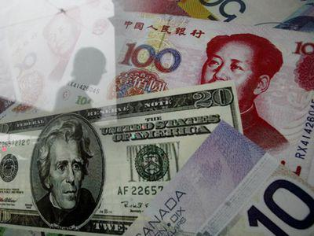

In today's interconnected global economy, exchange rate regimes are pivotal in determining the value of a country's currency. These systems come in various forms, each with specific mechanisms and impacts on international trade and economic stability. A particularly intriguing system within this spectrum is the 'dirty float'. This exchange rate regime represents an intermediary between fixed and floating systems, allowing a currency to float freely yet enabling central banks to intervene when necessary. Such interventions are typically aimed at stabilizing the currency's value amidst market volatility, economic shocks, and speculative pressures.

Understanding how dirty floats function and their implications is essential for navigating the complexities of modern economic landscapes. These regimes provide a unique blend of market-driven variability and regulatory oversight, offering both flexibility and stability. They allow countries to respond swiftly to external economic pressures while maintaining control over domestic economic policy.

This article will explore the intricacies of exchange rate regimes, with a special focus on dirty floats. It will examine the role of monetary policy in these systems and the influence of algorithmic trading in currency markets. Additionally, it will analyze how these elements combine to affect global trade and economic stability. Through this exploration, we aim to shed light on the complex interplay between market forces and government interventions that dictate currency values in today's dynamic global economy.

## Table of Contents

## Understanding Exchange Rate Regimes

Exchange rate regimes define how a country's currency is valued against others, affecting its international competitiveness and economic stability. These regimes fall into two primary categories: fixed and floating systems.

In a fixed exchange rate system, a country's currency value is pegged at a set rate relative to another currency or a basket of currencies. This system provides stability and predictability, beneficial for international trade and investment. Fixed rates can be maintained through central bank interventions in the foreign exchange market to buy or sell the domestic currency, keeping its value in line with the predetermined peg. Classic examples include the gold standard and the Bretton Woods system, where currencies were pegged to the US dollar, which was convertible to gold.

Floating exchange rate systems, in contrast, allow market forces of supply and demand to determine currency values. Under this regime, central banks generally abstain from direct market interventions, letting currency values fluctuate according to global economic conditions. Floating currencies can adjust naturally to trade imbalances and changes in foreign exchange demand but may also experience higher volatility, impacting inflation and economic planning.

Historically, exchange rate systems have evolved significantly. The Bretton Woods system established in 1944 aimed to provide fixed exchange rates, pegging currencies to the US dollar. However, this system collapsed in 1971 when the US suspended the dollar's convertibility to gold, leading to the adoption of more flexible regimes. Today, many countries use managed or "dirty" floats, blending fixed and flexible elements to stabilize currency fluctuations through occasional central bank interventions.

Each exchange rate system offers distinct advantages and disadvantages. Fixed systems provide an anchor for economic [agents](/wiki/agents), reducing currency risk and speculation but limiting a country's monetary policy flexibility. Floating systems offer autonomy in monetary policy and automatic adjustments to trade and capital flows but can result in higher currency [volatility](/wiki/volatility-trading-strategies) and economic uncertainty.

Ultimately, the choice of exchange rate regime affects global trade dynamics and economic policies, influencing how countries interact economically and financially on the world stage.

## Dirty Float: A Hybrid System

A dirty float, or managed float, describes an exchange rate regime where currency values are primarily determined by market demand and supply, but with periodic interventions by central authorities. This hybrid system facilitates stability amid market volatility and economic disturbances by allowing for market dynamics while providing a mechanism for governmental control. For example, should the national currency experience excessive appreciation or depreciation, the central bank might buy or sell currency, adjusting interest rates or deploying foreign exchange reserves to modulate the currency's value. Such interventions aim to dampen drastic movements and shield the economy from potential adverse effects, like inflation or trade imbalances.

The essence of a dirty float is its blend of market freedom and regulatory input. By not adhering to a fixed exchange rate, it offers flexibility, allowing monetary policy to respond to economic conditions without the constraints of a pegged system. This flexibility is vital as it enables central banks to target other macroeconomic objectives, such as inflation control, while maintaining favorable export competitiveness through carefully managed currency adjustments.

However, the degree of intervention in a dirty float system varies. Some nations might intervene frequently, while others adopt a hands-off approach, stepping in only during times of extreme volatility. This variance underscores the system's adaptability, accommodating diverse economic policies and conditions. Crucially, the effectiveness of a dirty float relies on the judicious use of interventions—balancing between too little, risking economic instability, and too much, potentially leading to claims of currency manipulation.

Overall, dirty floats strike a middle ground between fully liberalized and tightly regulated exchange regimes, offering an equilibrium that supports both autonomous market operations and strategic regulatory oversight.

## Monetary Policy and Dirty Float

Monetary policy plays a pivotal role in maintaining economic stability and mitigating the effects of economic fluctuations. In the context of a dirty float exchange rate system, it gains particular significance due to the system’s inherent flexibility. A dirty float, or managed float, enables monetary authorities to manage currency values through strategic interventions, rather than adhering to fixed exchange rates. This flexibility allows for more responsive monetary policy actions aimed at stabilizing the domestic economy.

The ability to adjust currency values without being bound to a fixed rate provides several advantages. For instance, under a dirty float, central banks can influence inflation rates by altering interest rates or engaging in foreign exchange operations. By selling or purchasing the domestic currency, monetary authorities can exert upward or downward pressure on currency values, which can indirectly impact inflation. Lowering the currency value might boost exports by making them cheaper on the global market, while also potentially raising import prices, which could contribute to moderate inflation.

Moreover, a dirty float system can help shield the economy from speculative attacks. Speculative attacks occur when traders bet against a currency, causing its value to plummet, which could be catastrophic for countries with rigidly fixed exchange rates. With a managed float, central banks have the leeway to counteract these attacks through market interventions. By buying their own currency, they can prevent its sharp devaluation and instill market confidence.

Stabilizing the domestic economy is another key objective achieved through a managed float regime. By allowing the currency to fluctuate within a controlled range, authorities can support the economy in adjusting to shocks, such as sudden changes in capital flows or shifts in global demand. This adaptability ensures that the currency reflects economic fundamentals without subjecting it to extreme volatility.

Overall, a dirty float allows monetary policy to be more dynamic and adaptable, giving central banks the tools to contend with diverse economic challenges. By facilitating responsive monetary interventions, this exchange rate system supports both currency stability and broader economic health.

## Algorithmic Trading in Forex Markets

Algorithmic trading, a modern approach to financial market transactions, leverages automated systems to execute trades based on predefined criteria. In the [forex](/wiki/forex-system) market, where currencies often operate under dirty float mechanisms, [algorithmic trading](/wiki/algorithmic-trading) has become a pivotal component. These systems utilize sophisticated algorithms to analyze extensive datasets, and their primary goal is to detect and capitalize on price movements at remarkable speeds. By employing technical indicators, statistical models, and [machine learning](/wiki/machine-learning) techniques, algorithmic trading can identify trading opportunities within milliseconds that would be imperceptible to human traders.

A typical algorithmic trading strategy may involve the following steps:

1. **Data Acquisition**: Real-time and historical data, including currency pair prices, interest rates, and economic indicators, are collected for analysis.
2. **Analysis and Signal Generation**: The algorithm processes the data using statistical models or machine learning to generate trade signals. For example, a moving average crossover method might be used:
$$
   \text{Signal} = 
   \begin{cases} 
   \text{Buy}, & \text{if } \text{SMA}_{\text{short}}(t) > \text{SMA}_{\text{long}}(t) \\
   \text{Sell}, & \text{if } \text{SMA}_{\text{short}}(t) < \text{SMA}_{\text{long}}(t)
   \end{cases}

$$

   where $\text{SMA}_{\text{short}}(t)$ and $\text{SMA}_{\text{long}}(t)$ are the short-term and long-term simple moving averages, respectively.

3. **Execution**: Once a signal is generated, orders are automatically executed through electronic trading platforms. High-frequency trading (HFT), a subset of algorithmic trading, allows traders to process a large number of orders in fractions of a second, thus capitalizing on very short-term price movements.

4. **Portfolio and Risk Management**: Algorithms are also designed to manage portfolios dynamically, ensuring that risk is minimized by adhering to predetermined parameters such as position sizes and stop-loss levels.

Algorithmic trading provides significant [liquidity](/wiki/liquidity-risk-premium) to the forex market, particularly crucial in a dirty float system. Increased liquidity reduces bid-ask spreads, facilitating smoother transactions and reducing market volatility. Moreover, it enhances market efficiency by enabling the rapid incorporation of new information into currency prices.

The role of algorithmic trading in maintaining stability in managed float currencies can be seen by its ability to dampen abrupt price swings. For instance, during periods of economic news releases that typically cause spikes in price volatility, algorithmic traders can rapidly adjust their strategies to manage risk and exploit volatility, contributing to market stabilization.

Despite its benefits, algorithmic trading also poses certain risks, including the potential for systemic failures and ethical concerns related to market manipulation. Thus, regulatory oversight and robust risk management frameworks are essential to harness its advantages effectively. As forex markets continue to evolve, algorithmic trading remains a central element, shaping how currencies exchange hands in today's global economy.

## Case Studies: Dirty Float in Action

China's exchange rate system represents a classic example of a dirty float or managed float, where the yuan's value is allowed to fluctuate but within a defined scope set by the People's Bank of China (PBOC). This approach allows the yuan to react to market dynamics, such as supply and demand factors, while also being subject to strategic interventions by the central bank. The PBOC regularly adjusts its intervention policies based on economic goals such as promoting exports or curbing inflation. This managed fluctuation aids in absorbing external shocks while maintaining the yuan's competitiveness in global markets.

Similarly, Brazil's exchange rate regime exemplifies a dirty float system. The Brazilian Central Bank conducts interventions in the foreign exchange market to influence the real's value, primarily to stabilize the economy against external economic pressures and inflation. These interventions include currency swaps and the sale of foreign currency reserves, employed as tools to limit excessive volatility. Brazil's strategic management of its currency helps it navigate economic uncertainties and maintain financial stability.

India presents another case study with its dirty float system. The Reserve Bank of India (RBI) frequently intervenes to ensure that the Indian rupee does not vary drastically in value, which is crucial for sustaining the country's robust import-export sector. By utilizing foreign reserve assets and other monetary policies, the RBI mitigates adverse fluctuations, thus supporting economic stability and growth.

These case studies demonstrate that countries employing dirty float strategies tailor their approach to meet distinct economic objectives, addressing issues like inflation control, export competitiveness, and economic resilience. The dirty float offers a flexible yet controlled environmental framework to manage currency values effectively while responding to both domestic and international financial challenges.

## Advantages and Disadvantages of Dirty Float

The dirty float exchange rate regime presents several advantages, primarily centered around its capacity to maintain currency stability while providing protection against market volatility. This hybrid system empowers central banks to stabilize their currencies through strategic interventions, thereby mitigating adverse effects from sudden economic shocks or speculative pressures. This environment aids in maintaining a predictable currency value, essential for both domestic and international economic transactions.

Additionally, a dirty float grants enhanced control over monetary policy. Governments and their monetary authorities can respond flexibly to changes in the economic landscape without being tethered to a fixed exchange rate. This capacity allows them to manage inflation rates more effectively, adjust interest rates, and take proactive measures to preserve economic stability.

However, the system is not without disadvantages. One significant challenge is the increased uncertainty it can generate. Market participants may find it difficult to predict future exchange rates, which can complicate long-term investment and trading decisions. Furthermore, the potential for central bank manipulation is a notable risk. As authorities have the power to influence currency values, they might engage in practices that favor short-term political or economic goals, sometimes to the detriment of market efficiency or transparency.

Another downside is the system's vulnerability to speculative attacks. Speculators may attempt to exploit perceived weaknesses or inconsistencies in monetary policy, leading to substantial capital flows that can destabilize the economy. Successfully balancing market forces with judicious intervention requires skilled management and a robust understanding of global financial dynamics to maximize the benefits while mitigating the drawbacks of a dirty float system.

## Conclusion

The dirty float exchange rate regime uniquely integrates the attributes of both fixed and floating systems, offering a hybrid solution that aims to foster economic stability. By permitting currency values to fluctuate with market trends while allowing central bank interventions to moderate extreme volatility, this system balances the need for market-driven currency valuations with the protective oversight of monetary authorities. Such a framework is particularly advantageous for economies exposed to unpredictable global capital flows and volatile financial markets.

Understanding the operation and implications of dirty float systems is crucial for stakeholders engaged in international trade and finance. This comprehension enables them to anticipate and adapt to currency fluctuations, thereby reducing risks associated with foreign exchange exposure. Businesses and policymakers can make more informed decisions on pricing, contracting, and strategic planning by considering currency movement trends and potential interventions by central authorities.

As algorithmic trading becomes an integral part of modern forex markets, the dynamics of currency trading are significantly evolving. Algorithmic systems, with their ability to process massive amounts of data and execute trades at high speeds, contribute to the liquidity and efficiency of forex markets. These sophisticated trading mechanisms can, however, also amplify market volatility if not properly regulated. Therefore, the importance of robust exchange rate regimes like the dirty float is increasingly highlighted, as they provide a framework within which both traditional and algorithmic trading can operate harmoniously. This ensures that while markets remain efficient and competitive, they are also stable and resilient against external and speculative shocks.

## References & Further Reading

[1]: ["Floating Exchange Rates: Theories and Evidence"](https://archive.org/details/floatingexchange0000macd_s3l7) by John Williamson, published in The Brookings Institution 

[2]: ["Exchange Rate Regimes: Fixed, Floating, and Managed"](https://fastercapital.com/content/Exploring-Exchange-Rate-Regimes--Fixed-vs--Floating.html) by Michael Mussa for the National Bureau of Economic Research

[3]: ["The Managed Float: A Half-Century Appraisal"](https://scholar.harvard.edu/files/frankel/files/frankel_managedfloat_may14wappx.pdf) by Tamim Bayoumi & Barry J. Eichengreen published by the International Monetary Fund

[4]: ["Algorithmic Trading and the Effects on Financial Markets"](https://www.researchgate.net/publication/378548435_Algorithmic_Trading_and_AI_A_Review_of_Strategies_and_Market_Impact) by Dave Cliff, published as a working paper by the Bank of England

[5]: ["Machine Trading: Deploying Computer Algorithms to Conquer the Markets"](https://www.amazon.com/Machine-Trading-Deploying-Computer-Algorithms/dp/1119219604) by Ernest P. Chan