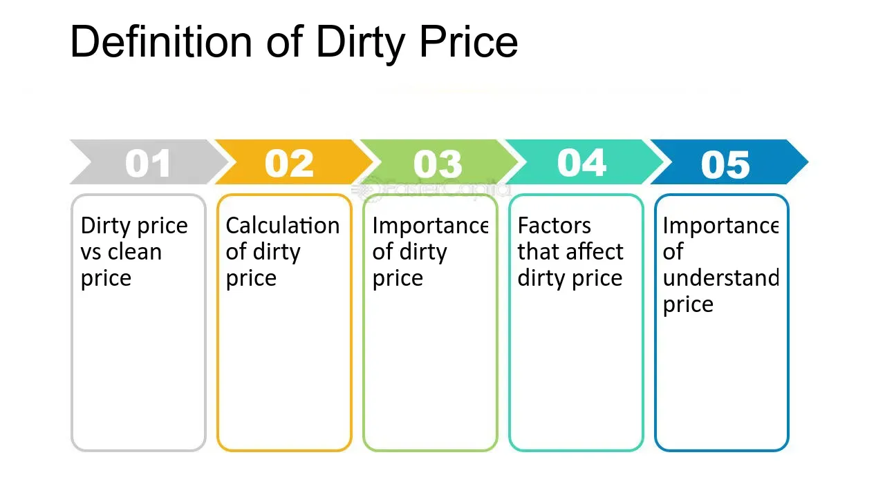

## Table of Contents

## What is a dirty price in the context of bonds?

A dirty price in the context of bonds is the total price that an investor pays to buy a bond. It includes the bond's clean price, which is the market value of the bond itself, plus any accrued interest that has built up since the last coupon payment. The accrued interest is the interest that the bond has earned but hasn't been paid out yet. So, the dirty price gives you the full cost of buying the bond at any given time.

Understanding the dirty price is important because it reflects the actual amount of money you need to pay to purchase the bond. When you buy a bond between coupon payment dates, you need to compensate the seller for the interest they have earned up to that point. This is why the dirty price is higher than the clean price. By knowing the dirty price, investors can make more informed decisions about when and how to buy bonds.

## What is a clean price in the context of bonds?

A clean price in the context of bonds is the price of the bond itself, without any added interest. It's like the base price you see when you look at a bond's value in the market. This price does not include any interest that has built up since the last time the bond paid out its coupon.

When you buy a bond, the clean price helps you understand what the bond is worth on its own. But remember, if you buy the bond between coupon payment dates, you'll also have to pay for the interest that has been earned but not yet paid out. That's why the total price you pay, called the dirty price, will be higher than the clean price.

## How are dirty and clean prices calculated?

The clean price of a bond is the price of the bond without any interest that has built up since the last coupon payment. It's the basic price you see when you look at the bond's value in the market. To find the clean price, you just look at what the bond is trading for at that moment, without adding any extra interest.

The dirty price of a bond is the total price you pay when you buy it, which includes the clean price plus any interest that has built up since the last coupon payment. This interest is called accrued interest. To calculate the dirty price, you add the clean price to the accrued interest. The accrued interest is figured out by calculating how much interest the bond has earned from the last coupon payment date up to the day you buy the bond. So, the dirty price gives you the full cost of buying the bond at any given time.

## Why is it important to understand the difference between dirty and clean prices?

Understanding the difference between dirty and clean prices is important because it helps you know exactly how much you need to pay for a bond. The clean price is just the basic price of the bond itself, without any extra interest. But when you buy a bond, you usually have to pay for the interest that has built up since the last coupon payment, which is called the dirty price. Knowing both prices helps you see the full cost of the bond.

If you only look at the clean price, you might think the bond is cheaper than it really is. But the dirty price tells you the real amount you have to pay, including the interest that has been earned but not yet paid out. This is important for making smart choices about when and how to buy bonds, so you can plan your money better and avoid surprises.

## Can you explain the relationship between accrued interest and dirty price?

Accrued interest is the interest that a bond earns between its coupon payment dates. When you buy a bond, you need to pay for this interest that has built up but hasn't been paid out yet. This extra interest is added to the bond's clean price to make the dirty price. So, the dirty price is the total amount you pay for the bond, including the bond's value and the accrued interest.

The relationship between accrued interest and dirty price is simple: the more accrued interest there is, the higher the dirty price will be. If you buy a bond right after a coupon payment, there won't be much accrued interest, so the dirty price will be close to the clean price. But if you buy it just before the next coupon payment, there will be a lot of accrued interest, making the dirty price much higher than the clean price. Knowing this helps you understand how much you'll actually pay for a bond at any given time.

## How does the timing of bond purchases affect the dirty and clean prices?

The timing of when you buy a bond can change how much you pay for it. If you buy a bond right after it pays its coupon, there won't be much interest that has built up. This means the dirty price, which is the total price you pay including the interest, will be close to the clean price, which is just the bond's value without the interest. So, buying right after a coupon payment can save you money because you won't have to pay for much extra interest.

But if you buy a bond just before the next coupon payment, there will be a lot of interest that has built up. This makes the dirty price much higher than the clean price because you have to pay for all that interest that hasn't been paid out yet. So, the timing of your purchase can make a big difference in the total cost of the bond. Understanding this can help you plan when to buy bonds to get the best deal.

## What are the implications of using dirty price versus clean price for bond valuation?

When you value a bond, using the dirty price gives you the full cost you'll pay to buy it. This includes the bond's value itself, which is the clean price, plus any interest that has built up since the last coupon payment. The dirty price is important because it shows you the real amount you need to spend. If you only look at the clean price, you might think the bond is cheaper than it really is, which could lead to surprises when you actually buy it.

Using the clean price for bond valuation can be useful for comparing different bonds without the extra interest. It helps you see the basic value of the bond itself. But remember, when you buy a bond, you usually have to pay the dirty price, which includes the interest. So, knowing both prices helps you understand the bond's true cost and make better decisions about when to buy and how much to spend.

## How do market conventions affect the reporting of dirty and clean prices?

Market conventions can change how dirty and clean prices are reported. Some markets might show only the clean price because it's easier to compare different bonds without the added interest. This way, investors can see the basic value of the bond. But when it's time to buy, they need to know the dirty price to understand the full cost, including the interest that has built up since the last coupon payment.

In other markets, the dirty price might be the main focus because it shows the exact amount someone will pay for the bond at any given time. This can be helpful for buyers who want to know the total cost upfront. Knowing how these conventions work in different markets helps investors understand bond prices better and make smarter choices about when and where to buy bonds.

## What role do dirty and clean prices play in bond trading strategies?

Dirty and clean prices are important in bond trading strategies because they help traders know exactly how much they will pay for a bond. The clean price is the basic price of the bond without any interest, which makes it easier to compare different bonds. Traders use the clean price to see if a bond is a good deal compared to others. But when it's time to buy, they need to know the dirty price, which includes the interest that has built up since the last coupon payment. This way, they can plan their money better and avoid surprises.

Traders also use the timing of coupon payments to their advantage. If they buy a bond right after a coupon payment, the dirty price will be close to the clean price because there isn't much interest built up yet. This can save them money. But if they buy a bond just before the next coupon payment, the dirty price will be much higher because they have to pay for all the interest that hasn't been paid out yet. Understanding how dirty and clean prices work helps traders make smart choices about when to buy and sell bonds to get the best deals.

## How do changes in interest rates impact the dirty and clean prices of bonds?

When interest rates change, it affects the clean price of bonds. If interest rates go up, the clean price of bonds usually goes down. This is because new bonds will be issued with higher interest rates, making older bonds with lower rates less attractive. So, to sell these older bonds, their price has to drop. On the other hand, if interest rates go down, the clean price of bonds goes up because the older bonds with higher rates become more valuable compared to new bonds with lower rates.

The dirty price of a bond is the clean price plus any interest that has built up since the last coupon payment. When interest rates change, the dirty price changes along with the clean price. If interest rates go up and the clean price drops, the dirty price will also drop, but it will still include the interest that has built up. If interest rates go down and the clean price rises, the dirty price will rise too, still including the interest. So, the dirty price always reflects the full cost of the bond at any given time, even when interest rates change.

## Can you discuss any regulatory considerations related to the use of dirty and clean prices?

Regulatory bodies often have rules about how bond prices should be shown to make sure everyone understands them the same way. Some regulators might say that only the clean price should be shown in certain situations because it's easier to compare different bonds without the added interest. This helps investors see the basic value of the bond. But they also need to know the dirty price to understand the full cost, including the interest that has built up since the last coupon payment.

Different countries might have different rules about how to report these prices. For example, some might require that both the clean and dirty prices are shown clearly so investors know exactly what they're paying. This helps prevent any confusion and makes sure that everyone in the market is working with the same information. Knowing these rules helps investors and traders follow the law and make smart choices about buying and selling bonds.

## How can advanced financial models incorporate both dirty and clean prices for more accurate bond pricing?

Advanced financial models can use both dirty and clean prices to make bond pricing more accurate. These models can look at the clean price to see the basic value of the bond without any interest. Then, they can add in the interest that has built up since the last coupon payment to find the dirty price. This way, the model can show the full cost of the bond at any time. By doing this, the model can help investors see how much they will really pay and make better choices about when to buy or sell bonds.

These models also take into account how interest rates might change and how that affects both the clean and dirty prices. If interest rates go up, the clean price might drop, and the model can show how that changes the dirty price too. If interest rates go down, the clean price might rise, and the model can show how the dirty price goes up as well. By including both prices, the model gives a complete picture of the bond's value, helping investors plan their money better and avoid surprises.

## What is the difference between Clean Price and Dirty Price?

A clean price is the quoted value of a bond that excludes any interest accrued since the last coupon payment. It represents the base price of the bond without accounting for any interim interest accumulation. This price metric is particularly significant for investors as it provides a standardized way to compare the intrinsic value of different bonds without the distortion caused by differing payment schedules.

Conversely, a dirty price includes the accrued interest up to the bond's settlement date, which is added to the clean price. This comprehensive price reflects the total amount a buyer would pay if purchasing the bond on the open market. The accrued interest is calculated from the last coupon payment date to the settlement date, thus the dirty price accounts for both the clean price and this accrued amount.

Mathematically, the relationship between clean and dirty prices can be expressed as:

$$

\text{Dirty Price} = \text{Clean Price} + \text{Accrued Interest}
$$

Accrued interest can be calculated using the formula:

$$

\text{Accrued Interest} = \frac{\text{Coupon Rate} \times \text{Par Value}}{\text{Number of Periods per Year}} \times \frac{\text{Days Since Last Coupon Payment}}{\text{Days in Coupon Period}}
$$

For example, in Python this can be computed as follows:

```python
def calculate_accrued_interest(coupon_rate, par_value, periods_per_year, days_since_last_payment, days_in_period):
    return (coupon_rate * par_value / periods_per_year) * (days_since_last_payment / days_in_period)

def calculate_dirty_price(clean_price, accrued_interest):
    return clean_price + accrued_interest

# Example values
coupon_rate = 0.05  # 5% annual coupon rate
par_value = 1000  # $1000 par value
periods_per_year = 2  # Semi-annual payments
days_since_last_payment = 45
days_in_period = 182
clean_price = 980

accrued_interest = calculate_accrued_interest(coupon_rate, par_value, periods_per_year, days_since_last_payment, days_in_period)
dirty_price = calculate_dirty_price(clean_price, accrued_interest)

print("Accrued Interest:", accrued_interest)
print("Dirty Price:", dirty_price)
```

Accurate clean and dirty pricing is essential for determining the actual transaction costs in the bond market. This distinction ensures that both buyers and sellers are clear about the amount payable, preventing misunderstandings and ensuring a smoother trading process. Understanding these prices is a fundamental aspect of bond trading, influencing both investment decisions and the structuring of financial strategies.

## What is the importance of accrued interest?

Accrued interest is the interest that accumulates on a bond since its last coupon payment. This interest represents the amount an investor would earn, or a seller would owe, if the bond is sold before the next coupon payment. The calculation of accrued interest is critical because it bridges the gap between the clean price, which excludes this interest, and the dirty price, the actual transaction price that includes it.

Mathematically, accrued interest can be calculated using the following formula:

$$

\text{Accrued Interest} = \frac{\text{Number of days since last coupon payment}}{\text{Days in coupon period}} \times \text{Coupon payment}
$$

Consider a bond with an annual 5% coupon rate and a face value of $1,000, with semi-annual payments. If 90 days have passed since the last coupon payment in a 180-day period, the accrued interest would be:

$$

\text{Accrued Interest} = \frac{90}{180} \times \left(0.05 \times 1000\right) = 0.5 \times 50 = 25
$$

Understanding this calculation is vital for bond market participants because accrued interest affects the true price paid by a buyer. While the clean price provides a simplified bond valuation, it does not fully represent what a buyer ultimately pays, especially when transactions are off-cycle from coupon dates.

Accrued interest also allows for fair transactions by ensuring that the seller receives compensation for the interest earned since the last coupon payment. This compensation is particularly relevant in long-term bonds, where the time between coupon payments can lead to significant interest accumulation. Mastering the nuances of accrued interest is thus essential for grasping dirty pricing, where the clean price is adjusted to reflect these accrued costs.

## What is the impact on bond valuation and trading?

The distinction between clean and dirty prices significantly influences the perceived value of bonds during trading activities. The clean price, devoid of any accrued interest, allows traders to evaluate the intrinsic value of the bond without the complication of pending interest amounts. Conversely, the dirty price provides the complete picture by incorporating accrued interest, reflecting the total cost necessary for acquisition. This distinction is pivotal during trading, as it affects investors' evaluations of whether a bond is priced favorably or not.

Algorithmic trading systems are integral to modern trading, leveraging these distinctions to maximize returns. By integrating real-time data on both clean and dirty prices, algorithms can make informed decisions promptly. This capability is particularly crucial in the bond market, where price discrepancies often exist due to [interest rate](/wiki/interest-rate-trading-strategies) changes and other market dynamics. For instance, an algorithm can be programmed to scan the markets for bonds trading below their expected dirty prices, factoring in the accrued interest, and execute trades automatically. This ensures that trading decisions are not only swift but optimized for maximum profitability.

Traders can exploit variations between clean and dirty pricing by focusing on accrued interest through sophisticated algorithmic models. These models can incorporate several variables, such as interest rate trends, coupon payment schedules, and settlement dates, to accurately calculate expected bond values. The formula for dirty price is typically:

$$
\text{Dirty Price} = \text{Clean Price} + \text{Accrued Interest}
$$

where the accrued interest can be calculated as:

$$
\text{Accrued Interest} = \frac{\text{Coupon Rate} \times \text{Days Since Last Payment}}{\text{Days in Coupon Period}}
$$

In practice, traders might use Python to automate these calculations, continuously inputting market data to update valuations:

```python
def calculate_accrued_interest(coupon_rate, days_since_last_payment, days_in_coupon_period):
    return (coupon_rate * days_since_last_payment) / days_in_coupon_period

def calculate_dirty_price(clean_price, accrued_interest):
    return clean_price + accrued_interest

# Example usage
coupon_rate = 0.05
days_since_last_payment = 30
days_in_coupon_period = 182
clean_price = 1000

accrued_interest = calculate_accrued_interest(coupon_rate, days_since_last_payment, days_in_coupon_period)
dirty_price = calculate_dirty_price(clean_price, accrued_interest)
```

Such calculations and algorithms are essential in exploiting the differences between clean and dirty prices, ensuring that traders gain a competitive edge in the market. By optimizing the timing and execution of trades based on these pricing distinctions, traders can significantly enhance their return on investment. As technology continues to evolve, the integration of clean and dirty pricing into algorithmic models will likely expand, providing even greater precision and efficiency in bond trading.

## What is the relationship between Algorithmic Trading and Bond Pricing?

Algorithmic trading, commonly referred to as algo trading, revolutionizes bond markets by leveraging distinctions between clean and dirty prices to enhance decision-making. These automated trading systems utilize real-time price data to execute trades, thus optimizing investment strategies. Clean prices, which exclude accrued interest, and dirty prices, which include it, provide critical inputs in the construction of trading algorithms.

The process begins with the integration of real-time market data. Algorithms systematically analyze this data, distinguishing between clean and dirty prices, to evaluate bonds' intrinsic and transactional values. Since accrued interest can significantly affect the total payable amount, accounting for it is crucial in yielding precise transaction values through dirty pricing. This distinction allows traders to act swiftly, ensuring that no [arbitrage](/wiki/arbitrage) opportunities are missed due to delayed action.

For example, consider an algorithm designed to trade bonds based on yield differentials. It continuously monitors the clean prices to assess the fundamental value, then calculates the dirty price by adding the accrued interest:

$$
\text{Dirty Price} = \text{Clean Price} + \text{Accrued Interest}
$$

The precise calculation of dirty prices is vital, as even minor inaccuracies can lead to substantial financial implications, especially in high-[volume](/wiki/volume-trading-strategy) trading environments. Python plays a pivotal role in implementing these trading strategies due to its robust libraries and analytic capabilities. Below is a simple Python code snippet demonstrating how an algorithm might calculate the dirty price:

```python
def calculate_dirty_price(clean_price, annual_coupon_rate, days_since_last_coupon, days_in_coupon_period):
    accrued_interest = (annual_coupon_rate / periods_per_year) * (days_since_last_coupon / days_in_coupon_period)
    dirty_price = clean_price + accrued_interest
    return dirty_price

clean_price = 950  # Example clean price
annual_coupon_rate = 0.06  # 6% coupon rate
days_since_last_coupon = 90  # Days since last payment
days_in_coupon_period = 180  # Assuming semi-annual payments

dirty_price = calculate_dirty_price(clean_price, annual_coupon_rate, days_since_last_coupon, days_in_coupon_period)
print(f"The dirty price is: {dirty_price}")
```

Such dynamic capabilities allow [algorithmic trading](/wiki/algorithmic-trading) systems to maintain a competitive edge. By capturing market nuances through precise calculations, traders develop more refined strategies, contributing to higher potential returns and optimized risk management. This adaptability underscores the importance of integrating clean and dirty prices into algorithmic frameworks, ensuring responses that are both timely and accurate in the bond markets.

## References & Further Reading

[1]: Fabozzi, F. J. (2007). ["Fixed Income Analysis."](https://books.google.com/books/about/Fixed_Income_Analysis.html?id=lujLawVLS3YC) John Wiley & Sons.

[2]: Hull, J. C. (2012). ["Options, Futures, and Other Derivatives."](https://www.semanticscholar.org/paper/Options%2C-Futures%2C-and-Other-Derivatives-Hull/89bdee500c8623864fc9eb7a471546aa713acc44) Pearson Education.

[3]: Das, S. R. (2006). ["Credit Derivatives, CDOs, and Structured Credit Products."](https://books.google.com/books/about/Credit_derivatives.html?id=NmpaAAAAYAAJ) John Wiley & Sons.

[4]: ["Inside the Black Box: A Simple Guide to Quantitative and High-Frequency Trading"](https://www.amazon.com/Inside-Black-Box-Quantitative-Frequency/dp/1118362411) by Rishi K. Narang

[5]: ["Modern Portfolio Theory and Investment Analysis"](https://books.google.com/books/about/Modern_Portfolio_Theory_and_Investment_A.html?id=181CEAAAQBAJ) by Edwin J. Elton, Martin J. Gruber, Stephen J. Brown, and William N. Goetzmann.