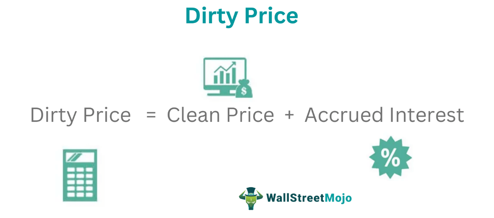

Understanding bond pricing is essential for both investors and traders. Bonds, as fixed-income securities, play a critical role in diversifying investment portfolios and managing risk. However, navigating the bond market requires familiarity with specific terminologies, particularly 'clean price' and 'dirty price'. These terms are pivotal in determining a bond's actual purchase cost and influence how transactions are executed in the market.

The clean price of a bond is the quoted amount excluding any accrued interest, providing a base valuation. In contrast, the dirty price includes accrued interest up to the settlement date, reflecting the total cost to acquire the bond. This distinction is not merely academic but affects the actual cash flow transactions involved in buying and selling bonds.



In recent years, algorithmic trading has become increasingly prevalent in the bond market, leveraging the nuances of clean and dirty pricing. These automated systems use sophisticated algorithms to analyze real-time market data, optimizing the buying and selling process to maximize returns. By incorporating both clean and dirty prices, algorithmic models can make precise trading decisions that account for the impact of accrued interest.

This article examines the definitions and differences between clean and dirty prices and their implications for algorithmic trading. Understanding these concepts is crucial for investors and traders seeking to operate effectively in the bond market. As technology continues to advance, the ability to accurately interpret and use these price types can provide a significant advantage in the dynamic landscape of financial markets.

## Table of Contents

## Understanding Clean Price and Dirty Price

A clean price is the quoted value of a bond that excludes any interest accrued since the last coupon payment. It represents the base price of the bond without accounting for any interim interest accumulation. This price metric is particularly significant for investors as it provides a standardized way to compare the intrinsic value of different bonds without the distortion caused by differing payment schedules.

Conversely, a dirty price includes the accrued interest up to the bond's settlement date, which is added to the clean price. This comprehensive price reflects the total amount a buyer would pay if purchasing the bond on the open market. The accrued interest is calculated from the last coupon payment date to the settlement date, thus the dirty price accounts for both the clean price and this accrued amount.

Mathematically, the relationship between clean and dirty prices can be expressed as:

$$

\text{Dirty Price} = \text{Clean Price} + \text{Accrued Interest}
$$

Accrued interest can be calculated using the formula:

$$

\text{Accrued Interest} = \frac{\text{Coupon Rate} \times \text{Par Value}}{\text{Number of Periods per Year}} \times \frac{\text{Days Since Last Coupon Payment}}{\text{Days in Coupon Period}}
$$

For example, in Python this can be computed as follows:

```python
def calculate_accrued_interest(coupon_rate, par_value, periods_per_year, days_since_last_payment, days_in_period):
    return (coupon_rate * par_value / periods_per_year) * (days_since_last_payment / days_in_period)

def calculate_dirty_price(clean_price, accrued_interest):
    return clean_price + accrued_interest

# Example values
coupon_rate = 0.05  # 5% annual coupon rate
par_value = 1000  # $1000 par value
periods_per_year = 2  # Semi-annual payments
days_since_last_payment = 45
days_in_period = 182
clean_price = 980

accrued_interest = calculate_accrued_interest(coupon_rate, par_value, periods_per_year, days_since_last_payment, days_in_period)
dirty_price = calculate_dirty_price(clean_price, accrued_interest)

print("Accrued Interest:", accrued_interest)
print("Dirty Price:", dirty_price)
```

Accurate clean and dirty pricing is essential for determining the actual transaction costs in the bond market. This distinction ensures that both buyers and sellers are clear about the amount payable, preventing misunderstandings and ensuring a smoother trading process. Understanding these prices is a fundamental aspect of bond trading, influencing both investment decisions and the structuring of financial strategies.

## Importance of Accrued Interest

Accrued interest is the interest that accumulates on a bond since its last coupon payment. This interest represents the amount an investor would earn, or a seller would owe, if the bond is sold before the next coupon payment. The calculation of accrued interest is critical because it bridges the gap between the clean price, which excludes this interest, and the dirty price, the actual transaction price that includes it.

Mathematically, accrued interest can be calculated using the following formula:

$$

\text{Accrued Interest} = \frac{\text{Number of days since last coupon payment}}{\text{Days in coupon period}} \times \text{Coupon payment}
$$

Consider a bond with an annual 5% coupon rate and a face value of $1,000, with semi-annual payments. If 90 days have passed since the last coupon payment in a 180-day period, the accrued interest would be:

$$

\text{Accrued Interest} = \frac{90}{180} \times \left(0.05 \times 1000\right) = 0.5 \times 50 = 25
$$

Understanding this calculation is vital for bond market participants because accrued interest affects the true price paid by a buyer. While the clean price provides a simplified bond valuation, it does not fully represent what a buyer ultimately pays, especially when transactions are off-cycle from coupon dates.

Accrued interest also allows for fair transactions by ensuring that the seller receives compensation for the interest earned since the last coupon payment. This compensation is particularly relevant in long-term bonds, where the time between coupon payments can lead to significant interest accumulation. Mastering the nuances of accrued interest is thus essential for grasping dirty pricing, where the clean price is adjusted to reflect these accrued costs.

## Comparison: Clean Price vs Dirty Price

The clean price of a bond refers to its quoted market price, excluding any accumulated interest since the last coupon payment. This method of presenting bond prices is prevalent in the United States, where investors and traders focus on the bond's value without the influence of accrued interest. The exclusion of interest in the clean price provides a simplified representation, which can be particularly useful for making a quick comparative analysis of bond valuations across different securities.

Conversely, in European markets, the dirty price is the standard for bond quotations. The dirty price includes both the clean price and the accrued interest. This comprehensive representation gives a clearer picture of the actual transaction cost for the buyer, reflecting the amount payable upon settlement. The dirty price ensures that all interest-related considerations are factored into the bond's price, making it particularly valuable for investors looking to understand the full financial implications of their transactions.

Understanding the distinction between clean and dirty prices is vital for navigating international bond markets. The clean price allows investors to evaluate the bond's intrinsic value free from interim interest; however, it does not represent the amount payable, which can lead to misunderstandings if not properly accounted for. On the other hand, the dirty price provides a more complete financial picture, which is crucial for precise accounting and cash flow management.

For investors and traders aiming to operate in both the U.S. and European markets, it is essential to recognize the impact of these pricing methodologies on earnings calculations, transaction costs, and investment yield analysis. Lack of clarity between clean and dirty prices can lead to mispricing and suboptimal trading strategies, thus understanding these terms allows for more informed decision-making and effective market participation.

## Impact on Bond Valuation and Trading

The distinction between clean and dirty prices significantly influences the perceived value of bonds during trading activities. The clean price, devoid of any accrued interest, allows traders to evaluate the intrinsic value of the bond without the complication of pending interest amounts. Conversely, the dirty price provides the complete picture by incorporating accrued interest, reflecting the total cost necessary for acquisition. This distinction is pivotal during trading, as it affects investors' evaluations of whether a bond is priced favorably or not.

Algorithmic trading systems are integral to modern trading, leveraging these distinctions to maximize returns. By integrating real-time data on both clean and dirty prices, algorithms can make informed decisions promptly. This capability is particularly crucial in the bond market, where price discrepancies often exist due to [interest rate](/wiki/interest-rate-trading-strategies) changes and other market dynamics. For instance, an algorithm can be programmed to scan the markets for bonds trading below their expected dirty prices, factoring in the accrued interest, and execute trades automatically. This ensures that trading decisions are not only swift but optimized for maximum profitability.

Traders can exploit variations between clean and dirty pricing by focusing on accrued interest through sophisticated algorithmic models. These models can incorporate several variables, such as interest rate trends, coupon payment schedules, and settlement dates, to accurately calculate expected bond values. The formula for dirty price is typically:

$$
\text{Dirty Price} = \text{Clean Price} + \text{Accrued Interest}
$$

where the accrued interest can be calculated as:

$$
\text{Accrued Interest} = \frac{\text{Coupon Rate} \times \text{Days Since Last Payment}}{\text{Days in Coupon Period}}
$$

In practice, traders might use Python to automate these calculations, continuously inputting market data to update valuations:

```python
def calculate_accrued_interest(coupon_rate, days_since_last_payment, days_in_coupon_period):
    return (coupon_rate * days_since_last_payment) / days_in_coupon_period

def calculate_dirty_price(clean_price, accrued_interest):
    return clean_price + accrued_interest

# Example usage
coupon_rate = 0.05
days_since_last_payment = 30
days_in_coupon_period = 182
clean_price = 1000

accrued_interest = calculate_accrued_interest(coupon_rate, days_since_last_payment, days_in_coupon_period)
dirty_price = calculate_dirty_price(clean_price, accrued_interest)
```

Such calculations and algorithms are essential in exploiting the differences between clean and dirty prices, ensuring that traders gain a competitive edge in the market. By optimizing the timing and execution of trades based on these pricing distinctions, traders can significantly enhance their return on investment. As technology continues to evolve, the integration of clean and dirty pricing into algorithmic models will likely expand, providing even greater precision and efficiency in bond trading.

## Algorithmic Trading and Bond Pricing

Algorithmic trading, commonly referred to as algo trading, revolutionizes bond markets by leveraging distinctions between clean and dirty prices to enhance decision-making. These automated trading systems utilize real-time price data to execute trades, thus optimizing investment strategies. Clean prices, which exclude accrued interest, and dirty prices, which include it, provide critical inputs in the construction of trading algorithms.

The process begins with the integration of real-time market data. Algorithms systematically analyze this data, distinguishing between clean and dirty prices, to evaluate bonds' intrinsic and transactional values. Since accrued interest can significantly affect the total payable amount, accounting for it is crucial in yielding precise transaction values through dirty pricing. This distinction allows traders to act swiftly, ensuring that no [arbitrage](/wiki/arbitrage) opportunities are missed due to delayed action.

For example, consider an algorithm designed to trade bonds based on yield differentials. It continuously monitors the clean prices to assess the fundamental value, then calculates the dirty price by adding the accrued interest:

$$
\text{Dirty Price} = \text{Clean Price} + \text{Accrued Interest}
$$

The precise calculation of dirty prices is vital, as even minor inaccuracies can lead to substantial financial implications, especially in high-[volume](/wiki/volume-trading-strategy) trading environments. Python plays a pivotal role in implementing these trading strategies due to its robust libraries and analytic capabilities. Below is a simple Python code snippet demonstrating how an algorithm might calculate the dirty price:

```python
def calculate_dirty_price(clean_price, annual_coupon_rate, days_since_last_coupon, days_in_coupon_period):
    accrued_interest = (annual_coupon_rate / periods_per_year) * (days_since_last_coupon / days_in_coupon_period)
    dirty_price = clean_price + accrued_interest
    return dirty_price

clean_price = 950  # Example clean price
annual_coupon_rate = 0.06  # 6% coupon rate
days_since_last_coupon = 90  # Days since last payment
days_in_coupon_period = 180  # Assuming semi-annual payments

dirty_price = calculate_dirty_price(clean_price, annual_coupon_rate, days_since_last_coupon, days_in_coupon_period)
print(f"The dirty price is: {dirty_price}")
```

Such dynamic capabilities allow [algorithmic trading](/wiki/algorithmic-trading) systems to maintain a competitive edge. By capturing market nuances through precise calculations, traders develop more refined strategies, contributing to higher potential returns and optimized risk management. This adaptability underscores the importance of integrating clean and dirty prices into algorithmic frameworks, ensuring responses that are both timely and accurate in the bond markets.

## Conclusion

Understanding clean and dirty prices is crucial for anyone involved in bond trading, as these concepts significantly influence transaction costs and perceived bond valuations. The clean price, devoid of accrued interest, presents a simplified outlook on a bond's value, while the dirty price offers a comprehensive perspective by incorporating accrued interest. This distinction is particularly vital for algorithmic trading systems, which capitalize on differences between clean and dirty pricing to enhance trading strategies and decision-making processes. 

By utilizing real-time data and accounting for accrued interest, algorithmic trading models can execute trades with greater precision. This integration not only ensures accurate valuation but also facilitates swift responses to market changes, thereby potentially maximizing returns. As technology continues to advance, the ability to dynamically process clean and dirty prices presents traders with a significant competitive advantage. The clarity these price types bring can lead to more informed investment decisions, promoting efficiency and profitability in financial markets. Consequently, investors and traders equipped with an understanding of these pricing dynamics can better navigate the complexities of the bond market.

## References & Further Reading

[1]: Fabozzi, F. J. (2007). ["Fixed Income Analysis."](https://books.google.com/books/about/Fixed_Income_Analysis.html?id=lujLawVLS3YC) John Wiley & Sons.

[2]: Hull, J. C. (2012). ["Options, Futures, and Other Derivatives."](https://www.semanticscholar.org/paper/Options%2C-Futures%2C-and-Other-Derivatives-Hull/89bdee500c8623864fc9eb7a471546aa713acc44) Pearson Education.

[3]: Das, S. R. (2006). ["Credit Derivatives, CDOs, and Structured Credit Products."](https://books.google.com/books/about/Credit_derivatives.html?id=NmpaAAAAYAAJ) John Wiley & Sons.

[4]: ["Inside the Black Box: A Simple Guide to Quantitative and High-Frequency Trading"](https://www.amazon.com/Inside-Black-Box-Quantitative-Frequency/dp/1118362411) by Rishi K. Narang

[5]: ["Modern Portfolio Theory and Investment Analysis"](https://books.google.com/books/about/Modern_Portfolio_Theory_and_Investment_A.html?id=181CEAAAQBAJ) by Edwin J. Elton, Martin J. Gruber, Stephen J. Brown, and William N. Goetzmann.