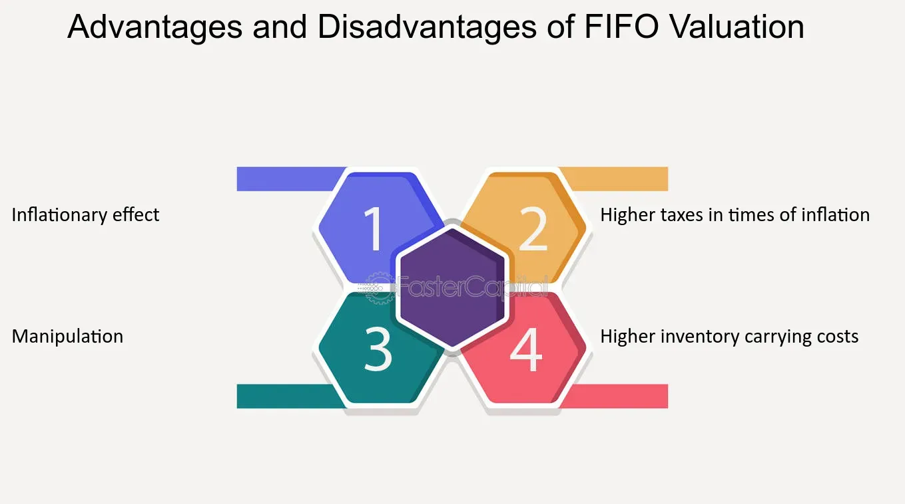

## Table of Contents

## What is the FIFO accounting method?

The FIFO accounting method stands for "First In, First Out." It's a way to keep track of inventory and costs. Imagine you have a store and you buy items to sell. With FIFO, you sell the oldest items first. So, if you bought some products a month ago and then bought more of the same product last week, you would sell the ones from a month ago before selling the ones from last week.

This method is useful because it matches the flow of goods in many businesses. For example, in a grocery store, you want to sell the oldest milk first so it doesn't spoil. Using FIFO can also help keep your costs more predictable because you're using the costs of the older inventory first. This can be important for financial reporting and tax purposes.

## How does FIFO differ from other inventory valuation methods like LIFO and weighted average?

FIFO, or "First In, First Out," means you sell the oldest items in your inventory first. This is like a grocery store where you want to sell the oldest milk before it goes bad. When you use FIFO, you use the cost of the oldest items to figure out your cost of goods sold. This can be good for businesses because it keeps costs predictable and matches how many businesses work.

LIFO, or "Last In, First Out," is the opposite. With LIFO, you sell the newest items first. Imagine if you bought some new toys last week and older toys a month ago, you'd sell the new toys before the old ones. This method can be useful for tax purposes because if prices are going up, you're using the higher costs of the newer items to figure out your costs, which can lower your taxable income.

The weighted average method is different because it doesn't matter when you bought the items. Instead, you take the average cost of all the items in your inventory. So, if you bought some items at different prices, you add up all the costs and divide by the number of items to get an average cost. This method can be simpler to use because you don't have to keep track of which items you bought when, but it might not reflect the actual flow of goods in your business as well as FIFO or LIFO.

## What are the basic disadvantages of using the FIFO method for a small business?

Using the FIFO method can sometimes be a problem for small businesses. One issue is that if prices are going up, FIFO can make your profits look bigger than they really are. This is because you're selling the older, cheaper items first, which means your costs are lower. But when you go to buy more inventory, you might have to pay more because prices have gone up. This can make it harder to plan your budget and might surprise you with higher costs than you expected.

Another disadvantage is that FIFO might not be the best choice for tax purposes. If prices are rising, using LIFO could lower your taxable income because you're using the newer, more expensive costs to figure out your costs of goods sold. With FIFO, you're using the older, cheaper costs, which means you might end up paying more in taxes. For a small business, every bit of savings on taxes can make a big difference, so this is something to think about when choosing an inventory method.

## Can FIFO lead to higher tax liabilities during periods of inflation?

Yes, FIFO can lead to higher tax liabilities during periods of inflation. When prices are going up, FIFO means you're selling the older, cheaper items first. This makes your cost of goods sold lower because you're using the old, lower prices to figure out your costs. When your costs are lower, your profits look bigger. And when your profits are bigger, you might have to pay more in taxes.

For a small business, this can be a problem. If you're using FIFO and prices are rising, you could end up with a bigger tax bill than if you used a method like LIFO. LIFO would let you use the newer, higher prices to figure out your costs, which would make your profits look smaller and lower your taxes. So, during inflation, choosing FIFO might mean you pay more in taxes, which can be tough for a small business trying to manage its money.

## How does FIFO impact the cost of goods sold (COGS) and gross margin?

When you use the FIFO method, it affects how you figure out the cost of goods sold (COGS) and your gross margin. With FIFO, you sell the oldest items first. So, if prices are going up, you're using the older, lower costs to figure out your COGS. This means your COGS will be lower than if you used a method like LIFO, where you'd use the newer, higher costs. A lower COGS means your profits look bigger because you're not spending as much on the goods you're selling.

This bigger profit also means your gross margin, which is your sales minus COGS, will be higher with FIFO. A higher gross margin can make your business look more profitable on paper. But remember, if you need to buy more inventory, you'll have to pay the newer, higher prices. So, while FIFO can make your gross margin look good now, it might not reflect the real costs you'll face later when you need to restock.

## In what ways can FIFO distort a company's financial health on the balance sheet?

Using FIFO can make a company's inventory on the balance sheet look different than it really is, especially during inflation. With FIFO, you count the newest items you bought at the highest prices as your inventory. So, if prices are going up, your inventory value on the balance sheet will be higher than if you used a method like LIFO, where you'd count the older, cheaper items. This higher inventory value can make your company look more valuable than it might be if you had to sell all your inventory at today's higher prices.

This difference in inventory value can also affect other parts of the balance sheet. For example, if your inventory value is higher, your total assets will be higher too. This might make your company look financially healthier than it really is. But if you need to sell your inventory quickly, you might not get as much money as the balance sheet suggests because you'd have to sell at current prices, not the older, lower prices you used for FIFO. So, while FIFO can make your balance sheet look good, it might not show the real financial health of your business.

## How might FIFO affect inventory management and purchasing decisions?

Using FIFO can change how a business manages its inventory and makes buying decisions. With FIFO, you sell the oldest items first, which means you need to keep a close eye on your stock to make sure the old items don't sit around too long. If you're not careful, you might end up with old inventory that's hard to sell, especially if it's perishable or if styles change quickly. So, you might need to buy new stock more often to keep things fresh and moving.

FIFO can also affect how you decide when and how much to buy. Since you're selling the oldest items first, you need to think about how quickly prices are changing. If prices are going up, you might want to buy more inventory now to lock in lower costs before they rise even more. But if you buy too much, you could end up with a lot of money tied up in inventory that's just sitting there. So, using FIFO means you need to balance buying enough to keep your stock fresh, but not so much that it hurts your cash flow.

## What are the implications of using FIFO in industries with volatile pricing?

Using FIFO in industries where prices change a lot can be tricky. If prices go up and down a lot, FIFO means you're selling the oldest items first, using the old prices to figure out your costs. When prices are going up, this can make your profits look bigger because you're using the lower, old prices. But if prices suddenly drop, you might still be selling items at the old, higher prices, which can make your costs look too high and your profits too low.

This can make it hard to plan your buying and selling. If you know prices are going to go up, you might want to buy a lot now to lock in the lower prices. But if prices drop after you've bought a lot, you could be stuck with inventory that's worth less than what you paid for it. So, in industries with volatile pricing, using FIFO means you need to be really good at guessing how prices will change and planning your inventory and buying decisions carefully.

## How does FIFO compliance with international accounting standards affect global businesses?

Using FIFO can be good for global businesses because it fits well with international accounting rules. Many countries follow rules like the International Financial Reporting Standards (IFRS), which allow FIFO. This means a company can use the same way of keeping track of inventory everywhere it does business, making it easier to compare numbers and report to people around the world. It's simpler to manage and understand the business's money when everyone is using the same method.

But, not all countries use the same rules. For example, the United States allows another method called LIFO, which FIFO users can't use. If a global business uses FIFO, it might have to explain why it's not using LIFO in the U.S., which can be tricky. Also, if the business wants to change to LIFO later, it's hard to switch because it changes how past numbers look. So, while FIFO helps with following international rules, it can still make things complicated when dealing with different countries' rules.

## What are the potential misalignments between FIFO and actual physical flow of inventory?

Sometimes, using FIFO might not match how the actual stuff in your store moves around. Imagine you have a shop where people always take the newest items from the front of the shelf. Even though you're using FIFO for your money records, the real stuff might not be sold in that order. This can cause a problem because what you see on your [books](/wiki/algo-trading-books) might not be what's really happening in your store.

This mismatch can make it hard to know how much of your stuff is really old and might need to be sold quickly or thrown away. If you're using FIFO but people are taking the newest items, you might think you're selling old stuff when you're not. This can lead to surprises when you find out some of your inventory is older than you thought, and you might have to deal with it quickly to avoid losing money.

## How can FIFO lead to obsolescence issues in inventory?

When you use FIFO, you sell the oldest items first. This can be a problem if your products can get old or out of style quickly. Imagine you have a store that sells electronics. If you keep using FIFO, you might end up with a lot of old phones or computers that nobody wants to buy anymore. These old items take up space and can lose value fast, which means you might have to sell them for less money or even throw them away.

To avoid this, you need to keep a close eye on your inventory. If you see that some items are getting old and might become obsolete, you might need to put them on sale or find other ways to get rid of them quickly. Using FIFO means you need to be smart about how you manage your stock so you don't end up with a lot of stuff that's hard to sell.

## What advanced strategies can be used to mitigate the disadvantages of FIFO in complex supply chain environments?

In complex supply chain environments, businesses can use advanced strategies to deal with the downsides of using FIFO. One strategy is to use better inventory tracking systems. These systems can help you see which items are getting old and might become hard to sell. With this information, you can make smart choices about when to put items on sale or move them to different stores where they might sell better. Another strategy is to use something called "just-in-time" inventory. This means you try to buy and receive new stock just when you need it, so you don't end up with a lot of old stuff sitting around.

Another way to handle FIFO's challenges is to use data analytics to predict how demand for your products might change. If you can guess what people will want to buy in the future, you can adjust how much you buy and when. This can help you avoid buying too much of things that might go out of style or become obsolete. Also, working closely with your suppliers can help. If you can talk to them about what you need and when, they might be able to help you get the right amount of stock at the right time, which can make FIFO work better for your business.

## What is FIFO in Accounting and How is it Understood?

The First-In, First-Out (FIFO) method is a commonly used accounting technique for inventory valuation, where the oldest inventory items are recorded as sold first. This approach is particularly popular because it aligns with the natural flow of inventory, assuming that businesses generally sell their oldest products before the newer ones. This natural alignment reduces the complexity involved in inventory management, making the method straightforward and easy to implement.

The calculation of the cost of goods sold (COGS) using FIFO involves taking the cost of the oldest inventory items available at the time of sale. Consequently, the ending inventory is valued at the more recent purchase costs. For example, consider a company with the following inventory purchase history:

- 100 units purchased at $10 per unit,
- 100 units purchased at $12 per unit.

If the company sells 150 units, the COGS under FIFO would be calculated as follows:

$$
\text{COGS} = (100 \times \$10) + (50 \times \$12) = \$1700.
$$

Here, the remaining inventory would be valued at $12 per unit, reflecting the most recent purchase price.

One of the primary advantages of FIFO is its ability to estimate the current market value of ending inventory. By valuing the remaining inventory at the latest costs, FIFO ensures that the inventory valuation on the balance sheet is closer to contemporary market prices, a significant consideration for accurate financial reporting. This attribute is particularly beneficial in stable or non-inflationary environments, where older costs do not significantly differ from current prices.

The clarity and simplicity offered by FIFO, alongside its ability to approximate current market conditions for inventory valuation, contribute to its widespread adoption among businesses. However, it is crucial to consider the potential limitations and disadvantages of FIFO, especially in contexts characterized by fluctuating prices or inflation, where its alignment with historical costs could lead to overstated profits and consequently influence taxation and financial statement presentations.

## What are the disadvantages of FIFO in accounting?

In accounting, the FIFO (First-In, First-Out) inventory management method can present several disadvantages, particularly during periods of inflation. One significant issue is the overstatement of profits. Under FIFO, the cost of goods sold (COGS) is calculated using the oldest inventory costs. During inflation, these older inventory costs are typically lower than current prices. As a result, the COGS recorded are lower, leading to inflated gross profits on the income statement. For example, consider a scenario in which a company sells 100 units priced at $15 each, but the units were purchased at an older price of $10 each:

$$
\text{Gross Profit} = (\text{Selling Price} - \text{Old Cost Price}) \times \text{Units Sold} = (15 - 10) \times 100 = 500
$$

This inflated gross profit results in a higher taxable income, which consequently increases the tax burden. Companies may face higher tax liabilities than they would under other inventory valuation methods like LIFO (Last-In, First-Out), where more recent, higher costs are matched with current revenues. This can strain cash flow, particularly in businesses with tight margins.

Moreover, FIFO does not reflect current market conditions accurately, which can lead to distorted financial statements. In hyperinflationary or rapidly fluctuating markets, the disparity between inventory costs and current market values broadens. This discrepancy reduces the accuracy of the financial portrayals, potentially misleading stakeholders about the company’s actual financial health and making it difficult for investors and analysts to make informed decisions.

Finally, FIFO can complicate financial analysis due to the uneven matching of costs and revenues over different accounting periods. As inventory purchased in various timeframes is sold at differing prices, the resulting profits do not align accurately with current economic conditions. This mismatch complicates financial forecasting and may lead to misguided strategic decisions. The inconsistencies introduced by FIFO can obscure performance assessments and hamper effective financial planning, especially when prices are volatile.

## What are the advantages and trade-offs when comparing FIFO and LIFO?

LIFO (Last-In, First-Out) is an accounting method used as an alternative to FIFO for inventory valuation. As opposed to FIFO, where the oldest inventory costs are recorded first when calculating the cost of goods sold (COGS), LIFO records the costs of the most recently acquired inventory items first. This distinction becomes particularly significant in environments with fluctuating or rising inventory costs.

### Scenarios Favoring LIFO

Businesses operating in sectors where inventory costs are rapidly rising or highly volatile might find LIFO advantageous. Under LIFO, the latest inventory, often purchased at higher prices due to inflation or market conditions, is used to calculate COGS. This approach can better match current revenue with current costs, reflecting a more accurate profit picture in times of increasing prices.

### Tax Advantages

A significant advantage of LIFO relates to tax benefits. By using the latest, higher-cost inventory to calculate COGS, the taxable income is typically lower than under FIFO, as shown in this equation:

$$
\text{Taxable Income}_{LIFO} = \text{Revenue} - \text{COGS}_{LIFO}
$$

Here, $\text{COGS}_{LIFO}$ generally results in a reduced taxable income compared to $\text{COGS}_{FIFO}$, due to the higher cost base, thereby decreasing the business's tax liability. 

### Limitations and Disadvantages of LIFO

Despite its benefits, LIFO comes with regulatory and operational challenges. One major disadvantage is its complexity in compliance and reporting, especially as LIFO is not permitted under the International Financial Reporting Standards (IFRS), restricting its use primarily to the United States, where Generally Accepted Accounting Principles (GAAP) apply.

Furthermore, LIFO can allow for inventory manipulation. Businesses could potentially alter reported profits by engaging in "LIFO liquidation," selling off older, lower-cost inventory to boost profits artificially if needed. This potential manipulation necessitates careful oversight and can complicate financial analysis and internal controls.

Lastly, using LIFO can give an outdated representation of inventory on the balance sheet. Since older inventory remains unsold under LIFO, the values listed in the financial statements may reflect prices from much earlier periods, which can distort stakeholders' perspective of a company's current economic standing and operational efficiency.

In summary, while LIFO offers tangible benefits, particularly in the form of tax savings in inflationary periods, it requires careful consideration of its regulatory viability and potential impacts on financial reporting and manipulation risks.

## References & Further Reading

[1]: ["Intermediate Accounting"](https://biz.libretexts.org/Bookshelves/Accounting/Intermediate_Financial_Accounting_1__(Arnold_and_Kyle)) by Donald E. Kieso, Jerry J. Weygandt, and Terry D. Warfield

[2]: Financial Accounting Standards Board (FASB) Resources. Available at [FASB’s official website](https://fasb.org/).

[3]: Nofsinger, J. R. (2001). ["Inflation and Inventory Valuation: Navigating the Choices."](https://www.researchgate.net/publication/230720761_The_Psychology_of_Investing) Journal of Business Finance & Accounting.

[4]: ["Algorithmic Trading and DMA: An Introduction to Direct Access Trading Strategies"](https://www.amazon.com/Algorithmic-Trading-DMA-introduction-strategies/dp/0956399207) by Barry Johnson

[5]: ["U.S. Master Tax Guide"](https://shoptax.wolterskluwer.com/en/us-master-tax-guide-2025.html) by CCH Tax Law Editors

[6]: Internal Revenue Service (IRS) Publications on Accounting Methods. Available at the [IRS website](https://www.irs.gov/publications/p538).

[7]: International Financial Reporting Standards (IFRS) Foundation. Available at the [IFRS website](https://www.ifrs.org/).