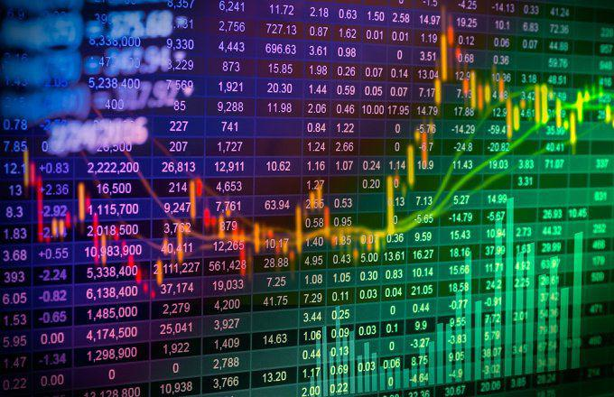

In the rapidly evolving world of finance, investors and traders continuously seek effective tools to streamline their investment decisions and gain a competitive edge in dynamic markets. Financial tools such as moving averages are pivotal in both investment analysis and algorithmic trading. Moving averages serve to smooth out price data, thereby reducing the impact of random fluctuations and highlighting underlying trends crucial for data-driven decision-making. This article examines the significance of moving averages, their practical application in financial analysis, and their integration into algorithmic trading strategies. By thoroughly comprehending these tools, traders and analysts can enhance their analytical capabilities, improve trading performance, and utilize informed strategies to maximize returns and manage risks effectively.

## Table of Contents



## Understanding Moving Averages

Moving averages are statistical tools employed in technical analysis to smooth out price data by calculating a continuously updated average price. These averages serve to mitigate the effects of random price fluctuations, thereby highlighting underlying trends in the financial markets. Various types of moving averages exist, each possessing unique characteristics that make them suitable for different analytical purposes. Among the most commonly used are the Simple Moving Average (SMA), Exponential Moving Average (EMA), and Weighted Moving Average (WMA).

### Simple Moving Average (SMA)

The Simple Moving Average is calculated by taking the arithmetic mean of a given set of prices over a specified number of periods. It is the most straightforward type of moving average, providing a lagging indicator of market trends. The formula for calculating an SMA is:

$$
\text{SMA} = \frac{P_1 + P_2 + \cdots + P_n}{n}
$$

Where $P_1, P_2, ..., P_n$ are the closing prices for each period over $n$ periods.

Although useful for identifying longer-term trends, the SMA is less responsive to recent price changes compared to other averages like the EMA, making it slower to react to market movements.

### Exponential Moving Average (EMA)

The Exponential Moving Average assigns more weight to recent prices, enabling it to respond more swiftly to new data compared to the SMA. This is achieved by incorporating a smoothing [factor](/wiki/factor-investing). The formula for the EMA is slightly more complex and is given by:

$$
\text{EMA}_t = \alpha \times P_t + (1 - \alpha) \times \text{EMA}_{t-1}
$$

Where:
- $\alpha = \frac{2}{n+1}$ is the smoothing factor
- $P_t$ is the price at time $t$
- $\text{EMA}_{t-1}$ is the EMA of the previous period
- $n$ is the number of periods

The EMA's greater sensitivity to recent prices makes it particularly valuable for identifying short-term trend reversals and dynamic market behavior.

### Weighted Moving Average (WMA)

The Weighted Moving Average assigns varying weights to different periods, with more recent periods typically receiving higher weights. This customized weighting allows analysts to emphasize certain data points over others, providing flexibility in analysis. The WMA is calculated as follows:

$$
\text{WMA} = \frac{w_1P_1 + w_2P_2 + \cdots + w_nP_n}{w_1 + w_2 + \cdots + w_n}
$$

Where $w_1, w_2, ..., w_n$ are the weights assigned to each price $P_1, P_2, ..., P_n$.

### Application in Financial Markets

These moving averages are utilized extensively in financial markets to perform tasks such as trend identification, setting stop-loss levels, and generating trading signals. Traders often select the appropriate type of moving average based on the specific requirements of their trading strategy and the characteristics of the market in which they are operating. By employing moving averages effectively, market participants can enhance their analytical capabilities and make more informed investment decisions.

## Types of Moving Averages

Moving averages are essential tools in technical analysis, offering various approaches for smoothing out price data and identifying trends. Three primary types of moving averages are Simple Moving Average (SMA), Exponential Moving Average (EMA), and Weighted Moving Average (WMA), each characterized by distinct methodologies and responsiveness to price changes.

**Simple Moving Average (SMA)** is calculated by taking the arithmetic mean of a given set of prices over a specified period. It is formulated as follows:

$$
\text{SMA} = \frac{P_1 + P_2 + \cdots + P_n}{n}
$$

where $P_1, P_2, \ldots, P_n$ represent the prices over $n$ periods. As an unweighted average, SMA responds slowly to price changes, ensuring a steady representation of trend lines. This sluggish adaptability makes it less effective in volatile markets but valuable for long-term trend analysis.

**Exponential Moving Average (EMA)** improves on the shortcomings of the SMA by assigning greater significance to recent prices, thereby enhancing its responsiveness. The formula for calculating the EMA involves a smoothing factor $\alpha$, which typically depends on the chosen period $n$:

$$
\alpha = \frac{2}{n + 1}
$$

The EMA can be defined recursively as:

$$
\text{EMA}_t = \left( P_t \times \alpha \right) + \left( \text{EMA}_{t-1} \times (1 - \alpha) \right)
$$

Here, $P_t$ is the price at time $t$, and $\text{EMA}_{t-1}$ is the EMA of the previous period. The EMA's ability to quickly adjust to new information makes it a preferred choice for traders who need to capture short-term movements efficiently.

**Weighted Moving Average (WMA)** introduces an additional dimension by assigning distinct weights to each price in the period considered, emphasizing more recent data without strictly adhering to the exponential formula of EMA. The WMA is given by:

$$
\text{WMA} = \frac{\sum (w_i \times P_i)}{\sum w_i}
$$

where $w_i$ denotes the weight attributed to each price $P_i$. This weighting mechanism enables analysts to customize their focus based on market conditions or other strategic considerations, thus offering greater flexibility in technical analysis.

Understanding these different types of moving averages allows traders to align their tools with specific trading objectives. By selecting the appropriate moving average, traders can optimize their strategies to respond either to long-term market trends or short-term fluctuations, thereby enhancing decision-making capabilities.

## Moving Averages in Financial Analysis

In financial analysis, moving averages play a significant role in identifying market trends, support, and resistance levels, which in turn inform trading decisions. By providing a smoothed representation of historical prices, moving averages help analysts discern the market's underlying trend by reducing the noise associated with short-term price fluctuations.

One of the primary applications of moving averages is trend identification. An upward-sloping moving average generally signals a bullish market trend, while a downward-sloping average suggests a bearish trend. By observing these trends, analysts can forecast future price movements more accurately. For example, when the current price crosses above a moving average, it might indicate a buying opportunity, while crossing below could suggest a selling opportunity.

Furthermore, moving averages are instrumental in the identification of support and resistance levels. Support levels represent price points where a downtrend can be expected to pause due to a concentration of demand, while resistance levels represent points where an uptrend is likely to halt due to a supply concentration. Moving averages often align with these levels because they represent dynamically calculated average prices, where many market participants may place their buy or sell orders.

Moving averages also contribute to risk assessment and portfolio optimization. In risk management, traders use moving averages to set stop-loss orders and triggers for exiting positions, thus limiting potential losses. As part of a comprehensive portfolio optimization strategy, moving averages can serve to balance exposure to diverse asset classes by indicating when to enter and [exit](/wiki/exit-strategy) different market segments.

Mathematically, the effectiveness of moving averages in financial analysis can also be demonstrated through models that use them in conjunction with other indicators. For instance, the crossover strategy, which involves short-term and long-term moving average crossovers, helps in generating buy or sell signals. This can be expressed in Python, where a simple crossover might look like this:

```python
import pandas as pd

def moving_average_crossover(df, short_window=40, long_window=100):
    df['Short_MA'] = df['Close'].rolling(window=short_window, min_periods=1).mean()
    df['Long_MA'] = df['Close'].rolling(window=long_window, min_periods=1).mean()
    df['Signal'] = 0
    df['Signal'][short_window:] = np.where(df['Short_MA'][short_window:] > df['Long_MA'][short_window:], 1, -1)
    return df

# Assume 'df' is a DataFrame containing stock prices with a 'Close' column
df = moving_average_crossover(df)
```

In summary, moving averages are a versatile and invaluable tool in financial analysis, significantly aiding in trend identification, risk assessment, and the optimization of trading strategies. By offering clarity amidst the chaotic fluctuations of market prices, they enable traders and analysts to make more informed and strategic decisions.

## Algorithmic Trading and Moving Averages

Algorithmic trading uses moving averages extensively for automated trend identification and signal generation. This technique is fundamental in creating trading algorithms that can operate without continuous human intervention. Moving average crossovers are among the most prevalent strategies applied in [algorithmic trading](/wiki/algorithmic-trading). The crossover method involves observing the point at which a short-term moving average intersects a long-term moving average, providing a signal for potential market [momentum](/wiki/momentum) changes.

The concept behind moving average crossovers is straightforward yet powerful. For instance, a common crossover strategy uses the 50-day and 200-day simple moving averages (SMA). When the 50-day SMA crosses above the 200-day SMA, it is termed a "Golden Cross," often interpreted as a bullish market signal. Conversely, when the 50-day SMA crosses below the 200-day SMA, it is called a "Death Cross," indicating a potential bearish market trend.

The integration of moving averages into algorithmic systems involves several considerations, including the selection of moving average types (e.g., SMA, EMA) and the optimization of their periods for specific asset classes. Algorithms typically employ programming languages like Python to enable [backtesting](/wiki/backtesting) and optimization. Using libraries such as pandas and NumPy, traders can efficiently compute moving averages and simulate trading strategies:

```python
import pandas as pd

# Assume df is a DataFrame with a 'Close' column containing closing prices

# Calculate 50-day and 200-day SMAs
df['SMA_50'] = df['Close'].rolling(window=50).mean()
df['SMA_200'] = df['Close'].rolling(window=200).mean()

# Generate signals for Golden Cross and Death Cross
df['Signal'] = 0
df['Signal'][50:] = df['SMA_50'][50:] > df['SMA_200'][50:]    # Golden Cross
df['Position'] = df['Signal'].diff()                           # Detect changes

```

In this code snippet, a DataFrame of stock prices is analyzed to compute the 50-day and 200-day SMAs, and signals are generated based on crossovers. The position changes derived from these signals can trigger trades automatically within an algorithmic trading system.

Backtesting and optimization are critical to ensure that the moving average-based strategies are robust and effective. Traders typically run historical data through their algorithms, assessing performance metrics such as return on investment (ROI), Sharpe ratio, and drawdown. Optimization may involve tweaking moving average periods and other parameters to improve strategy performance.

One of the significant advantages of utilizing moving averages in algorithmic trading is their ability to provide clear, objective trading signals that can enhance decision-making and reduce emotional bias. This precision and consistency are crucial in maintaining competitive performance in fast-moving financial markets, where timely execution and the ability to react to trends can significantly impact profitability.

Furthermore, incorporating moving averages into algorithmic systems offers scalability. Algorithms can be applied to multiple securities or market conditions simultaneously, allowing traders to manage larger portfolios with efficiency. This adaptability and capacity for handling complex datasets underscore the utility of moving averages as integral components of algorithmic trading systems.

## Case Studies and Examples

Real-world examples of moving averages in trading strategies highlight their practical applications and effectiveness. Notably, the 'Golden Cross' and 'Death Cross' strategies utilize moving average crossovers to furnish actionable insights into market momentum.

The 'Golden Cross' occurs when a short-term moving average, such as the 50-day Simple Moving Average (SMA), crosses above a long-term moving average like the 200-day SMA. This crossover is commonly interpreted as a bullish signal, indicating potential upward momentum. Conversely, the 'Death Cross' involves the short-term moving average crossing below the long-term moving average, which is considered a bearish signal, suggesting potential downward momentum. These crossover patterns are prevalent indicators among traders for identifying significant trend shifts in financial markets.

The practicability of moving averages extends into algorithmic trading strategies. Python-based algorithms often leverage Exponential Moving Averages (EMAs) due to their responsiveness to new price data, which makes them an attractive choice for algorithmic systems. The EMA formula is given by:

$$
EMA_t = \left(\frac{Price_t - EMA_{t-1}}{n + 1}\right) + EMA_{t-1}
$$

where $EMA_t$ is the current day's EMA, $Price_t$ is the current day's closing price, $EMA_{t-1}$ is the previous day's EMA, and $n$ is the number of days in the moving average.

An example of Python implementation could entail the use of libraries like pandas to calculate EMAs and develop trading signals. The following code snippet illustrates this in practice:

```python
import pandas as pd

# Assume df is a DataFrame with a column 'Close' for closing prices
df['EMA_50'] = df['Close'].ewm(span=50, adjust=False).mean()
df['EMA_200'] = df['Close'].ewm(span=200, adjust=False).mean()

# Generate signals
df['Signal'] = 0
df['Signal'][50:] = np.where(df['EMA_50'][50:] > df['EMA_200'][50:], 1, 0)
df['Position'] = df['Signal'].diff()

# Actions based on signals
df['Buy'] = np.where(df['Position'] == 1, df['Close'], np.nan)
df['Sell'] = np.where(df['Position'] == -1, df['Close'], np.nan)
```

This script calculates 50-day and 200-day EMAs and generates buy and sell signals based on the crossover strategy. A buy signal (Golden Cross) occurs when the 50-day EMA crosses above the 200-day EMA, while a sell signal (Death Cross) initiates when the opposite occurs. Traders can adapt such algorithms to backtest historical data and refine their strategies for optimal performance.

In conclusion, moving averages serve as versatile components in developing trading strategies, providing crucial signals for market entry and exit, and are instrumental in constructing algorithmic trading models.

## Conclusion

Moving averages are essential in financial analysis and algorithmic trading, offering a structured approach to interpreting market dynamics. By smoothing out price data, they enable traders to discern prevailing trends, providing clarity amidst short-term [volatility](/wiki/volatility-trading-strategies). This functionality is crucial for developing robust trading strategies, as moving averages serve as reliable indicators of support and resistance levels, trend direction, and trend strength.

In algorithmic trading, moving averages facilitate the automation of trade decisions through quantifiable signals. Strategies such as moving average crossovers capitalize on the interaction between short-term and long-term averages to provide actionable insights. For instance, a 'Golden Cross'—where a short-term moving average crosses above a long-term moving average—signals potential upward momentum, while a 'Death Cross' indicates the reverse.

Moreover, moving averages are instrumental in the design and optimization of automated trading systems. These systems utilize backtesting to evaluate strategy performance over historical data, adjusting parameters for maximum efficacy. By leveraging moving averages, traders can enhance the precision of these systems, leading to better risk management and improved trade outcomes.

Ultimately, the integration of moving averages into both manual and automated trading strategies equips traders with the tools required to make informed decisions. This informed approach not only enhances individual trading performance but also provides a competitive advantage in navigating the complexities of financial markets.

## References & Further Reading

Technical Analysis of the Financial Markets by John J. Murphy is a comprehensive resource that covers a wide range of technical analysis tools, including moving averages. This book is invaluable for traders and analysts looking to understand market dynamics and improve their analytical skills. It provides insights into chart patterns, indicators, and the strategic use of moving averages to predict price movements.

Investopedia's article on Moving Averages in Algorithmic Trading offers a detailed look at how these statistical tools are implemented within automated trading systems. It discusses the mechanics of moving average crossovers, their significance in generating trading signals, and their application in various algorithmic strategies. The article is an essential read for anyone interested in the practical aspects of using moving averages to enhance algorithmic trading performance.

Quantitative Technical Analysis by Howard B. Bandy focuses on the application of quantitative methods to market analysis. The book emphasizes the use of moving averages in the development of robust trading systems and their role in enhancing decision-making processes. It includes discussions on backtesting and optimizing trading algorithms, providing readers with the knowledge to improve trading system performance through the effective use of moving averages.

