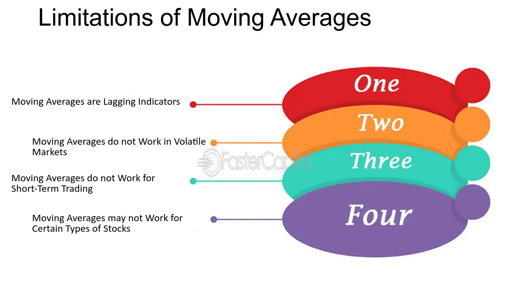

## Table of Contents

## What is a moving average and how is it used in data analysis?

A moving average is a way to smooth out data over time. It helps show the overall trend by taking the average of a set number of data points. For example, if you want to find the 3-day moving average of a stock price, you would add up the prices for the last three days and then divide by three. This gives you a single number that represents the average price over those three days.

In data analysis, moving averages are used to make it easier to see patterns and trends that might be hard to spot in raw data. They help remove short-term ups and downs, so you can focus on the bigger picture. For instance, businesses might use moving averages to understand sales trends over time, helping them make better decisions about inventory and marketing. By smoothing out the data, moving averages make it simpler to predict future trends and plan accordingly.

## Can you explain the concept of lag in moving averages?

Lag in moving averages is about how far back in time the average looks. When you calculate a moving average, you choose a certain number of past data points to include. This number is the lag. For example, if you use a 5-day moving average, the lag is 5 days because you're looking at the data from the past 5 days to calculate the average.

The lag affects how quickly the moving average reacts to changes in the data. A shorter lag, like a 3-day moving average, will change more quickly when the data changes because it's only looking at recent data. A longer lag, like a 20-day moving average, will change more slowly because it includes more past data. This means that a shorter lag can show you trends sooner, but it might also show more ups and downs. A longer lag smooths out the data more but might be slower to show new trends.

## How do moving averages affect the timeliness of data?

Moving averages can make data seem less timely because they include past data in their calculations. If you use a moving average, you're looking at an average of the last few days or weeks, not just what happened today. This means the moving average might not show you the latest changes in the data right away. For example, if something big happens today, a moving average that looks at the last 10 days won't show that big change until it's had time to affect the average.

The length of the moving average, or the lag, decides how timely the data appears. A short moving average, like a 3-day average, will show changes more quickly because it only uses recent data. But a long moving average, like a 30-day average, will take longer to show new trends because it includes a lot of past data. So, if you need to see what's happening right now, a short moving average is better. But if you want to see a smoother trend over time, a longer moving average might be more useful, even though it's less timely.

## What are the common types of moving averages and their specific disadvantages?

There are two main types of moving averages: the simple moving average (SMA) and the exponential moving average (EMA). The simple moving average is easy to calculate. You just add up a certain number of past data points and then divide by that number. For example, a 5-day SMA adds up the last 5 days and divides by 5. The problem with SMAs is that they treat all data points the same, so recent changes might not show up quickly. If something important happens today, it won't affect the average much until more days pass.

The exponential moving average is different because it puts more weight on recent data. This means it can show new trends faster than an SMA. To calculate an EMA, you use a formula that gives more importance to the latest data points. But EMAs can be harder to understand and calculate because of this weighting. Also, because they react more to recent changes, they might show more ups and downs, which can make it harder to see the overall trend.

Both types of moving averages have their uses, but they also have downsides. SMAs are simple but slow to show new trends. EMAs are quicker to react but can be more complicated and show more short-term changes. Choosing between them depends on what you need the moving average for and how much you care about seeing new trends quickly versus seeing a smooth, long-term trend.

## How does the choice of moving average period impact its effectiveness?

The choice of the moving average period really changes how well it works. If you pick a short period, like 3 days, the moving average will change quickly when the data changes. This can be good if you want to see new trends fast, but it might also show a lot of ups and downs that can be confusing. On the other hand, a longer period, like 20 days, makes the moving average change more slowly. This can be helpful if you want to see the big picture and not get distracted by little changes every day.

Choosing the right period depends on what you need the moving average for. If you're trying to spot new trends as soon as they start, a shorter period might be better. But if you want to see a smooth trend over time and ignore short-term changes, a longer period works better. It's all about finding the balance between seeing new trends quickly and getting a clear view of the overall trend.

## In what ways can moving averages distort the true nature of data trends?

Moving averages can make it hard to see what's really going on with the data. When you use a moving average, you're looking at an average of past data, not what's happening right now. This can hide big changes that happen quickly. For example, if a stock price jumps up a lot in one day, a moving average might not show that jump right away because it's still including old data. This means you might miss out on seeing important changes until they've had time to affect the average.

Also, moving averages can smooth out the data too much. If you use a long moving average, like a 30-day one, it can make the data look too steady and calm. This can trick you into thinking there are no big ups and downs when there really are. On the other hand, a short moving average can show too many ups and downs, making it hard to see the big picture. So, while moving averages are useful for seeing trends, they can also hide or change the true nature of the data if you're not careful.

## What are the potential pitfalls of using moving averages for short-term predictions?

Using moving averages for short-term predictions can be tricky. Moving averages look at past data to give you an average, so they might not show you what's happening right now. If something big changes quickly, like a stock price going up a lot in one day, the moving average might not show that right away. This means you could miss out on seeing important short-term changes until they've had time to affect the average.

Also, the length of the moving average matters a lot for short-term predictions. If you use a short moving average, like a 3-day one, it will change quickly when the data changes, but it might also show a lot of ups and downs that can be confusing. A longer moving average, like a 20-day one, will be smoother but slower to show new trends. So, if you're trying to predict what will happen in the very near future, you might not get the full picture with moving averages because they can hide or change the true nature of the data.

## How do moving averages perform in volatile markets or with erratic data?

In volatile markets or with erratic data, moving averages can be tricky to use. They are meant to smooth out the data and show trends, but when the data is jumping around a lot, moving averages might not help much. A short moving average, like a 3-day one, will change quickly with the data, showing a lot of ups and downs. This can make it hard to see any clear trend because the average is moving so much. It's like trying to see a path in a storm; the wind and rain make it hard to see where you're going.

On the other hand, a longer moving average, like a 20-day one, will be smoother but slower to show new trends. In a volatile market, this can mean the moving average is always behind what's really happening. It might not show you the big changes until they've had time to affect the average, which can be too late for making quick decisions. So, in markets or data that change a lot, moving averages can hide the true nature of what's going on, making it hard to predict what will happen next.

## Can moving averages lead to false signals in trading or analysis?

Moving averages can sometimes give you the wrong idea about what's happening in the market or with your data. They do this by creating false signals, which means they might make you think a trend is starting or ending when it's not really happening. For example, if the price of a stock goes up a bit, a short moving average might make it look like a new trend is starting. But if the price goes back down soon after, you might realize it was just a short-term change, not a real trend. This can be really confusing and lead you to make bad decisions, like buying or selling at the wrong time.

In trading, false signals from moving averages can be a big problem. Traders often use moving averages to decide when to buy or sell. If a moving average gives a false signal, a trader might buy a stock thinking it's going up, only to find out later that it was just a short-term bump. This can lead to losing money. To avoid this, traders need to be careful and maybe use more than one moving average or other tools to check if the signal is real. It's all about not relying too much on one type of signal and understanding that moving averages can sometimes be misleading, especially in markets that change a lot.

## What are the statistical limitations of using moving averages?

Moving averages have some problems when it comes to looking at data. One big issue is that they can make the data look smoother than it really is. This is because moving averages use past data to make an average, so they can hide big changes that happen quickly. For example, if a stock price goes up a lot in one day, a moving average might not show that right away because it's still including old data. This can make it hard to see what's really happening, especially if the data changes a lot.

Another problem is that moving averages can give false signals. This means they might make you think a trend is starting or ending when it's not really happening. If you're using moving averages to make decisions, like when to buy or sell a stock, these false signals can be confusing and lead to bad choices. To avoid this, it's a good idea to use other ways to check the data along with moving averages, so you don't rely on them too much.

## How do moving averages compare to more advanced forecasting methods in terms of accuracy?

Moving averages are pretty simple to use, but they might not be as accurate as some other ways to predict what will happen in the future. They look at past data to make an average, which can be good for seeing overall trends. But they can miss big changes that happen quickly because they include old data in their calculations. This means they might not show you what's happening right now, which can be a problem if you need to make quick decisions.

More advanced forecasting methods, like ARIMA (AutoRegressive Integrated Moving Average) or [machine learning](/wiki/machine-learning) models, can be better at predicting the future because they look at more things than just past averages. These methods can take into account patterns, seasonality, and other factors that moving averages might miss. While they can be more complicated to use, they often give you a more accurate picture of what might happen next, especially in markets or data that change a lot.

## What are the expert critiques on the reliance on moving averages in financial analysis?

Experts often say that relying too much on moving averages in financial analysis can be risky. Moving averages are good for showing general trends, but they can miss big changes that happen quickly. They use past data to make an average, which means they might not show what's happening right now. This can be a problem in markets that change a lot. If a stock price goes up a lot in one day, a moving average might not show that right away because it's still including old data. This can lead to false signals, making investors think a trend is starting or ending when it's not really happening.

Another point experts make is that moving averages can be too simple for today's complex markets. More advanced methods, like ARIMA or machine learning models, can look at more things than just past averages. These methods can take into account patterns, seasonality, and other factors that moving averages might miss. While moving averages are easy to use and understand, they might not give you the full picture needed for making good decisions in financial analysis. So, experts suggest using moving averages along with other tools to get a better understanding of the market.

## What is Understanding Moving Averages?

Moving averages are statistical tools employed in technical analysis to smooth out price data by calculating a continuously updated average price. These averages serve to mitigate the effects of random price fluctuations, thereby highlighting underlying trends in the financial markets. Various types of moving averages exist, each possessing unique characteristics that make them suitable for different analytical purposes. Among the most commonly used are the Simple Moving Average (SMA), Exponential Moving Average (EMA), and Weighted Moving Average (WMA).

### Simple Moving Average (SMA)

The Simple Moving Average is calculated by taking the arithmetic mean of a given set of prices over a specified number of periods. It is the most straightforward type of moving average, providing a lagging indicator of market trends. The formula for calculating an SMA is:

$$
\text{SMA} = \frac{P_1 + P_2 + \cdots + P_n}{n}
$$

Where $P_1, P_2, ..., P_n$ are the closing prices for each period over $n$ periods.

Although useful for identifying longer-term trends, the SMA is less responsive to recent price changes compared to other averages like the EMA, making it slower to react to market movements.

### Exponential Moving Average (EMA)

The Exponential Moving Average assigns more weight to recent prices, enabling it to respond more swiftly to new data compared to the SMA. This is achieved by incorporating a smoothing [factor](/wiki/factor-investing). The formula for the EMA is slightly more complex and is given by:

$$
\text{EMA}_t = \alpha \times P_t + (1 - \alpha) \times \text{EMA}_{t-1}
$$

Where:
- $\alpha = \frac{2}{n+1}$ is the smoothing factor
- $P_t$ is the price at time $t$
- $\text{EMA}_{t-1}$ is the EMA of the previous period
- $n$ is the number of periods

The EMA's greater sensitivity to recent prices makes it particularly valuable for identifying short-term trend reversals and dynamic market behavior.

### Weighted Moving Average (WMA)

The Weighted Moving Average assigns varying weights to different periods, with more recent periods typically receiving higher weights. This customized weighting allows analysts to emphasize certain data points over others, providing flexibility in analysis. The WMA is calculated as follows:

$$
\text{WMA} = \frac{w_1P_1 + w_2P_2 + \cdots + w_nP_n}{w_1 + w_2 + \cdots + w_n}
$$

Where $w_1, w_2, ..., w_n$ are the weights assigned to each price $P_1, P_2, ..., P_n$.

### Application in Financial Markets

These moving averages are utilized extensively in financial markets to perform tasks such as trend identification, setting stop-loss levels, and generating trading signals. Traders often select the appropriate type of moving average based on the specific requirements of their trading strategy and the characteristics of the market in which they are operating. By employing moving averages effectively, market participants can enhance their analytical capabilities and make more informed investment decisions.

## What are the types of moving averages?

Moving averages are essential tools in technical analysis, offering various approaches for smoothing out price data and identifying trends. Three primary types of moving averages are Simple Moving Average (SMA), Exponential Moving Average (EMA), and Weighted Moving Average (WMA), each characterized by distinct methodologies and responsiveness to price changes.

**Simple Moving Average (SMA)** is calculated by taking the arithmetic mean of a given set of prices over a specified period. It is formulated as follows:

$$
\text{SMA} = \frac{P_1 + P_2 + \cdots + P_n}{n}
$$

where $P_1, P_2, \ldots, P_n$ represent the prices over $n$ periods. As an unweighted average, SMA responds slowly to price changes, ensuring a steady representation of trend lines. This sluggish adaptability makes it less effective in volatile markets but valuable for long-term trend analysis.

**Exponential Moving Average (EMA)** improves on the shortcomings of the SMA by assigning greater significance to recent prices, thereby enhancing its responsiveness. The formula for calculating the EMA involves a smoothing factor $\alpha$, which typically depends on the chosen period $n$:

$$
\alpha = \frac{2}{n + 1}
$$

The EMA can be defined recursively as:

$$
\text{EMA}_t = \left( P_t \times \alpha \right) + \left( \text{EMA}_{t-1} \times (1 - \alpha) \right)
$$

Here, $P_t$ is the price at time $t$, and $\text{EMA}_{t-1}$ is the EMA of the previous period. The EMA's ability to quickly adjust to new information makes it a preferred choice for traders who need to capture short-term movements efficiently.

**Weighted Moving Average (WMA)** introduces an additional dimension by assigning distinct weights to each price in the period considered, emphasizing more recent data without strictly adhering to the exponential formula of EMA. The WMA is given by:

$$
\text{WMA} = \frac{\sum (w_i \times P_i)}{\sum w_i}
$$

where $w_i$ denotes the weight attributed to each price $P_i$. This weighting mechanism enables analysts to customize their focus based on market conditions or other strategic considerations, thus offering greater flexibility in technical analysis.

Understanding these different types of moving averages allows traders to align their tools with specific trading objectives. By selecting the appropriate moving average, traders can optimize their strategies to respond either to long-term market trends or short-term fluctuations, thereby enhancing decision-making capabilities.

## What are some case studies and examples?

Real-world examples of moving averages in trading strategies highlight their practical applications and effectiveness. Notably, the 'Golden Cross' and 'Death Cross' strategies utilize moving average crossovers to furnish actionable insights into market [momentum](/wiki/momentum).

The 'Golden Cross' occurs when a short-term moving average, such as the 50-day Simple Moving Average (SMA), crosses above a long-term moving average like the 200-day SMA. This crossover is commonly interpreted as a bullish signal, indicating potential upward momentum. Conversely, the 'Death Cross' involves the short-term moving average crossing below the long-term moving average, which is considered a bearish signal, suggesting potential downward momentum. These crossover patterns are prevalent indicators among traders for identifying significant trend shifts in financial markets.

The practicability of moving averages extends into [algorithmic trading](/wiki/algorithmic-trading) strategies. Python-based algorithms often leverage Exponential Moving Averages (EMAs) due to their responsiveness to new price data, which makes them an attractive choice for algorithmic systems. The EMA formula is given by:

$$
EMA_t = \left(\frac{Price_t - EMA_{t-1}}{n + 1}\right) + EMA_{t-1}
$$

where $EMA_t$ is the current day's EMA, $Price_t$ is the current day's closing price, $EMA_{t-1}$ is the previous day's EMA, and $n$ is the number of days in the moving average.

An example of Python implementation could entail the use of libraries like pandas to calculate EMAs and develop trading signals. The following code snippet illustrates this in practice:

```python
import pandas as pd

# Assume df is a DataFrame with a column 'Close' for closing prices
df['EMA_50'] = df['Close'].ewm(span=50, adjust=False).mean()
df['EMA_200'] = df['Close'].ewm(span=200, adjust=False).mean()

# Generate signals
df['Signal'] = 0
df['Signal'][50:] = np.where(df['EMA_50'][50:] > df['EMA_200'][50:], 1, 0)
df['Position'] = df['Signal'].diff()

# Actions based on signals
df['Buy'] = np.where(df['Position'] == 1, df['Close'], np.nan)
df['Sell'] = np.where(df['Position'] == -1, df['Close'], np.nan)
```

This script calculates 50-day and 200-day EMAs and generates buy and sell signals based on the crossover strategy. A buy signal (Golden Cross) occurs when the 50-day EMA crosses above the 200-day EMA, while a sell signal (Death Cross) initiates when the opposite occurs. Traders can adapt such algorithms to backtest historical data and refine their strategies for optimal performance.

In conclusion, moving averages serve as versatile components in developing trading strategies, providing crucial signals for market entry and [exit](/wiki/exit-strategy), and are instrumental in constructing algorithmic trading models.

## References & Further Reading

Technical Analysis of the Financial Markets by John J. Murphy is a comprehensive resource that covers a wide range of technical analysis tools, including moving averages. This book is invaluable for traders and analysts looking to understand market dynamics and improve their analytical skills. It provides insights into chart patterns, indicators, and the strategic use of moving averages to predict price movements.

Investopedia's article on Moving Averages in Algorithmic Trading offers a detailed look at how these statistical tools are implemented within automated trading systems. It discusses the mechanics of moving average crossovers, their significance in generating trading signals, and their application in various algorithmic strategies. The article is an essential read for anyone interested in the practical aspects of using moving averages to enhance algorithmic trading performance.

Quantitative Technical Analysis by Howard B. Bandy focuses on the application of quantitative methods to market analysis. The book emphasizes the use of moving averages in the development of robust trading systems and their role in enhancing decision-making processes. It includes discussions on [backtesting](/wiki/backtesting) and optimizing trading algorithms, providing readers with the knowledge to improve trading system performance through the effective use of moving averages.

