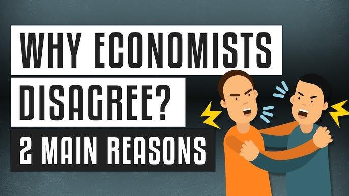

## Table of Contents

## What is the basic definition of an economist?

An economist is someone who studies how people use resources like money, time, and natural materials. They look at how these resources are used to make things like food, clothes, and buildings. Economists try to understand how people, businesses, and governments make choices about using these resources. They use data and math to figure out what might happen if people make different choices.

Economists also study big ideas like supply and demand, which is about how much of something is available and how much people want it. They look at things like inflation, which is when prices go up, and unemployment, which is when people who want jobs can't find them. By understanding these ideas, economists can give advice to businesses and governments on how to make the economy better for everyone.

## Why do disagreements occur among economists?

Disagreements among economists often happen because they have different ideas about how the world works. Economics is a big subject that tries to explain how people, businesses, and governments use resources. But people are complicated, and it's hard to predict exactly what they will do. So, economists might have different theories or models to explain the same thing. For example, some might think that cutting taxes will help the economy grow, while others might believe it will make things worse. These different views come from different ways of looking at the same information.

Another reason for disagreements is that economists often have to make guesses about the future. They use numbers and data to try to predict what might happen, but the future is always uncertain. So, when they look at the same data, they might come to different conclusions about what it means. For instance, one economist might think that a certain policy will lower unemployment, while another might think it will cause inflation. These disagreements are normal because economics is not an exact science like math or physics. It's more like trying to solve a puzzle with missing pieces.

## What are the main schools of economic thought?

There are several main schools of economic thought, each with its own way of looking at how the economy works. One of the biggest is the Classical school, which believes that markets can fix themselves without much help from the government. They think that if prices and wages can change freely, the economy will find a balance on its own. Another important school is Keynesian economics, named after John Maynard Keynes. Keynesians believe that the government should step in to help the economy, especially during tough times like recessions. They think that government spending can help create jobs and get the economy moving again.

Another school is the Monetarist school, which focuses a lot on money and how it moves through the economy. Monetarists, like Milton Friedman, believe that controlling the amount of money in the economy is the best way to keep things stable. They think that if the government can keep the money supply steady, it can avoid big problems like inflation. Then there's the Austrian school, which is very different. Austrian economists, like Friedrich Hayek, believe that the economy works best when people are free to make their own choices without much government interference. They think that trying to control the economy too much can lead to big problems.

Lastly, there's the Marxist school, which looks at the economy through the lens of class struggle. Marxists, following Karl Marx, believe that the economy is divided between the people who own the businesses and the people who work for them. They think that this division leads to conflict and that big changes are needed to make things fair. Each of these schools has its own ideas about how to make the economy work better, and they often disagree with each other about the best way to do that.

## How do different economic theories lead to disagreements?

Different economic theories lead to disagreements because they have different ideas about how the economy works and what should be done to make it better. For example, classical economists believe that markets can fix themselves if left alone, while Keynesian economists think that the government needs to step in to help, especially during bad times. These different views can lead to big arguments about whether the government should spend more money to create jobs or if it should let the market sort things out on its own.

Another reason for disagreements is that economists from different schools have different ways of looking at the same data. Monetarists focus a lot on the money supply and think that keeping it steady is the key to a stable economy. On the other hand, Austrian economists believe that people should be free to make their own choices without much government interference, and they think that too much control can cause problems. These different focuses can lead to different predictions about what will happen if certain policies are put in place.

Lastly, Marxist economists see the economy as a struggle between different classes, which is very different from how other schools see it. They believe that big changes are needed to make things fair, while other schools might think that smaller adjustments are enough. These fundamental differences in how economists see the world lead to disagreements about what the best solutions are for economic problems.

## Can you provide examples of famous economic debates?

One famous economic debate is about whether the government should spend more money during a recession. Keynesians, like John Maynard Keynes, believe that if the government spends more, it can create jobs and help the economy recover faster. They think this is important because when people are out of work, they don't spend money, and that can make the recession worse. On the other hand, classical economists, like Adam Smith, argue that the government should not interfere too much. They believe that if the government just lets the market work on its own, prices and wages will adjust, and the economy will fix itself. This debate was especially heated during the Great Depression and continues to be a big topic today.

Another well-known debate is about the role of money in the economy. Monetarists, like Milton Friedman, think that controlling the amount of money in the economy is the best way to keep things stable. They believe that if the government can keep the money supply steady, it can avoid problems like inflation. However, Keynesians argue that focusing too much on money misses the bigger picture. They believe that other factors, like how much people are spending and how many jobs there are, are more important. This debate became very important in the 1970s and 1980s when many countries were dealing with high inflation and high unemployment at the same time.

A third famous debate is between free-market advocates and those who believe in more government control. Austrian economists, like Friedrich Hayek, argue that the economy works best when people are free to make their own choices without much government interference. They believe that trying to control the economy too much can lead to big problems. On the other side, Marxist economists, like Karl Marx, see the economy as a struggle between different classes. They think that big changes are needed to make things fair, and they believe that the government should play a big role in making those changes. This debate has been going on for a long time and is at the heart of many discussions about economic policy.

## What role does empirical data play in economic disagreements?

Empirical data is important in economic disagreements because it helps economists test their ideas. Economists use numbers and facts to see if their theories are right. For example, if an economist thinks that raising the minimum wage will help workers, they can look at data from places where the minimum wage was raised to see if it worked. But different economists might look at the same data and see different things. One might say the data shows that raising the minimum wage helped, while another might say it hurt businesses. So, even with data, economists can still disagree because they might interpret it differently.

Another way empirical data plays a role is by helping economists make predictions. They use data to build models that try to guess what will happen in the future. For instance, if they want to know what will happen if the government spends more money, they can look at what happened in the past when the government did that. But the future is never certain, so different economists might use the same data to make different predictions. This can lead to disagreements about what the best policy is. Even though data can help, it doesn't always give clear answers, which is why economists often have different opinions.

## How do economic models contribute to or resolve disagreements?

Economic models help economists understand how the economy works by showing how different parts of it are connected. These models are like simplified pictures of the real world, where economists can change things to see what might happen. For example, they can use a model to see what would happen if the government spent more money or if interest rates changed. But because these models are simplified, they can lead to disagreements. Different economists might use different models or change the models in different ways, so they end up with different answers. One economist might think a model shows that raising taxes will help the economy, while another might think it will hurt it.

Even though economic models can cause disagreements, they can also help resolve them. When economists argue about something, they can use models to test their ideas. If they can agree on the data and how to use it in a model, they might be able to see which idea is more likely to be right. For example, if two economists disagree about whether cutting taxes will create jobs, they can use a model to look at what happened when taxes were cut in the past. If the model shows that cutting taxes did create jobs, it might help them agree. But because models are not perfect and the real world is complicated, they might still disagree about how much the model can be trusted or how it should be used.

## What are the implications of economic disagreements for policy-making?

Economic disagreements can make it hard for governments to decide what to do. When economists disagree about what will happen if the government raises taxes or spends more money, it can be tough for leaders to choose the best policy. They might hear different advice from different economists, and each one will say their way is the best. This can lead to confusion and delay in making decisions. Sometimes, the government might pick a policy that some economists think is a bad idea, which can lead to problems later on.

On the other hand, economic disagreements can also help make better policies. When economists argue, they often share new ideas and information. This can help everyone learn more about how the economy works. Governments can use these debates to think about different options and try to find the best solution. Even if they can't agree on everything, the discussions can lead to smarter choices. So, while disagreements can make things harder, they can also lead to better understanding and better policies in the end.

## How do cultural and ideological factors influence economic disagreements?

Cultural and ideological factors can really change how economists think about the economy. People from different places might have different ideas about what's fair or what's important. For example, in some countries, people might think it's good for the government to help everyone have a job, while in other places, people might believe that the government should stay out of the way and let businesses do what they want. These different beliefs can make economists disagree about what the best policies are. If an economist comes from a place where people value equality a lot, they might support policies that help everyone, even if it means the government has to spend more money.

Ideology also plays a big role in economic disagreements. Some economists might believe in free markets and think that people should be able to make their own choices without much government help. Others might think that the government should do more to make sure everyone has what they need. These different beliefs can lead to big arguments about things like taxes, spending, and how to help people who are struggling. For example, an economist who believes in free markets might argue against raising taxes, while one who thinks the government should help more might support it. These cultural and ideological differences can make it hard for economists to agree, even when they're looking at the same data.

## What are some strategies economists use to resolve their disagreements?

Economists often try to resolve their disagreements by looking at more data. They might do new studies or look at old data in a different way to see if they can find more evidence for their ideas. For example, if two economists disagree about whether raising the minimum wage helps workers, they might look at data from different places or over a longer time to see if it changes their minds. By using more and better data, they hope to find answers that everyone can agree on. But because the economy is so complicated, even with more data, they might still disagree about what it means.

Another way economists try to resolve disagreements is by talking to each other and sharing their ideas. They might go to meetings or write papers to explain their theories and listen to what others think. Sometimes, when they hear different viewpoints, they can find common ground or change their minds a little bit. This kind of discussion can help them see things in a new way and maybe agree on some points, even if they don't agree on everything. It's like a big conversation where everyone is trying to learn more and find the best solutions.

## How have historical economic events shaped current disagreements among economists?

Historical economic events have a big impact on what economists think today. For example, the Great Depression in the 1930s made many economists think that the government should step in to help during bad times. This is why Keynesian economics, which says the government should spend more money to create jobs, became popular. On the other hand, the high inflation in the 1970s made some economists believe that controlling the money supply was more important. This led to the rise of monetarism, which focuses on keeping the money supply steady to avoid problems like inflation. These events show how what happens in the past can change how economists see the world and what they think should be done.

Another big event that shaped economic disagreements was the fall of the Soviet Union in the 1990s. This made many economists think that free markets were better than having the government control everything. It led to more support for ideas like those from the Austrian school, which says people should be free to make their own choices. But not everyone agreed. Some economists still believed in ideas like those from Karl Marx, who thought that big changes were needed to make things fair. So, even though historical events can change what economists think, they often lead to new disagreements about what the best way to do things is.

## What advanced methodologies are used to analyze and potentially resolve economic disagreements?

Economists use advanced methods like econometrics to help figure out economic disagreements. Econometrics is a way of using math and [statistics](/wiki/bayesian-statistics) to look at data and see what it means. For example, economists might use econometrics to test if a new policy, like raising the minimum wage, really helps workers. They can look at data from different places and times to see if the policy worked or not. By doing this, they hope to find clear answers that can help them agree. But because the economy is so complicated, even with these advanced methods, they might still see the data differently and disagree about what it means.

Another advanced method economists use is called computational modeling. This is when they use computers to build models that can show how different parts of the economy work together. For example, they can use a computer model to see what might happen if the government spends more money or changes taxes. These models can help economists test their ideas and see if they hold up. By sharing these models and the results they get, economists can talk to each other and maybe find common ground. But because these models are still simplified versions of the real world, they might not always give clear answers, and economists can still disagree about how to use them or what they mean.

## How do Algorithmic Trading and Economic Theory relate to each other?

Algorithmic trading systems are often designed to leverage economic theories to forecast market movements. The integration of economic theory into algorithms can be both a boon and a bane, given the divergent perspectives offered by various economic schools of thought. These differences necessitate careful consideration during algorithm development.

Consider the Keynesian economists, who advocate for government intervention to stabilize markets. An algorithm based on this theory might prioritize macroeconomic indicators such as government spending, fiscal policies, and interest rates as key inputs for predicting market trends. On the other hand, proponents of free-market economics, who favor minimal government interference, might emphasize market-based indicators like supply-demand metrics and price elasticity.

These divergent approaches illustrate how contrasting economic perspectives can shape the development and implementation of [algorithmic trading](/wiki/algorithmic-trading) models. For instance, a trading algorithm aligned with free-market principles may utilize a supply-demand model, represented by the formula: 

$$
\text{Price Change} = \alpha (\text{Demand} - \text{Supply})
$$

where $\alpha$ is a constant determining the sensitivity of price to changes in demand and supply.

Disagreements between economic schools add complexity to decision-making processes in algorithmic trading. With differing views on the effects of monetary policy or fiscal intervention, traders face the challenge of aligning algorithmic models with their theoretical frameworks. This alignment is crucial as it influences which economic indicators are prioritized within the trading system.

The disparity in economic theories also offers opportunities for algorithmic trading. For example, if one set of algorithms predicts a bullish market based on Keynesian stimulus policies, while another set predicts a bearish market presuming minimal government intervention, traders can exploit these opposing strategies to hedge risks or capitalize on mispriced assets.

Ultimately, the task for traders is to select indicators that not only conform to their preferred economic theories but also robustly contribute to accurate market predictions. They must weigh empirical data against theoretical expectations to fine-tune algorithm parameters, often employing [machine learning](/wiki/machine-learning) techniques to enhance the predictive accuracy of these models. By embedding diverse economic perspectives into algorithmic frameworks, traders can harness the strengths of competing theories to navigate financial markets effectively.

## References & Further Reading

[1]: Keynes, J. M. (1936). ["The General Theory of Employment, Interest and Money."](https://link.springer.com/book/10.1007/978-3-319-70344-2) Palgrave Macmillan.

[2]: Friedman, M. (2002). ["Capitalism and Freedom."](https://ctheory.sitehost.iu.edu/resources/fall2020/Friedman_Capitalism_and_Freedom.pdf) University of Chicago Press.

[3]: Hayek, F. A. (1944). ["The Road to Serfdom."](https://en.wikipedia.org/wiki/The_Road_to_Serfdom) University of Chicago Press.

[4]: Cartea, Á., Jaimungal, S., & Penalva, J. (2015). ["Algorithmic and High-Frequency Trading."](https://assets.cambridge.org/97811070/91146/frontmatter/9781107091146_frontmatter.pdf) Cambridge University Press.

[5]: Jansen, S. (2020). ["Machine Learning for Algorithmic Trading"](https://github.com/stefan-jansen/machine-learning-for-trading) Packt Publishing.