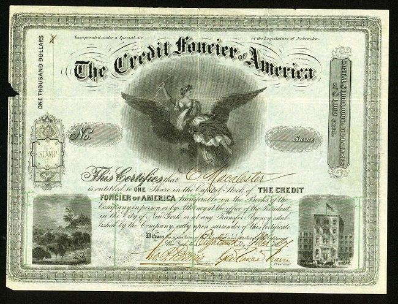

The financial world has undergone significant changes as physical stock certificates, once tangible symbols of share ownership, give way to electronic records. This evolution, known as the dematerialization of stocks, represents a major transition in financial transactions, emphasizing increased efficiency and security. Dematerialization refers to the process of converting physical stock certificates into electronic form, thereby facilitating seamless transactions and ensuring robust record-keeping. This transformation addresses the limitations of paper-based systems, such as delays in transfer, risk of physical damage, and administrative burden.

In recent years, the financial landscape has also witnessed the rise of algorithmic trading. This approach uses automated and pre-programmed trading instructions to execute orders at speeds that humans cannot match. Algorithmic trading has further advanced the digital shift in stock markets, enabling high-frequency trading and allowing investors to capitalize on market fluctuations with remarkable precision.



As investors adapt to these changes, understanding the intricacies of dematerialization and algorithmic trading is crucial for navigating the modern financial landscape. These shifts not only redefine the technical mechanisms of trading but also challenge traditional notions of ownership and transaction handling. With the continuous evolution of technology, the implications for the future of investing are profound, highlighting both opportunities and challenges. Through this article, we will examine the transformation of stock markets and its ramifications for investors, setting the stage for a future characterized by improved speed, security, and efficiency in financial transactions.

## Table of Contents

## The Era of Paper Stock Certificates

Stock certificates have long played a fundamental role in the financial markets, serving as tangible proof of share ownership in a corporation. These physical documents were traditionally issued by the company whose stock was being traded, providing clear, legal evidence of an individual's ownership stakes. The use of stock certificates dates back several centuries and has been a key component in the history of corporate finance.

Each stock certificate typically detailed the number of shares owned, the date of issuance, and the name of the shareholder, alongside official signatures and company seals. This paper-based system provided a sense of security and authenticity, allowing investors to possess a physical representation of their investment. Indeed, owning a stock certificate was akin to holding a title deed, affirming one's stake in the assets, earnings, and governance of a corporation.

Despite their longstanding use, stock certificates pose a number of challenges, particularly around security and convenience. They are susceptible to damage, loss, or theft, posing significant risks to shareholders. Additionally, the process of transferring ownership was time-consuming and cumbersome, requiring the physical exchange of documents. Verification and settlement processes were heavily reliant on manual checks, making them prone to errors and delays.

With the advent of technological innovations and the emergence of online trading platforms, the disadvantages inherent in paper certificates became increasingly apparent. Electronic records began to overshadow their paper counterparts, offering a more efficient and secure way to verify ownership and facilitate transactions. The digitization of stock records has eliminated the need for physical custody and enabled more agile trading practices.

Companies and exchanges globally have largely phased out the issuance of physical stock certificates in favor of digital alternatives. As a result, the era dominated by paper certificates has seen a gradual wane, as the financial industry embraces electronic solutions that align with modern trading demands. Despite this transition, some collectors treasure stock certificates for their historical significance and aesthetic value, preserving them as collectible memorabilia.

## Dematerialization of Stocks

Dematerialization, often abbreviated as DEMAT, signifies the transformation of physical stock certificates into an electronic format. This evolution represents a substantial shift in the way financial transactions are conducted, providing both increased efficiency and enhanced security. Traditionally, stock certificates were tangible documents that investors used to prove their ownership stake in a company. However, the process of handling, transferring, and storing these paper documents was cumbersome, susceptible to loss, theft, and damage, which compounded transaction risks.

The adoption of DEMAT accounts mitigates many of these risks by centralizing record-keeping in a digital format. These accounts enable the electronic transfer of shares, supporting seamless transactions and eliminating the need for manual paperwork. By digitizing stock records, DEMAT accounts ensure accuracy and facilitate quicker settlement cycles, which in turn aids in maintaining up-to-date ownership records and reduces the chance of discrepancies.

Moreover, the introduction of electronic stock records represents one of the most pivotal changes in the trading industry. This transformation aligns with the global movement towards digital financial systems and is now a standard practice in modern trading environments. The dematerialization of stocks not only simplifies the trading process for investors and financial institutions but also reduces administrative costs associated with physical record maintenance.

Furthermore, the enhanced security provided by DEMAT accounts is a significant advantage. Electronic records reduce the potential for fraud and misrepresentation of ownership, offering a more secure environment for investors and corporations alike. 

The shift to electronic records is reflective of broader technological advancements in the financial sector, underscoring a commitment to improving transactional integrity and operational efficiency. As financial markets continue to embrace technological innovations, the role of dematerialization in shaping the future landscape of trading cannot be overstated.

## Disappearance of Physical Stock Certificates

The transition from physical stock certificates to digital records has significantly reshaped the landscape of stock ownership and trading. Historically, stock certificates were tangible documents that provided proof of an investor's ownership in a company. However, with advancements in technology and the rise of online trading platforms, these physical artifacts have become largely obsolete.

The primary driver behind the disappearance of physical stock certificates is the shift towards dematerialization—a process where paper-based documents are converted into electronic records. This move has simplified and expedited trading processes by eliminating the need for physical handling and exchange of certificates. Although most companies have phased out the issuance of paper certificates in favor of electronic alternatives, a minority of investors still hold onto them for their historic and aesthetic value. Such certificates have become collectibles, valued not just for their roles in financial history but also for their intricate designs and symbolic significance.

Despite the disappearance of physical certificates, investors must understand the implications of this transition on proof of ownership and trading processes. In the digital context, proof of ownership is maintained through electronic records typically managed by financial institutions or central depositories. While this transition enhances security and reduces the risks of loss or damage associated with physical certificates, it also requires investors to rely on digital infrastructures for confirmation of their holdings.

As the financial ecosystem continues to evolve towards a digital milieu, the understanding of these changes is pivotal for investors. Navigating this transition not only ensures a grasp of ownership rights but also prepares investors to engage effectively with modern trading mechanisms.

## Impact of Algorithmic Trading

Algorithmic trading, or algo trading, utilizes computer programs to automate the trading process by executing orders at speeds unmatched by human traders. This technique has revolutionized financial markets through its ability to process multiple data points and execute trades in milliseconds, thereby capitalizing on minute market fluctuations for optimal gain.

The core advantage of [algorithmic trading](/wiki/algorithmic-trading) lies in its speed and precision. Algorithms can be programmed to scan real-time market data, analyze patterns, and execute orders instantaneously based on predefined criteria. This high-frequency trading ([HFT](/wiki/high-frequency-trading-strategies)) capability enables traders to profit from even the smallest price differences, leveraging the law of large numbers to achieve substantial financial returns. For example, a simple [arbitrage](/wiki/arbitrage) strategy could be implemented in Python as follows:

```python
def arbitrage_strategy(price_a, price_b, threshold):
    if price_a - price_b > threshold:
        print("Buy at Market B and Sell at Market A for arbitrage profit.")
    elif price_b - price_a > threshold:
        print("Buy at Market A and Sell at Market B for arbitrage profit.")
    else:
        print("No arbitrage opportunity.")

# Example execution
price_market_a = 100.5
price_market_b = 100.1
arbitrage_threshold = 0.3
arbitrage_strategy(price_market_a, price_market_b, arbitrage_threshold)
```

In addition to HFT, algorithmic trading supports a diverse range of strategies, including [statistical arbitrage](/wiki/statistical-arbitrage), market-making, and [trend following](/wiki/trend-following). Statistical arbitrage, for example, involves extensive data analysis to identify pricing inefficiencies across correlated securities, while market-making algorithms provide [liquidity](/wiki/liquidity-risk-premium) by continuously quoting buy and sell prices.

The reliance on algorithms requires a robust digital infrastructure, further driving the demand for dematerialized trading platforms. These platforms ensure the efficient execution of algo trades by reducing latency and improving data transfer speeds. Consequently, the trading landscape is increasingly dominated by firms and individual investors seeking to leverage this technology for competitive advantage.

Understanding algorithmic trading is crucial for investors aiming to tailor their strategies within a technologically advanced market. Proficiency in programming languages such as Python, along with a strong foundation in quantitative finance, is essential for the development and deployment of effective trading algorithms. As financial markets continue to integrate technology, the role of algorithmic trading is likely to expand, offering both challenges and opportunities for modern traders.

## The Future of Stock Trading

As technology continues to advance, the stock market is poised for further transformation through increasingly sophisticated digital trading systems. These systems are driven by innovations in trading platforms and methodologies, which promise to reshape how investors engage with financial markets. Digital trading platforms leverage cutting-edge technologies, such as [machine learning](/wiki/machine-learning) and [artificial intelligence](/wiki/ai-artificial-intelligence), to offer enhanced analytics, personalized investment strategies, and real-time decision-making capabilities. These tools allow investors to better understand market trends and react more swiftly to changes.

The shift from paper stock certificates to fully digital records also raises concerns about the preservation of financial history and documentation. While electronic systems offer unparalleled convenience and security, ensuring that past financial transactions and ownership records are accurately maintained and accessible is vital. Efforts to digitize historical financial records are underway, aiming to preserve the rich history embedded in traditional stock ownership documents.

Moreover, the digital transformation of stock trading systems offers both significant opportunities and challenges. Opportunities arise in the form of increased market accessibility, as digital platforms lower barriers to entry for new investors worldwide. They also enhance efficiency through reduced transaction costs and faster processing times. However, challenges persist, including cybersecurity threats and the potential for increased market [volatility](/wiki/volatility-trading-strategies) due to high-frequency trading.

Investors, now more than ever, need to remain informed about technological advancements and their implications on market dynamics. By embracing these innovations, investors can optimize their strategies and potentially achieve better outcomes. Yet, they must also be prepared to navigate and mitigate the risks associated with a rapidly evolving digital trading landscape. Ultimately, this transformation heralds a new era in stock trading, defined by unprecedented speed, security, and efficiency, where the continuous evolution of technology will play a crucial role in shaping its future trajectory.

## Conclusion

The disappearance of paper stock certificates and the dematerialization of stocks represent significant milestones in the financial industry. These changes have fundamentally redefined how investors interact with and manage their financial assets. The move from physical to digital stock records enhances not only the efficiency of transactions but also their security, as electronic systems significantly reduce the risks associated with fraud and loss intrinsic to paper certificates.

As the industry progresses, embracing algorithmic trading becomes crucial for investors aiming to leverage the full potential of these advancements. Algorithmic trading, characterized by its use of complex algorithms to execute trades at high speed and [volume](/wiki/volume-trading-strategy), provides opportunities to capitalize on market fluctuations with a precision that was previously unattainable. By employing strategies such as statistical arbitrage, traders can potentially improve their returns and mitigate risks through nuanced market analysis and rapid execution.

These technological advancements promise a future of trading defined by increased speed, security, and efficiency. The transition to digital platforms allows for near-instantaneous transactions and real-time data processing, which are pivotal in maintaining a competitive edge. Furthermore, enhanced cybersecurity measures continue to evolve, ensuring the safe handling of sensitive financial data in a predominantly electronic trading environment.

For investors, staying informed on the implications of these technological changes is paramount. The rapidly evolving landscape of stock trading necessitates a proactive approach to learning and adaptation. Educational resources, investment in cutting-edge technology, and staying ahead of emerging trends are vital strategies for modern investors seeking to optimize their portfolios in an era replete with digital transformation.

Ultimately, the transformation of stock trading through dematerialization and algorithmic trading heralds a more efficient, secure, and dynamic future, demanding that investors remain agile and well-informed to navigate its complexities.

## References & Further Reading

[1]: Singh, K. (2012). ["Dematerialization of Stock Certificates and its Impact."](https://link.springer.com/referenceworkentry/10.1007/978-3-030-68074-9_4-1) Financial Modeling Prep.

[2]: Lopez de Prado, M. (2018). ["Advances in Financial Machine Learning."](https://books.google.com/books/about/Advances_in_Financial_Machine_Learning.html?id=oU9KDwAAQBAJ) Wiley.

[3]: Chan, E. P. (2009). ["Quantitative Trading: How to Build Your Own Algorithmic Trading Business."](https://github.com/ftvision/quant_trading_echan_book) Wiley.

[4]: Jansen, S. (2020). ["Machine Learning for Algorithmic Trading: Predictive models to extract signals from market and alternative data for systematic trading strategies with Python."](https://github.com/stefan-jansen/machine-learning-for-trading) Packt Publishing.

[5]: Nakamoto, S. (2008). ["Bitcoin: A Peer-to-Peer Electronic Cash System."](https://nakamotoinstitute.org/library/bitcoin/) Bitcoin.org.

[6]: Securities Industry and Financial Markets Association. (2014). ["The Case for Dematerialization."](https://www.sifma.org/) SIFMA Reports.