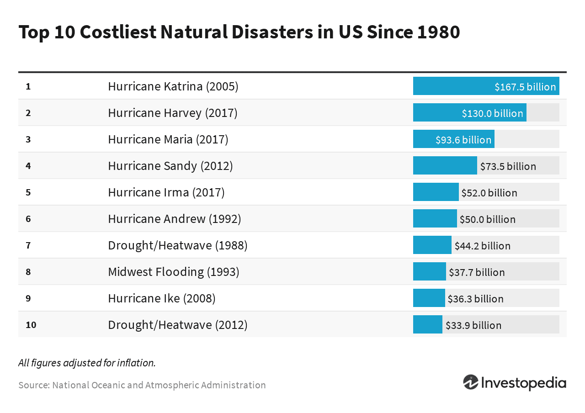

## Table of Contents

## What is disaster loss?

Disaster loss refers to the damage and negative impacts that happen because of a disaster. This can include things like buildings being destroyed, people getting hurt or losing their lives, and the economy being affected. Disasters can be natural, like earthquakes and floods, or caused by humans, like oil spills and wars. When a disaster strikes, it can lead to a lot of loss that affects individuals, communities, and even whole countries.

The impact of disaster loss can be felt in many ways. For example, if a hurricane destroys homes and businesses, people might lose their jobs and have nowhere to live. This can lead to a lot of stress and hardship. Governments and organizations often have to step in to help by providing money, food, and shelter. But even with help, it can take a long time for things to get back to normal. Understanding and preparing for disaster loss is important so that we can reduce its impact and help people recover more quickly.

## What are the common types of disasters that lead to loss?

Disasters that cause loss can be split into two main groups: natural disasters and human-made disasters. Natural disasters are events caused by nature, like earthquakes, hurricanes, floods, tornadoes, and wildfires. These events can destroy homes, buildings, and roads, and they can also harm people and animals. For example, an earthquake can make buildings fall down and trap people inside, while a flood can wash away entire neighborhoods.

Human-made disasters are caused by people, either on purpose or by accident. Examples include oil spills, nuclear accidents, wars, and terrorist attacks. These disasters can also lead to a lot of loss. An oil spill can harm the environment and kill wildlife, while a war can destroy cities and cause many people to lose their homes and loved ones. Both types of disasters can have a big impact on communities and require a lot of time and effort to recover from.

## How does disaster loss impact individuals and communities?

Disaster loss can really hurt individuals and communities. When a disaster happens, people might lose their homes, their jobs, and even their loved ones. This can make them feel sad, scared, and worried about the future. For example, if a hurricane destroys someone's house, they might have to live in a shelter or with family while they try to find a new place to live. This can be very hard and stressful, especially if they don't have enough money to rebuild.

Communities also feel the impact of disaster loss. When many people in a town lose their homes or jobs, the whole community can struggle. Schools might close, businesses might shut down, and it can be hard for people to get the things they need, like food and medicine. The community might need help from the government or other organizations to start recovering. It can take a long time for everything to get back to normal, and sometimes things are never the same as before.

## What are the basic mechanisms through which disasters cause financial loss?

Disasters can cause financial loss in several ways. First, they can destroy buildings and homes. When a hurricane or earthquake hits, it can break windows, knock down walls, and even make entire buildings collapse. Fixing or rebuilding these structures costs a lot of money. People might have to pay for repairs themselves or rely on insurance, but either way, it's a big expense. Businesses can also be affected because they might have to close while they fix their buildings, which means they lose money they would have made from selling things or providing services.

Another way disasters cause financial loss is by hurting the economy. When a disaster strikes, it can stop people from going to work or shopping. Roads might be blocked, making it hard for people to get around. If a lot of people in an area can't work, the whole economy can slow down. This can lead to businesses losing money and people losing their jobs. Governments might have to spend a lot of money to help people and fix things, which can affect the budget for other important things like schools and hospitals. Overall, disasters can have a big impact on everyone's finances, from individuals to the whole community.

## How is disaster loss calculated for personal property?

When a disaster happens, figuring out how much personal property was lost can be tough. People usually start by making a list of everything that got damaged or destroyed. This can include things like furniture, clothes, electronics, and even important papers. They then need to find out how much it would cost to replace these items or fix them. This can be done by looking at the original price of the items or getting quotes from stores or repair services. Insurance companies often help with this process by sending someone to look at the damage and help figure out the total cost.

Once the list is made and the costs are added up, people can see how much money they lost because of the disaster. If they have insurance, they might be able to get some of this money back. But insurance doesn't always cover everything, and sometimes people have to pay for things themselves. This can be really hard, especially if they don't have a lot of money saved up. Knowing how much was lost helps people plan for the future and start rebuilding their lives.

## What role do insurance companies play in disaster loss?

Insurance companies are very important when it comes to disaster loss. They help people by paying for some of the damage that happens during a disaster. When someone has insurance, they pay money to the insurance company every month or year. In return, if a disaster like a fire or a flood happens, the insurance company will help pay to fix or replace what was damaged. This can make a big difference because it means people don't have to pay for everything themselves, which can be really expensive.

But insurance companies also have to be careful. They need to make sure they have enough money to pay for all the claims people make after a disaster. Sometimes, if a lot of people are affected by a big disaster, it can be hard for the insurance company to pay everyone. They might have to raise prices or change what they cover to make sure they can keep helping people in the future. This is why it's important for people to understand their insurance policies and know what is covered and what isn't, so they can be ready for anything that might happen.

## How do governments assess and manage disaster loss?

Governments have a big job when it comes to assessing and managing disaster loss. After a disaster happens, they send out teams to look at the damage. These teams check how many buildings are destroyed, how many people are hurt or have lost their homes, and how the disaster has affected the economy. They use this information to figure out how much money and help is needed to fix things and help people recover. Governments also work with other organizations, like the Red Cross, to make sure everyone gets the help they need.

Once the damage is assessed, governments start managing the disaster loss. They give money to people who lost their homes or businesses, and they help rebuild roads, schools, and hospitals. Sometimes, they have to change their budget to make sure there's enough money to help everyone. Governments also try to learn from each disaster so they can be better prepared next time. They might change laws or build better buildings to make sure the same kind of disaster doesn't cause as much damage in the future.

## What are the advanced methods used for calculating economic impact of disaster loss?

Advanced methods for calculating the economic impact of disaster loss use special computer models and data analysis. These models look at many different things, like how much damage was done to buildings and roads, how many people lost their jobs, and how the disaster affected the local economy. They use a lot of numbers and [statistics](/wiki/bayesian-statistics) to figure out the total cost of the disaster. These models can also predict how long it will take for the economy to recover and what might happen if another disaster strikes in the future. This helps governments and businesses plan better and get ready for what might come next.

Another way to calculate the economic impact of disaster loss is by using something called input-output analysis. This method looks at how different parts of the economy are connected. For example, if a factory is destroyed, it might not just affect the people who work there, but also the businesses that sell things to the factory and the stores that sell the factory's products. Input-output analysis helps figure out all these connections and how they affect the economy as a whole. By understanding these links, experts can see the full picture of how a disaster impacts the economy and come up with better plans to help everyone recover.

## How does disaster loss affect long-term economic growth and development?

Disaster loss can slow down long-term economic growth and development in a big way. When a disaster happens, it can destroy important things like roads, schools, and hospitals. This means that people can't get to work, kids can't go to school, and sick people can't get the care they need. All of this can make it hard for the economy to grow. Businesses might have to close or move away, and it can take a long time to fix everything. This can make people lose trust in the future and be less willing to invest in new projects or start new businesses.

On the other hand, disasters can also lead to some positive changes in the long run. Governments and communities might learn from the disaster and build stronger, safer buildings and better emergency plans. This can help prevent as much damage in the future. Also, after a disaster, there might be a lot of money and help coming in from other places to rebuild. This can create new jobs and help the economy grow again. But even with these good changes, it can still take many years for a place to fully recover from a big disaster and get back on track with its economic growth and development.

## What are the challenges in accurately quantifying disaster loss?

It can be really hard to figure out exactly how much a disaster costs. One big problem is that disasters can affect so many different things at once. They can destroy buildings, hurt people, and mess up the economy. It's tough to add up all these different kinds of damage and turn them into a single number. Plus, some things, like how sad or scared people feel after a disaster, can't be measured with money at all. This makes it even harder to get a full picture of the loss.

Another challenge is that the information we need to calculate disaster loss can be hard to get. Right after a disaster, it can be chaotic, and it might take a while to find out how many buildings were damaged or how many people lost their jobs. Sometimes, people don't report all their losses, or they might not even know how much they've lost. Also, the cost of fixing things can change over time, which makes it tricky to come up with a final number. All these things make it really difficult to accurately quantify disaster loss.

## How can technology and data analytics improve disaster loss assessment?

Technology and data analytics can really help make disaster loss assessment better. They can do this by using special computer programs to look at a lot of information quickly. For example, satellites can take pictures from space to see how much damage a disaster caused to buildings and roads. Drones can fly over the disaster area and take even more detailed pictures. All this information can be put into a computer, which then uses math to figure out how much everything cost. This makes the assessment faster and more accurate than if people had to go out and look at everything themselves.

Data analytics can also help by looking at patterns and making predictions. For instance, computers can look at past disasters and see what usually happens after them. They can then use this information to guess how long it will take for the economy to recover from a new disaster. This helps governments and businesses plan better and get ready for what might come next. By using technology and data analytics, we can understand disaster loss better and help people and communities recover more quickly.

## What are the international standards and protocols for reporting disaster loss?

International standards and protocols for reporting disaster loss help countries and organizations share information in a clear way. One important set of standards is from the United Nations. They have something called the Sendai Framework, which gives guidelines on how to collect and report data about disasters. This helps everyone use the same methods, so it's easier to compare and understand disaster loss around the world. The Sendai Framework asks countries to report on things like how many people were affected, how much damage was done to buildings and the economy, and how well they were able to recover.

Another important protocol is from the World Bank and the United Nations Development Programme. They have a system called the DesInventar, which is a database where countries can enter information about disasters. This system helps keep track of all kinds of disasters, big and small, and makes sure the data is organized and easy to use. By following these international standards and protocols, countries can work together better to understand disaster loss and help each other recover.

## What is involved in understanding disaster management and loss calculation?

Disaster management encompasses strategies designed to prepare for, respond to, and recover from catastrophic events. These strategies are essential for minimizing the impacts of disasters on human life, property, and the economy. Effective disaster management requires accurate calculation of losses, which serves as a vital component in understanding the financial repercussions of these events.

### Loss Calculation in Disaster Management

Loss calculation is a critical process that quantifies the financial impact of disasters. Accurate loss assessments aid in strategic planning and are instrumental in acquiring necessary relief funds. They help policymakers and stakeholders make informed decisions about resource allocation, insurance claims, and rebuilding efforts.

#### Methodologies for Calculating Losses

Calculating disaster-related losses involves several methodologies, each contributing to a comprehensive financial understanding. These methodologies include considerations of taxation, insurance claims, and federal assistance provided under legislative frameworks such as the Robert T. Stafford Disaster Relief and Emergency Assistance Act.

- **Taxation:** Tax codes may provide deductions for losses incurred due to disasters, allowing individuals and businesses to reduce their taxable income. This can lighten the financial burden on those affected and support quicker economic recovery. For instance, the Internal Revenue Service (IRS) provides guidelines for claiming casualty losses, where the loss amount can be calculated as:
$$
  \text{Casualty Loss} = \text{Adjusted Basis of Property} - \text{Fair Market Value After Loss} - \text{Insurance Reimbursement}

$$

- **Insurance Claims:** Insurance plays a pivotal role in disaster loss calculation. Policies typically cover a portion of the damages, and accurate claims assessments are essential for restoring insured entities to their financial position pre-disaster. Insurers use established methodologies to estimate costs, considering factors like asset depreciation and prevalent market conditions.

- **Federal Assistance:** Under the Robert T. Stafford Act, the U.S. federal government offers financial and logistical support in disaster-stricken areas. This includes public assistance grants for emergency work and permanent work necessary to alleviate immediate threats to life and property. The Act emphasizes the importance of integrating federal efforts with local and state initiatives to optimize recovery processes.

These methodologies collectively enable a detailed financial portrait of disaster impacts, thereby facilitating targeted recovery initiatives and efficient allocation of resources. Understanding and leveraging these mechanisms can significantly enhance resilience and aid in faster recovery from disasters.

## How can we calculate disaster loss in financial terms?

Calculating financial loss due to disasters involves several key steps, including evaluating the extent of physical damage, quantifying asset depreciation, and considering adjustments from insurance claims. These calculations are crucial for both individual taxpayers and businesses to determine valid deductions and financial recovery strategies.

### Process of Calculating Financial Loss

1. **Assessment of Physical Damage**: The initial step involves assessing the physical damage caused by the disaster. This typically requires professional evaluations to estimate repair or replacement costs. An accurate damage assessment sets the foundation for further loss calculations.

2. **Asset Depreciation**: Depreciation plays a critical role in financial loss calculations. Depreciation accounts for the decline in value of an asset over time due to wear and tear or obsolescence. Calculating the net book value prior to the disaster helps in determining the actual loss. The formula for depreciation using the straight-line method is:
$$
   \text{Depreciation Expense} = \frac{\text{Cost of Asset} - \text{Salvage Value}}{\text{Useful Life of Asset}}

$$

3. **Insurance Claims**: Adjustments based on insurance claims are crucial to accurately report the net loss. Insurance policies often cover a portion of the losses, and the sum recovered must be subtracted from the total calculated damage to reflect the net loss accurately.

### Application of Disaster Loss Deductions

For taxpayers and businesses, the ability to deduct disaster-related losses from taxable income offers significant financial relief. The Internal Revenue Service (IRS) allows individuals and businesses to claim deductions for both catastrophic events and federally declared disasters. Businesses can deduct such losses from their taxable income in the year the disaster occurred, offering a means of mitigating financial distress.

For example, following a hurricane, a business may calculate its losses by considering the depreciated value of damaged inventory and equipment minus any insurance compensation received. This net loss can then be reported to tax authorities as a disaster loss deduction.

### Real-World Examples

In events such as hurricanes or earthquakes, precise calculations and timely reporting of losses can expedite recovery efforts. Consider a scenario where a taxpayer’s residential property is damaged by an earthquake. The process would involve:

- Estimating the market value of the property before and after the earthquake.
- Calculating any depreciation of the property's value.
- Adjusting for received insurance payouts to determine the net loss.

These calculations not only assist in tax deductions but also facilitate better financial planning, enabling individuals and businesses to allocate resources effectively in recovery phases.

Appropriate preparation and calculation of disaster losses ensure that victims, whether individual taxpayers or businesses, can leverage available financial instruments and provisions accurately, paving the way for well-structured recovery and strategic financial planning post-disaster.

## References & Further Reading

[1]: Bergstra, J., Bardenet, R., Bengio, Y., & Kégl, B. (2011). ["Algorithms for Hyper-Parameter Optimization."](https://dl.acm.org/doi/10.5555/2986459.2986743) Advances in Neural Information Processing Systems 24.

[2]: ["Advances in Financial Machine Learning"](https://www.amazon.com/Advances-Financial-Machine-Learning-Marcos/dp/1119482089) by Marcos Lopez de Prado

[3]: ["Evidence-Based Technical Analysis: Applying the Scientific Method and Statistical Inference to Trading Signals"](https://www.amazon.com/Evidence-Based-Technical-Analysis-Scientific-Statistical/dp/0470008741) by David Aronson

[4]: The United States Code. The Robert T. Stafford Disaster Relief and Emergency Assistance Act (Public Law 100-707). Available from: https://www.fema.gov/disaster/stafford-act

[5]: ["Machine Learning for Algorithmic Trading"](https://github.com/stefan-jansen/machine-learning-for-trading) by Stefan Jansen

[6]: ["Quantitative Trading: How to Build Your Own Algorithmic Trading Business"](https://www.amazon.com/Quantitative-Trading-Build-Algorithmic-Business/dp/1119800064) by Ernest P. Chan

[7]: Federal Emergency Management Agency. ["Understanding Disaster Assistance: A Guide to Federal Disaster Assistance for Families and Individuals."](https://en.wikipedia.org/wiki/Federal_Emergency_Management_Agency)