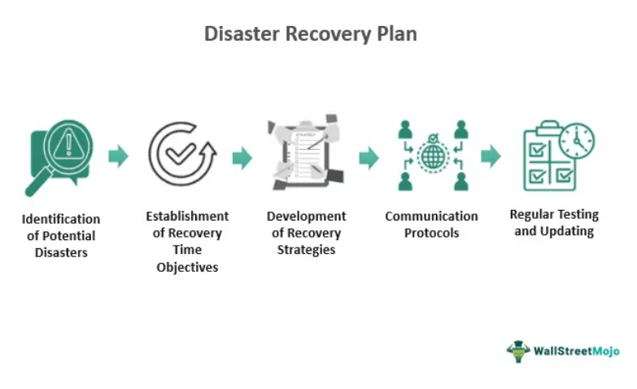

Algorithmic trading, often referred to as algo trading, uses automated software programs to execute trades in financial markets. These programs utilize complex algorithms to analyze data, monitor market conditions, and execute orders at speeds and frequencies that are beyond human capabilities. By capitalizing on market inefficiencies, algo trading offers significant advantages, such as increased speed and accuracy, reduced transaction costs, and the ability to swiftly adapt to market changes. These benefits have made algorithmic trading a critical component in modern financial markets, underpinning a significant portion of trading volume across global exchanges.

However, with these advancements come inherent risks, particularly when unforeseen disasters occur. Disasters, whether physical like earthquakes and fires or natural phenomena such as hurricanes and tsunamis, can destabilize the infrastructure essential for algorithmic trading. Moreover, the financial sector is continually threatened by technological failures, including software glitches and cyber-attacks, which can exacerbate the impact of disasters.

This article examines how different types of disasters affect algorithmic trading, offering insight into the dynamics of algorithmic systems under stress. By understanding these impacts, investors and market participants can better prepare and adapt their strategies to manage the repercussions of unexpected catastrophes on financial markets. Effective disaster response and risk management are critical to ensuring the stability and resilience of algorithmic trading in the face of these challenges.

## Table of Contents

## Understanding Algorithmic Trading

Algorithmic trading, commonly known as algo trading, involves the use of automated software to execute trades in financial markets at speeds and frequencies that are beyond human capability. The primary goal is to leverage complex mathematical models and algorithms to make decisions about the timing, price, and quantity of trades, thereby minimizing costs and maximizing profits.

### Significance in Modern Financial Markets

Algo trading has revolutionized the landscape of finance by enhancing market [liquidity](/wiki/liquidity-risk-premium) and efficiency. Its ability to process vast amounts of data in real-time and execute trades at lightning speed has made it an indispensable component of the financial ecosystem. This form of trading is particularly significant due to its role in improving price discovery and market stability, as algorithms can quickly respond to market fluctuations and capitalize on [arbitrage](/wiki/arbitrage) opportunities. 

### Types of Algorithms

Different types of algorithms are employed depending on the trading strategy and objectives:

1. **Arbitrage Algorithms**: These exploit price discrepancies of the same asset in different markets. For example, if a stock is priced differently on two exchanges, an arbitrage algorithm will buy the stock on the cheaper exchange and sell it on the more expensive one, profiting from the difference.

2. **Trend-Following Algorithms**: These are designed to follow and predict trends using technical indicators such as moving averages. They buy when a positive trend is detected and sell when the trend reverses, adhering to the principle that "the trend is your friend."

3. **High-Frequency Trading (HFT)**: This involves executing orders of large quantities at extremely high speeds, usually within microseconds. HFT firms aim to capture small price changes over very short time frames. The success of HFT algorithms hinges on their ability to access low-latency trading infrastructure and data feeds.

### Requirements for Successful Algo Trading

For algo trading to be successful, several critical requirements must be met:

- **Data Accuracy**: Accurate and high-quality data is essential, as algorithms rely on this data to make informed decisions. Even small errors can lead to significant financial losses.

- **Speed**: Execution speed is crucial, especially for strategies like high-frequency trading, where even microsecond delays can result in lost opportunities. Advanced network and server technologies are employed to reduce latency and enhance performance.

- **Efficient Execution**: Algorithms must be designed to execute trades with minimal market impact. This involves smart order routing and employing tactics to avoid revealing trading intentions, which could affect market prices unfavorably.

In conclusion, [algorithmic trading](/wiki/algorithmic-trading) stands as a cornerstone of contemporary financial markets, driven by sophisticated algorithms that require precision in data, speed, and execution. As the landscape continues to evolve, the importance of these requirements grows, ensuring that algo trading remains a powerful tool for market participants.

## Physical Disasters

Physical disasters, such as earthquakes, fires, and terrorist attacks, pose significant threats to the infrastructure critical for algorithmic trading. These events can lead to widespread disruption by impacting data centers, trading floors, and network systems integral to the functioning of financial markets.

Data centers, which are the backbone of trading operations, are particularly vulnerable during physical disasters. Earthquakes, for instance, can damage the structural integrity of buildings housing these centers, leading to potential hardware failures. The loss or unreliability of power supplies, often a consequence of such disasters, further exacerbates the risks, impeding the smooth operation of servers essential for executing trades. Similarly, fires can cause immediate physical harm and damage critical data storage and processing equipment, leading to data loss and system inefficiencies. Notably, in 2012, an earthquake off the coast of Japan disrupted not only telecommunications but also the operations of major data centers, causing trading interruptions across Asia.

Trading floors, though largely replaced by electronic trading, remain pivotal in various financial institutions worldwide. Disasters like terrorist attacks can lead to the immediate evacuation and shutdown of these floors. The September 11 attacks in 2001 are a prominent example, where the destruction of key infrastructure in New York led to the closure of U.S. markets for several days, disrupting global trading activities significantly.

Network systems that support the seamless flow of information are also highly susceptible to physical disasters. These systems rely heavily on physical infrastructure, such as undersea cables and local transmission grids, which can be damaged by natural events, resulting in delayed or lost communication. For example, the Taiwan earthquake in 2006 disrupted major undersea cables, causing extensive internet and communication blackouts affecting trading systems reliant on these networks.

The impact of these disasters is not limited to physical damage alone but extends to market behavior. The uncertainty and instability introduced by these events can cause market [volatility](/wiki/volatility-trading-strategies), complicating the algorithms designed for stable trading environments. As seen during the 2010 eruption of the Eyjafjallajökull volcano in Iceland, even natural disasters that do not directly hit financial hubs can disrupt global logistics and communications, leading to unforeseen trading outcomes.

Mitigating the effects of physical disasters on trading infrastructure involves strategic planning and investment in redundancies. Disaster recovery plans, alongside robust data backup systems and diversification of data center locations, are critical components in ensuring trading continuity. Furthermore, implementing real-time monitoring systems to detect and respond to infrastructure threats can significantly minimize downtime and potential losses during unexpected events.

## Natural Disasters

Natural disasters, such as hurricanes, floods, and tsunamis, significantly influence financial markets by inducing marked volatility and altering investor behavior, often resulting in complications for algorithmic trading strategies.

**Market Volatility and Investor Behavior**

Natural disasters introduce abrupt environmental changes that disrupt businesses and economies, leading to heightened market volatility. For instance, the sudden onset of a hurricane can halt industrial activities, damage infrastructure, and create uncertainty about future economic performance. Such events tend to amplify risk perceptions among investors, leading to frantic buying or selling as they attempt to hedge against potential losses. This erratic trading behavior increases price volatility, rendering previous algorithmic models potentially ineffective if they fail to anticipate or adapt to such rapid fluctuations. Typically, volatility ($\sigma$) is measured using statistical models that incorporate standard deviation of market returns:

$$
\sigma = \sqrt{\frac{\sum (R_i - \bar{R})^2}{N}}
$$

where $R_i$ represents individual asset returns, $\bar{R}$ is the average return, and $N$ denotes the number of observations. During disasters, the value of $\sigma$ spikes, indicating increased uncertainty.

**Algorithmic Strategies Affected**

Algorithmic trading systems rely heavily on historical data and predictive models to execute trades based on perceived opportunities in the market. Natural disasters disrupt this reliance by introducing non-normal returns and skewed data distributions that such algorithms may not be equipped to handle effectively. For example, trend-following strategies, which assume that asset prices follow historical patterns, may suffer as baselines drawn from stable periods no longer apply in disaster-induced markets. Similarly, arbitrage opportunities might support distorted pricing as liquidity constraints and irregular trading volumes manifest. High-frequency trading ([HFT](/wiki/high-frequency-trading-strategies)) systems that capitalize on minute-to-minute inefficiencies can also be affected by increased latency and varied price movements that defy conventional logic.

**Historical Examples**

The 2011 Fukushima disaster exemplifies how natural calamities can interfere with trading activities. Following the earthquake and resulting tsunami, Japanese markets experienced unprecedented volatility, compelling many algorithmic trading systems to either recalibrate or shut down temporarily. The Tokyo stock market observed sudden price discrepancies and trading halts as the disaster unfolded, challenging the efficacy of traditional algo trading systems that struggled to account for the disruption (Purbaningsih, 2014).

Another instance is Hurricane Katrina in 2005, which caused massive dislocations in the U.S. energy markets. The ensuing oil price volatility burdened algorithmic models that traded in energy commodities or reliant equities, as pre-disaster data could not accurately predict the supply shock and regional economic impacts caused by the hurricane.

Understanding these dynamics underscores the need for sophisticated algorithms capable of adapting to extreme market shifts ushered in by natural disasters. Enhancements in real-time data processing and integration of [alternative data](/wiki/best-alternative-data) sources, such as weather models, are potential strategies to mitigate these impacts on algorithmic trading systems.

## Technological Failures

Technological failures, including software glitches and cyber-attacks, present substantial threats to algorithmic trading. These failures can result in unintended trades, leading to significant financial losses and market instability. Automated trading systems rely heavily on complex software, which, despite rigorous testing, can still harbor bugs or be subject to unexpected behavior under certain conditions. For instance, software malfunctions may trigger erroneous orders if the algorithms misinterpret data inputs or execute trades based on flawed logic.

One typical scenario involves incorrect data inputs that can skew algorithmic decisions. Algorithmic trading systems process vast amounts of data in real-time, and any anomalies in this data—such as incorrect market prices or delayed information—can cause the algorithms to react inappropriately. For instance, if a trading algorithm incorrectly interprets a transient spike in trading [volume](/wiki/volume-trading-strategy) as a lasting trend, it may execute a series of trades that are unaligned with market conditions, resulting in financial losses.

Real-life instances underline these risks. The Flash Crash of May 6, 2010, is a notable example where a combination of algorithmic trading strategies and a significant volume of sell orders triggered a sudden, severe drop in the United States stock market. A mutual fund's large sale order, executed through automated trading systems designed to hedge risk, led to a rapid escalation of sell orders across the market. The algorithms continued to sell as prices dropped abruptly, demonstrating how software misinterpretations under high-stress conditions can exacerbate market volatility.

Cyber-attacks pose another significant threat. As trading infrastructures become more digital, the potential for malicious actors to exploit software vulnerabilities increases. These intrusions can lead to unauthorized trades, data theft, and disruptions in trading operations. For example, in 2013, several major exchanges were targeted by cyber-attacks, causing temporary halts in trading activities and emphasizing the necessity for robust cybersecurity measures in protecting algorithmic trading systems.

Algorithmic trading systems must incorporate rigorous testing, real-time monitoring, and effective contingency plans to mitigate the risks associated with technological failures. By adopting such measures, financial institutions can help ensure the reliability and security of algorithmic trading operations despite potential technological challenges.

## Market Abnormalities

Algorithmic trading, characterized by its reliance on automated decision-making processes, can sometimes exacerbate market abnormalities, such as flash crashes. These sudden, severe price drops or spikes occur in very short timeframes, often within minutes or seconds. The "Flash Crash" of May 6, 2010, is a notable example where the Dow Jones Industrial Average plummeted nearly 1,000 points in minutes, only to recover those losses shortly thereafter. The event highlighted the potential vulnerabilities of markets heavily reliant on algorithmic trading.

Flash crashes can be attributed to a combination of factors often set off by a triggering event, such as an unexpected market movement, that then leads to a cascade of rapid automated selling or buying orders. High-frequency trading (HFT) firms, employing computer algorithms, execute numerous trades at lightning speed, which can amplify the cascade effect and drain liquidity from the markets. In stress conditions, these algorithms behave according to pre-set rules without contextual judgment, potentially accelerating the downward spiral of asset prices.

In response to such abnormalities, market regulatory bodies have implemented several measures. One key intervention is the introduction of circuit breakers, also known as trading pauses, which temporarily halt trading on exchanges during periods of extreme volatility. These pauses are intended to provide a buffer time for market participants to assess market conditions and act more judiciously, thereby preventing panic-driven sell-offs or buy-ins. 

The implications of market abnormalities on trading regulations and strategies are significant. Regulators, such as the U.S. Securities and Exchange Commission (SEC) and the Financial Industry Regulatory Authority (FINRA), have reinforced their scrutiny of algorithmic methodologies and the risk management systems employed by trading firms. This has led to more stringent requirements for firms to test their algorithms under various simulated conditions before deployment. Additionally, there are expectations for ongoing monitoring and auditing of algorithm performance to ensure compliance with safety standards.

Algorithmic strategy revisions are also necessitated by the lessons learned from these events. Traders are increasingly incorporating safeguards within their algorithms, such as volatility detection measures, to dynamically adjust trading behavior based on real-time market analysis. Moreover, there is a growing emphasis on incorporating [machine learning](/wiki/machine-learning) techniques, allowing algorithms to learn from historical data and potentially predict or identify early signs of flash crashes or other anomalies.

In conclusion, while algorithmic trading offers significant efficiencies and opportunities within financial markets, it also poses unique risks that must be managed carefully. Regulatory frameworks and advanced algorithmic strategies are evolving to mitigate these risks, aiming to create a trading environment that balances speed and precision with stability and safety.

## Risk Management in Algorithmic Trading

Algorithmic trading, with its reliance on quantitative models and automated decision-making, is vulnerable to various disruptions. Effective risk management is critical to ensure the stability and reliability of these systems during disasters, both physical and natural.

Contingency plans are the cornerstone of risk management strategies in algorithmic trading. These plans involve predefined protocols that outline steps to be taken when unexpected events occur. For example, if a natural disaster disrupts a major data center, contingency plans may dictate an automatic switch to backup systems located in geographically distant locations. Redundancy systems play a crucial role here, as they ensure that trading operations can continue without interruption even when primary infrastructure components fail. Implementing multiple data feeds and backup communication networks can help mitigate risks associated with data inaccuracies or connectivity loss.

Human oversight is another vital component of risk management in algorithmic trading. Automated systems, despite their efficiency, are not infallible. In times of crisis, human intervention can help interpret complex scenarios that algorithms may not be programmed to handle. Trading desks often employ a layer of human supervision to monitor automated systems, ready to halt or adjust trading activities when necessary. This human element ensures that potential errors or malfunctions can be detected and corrected swiftly.

Regulation plays a pivotal role in maintaining the safety and stability of algorithmic trading practices. Regulatory bodies enforce rules designed to protect market integrity and prevent the exacerbation of trading disruptions during disasters. For instance, circuit breakers are regulatory mechanisms that pause trading across exchanges if prices drop or rise too precipitously within a short period, thereby preventing a cascade of panic selling or buying. These measures help curb the impact of sudden market movements that could trigger algorithmic strategies into executing unintended trades.

Moreover, regulations often require trading firms to perform regular stress testing of their systems, simulating adverse conditions to evaluate their resilience. This proactive approach helps identify potential vulnerabilities and reinforces the robustness of trading algorithms. Regulatory frameworks also mandate transparency, requiring firms to document the logic behind their algorithms and maintain logs of their decisions and actions. This documentation aids in post-event analyses and lays the groundwork for improvements in trading strategies and systems.

In preparing for physical and natural disasters, firms can adopt technologies like distributed ledger systems, which enhance data integrity and provide tamper-proof records of all transactions. Such advancements contribute to building more resilient trading environments capable of withstand diverse disruptions.

In summary, a robust risk management strategy in algorithmic trading integrates contingency planning, redundancy, human oversight, and regulatory adherence. By implementing these measures, trading firms can safeguard their operations and preserve market stability during unforeseen disasters. These strategies not only protect individual firms but also contribute to the broader financial ecosystem's resilience.

## Conclusion

Understanding the impact of disasters on algorithmic trading is crucial for ensuring the stability and resilience of financial markets. Disasters, whether physical, natural, or technological, can cause significant disruptions to algo trading systems, leading to erratic market behavior and potential financial losses. By analyzing these impacts, investors and market participants can better prepare for adverse events.

Robust systems and strategies are necessary to mitigate the risks associated with disasters. This includes developing contingency plans and redundancy systems that can maintain trading operations despite disruptions. Human oversight plays a vital role in monitoring algorithmic activities and intervening during crises to prevent unintended trades and market anomalies. Furthermore, regulatory frameworks should enforce standards that promote stability and protect market participants from systemic failures.

Encouraging ongoing research and development is essential for improving the resilience of algorithmic trading infrastructures. This entails investing in advanced technologies, enhancing data accuracy, and developing algorithms that can adapt to volatile conditions. By fostering innovation and collaboration within the financial industry, institutions can better anticipate and respond to the challenges posed by disasters. Continued efforts in this direction will contribute to a more robust and secure trading environment.

## References & Further Reading

[1]: Hirsa, A. (2013). ["Computational Methods in Finance."](https://www.routledge.com/Computational-Methods-in-Finance/Hirsa/p/book/9781439829578) CRC Press.

[2]: Purbaningsih, S.A. (2014). ["Reflections on Risk Management and Algorithms Post-Fukushima Disaster"](https://scholar.google.com/citations?user=EcB-7vAAAAAJ), Journal of Financial Markets.

[3]: Lopez de Prado, M. (2018). ["Advances in Financial Machine Learning."](https://www.amazon.com/Advances-Financial-Machine-Learning-Marcos/dp/1119482089) Wiley.

[4]: Johnson, B. (2010). ["Algorithmic Trading & DMA: An Introduction to Direct Access Trading Strategies."](https://www.amazon.com/Algorithmic-Trading-DMA-introduction-strategies/dp/0956399207) 4Myeloma Press.

[5]: McGinnis, J. "Risk Management in the Era of High Frequency Trading: Mandate for Trade Surveillance Systems." Financial Services Review, Vol. 21, no. 2, 2017.