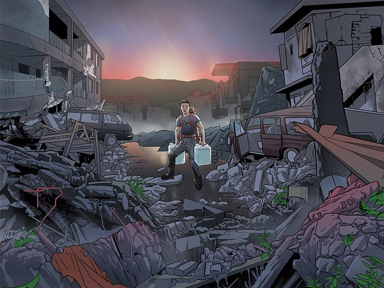

## Table of Contents

## What is a disaster?

A disaster is a sudden event that causes a lot of damage and harm. It can be caused by nature, like earthquakes, hurricanes, or floods. It can also be caused by people, like wars or accidents. Disasters can destroy homes, buildings, and roads. They can also hurt or kill many people and animals.

When a disaster happens, it can be very hard for the people who live in the affected area. They might lose their homes and belongings. They might not have food, water, or a safe place to stay. People often need help from others to recover from a disaster. This help can come from their community, their government, or even from people in other countries.

After a disaster, it takes time to rebuild and heal. People work together to fix what was broken and to make their lives better again. It's important for everyone to be ready for disasters, so they know what to do when one happens. This can help to keep more people safe and make recovery easier.

## What are the main types of natural disasters?

Natural disasters are events caused by nature that can harm people and damage buildings and the environment. Some main types of natural disasters are earthquakes, which happen when the earth's surface shakes; hurricanes, which are strong storms with heavy rain and high winds; and floods, which occur when too much water covers the land. These disasters can happen suddenly and can be very destructive.

Other types of natural disasters include tornadoes, which are fast-spinning columns of air that can destroy anything in their path; wildfires, which are large fires that spread quickly and burn forests and homes; and tsunamis, which are huge waves caused by underwater earthquakes or volcanic eruptions. These events can also cause a lot of damage and can be dangerous for people and animals.

Volcanic eruptions are another type of natural disaster. They happen when a volcano releases hot lava, ash, and gas. This can destroy everything around the volcano and can affect the air quality far away. Droughts, which are long periods without rain, can also be considered natural disasters because they can lead to water shortages and harm crops and wildlife.

## What are the main types of physical or man-made disasters?

Physical or man-made disasters are events caused by people that can harm others and damage buildings and the environment. Some main types of these disasters are industrial accidents, which happen when something goes wrong in a factory or plant, like a chemical spill or explosion. Another type is transportation accidents, which include plane crashes, train derailments, and big road accidents. These events can cause a lot of damage and can be dangerous for people and the environment.

Wars and acts of terrorism are also man-made disasters. Wars involve fighting between countries or groups, which can destroy cities and kill many people. Acts of terrorism are violent actions done to scare people and achieve a political goal, like bombings or shootings. These disasters can cause a lot of harm and can affect many people's lives.

Other types of man-made disasters include nuclear accidents, which happen when something goes wrong at a nuclear power plant, like the Chernobyl disaster. Pollution and environmental damage caused by human activities, like oil spills and deforestation, can also be considered man-made disasters because they harm the environment and can affect people's health and livelihoods.

## How do natural disasters form?

Natural disasters form in different ways depending on what kind they are. Earthquakes happen when big pieces of the earth's crust, called tectonic plates, move and bump into each other. This movement can cause the ground to shake a lot. Hurricanes start over the ocean when warm air rises and creates a low-pressure area. This makes the winds spin faster and faster, turning into a big storm with lots of rain and high winds. Floods can happen when there is too much rain or when rivers and lakes overflow, covering the land with water.

Tornadoes form when warm, moist air meets cold, dry air, creating a spinning column of air that can be very destructive. Wildfires start when dry plants catch fire, and the fire spreads quickly because of wind or hot weather. Tsunamis are huge waves caused by earthquakes or volcanic eruptions under the ocean. The movement of the earth's crust pushes water up and creates big waves that can travel far and crash onto land. Volcanic eruptions happen when pressure builds up inside a volcano and it releases hot lava, ash, and gas. Droughts form when there is not enough rain for a long time, making the land dry and causing water shortages.

All these natural disasters can start suddenly and can be very hard to predict. Understanding how they form can help people prepare and stay safe when they happen.

## What are the immediate effects of disasters on communities?

When a disaster hits a community, it can cause a lot of damage right away. Buildings and homes can be destroyed, making it hard for people to find a safe place to stay. Roads and bridges might be broken, which can make it difficult for help to reach the people who need it. People can get hurt or even lose their lives. There might not be enough food, water, or electricity, which can make life very hard for everyone in the community. The sudden loss of things they need can make people feel scared and unsure about what will happen next.

The immediate effects can also change how the community works. Schools and hospitals might have to close, which can stop children from learning and make it harder for sick people to get the care they need. Businesses can be damaged or destroyed, which can mean people lose their jobs and have less money to live on. The community might also lose important services like police and fire departments, making it harder to stay safe. All these changes can make people feel stressed and worried, and it can take a long time for the community to start feeling normal again.

## How can individuals prepare for a disaster?

To prepare for a disaster, individuals should make a plan with their family. This plan should include where to meet if you get separated, how to contact each other, and what to do in different types of disasters. It's important to practice this plan so everyone knows what to do when a disaster happens. Also, make sure to have an emergency kit ready. This kit should have water, food that lasts a long time, a flashlight, batteries, a first-aid kit, and important medicines. Keep the kit in an easy-to-reach place so you can grab it quickly if you need to leave your home.

Another way to prepare is to learn about the risks in your area. Find out what kinds of disasters are most likely to happen where you live, like earthquakes, hurricanes, or floods. You can get information from local government websites or community meetings. Once you know the risks, you can take steps to make your home safer. For example, you can secure heavy furniture to the walls to stop it from falling over in an earthquake, or you can have storm shutters to protect your windows during a hurricane. Being ready and knowing what to do can help keep you and your family safe when a disaster strikes.

## What are the long-term impacts of disasters on society and the environment?

Disasters can have big effects on society that last a long time. After a disaster, people might need to rebuild their homes and businesses, which can take years. Some people might lose their jobs and have a hard time finding new ones, making it tough for them to get back on their feet. Communities might also see changes in how they work. For example, schools and hospitals might take a long time to reopen, which can affect children's education and people's health. The stress and trauma from the disaster can also affect people's mental health for a long time, making it hard for them to feel normal again. All these changes can make life harder for everyone in the community and can change how the community grows and develops in the future.

Disasters can also harm the environment in ways that last a long time. For example, a big oil spill can pollute the water and kill fish and other animals, affecting the whole ecosystem. Forests that burn in wildfires might take many years to grow back, and the land might be more likely to have landslides or floods. When disasters like hurricanes or floods happen often, they can change the landscape and make it harder for plants and animals to live there. These changes can affect the environment for a long time and can make it harder for people to use the land for farming or building homes. Taking care of the environment after a disaster is important to help it heal and to keep it safe for future generations.

## What role do governments and international organizations play in disaster management?

Governments and international organizations have big roles in managing disasters. Governments are usually the first to help when a disaster happens. They send emergency services like firefighters, police, and medical teams to save people and help them get to safety. Governments also give out food, water, and shelter to people who lost their homes. They work to fix roads, bridges, and buildings so life can get back to normal. Governments also make plans and rules to help people get ready for disasters and to make sure they know what to do when one happens.

International organizations, like the United Nations and the Red Cross, also help a lot with disaster management. They send aid and experts to countries that need help after a disaster. These organizations work with local governments to make sure help gets to the people who need it the most. They also help with long-term recovery, like rebuilding homes and schools. International organizations also work to make sure countries are ready for disasters by sharing information and helping them make plans. This teamwork helps everyone be safer and recover faster when disasters strike.

## How does technology help in predicting and managing disasters?

Technology helps a lot in predicting disasters by using special tools and machines. Scientists use satellites to watch the weather and the earth's surface from space. These satellites can see things like storms forming or the ground moving before an earthquake. Computers use this information to make models and forecasts, which can tell people when and where a disaster might happen. This gives people time to get ready and stay safe. For example, weather radars can track hurricanes and give warnings days in advance, and seismometers can detect early signs of earthquakes.

Technology also helps a lot in managing disasters once they happen. Communication tools like phones and the internet let people share information quickly. This helps emergency teams know where to go and what to do. Drones can fly over disaster areas to see the damage and help plan the rescue. GPS and mapping tools help find the best routes for help to reach people. After a disaster, technology like social media can help people find each other and get the help they need. All these tools make it easier for everyone to work together and recover faster.

## What are some case studies of major disasters and their aftermath?

The 2004 Indian Ocean earthquake and tsunami was a huge disaster. It happened on December 26, 2004, when a big earthquake under the ocean caused a giant wave. This wave hit many countries around the Indian Ocean, like Indonesia, Sri Lanka, and Thailand. More than 230,000 people died, and millions lost their homes. After the disaster, people from all over the world helped. They sent food, water, and medicine. Governments and groups like the Red Cross worked together to rebuild homes and schools. It took years for life to get back to normal, but the help made a big difference.

Another big disaster was the 2010 Haiti earthquake. On January 12, 2010, a strong earthquake hit Haiti, destroying a lot of buildings and killing over 200,000 people. Many more were hurt, and millions lost their homes. The country was already poor, so it was hard to recover. People from around the world sent help right away. They gave money, food, and medical care. The United Nations and other groups helped rebuild, but it was slow and hard. Even years later, Haiti was still trying to get better. This disaster showed how important it is for everyone to work together to help after a big disaster.

The Chernobyl nuclear disaster in 1986 was different but also very serious. It happened in Ukraine when a nuclear power plant exploded. The explosion released harmful radiation into the air, which made many people sick and caused long-term health problems. The area around the plant had to be left empty because it was too dangerous to live there. After the disaster, many countries helped clean up and make the area safe again. They built a big cover over the damaged reactor to stop more radiation from getting out. This disaster showed how important it is to be careful with nuclear power and to have good plans for emergencies.

## How do socio-economic factors influence the impact of disasters?

Socio-economic factors can make the impact of disasters worse for some people. People who are poor or live in places without good buildings might get hurt more in a disaster. They might not have money to fix their homes or buy food and water after the disaster. Also, if people don't have good jobs or education, it can be harder for them to get help and recover. In some places, the government might not have enough money or resources to help everyone, which can make things even harder for people who are already struggling.

These factors can also affect how well a community can get ready for a disaster. If people don't have money, they might not be able to buy things like emergency kits or make their homes safer. Communities with less money might not have good warning systems or plans for what to do in a disaster. This means people might not know what to do when a disaster happens, which can make the damage worse. Understanding these socio-economic factors can help people and governments make better plans to help everyone stay safe and recover faster after a disaster.

## What are the latest research and innovations in disaster mitigation and response?

Scientists and engineers are always working on new ways to make disasters less harmful and to help people recover faster. One big area of research is using better technology to predict disasters. For example, new satellites and computer models can now give more accurate warnings about hurricanes and earthquakes. This helps people get ready and move to safe places before the disaster hits. Also, there are new materials and building designs that can make homes and buildings stronger, so they don't get damaged as much during disasters like floods or earthquakes. These innovations help reduce the harm that disasters can cause.

Another important area is improving how we respond to disasters. Drones are being used more often to quickly see the damage and find people who need help. Special apps and social media are also helping people share information and get help faster. Researchers are also working on new ways to clean up after disasters, like using robots to remove dangerous materials or plants that can help fix polluted soil. These new ideas and technologies are making a big difference in how we handle disasters and help communities get back on their feet.

## What are Natural Disasters?

Natural disasters, such as hurricanes, floods, and tsunamis, significantly influence financial markets by inducing marked [volatility](/wiki/volatility-trading-strategies) and altering investor behavior, often resulting in complications for [algorithmic trading](/wiki/algorithmic-trading) strategies.

**Market Volatility and Investor Behavior**

Natural disasters introduce abrupt environmental changes that disrupt businesses and economies, leading to heightened market volatility. For instance, the sudden onset of a hurricane can halt industrial activities, damage infrastructure, and create uncertainty about future economic performance. Such events tend to amplify risk perceptions among investors, leading to frantic buying or selling as they attempt to hedge against potential losses. This erratic trading behavior increases price volatility, rendering previous algorithmic models potentially ineffective if they fail to anticipate or adapt to such rapid fluctuations. Typically, volatility ($\sigma$) is measured using statistical models that incorporate standard deviation of market returns:

$$
\sigma = \sqrt{\frac{\sum (R_i - \bar{R})^2}{N}}
$$

where $R_i$ represents individual asset returns, $\bar{R}$ is the average return, and $N$ denotes the number of observations. During disasters, the value of $\sigma$ spikes, indicating increased uncertainty.

**Algorithmic Strategies Affected**

Algorithmic trading systems rely heavily on historical data and predictive models to execute trades based on perceived opportunities in the market. Natural disasters disrupt this reliance by introducing non-normal returns and skewed data distributions that such algorithms may not be equipped to handle effectively. For example, trend-following strategies, which assume that asset prices follow historical patterns, may suffer as baselines drawn from stable periods no longer apply in disaster-induced markets. Similarly, [arbitrage](/wiki/arbitrage) opportunities might support distorted pricing as [liquidity](/wiki/liquidity-risk-premium) constraints and irregular trading volumes manifest. High-frequency trading ([HFT](/wiki/high-frequency-trading-strategies)) systems that capitalize on minute-to-minute inefficiencies can also be affected by increased latency and varied price movements that defy conventional logic.

**Historical Examples**

The 2011 Fukushima disaster exemplifies how natural calamities can interfere with trading activities. Following the earthquake and resulting tsunami, Japanese markets experienced unprecedented volatility, compelling many algorithmic trading systems to either recalibrate or shut down temporarily. The Tokyo stock market observed sudden price discrepancies and trading halts as the disaster unfolded, challenging the efficacy of traditional algo trading systems that struggled to account for the disruption (Purbaningsih, 2014).

Another instance is Hurricane Katrina in 2005, which caused massive dislocations in the U.S. energy markets. The ensuing oil price volatility burdened algorithmic models that traded in energy commodities or reliant equities, as pre-disaster data could not accurately predict the supply shock and regional economic impacts caused by the hurricane.

Understanding these dynamics underscores the need for sophisticated algorithms capable of adapting to extreme market shifts ushered in by natural disasters. Enhancements in real-time data processing and integration of [alternative data](/wiki/best-alternative-data) sources, such as weather models, are potential strategies to mitigate these impacts on algorithmic trading systems.

## References & Further Reading

[1]: Hirsa, A. (2013). ["Computational Methods in Finance."](https://www.routledge.com/Computational-Methods-in-Finance/Hirsa/p/book/9781439829578) CRC Press.

[2]: Purbaningsih, S.A. (2014). ["Reflections on Risk Management and Algorithms Post-Fukushima Disaster"](https://scholar.google.com/citations?user=EcB-7vAAAAAJ), Journal of Financial Markets.

[3]: Lopez de Prado, M. (2018). ["Advances in Financial Machine Learning."](https://www.amazon.com/Advances-Financial-Machine-Learning-Marcos/dp/1119482089) Wiley.

[4]: Johnson, B. (2010). ["Algorithmic Trading & DMA: An Introduction to Direct Access Trading Strategies."](https://www.amazon.com/Algorithmic-Trading-DMA-introduction-strategies/dp/0956399207) 4Myeloma Press.

[5]: McGinnis, J. "Risk Management in the Era of High Frequency Trading: Mandate for Trade Surveillance Systems." Financial Services Review, Vol. 21, no. 2, 2017.