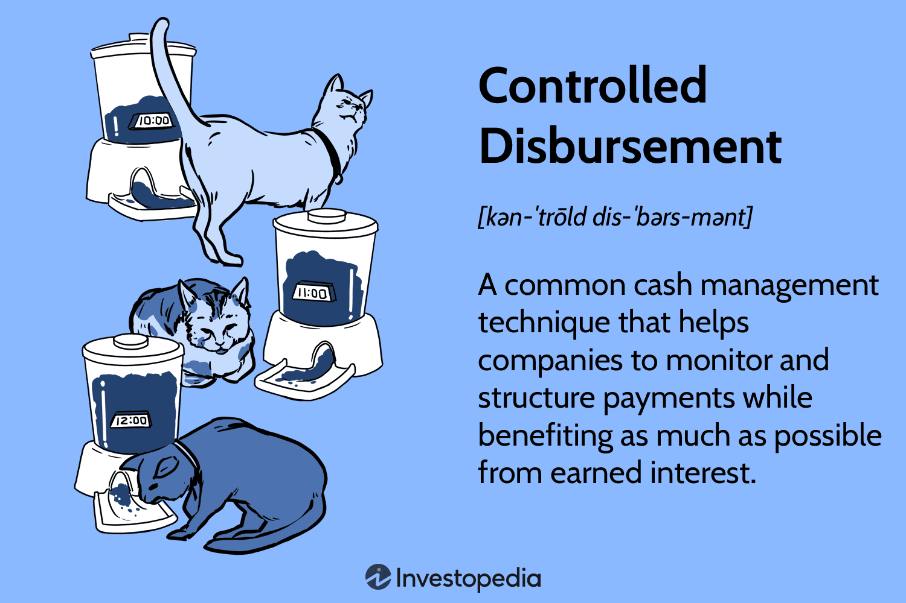

In today's fast-paced digital economy, financial transactions have undergone a significant transformation, driven by advancements in technology that have enhanced speed, efficiency, and security. Modern financial systems rely heavily on the interconnected elements of financial transactions, payment processes, disbursement mechanisms, and algorithmic trading. These components work together to create a dynamic financial ecosystem crucial for businesses, financial institutions, and individual traders.

Financial transactions serve as the backbone of the global economy by facilitating the exchange of goods, services, and capital. The evolution from traditional barter systems to digital exchanges marks a significant leap in how transactions are conducted. With globalization and technological progression, the efficiency and reach of financial transactions have expanded, allowing for faster and more secure processes. The emergence of innovations like cryptocurrency and mobile banking exemplifies the current trends reshaping the landscape.



Payment processes are vital for executing financial transactions smoothly. The journey from payment initiation to settlement involves complex mechanisms that ensure the security and accuracy of each transaction. Aspects like payment gateways and secure transaction protocols play a significant role, as do innovations such as blockchain technology, which streamline processes and mitigate risks such as fraud.

Efficient disbursement mechanisms are essential in contexts such as payroll, supplier payments, and refunds. Automated systems improve the accuracy and efficiency of these activities, supported by fintech innovations like instant transfers and peer-to-peer payments. However, managing large-scale disbursements entails its own set of challenges, especially in a globalized economy.

Algorithmic trading has revolutionized trading strategies by employing technology to execute trades based on pre-programmed instructions. This approach offers advantages in terms of speed, accuracy, and data analysis capabilities. Yet, it also brings risks and ethical considerations, such as potential market manipulation and systemic risks, which need to be carefully managed.

Understanding these intricate processes is not just beneficial but essential for navigating and thriving within the financial landscape. The integration of payment technologies with algorithmic trading operations is reshaping financial services, influencing factors like liquidity, transaction costs, and trading volumes. This convergence presents both opportunities and challenges, paving the way for future innovations.

In conclusion, dissecting the mechanics and innovations that govern today's financial landscape provides valuable insights into the evolving world of finance. Embracing technological advancements and adapting to new regulatory environments remain crucial for continued success and transformation in the global finance sector.

## Table of Contents

## The Role of Financial Transactions in the Global Economy

Financial transactions are a fundamental component of the global economy, enabling the seamless exchange of goods, services, and capital. They serve as the cornerstone of economic activity, influencing both macroeconomic policies and individual purchasing decisions. At their core, financial transactions typically involve a transfer of value, such as currency or financial instruments, between parties. These transactions can be categorized into different types, including cash transactions, electronic transfers, derivatives trading, and more. Each category plays a distinct role in supporting the complex web of economic interactions that sustain global commerce.

Historically, the concept of financial transactions has undergone a significant transformation. Initially, barter systems dominated ancient economies, allowing individuals to trade goods and services directly. However, the limitations of barter—primarily the need for a double coincidence of wants—prompted the development of money as a medium of exchange. Over time, physical currency evolved, eventually giving way to the modern digital exchanges we observe today. The digital revolution has propelled financial transactions into a new era, characterized by increased speed, efficiency, and convenience.

The advent of globalization and technological advancements has further amplified the reach and efficacy of financial transactions. Globalization has led to the integration of international markets, making cross-border transactions more prevalent and accessible. Technological innovations, such as digital payment platforms and electronic fund transfers, have streamlined transaction processes, reducing the time and cost associated with traditional methods. As a result, financial systems have seen improved [liquidity](/wiki/liquidity-risk-premium) and expanded access to financial services for individuals and businesses worldwide.

Current trends shaping the landscape of financial transactions include the rise of cryptocurrencies and mobile banking. Cryptocurrencies, such as Bitcoin and Ethereum, have introduced a decentralized and secure means of facilitating transactions, challenging traditional financial systems. Their underlying blockchain technology offers transparency and immutability, attracting attention from both investors and technologists. Meanwhile, mobile banking has revolutionized how individuals interact with financial institutions, providing convenient and accessible services through smartphones. These trends highlight the dynamic nature of financial transactions and underscore the continuous evolution of how value is exchanged in the global economy.

In summary, financial transactions are pivotal to the operation of global economies, underpinning the vast array of economic activities that occur daily. Their evolution from barter systems to sophisticated digital platforms reflects the adaptability and resilience of financial systems in incorporating new technologies and addressing emerging challenges.

## Understanding the Payment Process

Payment processes are integral components of financial transactions, ensuring the seamless transfer of funds from one entity to another. These processes generally encompass several stages, each critical for ensuring efficiency and security.

### Step-by-Step Process of Payments

1. **Initiation**: The payment process begins with initiation, where a payer authorizes a payment instruction. This could be a manual action, such as swiping a card, or an automated one via pre-set agreements in systems like direct debits.

2. **Authentication and Authorization**: Once initiated, the transaction needs verification. Authentication confirms the payer’s identity, often through passwords, PINs, or biometric data. Authorization checks if the payer’s account is capable of fulfilling the payment, considering factors like funds availability or credit limits.

3. **Clearing**: After successful authorization, the transaction moves to the clearing phase. This involves the exchange of information between the payer’s and the payee’s financial institutions. Here, the details of the transaction are logged, and any necessary adjustments are made to the involved accounts, but no funds are transferred yet.

4. **Settlement**: The final step is settlement, where the actual transfer of funds occurs between financial institutions. This can happen in real-time (e.g., via Real-Time Gross Settlement systems) or through batch processes in scheduled cycles, depending on the payment systems in use.

### Importance of Payment Gateways and Secure Protocols

Payment gateways are vital infrastructures that facilitate the electronic transfer of funds. They act as intermediaries, ensuring that the payer’s payment details are securely transmitted to the financial institution for processing. Important secure transaction protocols include SSL/TLS for encryption and HTTPS for secure web communication, safeguarding users’ sensitive information against potential cyber threats.

### Advancements in Blockchain Technology

Blockchain technology has introduced significant advancements in payment processes by offering an immutable ledger for transactions, reducing the need for intermediaries. Through decentralized networks and smart contracts, blockchain facilitates faster transactions with reduced costs and enhanced transparency. For example, cryptocurrencies employ blockchain to enable peer-to-peer transactions with minimal fees and near-instant settlement times.

### Challenges in Payment Processing

Despite technological advancements, payment processing faces numerous challenges. Fraud prevention remains a critical concern, as cyber threats evolve in both complexity and frequency. Modern payment systems employ [machine learning](/wiki/machine-learning) algorithms to detect and mitigate fraudulent activities swiftly.

Regulatory compliance is another significant concern, as financial institutions must navigate complex international regulations designed to prevent money laundering and other illicit activities. Compliance protocols, such as Know Your Customer (KYC) and Anti-Money Laundering (AML), are integral to maintaining trust in payment systems, even though they add layers of verification that can slow transactions.

In conclusion, understanding the payment process is essential for maintaining efficient and secure financial transactions. As technology continues to evolve, so too must the strategies for navigating the complexities of payment systems, balancing innovation with security and compliance.

## Efficient Disbursement Mechanisms

Disbursement involves the distribution of funds and is a critical component in the financial landscape, affecting businesses and financial institutions. Efficient disbursement systems are vital in today’s fast-paced environment, aiming to enhance both accuracy and speed in financial operations. 

Automated disbursement systems stand at the forefront of enhancing efficiency and accuracy. These systems leverage technology to streamline financial operations, reducing human error and the time required for processing transactions. Automation in disbursement ensures that payments such as payroll, supplier payments, and refunds are handled swiftly and with precision. For instance, in payroll, automated systems can efficiently manage employee salaries, deductions, and benefits, ensuring timely payments with minimal manual intervention. Similarly, for supplier payments, automation aids in enforcing payment terms precisely, thereby maintaining healthy business relationships and supply chain efficiency.

The benefits of efficient disbursement extend to various functional areas. In payroll, automation not only ensures accuracy in calculations but also compliance with taxation and labor laws, minimizing legal risks for employers. Supplier payments benefit from scheduling capabilities, which enhance cash flow management by aligning payment schedules with company revenue cycles. Refund processes are also optimized through automated systems, offering seamless and rapid customer satisfaction.

Fintech innovations have further transformed disbursement mechanisms. Technologies enabling instant transfers and peer-to-peer (P2P) payments have become commonplace. Instant transfer technologies, such as those offered by platforms like the Clearing House's RTP (Real-Time Payments) system in the U.S., facilitate immediate fund transfers, enhancing liquidity and cash flow management. P2P payment systems, popularized by platforms like PayPal and Venmo, empower individuals and smaller entities with quick and easy payment solutions, bypassing more traditional and slower banking processes.

Managing large-scale disbursements in a globalized economy presents unique challenges. Fluctuating exchange rates, differing regulatory requirements, and varied banking systems across countries complicate cross-border transactions. Solutions to these challenges involve embracing digital currencies and blockchain technology to streamline international payments. Additionally, adherence to international regulations such as anti-money laundering (AML) standards is critical to ensuring secure transactions. 

In conclusion, the rise of automated systems and fintech innovations in disbursement has spectacularly improved efficiency, accuracy, and speed in financial operations, yet challenges remain, particularly when scaling in a global context. Solutions like digital currencies and advanced compliance measures can address these concerns, suggesting a promising future for efficient global disbursement mechanisms.

## Algorithmic Trading: A Game Changer

Algorithmic trading, a transformative force in financial markets, utilizes computer algorithms to execute trading instructions at such a speed and frequency that human traders cannot achieve. These algorithms make decisions based on pre-defined criteria and market conditions, often bypassing the need for manual intervention.

### Principles and Methodologies

At its core, [algorithmic trading](/wiki/algorithmic-trading) relies on mathematical models and quantitative analysis to identify trading opportunities. The process involves several key methodologies:

1. **Statistical Arbitrage**: Algorithms capitalize on statistical discrepancies between assets. By identifying mean-reverting price series, they execute trades to exploit these discrepancies until convergence occurs.

2. **Market Making**: Algorithms continuously place buy and sell orders to profit from the bid-ask spread, providing liquidity to financial markets.

3. **Trend Following**: Based on technical indicators like moving averages, these algorithms identify and follow market trends to gain profit from momentum-based trading.

4. **Mean Reversion**: This strategy assumes that prices eventually return to their historical averages. Algorithms recognize overbought or oversold conditions and trade accordingly.

Python has become an invaluable tool for developing algorithmic trading strategies. A basic example using a moving average crossover strategy is outlined below:

```python
import pandas as pd

# Assume 'data' is a DataFrame containing historical price data with a 'Close' column
def moving_average_crossover(data, short_window=40, long_window=100):
    # Calculate short and long moving averages
    data['Short_MA'] = data['Close'].rolling(window=short_window, min_periods=1).mean()
    data['Long_MA'] = data['Close'].rolling(window=long_window, min_periods=1).mean()

    # Generate signals
    data['Signal'] = 0
    data['Signal'][short_window:] = np.where(data['Short_MA'][short_window:] > data['Long_MA'][short_window:], 1, -1)

    return data['Signal']

# Usage
# signals = moving_average_crossover(historic_data)
```

This example demonstrates how a moving average crossover strategy can be implemented in Python, where buy signals are generated when the short-term average surpasses the long-term average.

### Advantages

Algorithmic trading boasts several significant advantages:
- **Speed**: Algorithms process and execute trades in fractions of a second, capitalizing on transient market conditions.
- **Accuracy**: Automating trades minimizes human error and ensures consistent execution of predefined strategies.
- **Data Analysis**: Algorithms can analyze vast datasets rapidly, tapping into large-scale market patterns and gaining insights unavailable to human traders.

### Risks and Ethical Considerations

While algorithmic trading offers numerous benefits, it also poses several risks and ethical dilemmas:
- **Market Manipulation**: High-frequency algorithms may increase volatility, leading to instances of "quote stuffing" or "front running."
- **Systemic Risks**: Large-scale algorithmic failures can lead to systemic disruptions, exemplified by the 2010 "Flash Crash" where the Dow Jones Industrial Average plunged almost 1,000 points within minutes.

### Emerging Trends

The landscape of algorithmic trading is continually evolving:
- **Artificial Intelligence and Machine Learning**: These technologies enhance algorithmic trading by enabling systems to learn from past data, adapting strategies to dynamic market conditions.
- **Increased Regulation**: In response to potential risks, regulatory bodies globally are scrutinizing algorithmic practices, aiming to ensure fair and stable markets.
- **Cryptocurrency Markets**: Algorithms increasingly target cryptocurrency exchanges, leveraging their high volatility and trading volumes.

These trends suggest that as technology advances, the impact of algorithmic trading on financial markets will deepen, presenting both opportunities and challenges for market participants. The ongoing evolution necessitates robust risk management and ethical considerations to ensure market integrity and stability.

## The Integration of Payment Processes and Algorithmic Operations

The convergence of payment technologies and algorithmic trading is profoundly reshaping financial services by enhancing efficiency, reducing costs, and increasing the speed of transactions. Payment technologies, including digital wallets, mobile banking, and blockchain-based systems, streamline the process of transferring funds, thereby making liquidity management more agile. Algorithmic trading leverages complex mathematical models and high-speed computer programs to execute trades within milliseconds, optimizing trading strategies based on real-time market conditions. Together, these technologies offer a powerful synergy that influences key aspects of financial markets.

**Liquidity and Transaction Costs**

Improved payment technologies facilitate quicker settlement of transactions, which boosts liquidity for participants in financial markets. Algorithmic systems can adjust trading strategies in real-time as liquidity changes, often leading to tighter bid-ask spreads and reduced transaction costs. For instance, high-frequency trading ([HFT](/wiki/high-frequency-trading-strategies)) firms utilize payment and settlement systems that are synchronized with their trading algorithms to ensure liquidity is available when and where it is needed, providing a competitive advantage in executing large volumes of trades efficiently. The result is a more dynamic market environment where transaction costs are minimized, thus benefiting both institutional and retail traders.

**Trading Volumes and Case Studies**

The integration of these technologies has led to significant increases in trading volumes. One successful example is the collaboration between major financial institutions and fintech companies to integrate blockchain technology into payment and trading systems. For instance, JPMorgan Chase's Onyx platform uses blockchain to facilitate real-time international transactions, reducing the time required for cross-border payments and enabling accurate and swift trade execution.

Moreover, the London Stock Exchange has explored using distributed ledger technology (DLT) to enhance its settlement systems, which has potential benefits for liquidity and trading [volume](/wiki/volume-trading-strategy) by providing a more transparent and efficient mechanism for completing transactions. These examples demonstrate the practical benefits of integrating payment technologies with trading systems to enhance financial service delivery.

**Technological and Regulatory Challenges**

Despite the benefits, integrating payment processes with algorithmic operations presents challenges. Technologically, ensuring compatibility and interoperability between varied systems is complex. Regulatory challenges also abound, especially concerning data privacy, financial stability, and anti-money laundering laws. To address these, firms must invest in robust cybersecurity measures and maintain compliance with evolving regulations globally. This requires collaboration with regulators to establish frameworks that support innovation while maintaining financial system integrity.

**Future Developments and Innovations**

Looking ahead, we can expect further developments, such as advanced AI-driven trading algorithms that can predict market movements with increasing accuracy, integrated directly with automated payment systems for seamless execution. Furthermore, the adoption of 5G and quantum computing could enhance data processing speeds, allowing for even quicker and more efficient transactions.

Continued innovation in blockchain technologies might lead to fully decentralized trading systems, requiring payment technologies to evolve concurrently to facilitate near-instant settlement of trades across global markets. With these advancements, financial services stand on the brink of unprecedented transformation, promising a future where transactions are not only faster and cheaper but also more secure and accessible to a broader audience.

## Conclusion

Understanding the entire financial transaction ecosystem is vital, as it encompasses processes ranging from payments to sophisticated trading methods. These elements form the core of modern economic systems, supporting global commerce and individual financial activities. The integration of robust payment systems and dynamic trading platforms ensures efficiency, security, and accessibility, thereby underpinning economic stability and growth. 

Technological advancements play a crucial role in reshaping financial services. Innovations such as blockchain, [artificial intelligence](/wiki/ai-artificial-intelligence), and machine learning are revolutionizing the way transactions are conducted and analyzed. These technologies enhance transparency, reduce costs, and increase the speed of financial operations, providing significant competitive advantages to businesses that effectively harness them. However, as technology evolves, so do the complexities of regulatory compliance, which must adapt swiftly to safeguard financial integrity and consumer protection.

To keep pace with rapid technological progress and shifting regulatory landscapes, continuous adaptation is necessary. This involves not only upgrading systems and processes but also fostering an adaptive mindset within organizations and individuals. Embracing lifelong learning and keeping abreast of industry trends can empower stakeholders to effectively navigate challenges and capitalize on new opportunities.

As the global financial landscape progresses, it promises exciting possibilities and significant challenges. Emerging technologies and methodologies will likely reshape traditional financial models, heralding unprecedented transformation. The future of global finance will be characterized by increased connectivity, real-time transactions, and enhanced predictive capabilities. These developments will have profound implications on how financial institutions operate, necessitating strategic foresight and agility.

Ultimately, the commitment to understanding and improving each aspect of the financial transaction process ensures resilience and innovation. By embracing these principles, participants in the global financial ecosystem can contribute to a more inclusive, efficient, and sustainable economic future.

## References & Further Reading

[1]: Puschmann, T., & Alt, R. (2016). ["Cryptocurrencies under Supervision: The Blockchain Technology beyond Bitcoin"](https://www.researchgate.net/publication/289367044_Sharing_Economy). Journal of Risk Finance, 17(1).

[2]: Narayanan, A., Bonneau, J., Felten, E., Miller, A., & Goldfeder, S. (2016). ["Bitcoin and Cryptocurrency Technologies: A Comprehensive Introduction"](https://press.princeton.edu/books/hardcover/9780691171692/bitcoin-and-cryptocurrency-technologies). Princeton University Press.

[3]: Chuen, D. L. K. (Ed.). (2015). ["Handbook of Digital Currency: Bitcoin, Innovation, Financial Instruments, and Big Data"](https://www.sciencedirect.com/book/9780128021170/handbook-of-digital-currency). Academic Press.

[4]: Imai, J. (2021). ["Algorithmic Trading and DMA: An introduction to direct access trading strategies"](https://www.semanticscholar.org/paper/Algorithmic-trading-%26-DMA-%3A-an-introduction-to-Johnson/aa5de1ab883d5e23b6651faa7c1807586d688e4b). Altera Media.

[5]: Donoho, D. (2020). ["Empirical Finance for Finance and Accounting"](https://www.jstor.org/journal/jfinance). Springer. 

[6]: Tapscott, D., & Tapscott, A. (2016). ["Blockchain Revolution: How the Technology Behind Bitcoin and Other Cryptocurrencies is Changing the World"](https://dl.acm.org/doi/10.5555/3051781). Portfolio.