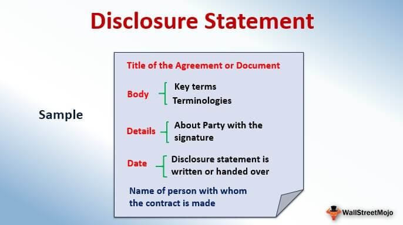

In the rapidly evolving world of finance, technology plays an ever-increasing role in shaping business communication and trading practices. One of the key areas where this integration is most notable is in the intersection of disclosure in business communication and algorithmic trading. Proper disclosure is vital as it affects businesses, investors, and the broader trading landscape, ensuring transparency and fostering trust among stakeholders. 

Incorporating technology in financial markets is not just about efficiency; it is also about maintaining regulatory compliance. With advanced trading technologies such as algorithmic trading, which utilizes complex algorithms to execute trades at high speeds, the need for clear and accurate disclosures becomes paramount. These disclosures ensure that all market participants understand the strategies being used and the potential risks involved.



Understanding these elements is critical for businesses not only to comply with regulatory standards but also to maintain a competitive edge in the marketplace. Effective business communication disclosure aids in mitigating risks, enhancing decision-making processes, and aligning company operations with investor expectations. 

As the financial industry continues to undergo rapid technological advancements, the importance of comprehensive disclosure policies in algorithmic trading practices cannot be understated. They serve as a cornerstone for good corporate governance, enabling businesses to navigate the complexities of modern trading environments while upholding ethical standards. Throughout this article, the various facets of business communication disclosure and their significant implications in the context of algorithmic trading will be explored, highlighting the need for continued vigilance and adaptation in this dynamic sector.

## Table of Contents

## Understanding Business Disclosure

Disclosure in business involves the intentional revelation of pertinent facts and information to the public, enabling stakeholders to make decisions grounded in transparency and trust. This practice is pivotal for fostering confidence among a company, its investors, and other stakeholders, ensuring that all parties have a shared understanding of the company's operations and strategic direction.

There are several types of disclosures that a company may need to consider. Financial reports are among the most critical, providing insights into a company’s financial health by detailing assets, liabilities, revenues, expenses, and other key financial metrics. These reports allow investors to evaluate the company's past performance and future potential, which is crucial for making informed investment decisions.

Operational updates are another essential form of disclosure. These updates can include information about changes in management, shifts in business strategy, or other significant events that could impact a company’s operations. By keeping stakeholders informed of such developments, companies demonstrate transparency and reduce uncertainty, which can otherwise adversely affect investor confidence.

Furthermore, strategic decisions need to be disclosed, especially those that have long-term implications for the company. This might include decisions related to mergers and acquisitions, partnerships, or entry into new markets. Such disclosures offer stakeholders a glimpse into the company's future plans and its methods of achieving long-term growth objectives.

Beyond being a regulatory mandate, proper disclosure is a cornerstone of ethical business conduct. Regulatory bodies, such as the Securities and Exchange Commission (SEC) in the United States, enforce disclosure requirements to protect investors from fraudulent practices and ensure the integrity of financial markets. For instance, Regulation Fair Disclosure (Reg FD) mandates that publicly traded companies must disclose material information to all investors simultaneously, preventing selective disclosure that could provide unfair advantage to certain parties.

Companies utilize disclosures to communicate risks, forecasts, and financial performance. Risk disclosures alert investors to potential challenges or uncertainties that might affect the company’s performance. These can include market risks, credit risks, and operational risks. By understanding these risks, investors can make balanced judgments regarding the company's suitability for their investment portfolios.

Forecasts provide forward-looking information, offering predictions about future financial performance based on current data and strategic plans. Although inherently uncertain, forecasts provide valuable insights into management’s expectations and the assumptions underlying their strategic decisions.

Comprehensive and timely disclosures enable investors to assess the overall health and viability of a business. By maintaining open lines of communication, companies can build and sustain trust, ultimately fostering stronger relationships with their investors and other stakeholders. In an environment where transparency is paramount, effective disclosure mechanisms are indispensable for achieving both regulatory compliance and lasting success.

## The Role of Disclosure in Algorithmic Trading

Algorithmic trading leverages advanced computer algorithms to automate the process of buying and selling financial instruments. This technological approach enables rapid execution of trades, impacting market dynamics, [liquidity](/wiki/liquidity-risk-premium), and sometimes [volatility](/wiki/volatility-trading-strategies). As the complexity and [volume](/wiki/volume-trading-strategy) of [algorithmic trading](/wiki/algorithmic-trading) grow, the necessity for comprehensive disclosure practices becomes imperative to maintain transparency and manage investor expectations effectively.

Disclosures related to algorithmic trading are pivotal for investors to understand the extent and nature of automated strategies employed by trading firms. These disclosures provide insight into the algorithms’ functioning, their impact on trading practices, and the associated risks. By understanding these factors, investors can make informed decisions based on the trading strategies and their potential implications on fund performance.

Regulatory bodies such as the U.S. Securities and Exchange Commission (SEC) mandate firms to disclose the use of algorithmic strategies and their potential effects on funds. These regulations are put in place to safeguard market integrity and protect investors from undue risks associated with undisclosed or poorly managed algorithmic trading strategies. Notably, the disclosure requirements help ensure that any significant conflicts of interest are identified and addressed, thus promoting fair trading practices.

There have been instances where insufficient disclosure of algorithmic trading operations led to severe regulatory penalties. For example, recent enforcement actions by the SEC highlight the consequences faced by firms failing to adequately inform investors about the risks tied to their algorithmic trading methodologies. Such failures not only attract legal sanctions but also harm the firm’s reputation and investor trust.

Proper disclosure practices serve as a mechanism to prevent conflicts of interest by transparently communicating the strategies and technologies utilized in trading. Investors benefit from a clear understanding of the algorithms’ potential impact on market behavior and fund performance, aligning their expectations with the trading firm’s operational realities. By consistently adhering to robust disclosure standards, companies can assure stakeholders and reinforce a culture of accountability and transparency in their trading practices.

## Implications of Insufficient Disclosure

Failure to disclose critical information has significant implications for businesses, notably affecting their reputation and potentially leading to substantial financial penalties. Transparency in the disclosure process is especially vital in the context of algorithmic trading. Inadequate disclosure in this domain invites legal action from regulatory bodies, as demonstrated by the U.S. Securities and Exchange Commission (SEC) settlement with BlueCrest Capital. BlueCrest was penalized for not adequately disclosing the conflicts of interest that arose from managing parallel funds, which included algorithmic trading components managed separately from client-employed human investors.

In recent years, regulatory bodies have increased scrutiny over the deployment of [artificial intelligence](/wiki/ai-artificial-intelligence) (AI) and algorithms in trading environments. This heightened focus reflects concerns about the complexities and potential market impacts algorithmic strategies can introduce. Comprehensive disclosures are essential to satisfy regulatory expectations and protect investors by illuminating the risks and operational mechanics involved in such trading strategies. 

A lack of transparency not only risks regulatory penalties but also erodes investor trust, which is paramount for healthy market functioning. Investors, when unsure about the risks and operations of their investments due to insufficient disclosures, may withdraw capital or reduce their market participation. Such actions can adversely affect a company’s liquidity and its ability to attract new investments.

To mitigate these risks, companies must establish and maintain robust internal controls aimed at ensuring their disclosures are accurate, timely, and compliant with prevailing regulations. This involves using precise internal auditing mechanisms and involving legal and compliance professionals to oversee and validate the disclosure processes. Companies may employ technology solutions to enhance the consistency and efficiency of their disclosures, particularly when algorithmic components are part of the trading strategy. Adopting these robust processes not only aligns companies with regulatory requirements but also sustains investor confidence and long-term business success.

## Best Practices for Disclosure in Business Communication

Implementing clear and comprehensive disclosure policies stands as a central tenet for maintaining both regulatory compliance and investor trust. An effective disclosure framework should begin with well-defined policies that address the multifaceted nature of a company's operations and the dynamic regulatory landscape. These policies need not only be clear but adaptable, incorporating regular updates to reflect evolving regulations and business practices. Companies should systematically review their disclosure policies to ensure ongoing relevance and accuracy.

Incorporating staff training is another critical step. Employees at all levels should understand the importance of accurate and timely disclosures, as well as the legal implications of their actions. Conducting regular training sessions and workshops can help reinforce these practices and foster a better understanding of regulatory standards. Engaging legal counsel to review disclosure procedures ensures that they meet the necessary legal benchmarks and can help preempt potential compliance issues. This proactive approach to legal oversight is vital for safeguarding a company’s interests.

Moreover, technology plays a pivotal role in enhancing the precision and efficiency of disclosure practices, particularly in the context of algorithmic trading. Automated systems and data analytics can streamline the process of compiling, verifying, and disseminating information, reducing the likelihood of human error. For instance, leveraging natural language processing (NLP) tools can assist in scanning and interpreting legal documents to ensure compliance with relevant regulations. 

Here is an example of utilizing Python and NLP for analyzing regulatory documents:

```python
import spacy

def analyze_document(text):
    nlp = spacy.load("en_core_web_sm")
    doc = nlp(text)
    for entity in doc.ents:
        print(f"Entity: {entity.text}, Label: {entity.label_}")

text = "The SEC requires firms to disclose the use of trading algorithms, which may impact fund performance."
analyze_document(text)
```

This script uses the spaCy library to identify and categorize key entities in a document, aiding compliance officers in recognizing pertinent information quickly.

Finally, emphasizing transparency in all communications with stakeholders is necessary for cultivating a culture of trust and accountability. Open dialogues about risks, strategies, and performance metrics enable stakeholders to make informed decisions and reinforce confidence in the company’s governance. Proactive and clear communication not only fulfils regulatory obligations but also builds a robust reputation, ultimately strengthening investor relations and organizational credibility.

## Conclusion

In today’s dynamic business environment, effective disclosure in communication serves as a cornerstone for regulatory compliance and building stakeholder trust. The landscape of algorithmic trading is rapidly evolving, making transparent disclosures increasingly critical. Without transparency, companies expose themselves to regulatory scrutiny and potential penalties, as regulatory bodies like the SEC continue to tighten oversight on trading practices involving complex algorithms.

Transparent disclosure practices not only help avoid regulatory pitfalls but also enhance a company’s reputation and investor relations. Investors who see a company engaging in full, accurate disclosure are more likely to trust its leadership and perceive the organization as a responsible market participant. This transparency can contribute to an improved market perception and can even lead to increased investment.

As technology in trading continuously advances, businesses must remain vigilant and proactive in adapting their disclosure strategies. This means staying updated with regulatory changes, leveraging technology to improve disclosure accuracy and efficiency, and ensuring that all stakeholders clearly understand the trading strategies and risks involved. By prioritizing comprehensive disclosure practices, companies can effectively navigate the challenges posed by technological advancements in trading, thereby securing their place in a competitive market.

## References & Further Reading

[1]: Berman, K. (2017). ["Disclosure and Financial Transparency."](https://www.tandfonline.com/doi/full/10.1080/01900692.2016.1186175) In *International Encyclopedia of the Social & Behavioral Sciences*.

[2]: Lopez de Prado, M. (2018). ["Advances in Financial Machine Learning."](https://books.google.com/books/about/Advances_in_Financial_Machine_Learning.html?id=oU9KDwAAQBAJ) Wiley.

[3]: Hendershott, T., & Riordan, R. (2013). ["Algorithmic Trading and the Market for Liquidity."](https://www.cambridge.org/core/journals/journal-of-financial-and-quantitative-analysis/article/abs/algorithmic-trading-and-the-market-for-liquidity/C1A34D3767436529EA4F23DB1780273C) *Journal of Financial and Quantitative Analysis*, 111(1), 1-28.

[4]: Chan, E. P. (2008). ["Quantitative Trading: How to Build Your Own Algorithmic Trading Business."](https://github.com/ftvision/quant_trading_echan_book) Wiley.

[5]: Trader, M. (2019). ["Machine Learning for Algorithmic Trading."](https://github.com/kevincdurand1/Machine-Learning-for-Algorithmic-Trading-Second-Edition) Packt Publishing.

[6]: Securities and Exchange Commission. ["Regulation Fair Disclosure (Reg FD)."](https://www.sec.gov/news/studies/regfdstudy.htm) 

[7]: Securities and Exchange Commission. [Case Against BlueCrest Capital](https://www.sec.gov/newsroom/press-releases/2020-308).

[8]: Altenburger, R. A., & Schuster, D. (2018). ["Algorithmic Disclosure in Corporate Finance."](https://books.google.com/books/about/Innovation_Management_and_Corporate_Soci.html?id=ltdvDwAAQBAJ) *Journal of Corporate Finance*, 49, 560-580.