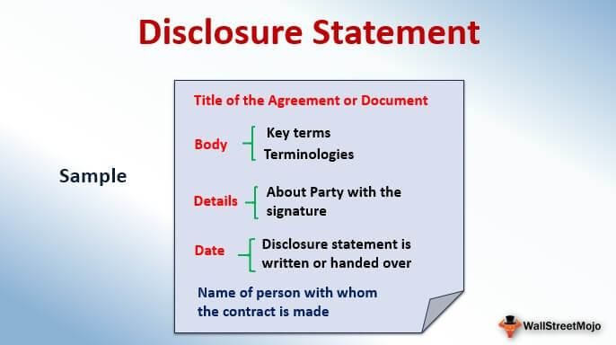

Financial disclosure serves as a critical component of market transparency and investor protection, distinguishing the financial landscape between public and private companies. Public companies are generally required to provide comprehensive financial disclosures as part of regulatory obligations, ensuring transparency for investors and stakeholders. These disclosures are typically mandated by regulatory bodies such as the U.S. Securities and Exchange Commission (SEC) and encompass financial statements, performance metrics, and other relevant information.

In contrast, private companies have different disclosure requirements and may not be obligated to share detailed financial information publicly, allowing them greater discretion in maintaining competitive secrecy. This dichotomy between public and private entities becomes particularly complex when considering algorithmic trading, a technology-driven process that relies heavily on the accessibility of financial data to execute trades efficiently.



Algorithmic trading has transformed the financial markets by incorporating algorithms to make data-driven trading decisions. It capitalizes on the availability of public financial disclosures from public companies, integrating this data into trading models to enhance profitability and market efficiency. The intersection of algorithmic trading with financial regulations and disclosure requirements introduces unique challenges and opportunities for investors, market participants, and regulators.

This article examines the intricacies of financial disclosure pertinent to private companies and its consequential effects on algorithmic trading. It highlights how public financial disclosures are utilized within algorithmic trading frameworks and discusses the broader legal structures governing these practices. Understanding the importance of transparency in algorithmic trading is crucial for maintaining market integrity and trust.

Through a comprehensive exploration of these interconnected domains, this article aims to elucidate the nuances of financial disclosure and algorithmic trading for a diverse audience, including investors, regulators, and industry stakeholders. The interplay between financial disclosure obligations and algorithmic trading not only underscores the complexities inherent within modern financial markets but also emphasizes the need for ongoing adaptation to regulatory advancements and technological innovations.

## Table of Contents

## Financial Disclosure Requirements for Private Companies

Private companies in the United States enjoy a different set of financial disclosure requirements compared to their public counterparts. Unlike public companies, which must adhere to regulations set forth by the Securities and Exchange Commission (SEC) and disclose detailed financial statements to the public, private companies are not subject to such mandates. This lack of obligatory public financial disclosure allows private companies to maintain a competitive advantage by keeping strategic and operational details confidential from competitors.

Despite the absence of a requirement for public financial disclosures, private companies must comply with certain state-level obligations. One key requirement is filing articles of incorporation with the state in which they are registered. These articles typically detail the company's structure and governance but do not require extensive financial disclosures. Additionally, private companies are obliged to submit financial information to the Internal Revenue Service (IRS) for tax purposes. However, unlike the financial disclosures made by public companies, these tax filings are not accessible to the public, ensuring that sensitive information remains confidential.

The confidentiality afforded to private companies through these regulations allows them to operate with greater strategic discretion. They can avoid revealing operational strategies and financial health to competitors, which could otherwise diminish their competitive positioning in the market. This secrecy can be particularly advantageous in industries where innovation and strategic positioning are critical to success.

In contrast, the regulatory environment in the European Union (EU) imposes different obligations on companies, regardless of their public or private status. EU regulations necessitate the disclosure of certain financial documents even by private companies, especially those registered as limited liability entities. This transparency is enforced to promote accountability and protection for stakeholders, ensuring a level of financial transparency despite the company's private status.

In summary, the disparity in financial disclosure requirements between private companies in the U.S. and the EU highlights differing regulatory priorities. In the U.S., the focus leans towards protecting competitive strategy through confidentiality, while the EU emphasizes stakeholder protection through mandatory financial disclosures.

## Impact of Public Information on Algorithmic Trading

Algorithmic trading, a form of trading that uses complex algorithms to make rapid trades, is deeply dependent on publicly available information. The availability and accuracy of data significantly impact the effectiveness and profitability of these trading strategies.

Public financial disclosures from corporations are vital to algorithmic models because they provide standardized, reliable data that can be used to inform trading decisions. These disclosures often include income statements, balance sheets, and cash flow statements, serving as critical inputs for algorithms that assess a company's financial health and predict future performance. For instance, algorithms might assess a company's earnings growth trends or compare its financial ratios against industry benchmarks to identify opportunities for trading.

The lack of public financial information from private companies presents challenges for algorithms, as these entities are not obligated to release comprehensive financial data. While this nondisclosure limits direct insights, algorithms can supplement this gap with [alternative data](/wiki/best-alternative-data) sources. Derived data such as market performance indicators, consumer sentiment analysis, and even social media activity can partially fill this void, allowing algorithms to infer potential trends and make informed decisions despite the absence of direct financial disclosure.

The transparency regarding a firm's financial health can significantly influence the development of robust [algorithmic trading](/wiki/algorithmic-trading) strategies. Greater transparency reduces uncertainty, allowing algorithms to operate with a higher level of precision. This precision is crucial not only for predicting price movements but also for managing risks associated with trading. In scenarios where information transparency is high, algorithms can more accurately gauge [volatility](/wiki/volatility-trading-strategies) and adjust trading strategies promptly, thereby enhancing the potential for profit maximization while mitigating risks.

In summary, public financial information serves as the backbone of algorithmic trading models, with the extent of data transparency playing a crucial role in refining algorithms' effectiveness. While private companies' nondisclosure poses challenges, alternative data sources provide a pathway for maintaining algorithm functionality, thereby ensuring that algorithmic trading can continue to adapt and thrive in dynamic market environments.

## Regulatory Frameworks Surrounding Disclosure and Algorithmic Trading

Various regulatory bodies, including the Securities and Exchange Commission (SEC) in the United States and the European Securities and Markets Authority (ESMA) in the European Union, play pivotal roles in overseeing financial disclosure and trading practices. These organizations are tasked with the enforcement of regulations that ensure the transparency and reliability of financial markets, fostering an environment where investors can make well-informed decisions.

One central aspect of these regulatory frameworks is the requirement for adequate financial disclosure. This obligates public companies to regularly publish detailed reports on financial performance, strategic directions, and risk management practices. Such disclosures help to level the playing field by granting all market participants access to the same critical information, thereby reducing information asymmetry that could lead to unfair trading advantages.

In the U.S., Regulation National Market System (Reg NMS) is a cornerstone of equitable market maintenance. Originally adopted in 2005 by the SEC, Reg NMS was designed to modernize and strengthen the structure of the U.S. equity markets, promoting transparency and competition. It ensures that all investors have access to the best possible prices for their trades by requiring stock exchanges to guarantee that buy and sell orders are executed at the best available prices across the entire market.

On the other side of the Atlantic, the Markets in Financial Instruments Directive II (MiFID II) serves a similar purpose in the European context. Effective from January 2018, MiFID II enhances market transparency and investor protection while striving to create a level playing field among various trading venues and financial instruments. It requires extensive pre- and post-trade transparency and mandates comprehensive reporting standards, which significantly impact algorithmic trading by necessitating clear documentation and reporting about the use of algorithms in trade execution.

Compliance within algorithmic trading is particularly nuanced, as firms must adhere to these stringent regulations while safeguarding their proprietary trading strategies. Algorithmic trading systems must be robust and well-documented to meet the transparency requirements without revealing sensitive intellectual property. Consequently, firms often implement rigorous internal controls and audits to ensure their trading systems and strategies align with regulatory expectations without compromising their competitive edge.

These frameworks underscore the balance between regulation and innovation, ensuring that as financial markets become increasingly sophisticated, they remain fair, transparent, and accessible to all participants. As technology progresses, the regulatory landscape will likely continue to evolve, necessitating ongoing adaptation by firms to achieve compliance while fostering innovation in algorithmic trading practices.

## Challenges in Financial Disclosure for Algorithmic Traders

Algorithmic trading, characterized by the use of complex algorithms to execute trades, faces significant challenges in financial disclosure. One of the primary difficulties is achieving an equilibrium between transparency and the safeguarding of proprietary algorithms and trading strategies. This balance is critical to maintaining a firm's competitive edge while also adhering to regulatory mandates.

Global firms engaged in algorithmic trading encounter diverse regulatory requirements across different jurisdictions. These varied requirements pose significant challenges in achieving cross-border compliance. For example, a firm operating both in the United States and the European Union must navigate the Securities and Exchange Commission's (SEC) regulations, as well as the European Securities and Markets Authority's (ESMA) directives. Each regulatory body imposes distinct disclosure obligations, making uniform compliance a complex task for multinational firms.

Another persistent challenge is protecting data privacy in the context of financial disclosures. Firms are tasked with ensuring that sensitive information, such as client data and proprietary trading models, remains confidential while still providing clear and informative disclosures. The General Data Protection Regulation (GDPR) in the EU and similar laws globally impose strict controls on data handling, adding layers of compliance for firms to manage.

The intricacy of algorithmic trading itself further complicates financial disclosures. The sophisticated nature of these algorithms can render disclosures opaque to average investors, who may lack the technical expertise to fully understand trading practices and associated risks. This creates a communication gap, where disclosures, despite being comprehensive, may not effectively inform all stakeholders.

The challenge is to present complex trading strategies and their associated risks in an accessible manner. For instance, consider a simplified version of a trading algorithm in Python:

```python
class TradingAlgorithm:
    def __init__(self, trading_data):
        self.data = trading_data

    def execute_trade(self):
        signal = self.calculate_signal(self.data)
        if signal > 0:
            return "Buy"
        elif signal < 0:
            return "Sell"
        else:
            return "Hold"

    def calculate_signal(self, data):
        # Sample signal calculation logic
        return sum(data) / len(data) - 50  # Just a placeholder logic

trading_data = [55, 52, 58, 60, 57]  # Example trading data
algo = TradingAlgorithm(trading_data)
action = algo.execute_trade()
print("Trade Action:", action)
```

While this is a simplified example, actual algorithms are significantly more complex. Disclosure must adequately convey how such algorithms function and their potential risks, which is not always straightforward.

To sum up, financial disclosure in algorithmic trading demands a careful balance between transparency, regulatory compliance, and the protection of proprietary strategies and data privacy. The inherent complexity of algorithmic models poses additional challenges in ensuring disclosures are informative and understandable to all investors. The evolving regulatory landscape necessitates continual adaptation by firms to maintain transparency and investor confidence.

## Best Practices and Trends in Transparency and Disclosure

Transparency in algorithmic trading is crucial for maintaining market confidence and ensuring that investors have access to vital information regarding the practices and risks associated with this sophisticated trading approach. Regular filings and thorough disclosures are integral components of this transparency.

Prominent firms in the algorithmic trading sector, such as Renaissance Technologies and Two Sigma, are often highlighted for their rigorous compliance with regulatory requirements. These organizations engage in comprehensive filings that detail their trading strategies and associated risks. Such practices not only comply with legal obligations but also foster trust among investors and regulatory bodies alike.

A significant trend in transparency and disclosure is the move towards real-time reporting. This approach involves the continuous updating of trading activities and risk assessments, thereby providing stakeholders with immediate insights into a firm's operations. Real-time systems leverage advanced technologies, including [machine learning](/wiki/machine-learning) and distributed ledger technology (DLT), to efficiently process and report data. Python, a widely used programming language in data science, offers various libraries such as `pandas` for data manipulation and `dash` for creating interactive web applications, which can be employed to develop real-time reporting tools.

The integration of AI disclosures is another emerging trend, driven by the increasing use of [artificial intelligence](/wiki/ai-artificial-intelligence) in trading algorithms. Disclosures now often include the methodologies and data sources used to train AI models, as well as the potential biases and risks associated with AI-driven trading strategies. This transparency is critical in ensuring that investors are aware of and understand the complexities and potential volatilities introduced by AI technologies.

Additionally, there is a global movement towards standardizing disclosure requirements. This trend seeks to harmonize regulations across different jurisdictions, simplifying compliance for international firms and promoting a more unified global market. Organizations like the International Organization of Securities Commissions (IOSCO) are involved in creating frameworks that support this standardization effort. By aligning disclosure practices, companies can navigate the regulatory landscape more efficiently, reducing the risk of non-compliance and enhancing overall market stability.

In summary, best practices in algorithmic trading transparency involve a commitment to detailed and timely disclosures. Firms that effectively communicate their trading practices and risks while engaging in real-time reporting and AI transparency are better positioned to build and maintain investor trust. The ongoing global standardization of disclosure requirements further supports this effort, offering a pathway to greater consistency and clarity in financial markets.

## Conclusion

A robust understanding of financial disclosure and algorithmic trading is essential for maintaining market integrity and ensuring the protection of investors. The interplay between comprehensive disclosures and sophisticated trading strategies is where firms can build trust and ensure compliance. Companies that adeptly balance transparency with the confidentiality of proprietary information manage to uphold investor confidence while meeting regulatory requirements. 

Technological advancements are reshaping the landscape of financial markets, and firms must be proactive in adapting to increasingly stringent disclosure environments. These evolutions call for enhanced transparency, which, in turn, reinforces investor trust. For instance, the advent of artificial intelligence and machine learning in trading necessitates clear disclosures about the associated risks and methodologies.

Regulatory frameworks continue to evolve, and it is imperative for both firms and regulatory bodies to cultivate a thorough understanding of these changes. The adaptability of firms in the face of evolving regulations will be crucial for maintaining competitive advantage and compliance across different jurisdictions. As markets become more interconnected globally, the push toward standardized disclosure requirements will likely intensify, fostering a more cohesive and transparent financial ecosystem. This evolution underscores the need for continuous education and adaptation within both the industry and regulatory environments. Balancing these dynamics will be key to sustaining trust, integrity, and confidence in global financial markets.

## References & Further Reading

[1]: ["SEC Regulation National Market System (Reg NMS)"](https://www.sec.gov/rules-regulations/2005/06/regulation-nms) on Investopedia

[2]: ["Markets in Financial Instruments Directive II (MiFID II)"](https://finance.ec.europa.eu/regulation-and-supervision/financial-services-legislation/implementing-and-delegated-acts/markets-financial-instruments-directive-ii_en) on the European Securities and Markets Authority (ESMA) website

[3]: ["Financial Stability and Transparency in the Financial Markets"](https://www.brookings.edu/articles/enhancing-financial-stability-the-role-of-transparency/) by The World Bank

[4]: Gomber, P., Arndt, B., Lutat, M., & Uhle, T. (2011). ["High-Frequency Trading."](https://papers.ssrn.com/sol3/papers.cfm?abstract_id=1858626) Business & Information Systems Engineering, 3(3), 153–162.

[5]: Harris, L. (2003). ["Trading and Exchanges: Market Microstructure for Practitioners"](https://academic.oup.com/book/52292) by Larry Harris