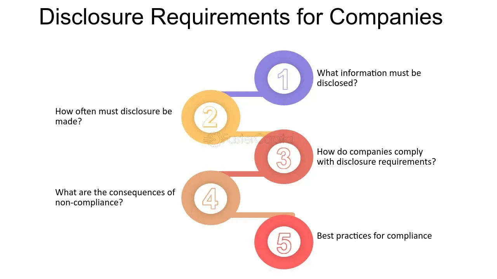

## Table of Contents

## What are disclosure requirements for private companies?

Private companies have to follow certain rules about what information they need to share. These rules are called disclosure requirements. They are not as strict as the rules for public companies, but private companies still have to tell the truth about their financial situation and other important details. This is important because it helps people like investors, lenders, and business partners make good decisions.

The exact disclosure requirements can be different depending on where the company is located and what kind of business it does. For example, in the United States, private companies might need to file certain documents with the Securities and Exchange Commission (SEC) if they have a certain number of shareholders or if they are planning to go public. They also need to follow rules set by the states where they operate. These rules make sure that everyone gets the information they need to trust the company.

Overall, even though private companies have less strict rules than public companies, they still need to be open and honest about their business. This helps build trust and keeps the business world fair for everyone involved.

## Why are disclosure requirements important for private companies?

Disclosure requirements are important for private companies because they help keep things fair and honest. When a private company shares information about its finances and operations, it lets investors, lenders, and business partners know what's really going on. This way, these people can make smart decisions about whether to invest money, lend money, or work with the company. If a company hides important information, it could trick people into making bad choices, which isn't fair.

Also, disclosure requirements build trust. When a private company is open about its business, it shows that it's willing to be honest and responsible. This makes people feel more confident about working with the company. If everyone knows the rules and follows them, it helps create a business environment where everyone can trust each other. This is good for the company and good for the economy as a whole.

## What types of information are typically required to be disclosed by private companies?

Private companies usually need to share information about their finances, like how much money they make, how much they spend, and what they own or owe. This includes things like their income statements, balance sheets, and cash flow statements. They also need to tell about any big changes in their business, like if they are merging with another company or if there are big changes in who owns the company. This helps investors and lenders understand the company's financial health and make good decisions.

Besides financial information, private companies might need to share details about their operations and management. This can include information about the people who run the company, like the board of directors and top executives. They might also need to tell about any legal problems or risks the company faces. Sharing this kind of information helps everyone know who is in charge and what challenges the company might be dealing with.

In some cases, private companies also have to share information about their shareholders. This means telling who owns parts of the company and how much they own. This is important because it helps everyone understand who has a say in the company's decisions. Overall, the information that private companies need to disclose helps keep things clear and honest for everyone involved.

## How do disclosure requirements differ between private and public companies?

Disclosure requirements for private companies are not as strict as those for public companies. Public companies have to share a lot more information because they sell their stocks to the public. They need to tell the public about their finances, like how much money they make and spend, and any big changes in their business. They have to file detailed reports with government agencies like the Securities and Exchange Commission (SEC) in the United States. This is because public companies have many shareholders who need to know everything to make good decisions about buying or selling the company's stocks.

Private companies, on the other hand, do not have to share as much information. They do not sell their stocks to the public, so they have fewer shareholders to answer to. Still, private companies need to be honest about their finances and big changes in their business. They might need to file some reports with government agencies, but these reports are not as detailed as those for public companies. The main reason for these disclosure requirements is to help investors, lenders, and business partners trust the company and make smart decisions.

## What are the legal obligations of private companies regarding disclosure?

Private companies have to follow certain rules about sharing information, but these rules are not as strict as those for public companies. They need to be honest about their money situation, like how much they make and spend, and any big changes in their business. This helps investors, lenders, and business partners trust the company and make good choices. In some places, like the United States, private companies might need to file some reports with the Securities and Exchange Commission (SEC) if they have a lot of shareholders or are thinking about going public. They also need to follow rules set by the states where they do business.

The main goal of these rules is to make sure everyone gets the information they need to trust the company. For example, if a private company is borrowing money from a bank, the bank needs to know the company's financial health to decide if it's a good risk. If a private company has investors, those investors need to know about the company's money situation to decide if they should keep their money in the company. Even though private companies don't have to share as much as public companies, being open and honest is important for building trust and keeping business fair.

## What are the consequences of non-compliance with disclosure requirements for private companies?

If private companies do not follow the rules about sharing information, they can get into trouble. They might have to pay fines or face legal action. This is because the rules are there to make sure everyone can trust the company. If a private company hides important information, it could trick investors, lenders, or business partners into making bad choices. This is not fair, and the government wants to stop it from happening.

Not following the rules can also hurt the company's reputation. If people find out that a company is not being honest, they might not want to work with it anymore. This can make it hard for the company to get loans, find investors, or do business with other companies. In the end, not following the rules can make it harder for the company to succeed.

## How can private companies ensure they meet all necessary disclosure requirements?

Private companies can make sure they meet all the disclosure rules by keeping good records of their money and business activities. They should always be honest about how much money they make and spend, and about any big changes in their business. It's important for them to check the rules set by the government agencies where they do business, like the Securities and Exchange Commission (SEC) in the United States, and follow those rules carefully. If they are not sure about what they need to share, they can ask a lawyer or an accountant for help. Keeping everything clear and up-to-date helps them stay out of trouble.

Having a good system for sharing information is also important. Private companies should tell their investors, lenders, and business partners about their financial health regularly. They can do this by sending reports or having meetings where they explain what's going on with the company. This way, everyone knows what's happening and can trust the company. By being open and honest, private companies can build strong relationships with the people they work with and keep their business running smoothly.

## What role do auditors play in the disclosure process for private companies?

Auditors help private companies make sure they are following the rules about sharing information. They check the company's financial records to see if everything is correct and honest. This is important because it helps the company show that it is being open about its money situation. When auditors look at the records, they can find any mistakes or problems and help the company fix them before sharing the information with others.

Having auditors involved also makes investors, lenders, and business partners feel more confident about the company. When these people see that an auditor has checked the company's financial information, they know it is more likely to be true and accurate. This helps build trust and makes it easier for the company to get loans, find investors, or do business with other companies. Overall, auditors play a big role in making sure private companies follow the disclosure rules and keep everything honest and clear.

## How have disclosure requirements for private companies evolved over the past decade?

Over the past decade, disclosure requirements for private companies have become more important and detailed. Governments and regulatory bodies have started to pay more attention to private companies because they play a big role in the economy. For example, in the United States, the SEC has introduced new rules that require more private companies to share information about their finances and shareholders. This is to make sure everyone has a clear picture of the company's health and to prevent any surprises or problems.

Another change is that technology has made it easier for private companies to share information. Many companies now use online platforms to send reports and updates to investors and lenders. This has made the disclosure process faster and more efficient. However, it also means that private companies need to be more careful about keeping their information secure and making sure it is accurate. Overall, the goal of these changes is to make private companies more transparent and trustworthy, which helps everyone in the business world make better decisions.

## What are some best practices for managing disclosure requirements in private companies?

To manage disclosure requirements well, private companies should keep good records of their money and business activities. They should always be honest about how much money they make and spend, and about any big changes in their business. It's important to check the rules set by government agencies, like the Securities and Exchange Commission (SEC) in the United States, and follow those rules carefully. If they are not sure about what they need to share, they can ask a lawyer or an accountant for help. Keeping everything clear and up-to-date helps them stay out of trouble and builds trust with investors, lenders, and business partners.

Another good practice is to have a system for sharing information regularly. Private companies should send reports or have meetings where they explain what's going on with the company. This way, everyone knows what's happening and can trust the company. Using technology, like online platforms, can make sharing information faster and easier. But it's also important to keep the information secure and make sure it is accurate. By being open and honest, private companies can build strong relationships with the people they work with and keep their business running smoothly.

## How do international standards affect disclosure requirements for private companies operating globally?

International standards can change the rules that private companies need to follow when they do business in different countries. These standards help make sure that companies are sharing information in a way that everyone can understand, no matter where they are. For example, the International Financial Reporting Standards (IFRS) set rules for how companies should report their money situation. If a private company is working in many countries, it might need to follow these standards to make sure its financial reports are clear and easy to understand for people all over the world.

Following international standards can also help private companies build trust with people in different countries. When a company shares information the same way everywhere, it shows that it is being honest and open. This can make it easier for the company to get loans, find investors, or do business with other companies around the world. Even though the rules might be different in each country, following international standards can help private companies meet all the disclosure requirements and keep their business running smoothly.

## What advanced strategies can private companies employ to optimize their disclosure processes?

Private companies can optimize their disclosure processes by using technology to make sharing information easier and faster. They can use special software to keep track of their money and business activities, and then share reports with investors and lenders through online platforms. This helps them send information quickly and makes sure everyone gets the same updates at the same time. It's also a good idea to use tools that help keep the information safe and correct. By using technology, private companies can make their disclosure process smoother and more efficient.

Another strategy is to have a clear plan for what information needs to be shared and when. This means setting up a schedule for sending reports and updates, and making sure everyone in the company knows what to do. It can be helpful to have a team of people who are in charge of making sure the company follows all the rules about sharing information. They can work with lawyers and accountants to make sure everything is correct and honest. By having a good plan and the right team, private companies can make sure they meet all the disclosure requirements and keep their business running well.

## References & Further Reading

[1]: ["SEC Regulation National Market System (Reg NMS)"](https://www.sec.gov/rules-regulations/2005/06/regulation-nms) on Investopedia

[2]: ["Markets in Financial Instruments Directive II (MiFID II)"](https://finance.ec.europa.eu/regulation-and-supervision/financial-services-legislation/implementing-and-delegated-acts/markets-financial-instruments-directive-ii_en) on the European Securities and Markets Authority (ESMA) website

[3]: ["Financial Stability and Transparency in the Financial Markets"](https://www.brookings.edu/articles/enhancing-financial-stability-the-role-of-transparency/) by The World Bank

[4]: Gomber, P., Arndt, B., Lutat, M., & Uhle, T. (2011). ["High-Frequency Trading."](https://papers.ssrn.com/sol3/papers.cfm?abstract_id=1858626) Business & Information Systems Engineering, 3(3), 153–162.

[5]: Harris, L. (2003). ["Trading and Exchanges: Market Microstructure for Practitioners"](https://academic.oup.com/book/52292) by Larry Harris