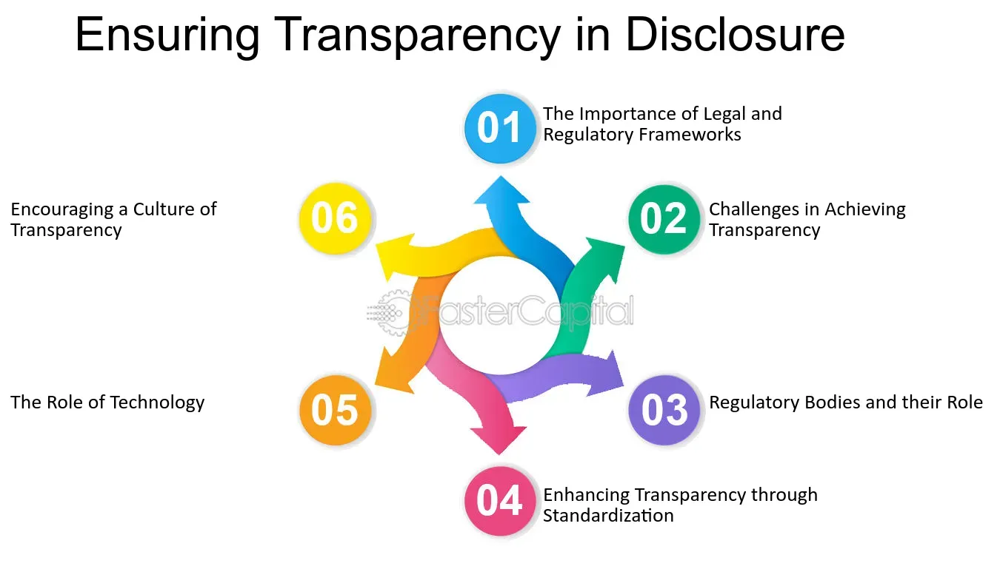

## Table of Contents

## What are disclosure and transparency laws?

Disclosure and transparency laws are rules that make sure people and companies share important information openly. These laws help everyone know what is going on in businesses, governments, and other organizations. By sharing information, these laws help prevent bad actions like fraud and corruption. They make sure that people can trust the information they get.

These laws are important in many areas, like finance, politics, and healthcare. In finance, companies must tell the public about their money situation and any big changes. In politics, politicians have to share details about their money and who helps them. In healthcare, doctors and hospitals need to be open about treatments and costs. All these rules help people make better choices and keep things fair.

## Why are disclosure and transparency laws important?

Disclosure and transparency laws are important because they help keep things honest and fair. When companies, governments, and other organizations have to share important information, it stops them from hiding bad actions like fraud or corruption. This makes people trust them more. For example, if a company has to tell everyone about its money situation, people can see if it's doing well or not. This helps investors and customers make better choices.

These laws also help in many different areas. In politics, when politicians have to share details about their money and who supports them, it helps voters decide who to trust. In healthcare, when doctors and hospitals have to be open about treatments and costs, patients can make better decisions about their health. Overall, disclosure and transparency laws make sure that everyone has the information they need to make good choices and keep things fair.

## What types of information are typically covered by these laws?

Disclosure and transparency laws cover many types of information. In finance, companies need to share details about their money, like how much they earn, how much they owe, and any big changes in their business. This helps investors know if the company is doing well or not. In politics, these laws make politicians tell the public about their money, like how much they have and where it comes from. They also have to say who helps them, like donors or supporters. This helps voters decide who to trust.

In healthcare, doctors and hospitals have to be open about treatments and costs. They need to tell patients about different treatment options and how much they will cost. This helps patients make good choices about their health. In other areas, like the environment, companies might have to share information about how their work affects nature. This helps people know if a company is being good to the environment or not. Overall, these laws make sure that important information is shared so everyone can make better decisions.

## How do disclosure laws differ from transparency laws?

Disclosure laws and transparency laws both aim to make important information public, but they work a bit differently. Disclosure laws focus on making sure that certain information is shared with the public. For example, a company might have to disclose its financial statements or a politician might need to report their income and donations. These laws set rules about what information must be shared and when it should be shared. The main goal is to prevent fraud and corruption by making sure everyone knows what's going on.

Transparency laws, on the other hand, are about making the process of sharing information open and easy to understand. They focus on how information is shared, making sure it is clear and accessible to everyone. For example, a government might have to make its decision-making process transparent by sharing meeting minutes or details about how decisions are made. The goal here is to build trust by showing that the process is fair and open. While disclosure laws tell you what must be shared, transparency laws make sure the sharing is done in a way that everyone can understand and trust.

## Which countries have the most stringent disclosure and transparency laws?

Some countries are known for having very strict disclosure and transparency laws. In the United States, laws like the Sarbanes-Oxley Act make companies share a lot of financial information. This helps prevent fraud and makes sure investors know what's going on. The U.S. also has laws that make politicians share details about their money and who helps them. This helps voters trust the government more. In Norway, the government makes sure people can see a lot of information about companies and politicians. This helps everyone know if things are fair and honest.

Another country with strong laws is Sweden. Sweden has had transparency laws since 1766, which is very early. These laws make the government share a lot of information with the public. This helps people know what the government is doing and makes it easier to trust them. In Canada, the laws also make companies and politicians share important information. This helps keep things fair and stops bad actions like fraud and corruption. These countries show that strong disclosure and transparency laws can help build trust and make sure everyone has the information they need.

## What are the common challenges in implementing disclosure and transparency laws?

One big challenge in making disclosure and transparency laws work is getting everyone to follow them. Sometimes, companies or politicians might not want to share all their information because it could make them look bad or lose money. They might try to hide things or not tell the whole truth. This can be hard to stop, especially if the laws are not strict enough or if there are not enough people checking to make sure everyone follows the rules.

Another challenge is making sure the information shared is easy to understand and find. Sometimes, the information can be very complicated or hard to get to. If people can't understand it or can't find it easily, it doesn't help them make good choices. This can make the laws less useful. Governments and organizations need to work hard to make the information clear and easy to access so that everyone can use it to make better decisions.

## How do these laws impact businesses and organizations?

Disclosure and transparency laws make businesses and organizations share important information with everyone. This can be good because it helps build trust. When a company is open about its money and how it works, people are more likely to trust it. This can attract more customers and investors. For example, if a company shares its financial reports, investors can see if it is doing well and decide to put their money in it. This can help the company grow and do better.

But these laws can also be hard for businesses and organizations. They might need to spend a lot of time and money to follow the rules. They have to make sure all their information is correct and shared on time. If they don't follow the laws, they can get in big trouble and be fined a lot of money. Sometimes, sharing too much information can also make it easier for other companies to see what they are doing and copy them. So, while these laws can help build trust, they can also make things more difficult and costly for businesses and organizations.

## What are the penalties for non-compliance with disclosure and transparency laws?

When businesses or organizations do not follow disclosure and transparency laws, they can face serious penalties. These penalties can include big fines. The fines can be a lot of money, and they are meant to make sure companies follow the rules. Sometimes, the people in charge of the company, like the CEO or other leaders, can also be fined personally. This makes sure that everyone takes the laws seriously.

Besides fines, not following these laws can lead to other problems. Companies might be watched more closely by the government, which can make things harder for them. They might also lose trust from customers and investors. If people find out that a company is not being honest, they might not want to do business with it anymore. This can hurt the company's reputation and make it lose money. In really bad cases, the company might even have to close down if it keeps breaking the rules.

## How have disclosure and transparency laws evolved over the past decade?

Over the past ten years, disclosure and transparency laws have gotten stronger and more detailed. Many countries have made new rules to make sure companies and governments share more information. For example, after big financial problems, like the 2008 crisis, many places made tougher laws to stop fraud and make sure everyone knows what's going on with money. These laws now ask for more details about money, like how much companies earn and owe, and who helps politicians. This helps people trust companies and governments more.

Technology has also changed these laws. Now, it's easier to share information quickly and in ways that are easy to understand. Many places use the internet to make information public, like on government websites or through apps. This makes it easier for everyone to see what's going on. But it also means that companies and governments need to be careful about how they share information, to make sure it's correct and easy to find. Overall, these laws have become more important and more detailed to help keep things fair and honest.

## What role do technology and digital platforms play in enhancing disclosure and transparency?

Technology and digital platforms have made it a lot easier to share information quickly and in ways that everyone can understand. Now, governments and companies can put important information on websites or apps, so people can see it anytime they want. This helps everyone know what's going on with money, politics, and other important things. For example, a company can share its financial reports online, so investors can check them easily. This makes it easier for people to trust the company and make good choices.

But technology also brings new challenges. Companies and governments need to make sure the information they share online is correct and easy to find. If the information is hard to understand or hidden away, it doesn't help people make good choices. Also, with so much information online, it can be hard to know what's true and what's not. So, while technology helps make things more open, it also means everyone needs to be careful and check the information they find.

## How can organizations ensure compliance with international disclosure and transparency standards?

Organizations can make sure they follow international disclosure and transparency standards by first learning about the rules in different countries. They need to know what information they have to share and when they have to share it. They can do this by working with experts who know about these laws or by using special software that helps keep track of all the rules. It's also important for organizations to train their workers so everyone knows what to do and how to share information the right way.

Another way organizations can stay compliant is by setting up good systems to manage and share information. They should use technology like websites and apps to make it easy for people to see their information. It's also a good idea to check their own information regularly to make sure it's correct and up to date. By doing these things, organizations can build trust with people around the world and make sure they follow the rules everywhere they work.

## What are the future trends and potential reforms in disclosure and transparency legislation?

In the future, disclosure and transparency laws might become even stricter. More countries might start to make rules that ask for more information to be shared, especially about money and how decisions are made. This could happen because people want to trust companies and governments more. Also, new technology like [artificial intelligence](/wiki/ai-artificial-intelligence) and blockchain might change how information is shared. These technologies could make it easier to share information quickly and safely, but they also bring new challenges. Governments and companies will need to figure out how to use these technologies to follow the rules and keep information open and honest.

Another trend might be more focus on making information easy to understand. Right now, a lot of the information shared can be hard for people to read and understand. In the future, laws might ask for information to be shared in simpler ways, like using pictures or short videos. This would help more people understand what's going on and make better choices. Also, there might be more rules about sharing information about the environment and how companies affect it. As people care more about the planet, they will want to know more about what companies are doing to help or hurt it.

## What is the Importance of Managerial and Board-Level Oversight?

Enhanced oversight and governance are crucial to ensuring compliance with disclosure laws in [algorithmic trading](/wiki/algorithmic-trading). These elements are integral to safeguarding the integrity of financial markets, thus preventing conflicts of interest and minimizing market disruptions.

Effective oversight begins with the appointment of dedicated personnel responsible for monitoring the entire lifecycle of trading algorithms. This includes overseeing their development, deployment, and risk management. Such personnel must possess a deep understanding of both the technological and regulatory landscapes in which algorithmic trading operates. By doing so, corporations can ensure that their algorithms abide by existing laws and are aligned with internal ethical standards aimed at preventing any unjust advantage or market distortion.

Moreover, board members and executives play a pivotal role in fostering a culture of transparency and accountability. They must be well-versed in the operational and compliance aspects of algorithmic trading to provide adequate oversight. This may involve regular training sessions that address current trends, technological advancements, and regulatory changes in financial trading. A comprehensive understanding of these aspects enables the board to ask pertinent questions and support the implementation of robust compliance frameworks.

For instance, when considering risk management, employing quantitative measures such as Value at Risk (VaR) can be instrumental in assessing potential losses associated with trading algorithms. Board members should be able to interpret these measures and evaluate the effectiveness of strategies designed to mitigate identified risks:

$$
\text{Value at Risk (VaR) = P(X < -L)}
$$

Where $P$ is the probability of a loss $X$ exceeding a specified level $L$. Understanding and interpreting this metric allows for informed decision-making concerning risk exposure.

Furthermore, boards and management teams should implement comprehensive policies for algorithm testing and auditing. Ensuring that algorithms undergo rigorous [backtesting](/wiki/backtesting) and real-time monitoring can identify discrepancies or unanticipated behavior before they impact the market. Such practices are pivotal for maintaining investor trust and upholding market integrity.

In conclusion, establishing a robust oversight framework involving skilled personnel and informed executives is essential for adhering to disclosure transparency laws in algorithmic trading. It not only promotes fair trading practices but also fortifies the resilience of financial markets against future challenges.

## References & Further Reading

[1]: Biais, B., Foucault, T., & Moinas, S. (2015). ["Equilibrium Fast Trading."](https://www.sciencedirect.com/science/article/pii/S0304405X15000288) The Review of Financial Studies, 28(7), 1787-1821.

[2]: Aldridge, I. (2013). ["High-Frequency Trading: A Practical Guide to Algorithmic Strategies and Trading Systems."](https://books.google.com/books/about/High_Frequency_Trading.html?id=6l0DDQAAQBAJ) Wiley Finance.

[3]: U.S. Securities and Exchange Commission. (2020). ["SEC Charges BlueCrest Capital Management Limited With Misleading Investors About Transfer of Top Traders to Internal Fund."](https://ir.barings.com/sec-filings/all-sec-filings/content/0001225208-20-003631/doc3.html) 

[4]: Carrion, A. (2013). ["Very Fast Money: High-Frequency Trading on the NASDAQ."](https://www.sciencedirect.com/science/article/pii/S138641811300027X) Journal of Financial Markets, 16(4), 680-711.

[5]: Easley, D., Lopez de Prado, M., & O’Hara, M. (2012). ["Flow Toxicity and Liquidity in a High-Frequency World."](https://academic.oup.com/rfs/article-abstract/25/5/1457/1569929) The Review of Financial Studies, 25(5), 1457-1493.