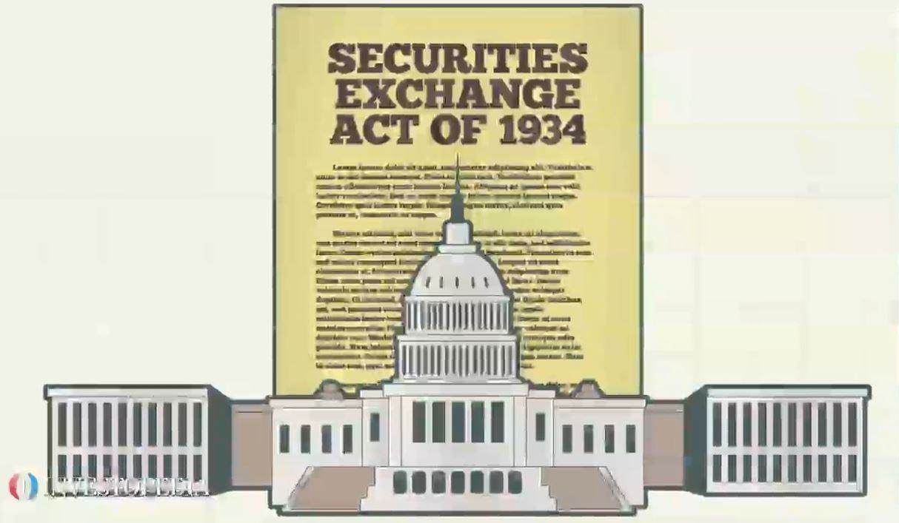

Algorithmic trading, often referred to as algo trading, has become an integral part of today's financial markets. This technologically advanced method of trading utilizes complex algorithms to make high-speed transactions possible. These algorithms can analyze vast amounts of data, identify market trends, and execute trades much faster than any human trader. The speed and efficiency that algo trading brings to financial markets have revolutionized the way trading occurs.

However, with the increased reliance on technological tools and strategies, there is a heightened need for transparency and disclosure. Disclosure transparency laws play a critical role in establishing fair trading practices by mandating that market participants provide clear and accurate information about their trading algorithms. Such regulations are designed to prevent market manipulation and ensure that all investors, regardless of their level of sophistication, have access to essential information that could impact their investment decisions.



In algorithmic trading, transparency ensures that stakeholders are aware of the operations, strategies, and risks involved with the algorithms being employed. This has become especially important as recent cases have highlighted instances where non-disclosure of algorithmic strategies led to significant financial settlements and prompted calls for stricter regulatory oversight.

This article will discuss the fundamental importance of disclosure transparency laws in the context of algorithmic trading. It aims to outline how these regulations are designed to protect investors and maintain the integrity of the markets. Furthermore, it will review existing legal frameworks related to transparency, examine notable real-world cases, and consider what the future holds for transparency as financial technologies continue to evolve.

## Table of Contents

## Understanding Disclosure Transparency Laws

Disclosure transparency laws are a cornerstone of financial regulation, aimed at compelling public companies to provide critical information to investors in a timely and accessible manner. Such transparency is integral to safeguarding market integrity and ensuring that investors can make informed decisions based on accurate and comprehensive data. This set of laws became necessary in the aftermath of the Great Depression, leading to the enactment of foundational regulations like the Securities Act of 1933 and the Securities Exchange Act of 1934.

The Securities Act of 1933 primarily focuses on the prevention of fraud in the securities market by requiring companies to register securities offerings with the federal government and provide key disclosures. These disclosures encompass a wide range of information, including the company's financial performance, its business model, and any potential risks that could affect the value of the securities. The act aims to prevent market manipulation and fosters a transparent investment environment by holding companies accountable for any material misstatements or omissions.

In conjunction with the Securities Act of 1933, the Securities Exchange Act of 1934 established the Securities and Exchange Commission (SEC), which is charged with enforcing federal securities laws and regulating the securities industry. One of the main functions of the SEC is to mandate that companies disclose material information that could significantly influence an investor's decision-making process. This requirement for material disclosures promotes a level playing field among all market participants, as it reduces the informational asymmetry that could otherwise be exploited for unfair advantage.

In the context of [algorithmic trading](/wiki/algorithmic-trading), these transparency laws take on additional significance. As algorithm trading programs execute trades based on complex, often proprietary models, the potential for misuse or intentional obfuscation increases. Therefore, it is crucial that stakeholders—including investors and regulators—are fully informed about the nature, operations, and potential risks of the algorithms being utilized. These stakeholders need to understand how these algorithms might impact market dynamics and what safeguards are in place to mitigate potential risks.

The SEC's mandate ensures that companies engaged in algorithmic trading disclose relevant information about their trading algorithms. This includes the underlying logic, risk assessment strategies, and any modifications made to the trading algorithms or systems. By doing so, the regulations aim to curtail any adverse effects on market integrity that could arise from opaque algorithmic trading practices, such as market manipulation or systemic risk.

Overall, disclosure transparency laws serve as vital tools in promoting trust, fairness, and efficiency in financial markets, particularly in areas impacted by rapidly evolving technologies like algorithmic trading. Through rigorous enforcement and continuous adaptation of these laws, markets can remain resilient amidst technological advancements and maintain equitable conditions for all investors.

## The Role of Disclosure in Algorithmic Trading

Algorithmic trading, commonly referred to as algo trading, leverages advanced mathematical algorithms and high-speed computation to execute trades in fractions of a second. This technological advancement presents distinct challenges concerning transparency and the necessity of detailed disclosure to ensure fair market operations. Unlike traditional trading methods, where trades are manually processed, algorithmic trading exploits opportunities in the market using automated systems that can process massive amounts of data and make split-second decisions.

Transparency within the domain of algorithmic trading is crucial for several reasons. Primarily, it helps in the prevention of the misuse of insider information, a practice that can lead to unfair advantages and market manipulation. Without proper transparency, there is an increased risk that privileged information could be exploited by sophisticated trading algorithms, giving certain players an unfair edge over others. Ensuring a level playing field means that all market participants, irrespective of their technological capabilities, have equal access to information that could influence market dynamics.

The significance of disclosure in algorithmic trading is underscored by cases involving companies like BlueCrest Capital Management. BlueCrest, a prominent [hedge fund](/wiki/hedge-fund-trading-strategies), faced substantial penalties for its failure to adequately disclose its reliance on algorithmic trading tools. In particular, the company did not inform its clients that it had shifted its best human traders to manage an internal fund for the benefit of its partners, while replacing these traders with algorithms for its flagship client fund. This substitution led to underperformance that was not disclosed to the investors, culminating in a lack of transparency and resulting in a $170 million settlement with the U.S. Securities and Exchange Commission (SEC).

Such instances highlight the acute necessity for stringent disclosure practices within the algo trading sector. Regulatory bodies require that firms provide full disclosure regarding the algorithms they employ, the nature of their operations, and the potential risks involved. This transparency is not just a regulatory requirement but also a moral obligation to maintain investors' trust and the integrity of financial markets.

To illustrate, consider the algorithmic process as a simple Python function that calculates potential trade executions based on specific market signals:

```python
def execute_trade(signal_strength, capital):
    if signal_strength > threshold:
        return "Buy", capital * leverage
    elif signal_strength < -threshold:
        return "Sell", capital * leverage
    else:
        return "Hold", 0

threshold = 0.05
leverage = 2

## Example usage:
signal = 0.06  # Positive signal detected from algorithm
capital_available = 100000  # Capital available for trading

action, amount = execute_trade(signal, capital_available)
print(f"Action: {action}, Amount: {amount}")
```

The function above is a simplified representation of how trading decisions might be automated in algorithmic systems. It fundamentally exemplifies the necessity for transparency, as every aspect of such a coded decision needs to be disclosed to maintain market confidence and investor protection. 

Ultimately, as algorithmic trading continues to evolve, so too must the frameworks and practices surrounding disclosure transparency. With financial markets increasingly reliant on technology, ensuring thorough and honest disclosure remains pivotal to safeguarding both investors and the broader market ecosystem.

## Case Studies and Real-World Implications

The Securities and Exchange Commission's (SEC) settlement with BlueCrest Capital signifies the profound implications a lack of transparency can have in the domain of algorithmic trading. Between 2011 and 2015, BlueCrest Capital Management implemented a strategy that reallocated its most successful human traders from its flagship fund available to external investors to a proprietary fund, BCIP, reserved for its partners and employees. In their stead, BlueCrest employed algorithm-driven trading systems, notably the "Systematic Intelligence Access" (SIA), to manage the external fund without adequately disclosing these changes to investors.

The underperformance of these algorithms, in comparison to the human traders, was substantial but undisclosed, effectively misleading investors regarding the true nature and quality of the fund's management. Without knowledge of these critical internal shifts, investors were deprived of essential information necessary for informed decision-making, breaching transparency obligations that are central to fair trading practices.

This lack of disclosure brought significant repercussions, culminating in BlueCrest settling with the SEC for $170 million in 2020. This outcome not only resulted in substantial financial penalties but also highlighted the critical importance of comprehensive transparency. The harsh penalties underscore the broader consequences that firms might face when failing to uphold transparency and disclosure standards, reinforcing the notion that regulatory authorities are vigilant in maintaining market fairness and integrity.

Such cases serve as pivotal reminders for the financial industry of the necessity to provide thorough and honest disclosures, especially as algorithmic strategies continue to gain more significant market share. By ensuring that all material changes and associated risks in trading practices are communicated to investors accurately, trust and confidence in the financial markets are upheld. This trust forms the cornerstone of an effective and equitable market system, where investors are empowered to make sound decisions based on complete and reliable information.

## Future of Disclosure in Fintech and Algo Trading

As technology relentlessly advances, regulatory frameworks must adapt to address the evolving landscape of algorithmic trading. Recent legislative proposals, such as the Algorithmic Accountability Act, underscore the necessity of stringent oversight to safeguard the fairness and integrity of financial markets. This Act seeks to hold companies accountable by requiring them to assess and mitigate risks associated with automated decision systems, including trading algorithms. By mandating impact assessments and audits, the Act aims to enhance transparency and identify potential biases or risks that could compromise market integrity.

Additionally, the Commodity Futures Trading Commission's (CFTC) proposed Regulation Automated Trading (Regulation AT) exemplifies regulatory efforts to modernize oversight of algorithmic trading. Regulation AT seeks to improve the transparency of trading activities by requiring detailed disclosures about the development and operational frameworks of trading algorithms. The regulation emphasizes risk controls and compliance measures, promoting a safer trading environment.

These regulatory advancements are crucial as algorithmic trading systems become capable of executing strategies at unprecedented speeds. Due to this complexity, ensuring comprehensive oversight is paramount to prevent adverse market impacts and to foster an environment that encourages innovation responsibly. For instance, the introduction of strict reporting requirements can facilitate better monitoring of trading practices and help detect anomalies or manipulative behavior more efficiently.

The synergistic relationship between regulatory initiatives and technological progress can help preemptively address challenges associated with algorithmic trading. A robust regulatory framework can bridge the gap between innovation and ethical trading, ensuring that as the sophistication of trading systems increases, so too does the protection of market participants. Hence, continuous refinement of policies is essential to balance innovation with the assurance of market stability and transparency.

## The Importance of Managerial and Board-Level Oversight

Enhanced oversight and governance are crucial to ensuring compliance with disclosure laws in algorithmic trading. These elements are integral to safeguarding the integrity of financial markets, thus preventing conflicts of interest and minimizing market disruptions.

Effective oversight begins with the appointment of dedicated personnel responsible for monitoring the entire lifecycle of trading algorithms. This includes overseeing their development, deployment, and risk management. Such personnel must possess a deep understanding of both the technological and regulatory landscapes in which algorithmic trading operates. By doing so, corporations can ensure that their algorithms abide by existing laws and are aligned with internal ethical standards aimed at preventing any unjust advantage or market distortion.

Moreover, board members and executives play a pivotal role in fostering a culture of transparency and accountability. They must be well-versed in the operational and compliance aspects of algorithmic trading to provide adequate oversight. This may involve regular training sessions that address current trends, technological advancements, and regulatory changes in financial trading. A comprehensive understanding of these aspects enables the board to ask pertinent questions and support the implementation of robust compliance frameworks.

For instance, when considering risk management, employing quantitative measures such as Value at Risk (VaR) can be instrumental in assessing potential losses associated with trading algorithms. Board members should be able to interpret these measures and evaluate the effectiveness of strategies designed to mitigate identified risks:

$$
\text{Value at Risk (VaR) = P(X < -L)}
$$

Where $P$ is the probability of a loss $X$ exceeding a specified level $L$. Understanding and interpreting this metric allows for informed decision-making concerning risk exposure.

Furthermore, boards and management teams should implement comprehensive policies for algorithm testing and auditing. Ensuring that algorithms undergo rigorous [backtesting](/wiki/backtesting) and real-time monitoring can identify discrepancies or unanticipated behavior before they impact the market. Such practices are pivotal for maintaining investor trust and upholding market integrity.

In conclusion, establishing a robust oversight framework involving skilled personnel and informed executives is essential for adhering to disclosure transparency laws in algorithmic trading. It not only promotes fair trading practices but also fortifies the resilience of financial markets against future challenges.

## Conclusion

Disclosure transparency laws play a critical role in fostering trust and fairness within financial markets influenced by algorithmic trading. These regulations ensure that vital information regarding trading algorithms and their potential impacts is shared with stakeholders, thereby promoting informed decision-making and reducing the likelihood of market manipulation. By demanding that entities engaged in algorithmic trading adhere to rigorous disclosure standards, markets can operate more efficiently and equitably.

Algorithmic trading, characterized by its reliance on complex mathematical models and high-speed execution, presents unique transparency challenges. As these technologies continue to evolve, the potential for misuse or insufficient information disclosure can lead to significant market disruptions and loss of investor confidence. Thus, effective regulation is necessary to maintain the integrity of the financial system.

Adhering to disclosure requirements not only benefits investors by equipping them with critical information but also enhances the overall market environment by fostering accountability among trading entities. In an era where algorithmic strategies can significantly influence market dynamics, maintaining a level playing field is essential for upholding investor trust and promoting market stability.

As algorithmic trading technologies advance and become more sophisticated, there is a continual need for regulatory vigilance and innovation. Regulatory bodies and market participants must remain proactive in addressing emerging challenges while embracing technological advancements. This may include implementing novel regulatory frameworks and improving the oversight of algorithmic trading practices to ensure they align with established standards of transparency and fairness.

In conclusion, disclosure transparency laws are indispensable in safeguarding the efficacy and equitability of financial markets, particularly as they adapt to rapid technological advancements in algorithmic trading. Ongoing vigilance and regulatory evolution are essential in responding to new opportunities and mitigating risks within the ever-evolving landscape of financial technology.

## References & Further Reading

[1]: Biais, B., Foucault, T., & Moinas, S. (2015). ["Equilibrium Fast Trading."](https://www.sciencedirect.com/science/article/pii/S0304405X15000288) The Review of Financial Studies, 28(7), 1787-1821.

[2]: Aldridge, I. (2013). ["High-Frequency Trading: A Practical Guide to Algorithmic Strategies and Trading Systems."](https://books.google.com/books/about/High_Frequency_Trading.html?id=6l0DDQAAQBAJ) Wiley Finance.

[3]: U.S. Securities and Exchange Commission. (2020). ["SEC Charges BlueCrest Capital Management Limited With Misleading Investors About Transfer of Top Traders to Internal Fund."](https://ir.barings.com/sec-filings/all-sec-filings/content/0001225208-20-003631/doc3.html) 

[4]: Carrion, A. (2013). ["Very Fast Money: High-Frequency Trading on the NASDAQ."](https://www.sciencedirect.com/science/article/pii/S138641811300027X) Journal of Financial Markets, 16(4), 680-711.

[5]: Easley, D., Lopez de Prado, M., & O’Hara, M. (2012). ["Flow Toxicity and Liquidity in a High-Frequency World."](https://academic.oup.com/rfs/article-abstract/25/5/1457/1569929) The Review of Financial Studies, 25(5), 1457-1493.