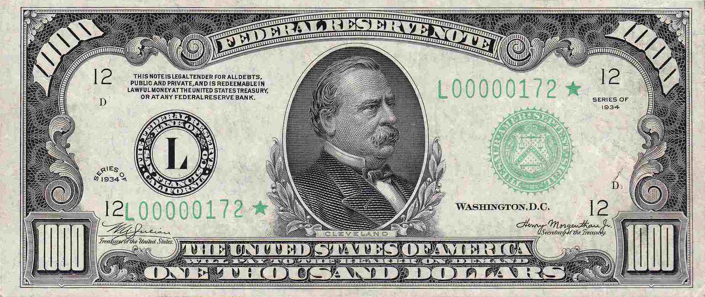

## Table of Contents

## What are some examples of discontinued U.S. currency denominations?

In the past, the United States had some currency denominations that are no longer used today. One example is the $500 bill, which was last printed in 1945. It featured President William McKinley on the front. Another discontinued denomination is the $1,000 bill, which was last printed in 1945 as well and showed President Grover Cleveland. These large bills were taken out of circulation because they were mostly used by banks and were not needed by the general public.

There were even larger denominations that have been discontinued, like the $5,000 bill, which last featured President James Madison and was printed in 1945. The $10,000 bill, last printed in 1945 and showing Secretary of the Treasury Salmon P. Chase, is another example. The largest denomination ever printed in the U.S. was the $100,000 bill, which was only used for transactions between Federal Reserve Banks and featured President Woodrow Wilson. It was printed in 1934 and was never circulated among the public.

## Why were certain U.S. currency denominations discontinued?

Certain U.S. currency denominations were discontinued because they were not needed by the general public. The larger bills, like the $500, $1,000, $5,000, and $10,000, were mainly used by banks for large transactions. Regular people did not use these big bills in their daily lives, so the government decided to stop making them.

Another reason for discontinuing these denominations was to fight against illegal activities. Criminals often used large bills for their illegal dealings because they were easier to [carry](/wiki/carry-trading) and hide. By removing these bills from circulation, the government made it harder for criminals to move large amounts of money around. This helped to reduce activities like money laundering and tax evasion.

## When were the $500, $1,000, $5,000, and $10,000 bills last printed?

The $500, $1,000, $5,000, and $10,000 bills were all last printed in 1945. The $500 bill showed President William McKinley, the $1,000 bill had President Grover Cleveland, the $5,000 bill featured President James Madison, and the $10,000 bill showed Secretary of the Treasury Salmon P. Chase.

These bills were used mostly by banks for big transactions. Regular people did not need them, so the government stopped making them. Also, stopping these big bills helped to fight crime because criminals used them for illegal activities like money laundering.

## Who were the historical figures featured on discontinued high-denomination bills?

The $500 bill had a picture of President William McKinley on it. He was the 25th President of the United States. The $1,000 bill showed President Grover Cleveland, who was the 22nd and 24th President. These bills were used by banks for big transactions, but regular people did not use them much.

The $5,000 bill featured President James Madison, who was the 4th President and helped write the U.S. Constitution. The $10,000 bill had Secretary of the Treasury Salmon P. Chase on it. He was important because he helped make the national banking system during the Civil War. These big bills were stopped being made in 1945 because they were not needed by the public and were used for illegal activities.

## How did the discontinuation of large denominations affect the U.S. economy?

The stopping of large denomination bills like the $500, $1,000, $5,000, and $10,000 did not hurt the U.S. economy much. Regular people did not use these big bills in their daily lives, so they were not missed. Banks used these bills for big transactions, but they found other ways to move money around without them. This change did not make it harder for businesses to do their work or for people to buy things they needed.

One good thing that came from stopping these big bills was that it helped fight crime. Criminals used these large bills for illegal activities like money laundering because they were easy to carry and hide. By taking these bills out of circulation, it became harder for criminals to move large amounts of money without being caught. This helped make the economy safer and more honest.

## What are the reasons behind the U.S. government's decision to stop issuing large denomination bills?

The U.S. government decided to stop issuing large denomination bills because regular people did not need them. These big bills, like the $500, $1,000, $5,000, and $10,000, were mostly used by banks for big transactions. The general public did not use them in their daily lives, so the government saw no reason to keep making them. Banks found other ways to move money around, so the economy kept working fine without these large bills.

Another big reason was to fight crime. Criminals liked using these large bills for illegal activities like money laundering because they were easy to carry and hide. By stopping these big bills, the government made it harder for criminals to move large amounts of money without being caught. This helped make the economy safer and more honest.

## What is the rarest discontinued U.S. currency denomination and why?

The rarest discontinued U.S. currency denomination is the $100,000 bill. It was only used for transactions between Federal Reserve Banks and never circulated among the public. This bill was printed in 1934 and featured President Woodrow Wilson on the front. Because it was never used by regular people and only a small number were made, it is very hard to find today.

The $100,000 bill is rare because it was only used for a short time and in a very specific way. It was meant to help move large amounts of money between banks quickly and safely. Since it was not needed for everyday transactions, the government did not print many of them. Today, these bills are mostly found in museums or private collections, making them very rare and special.

## Are discontinued U.S. currency denominations still considered legal tender?

Discontinued U.S. currency denominations, like the $500, $1,000, $5,000, $10,000, and $100,000 bills, are no longer made or used every day. But they are still considered legal tender. This means that if someone has one of these old bills, they can still use it to buy things or trade it for newer money at a bank.

Even though these bills are legal tender, you will not see them in stores or used by regular people. They are mostly found in special collections or museums. Banks will take them if someone brings them in, but they are very rare and not part of everyday money anymore.

## How can collectors identify genuine discontinued U.S. currency?

Collectors can identify genuine discontinued U.S. currency by checking a few important things. First, they should look at the paper. Real U.S. currency is made from a special kind of paper that feels different from regular paper. It has tiny red and blue fibers in it. If the bill feels too smooth or the fibers are missing, it might be fake. Also, collectors should look for the security thread. This is a thin strip inside the bill that you can see when you hold it up to the light. Each bill has this thread in a different place, so knowing where it should be can help tell if a bill is real.

Another way to spot genuine discontinued currency is by checking the printing. Real bills have very clear and detailed pictures. The ink is also special and can change color or look raised when you touch it. If the printing looks blurry or the ink does not change color, the bill might not be real. Collectors can also use special tools like a magnifying glass or a UV light to see tiny details that fakes might miss. By taking a close look at these things, collectors can make sure they have a real piece of discontinued U.S. currency.

## What is the current market value of discontinued U.S. currency denominations?

The current market value of discontinued U.S. currency denominations can change a lot. It depends on how rare the bill is, what condition it is in, and how much people want it. For example, a $500 bill in good condition might be worth around $1,000 to $1,500. A $1,000 bill in the same condition could go for $2,000 to $2,500. These prices can go up if the bill is in perfect shape or if it has a special serial number.

The $5,000 and $10,000 bills are even rarer, so they can be worth a lot more. A $5,000 bill might sell for $30,000 to $40,000, while a $10,000 bill could be worth $50,000 to $60,000. The $100,000 bill is the rarest of all and is usually found in museums or private collections. If one ever comes up for sale, it could be worth over $100,000. Remember, these are just estimates, and the actual value can change based on many factors.

## How have discontinued denominations influenced modern U.S. currency design?

Discontinued denominations have influenced modern U.S. currency design by showing how important it is to have money that people can use easily. The old big bills like the $500, $1,000, $5,000, and $10,000 were stopped because regular people did not need them. This taught the government to make money that is useful for everyone. Now, the U.S. uses smaller bills that people use every day, like the $1, $5, $10, $20, $50, and $100.

Also, the old bills helped the government learn about security features. The big bills had simple designs that were easy to copy. Modern U.S. currency has many new features to stop people from making fake money. These include special paper, ink that changes color, and hidden pictures that you can see under a special light. These lessons from discontinued bills help keep today's money safe and easy to use.

## What role did discontinued denominations play in combating counterfeiting and financial crimes?

Discontinued denominations helped fight against counterfeiting and financial crimes because they were easy for criminals to use. The big bills like the $500, $1,000, $5,000, and $10,000 were used a lot for illegal activities like money laundering. Criminals liked these bills because they could move a lot of money without carrying too many bills. By stopping these big bills, the government made it harder for criminals to do these illegal things.

Now, modern U.S. currency has many special features to stop people from making fake money. These features were added because the government learned from the old bills. Things like special paper, ink that changes color, and hidden pictures make it hard for people to copy money. These changes help keep money safe and make it harder for criminals to use fake bills for their crimes.

## References & Further Reading

[1]: U.S. Department of the Treasury: "Bureau of Engraving and Printing." [https://www.moneyfactory.gov/2dollarbill.html](https://www.bep.gov/services/mutilated-currency-redemption/submit-a-request).

[2]: Krugman, Paul. (1995). "Economic Policy and Financial Markets." The MIT Press.

[3]: ["Advances in Financial Machine Learning"](https://www.amazon.com/Advances-Financial-Machine-Learning-Marcos/dp/1119482089) by Marcos Lopez de Prado

[4]: ["Quantitative Trading: How to Build Your Own Algorithmic Trading Business"](https://www.amazon.com/Quantitative-Trading-Build-Algorithmic-Business/dp/1119800064) by Ernest P. Chan

[5]: ["History of the U.S. Federal Reserve"](https://en.wikipedia.org/wiki/History_of_the_Federal_Reserve_System)

[6]: Smith, Andrew Farris. (2013). "U.S. Monetary History: The Evolution of Currency in America." Economics for Business Journal.

