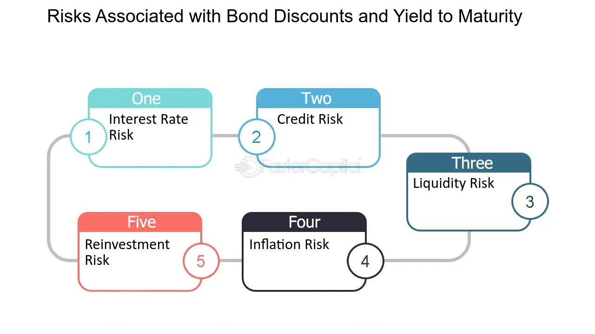

## Table of Contents

## What is a discount bond?

A discount bond is a bond that is sold for less than its face value. The face value, also known as the par value, is the amount that the bond will be worth when it matures. For example, if a bond has a face value of $1,000 but is sold for $950, it is a discount bond. People buy discount bonds because they can earn more money when the bond reaches its face value at maturity.

Discount bonds are different from premium bonds, which are sold for more than their face value. The reason a bond might be sold at a discount is often because it offers a lower interest rate than current market rates. Investors are willing to accept a lower interest rate if they can buy the bond at a discount and still make a profit when it matures. This makes discount bonds an attractive option for investors looking for a good deal.

## How is the price of a discount bond determined?

The price of a discount bond is figured out by looking at a few important things. One big thing is the time left until the bond matures. The longer you have to wait for the bond to reach its full value, the less you might be willing to pay for it now. Another thing to think about is the interest rate, or yield, that the bond offers. If the bond's interest rate is lower than what you can get from other investments right now, you might want to pay less for it. This is why discount bonds are sold for less than their face value.

Another [factor](/wiki/factor-investing) that affects the price of a discount bond is how safe it is. If people think there's a bigger chance the bond issuer might not be able to pay back the money, they'll want to pay less for the bond. Also, the overall market conditions play a role. If everyone is feeling good about the economy and wants to buy bonds, the price might go up a bit. But if people are worried and selling their bonds, the price might go down. So, the price of a discount bond is a mix of time, interest rates, safety, and what's happening in the market.

## What is the yield to maturity (YTM) of a bond?

The yield to maturity (YTM) of a bond is like figuring out what percentage return you would get if you bought the bond and held onto it until it matures. It's a way to see how good of a deal the bond is by looking at its current price, the interest it pays, and how long you have to wait until it reaches its full value. YTM takes into account all the interest payments you'll get over time, plus the difference between what you paid for the bond and what you'll get back when it matures.

For example, if you buy a bond for less than its face value, like a discount bond, the YTM will be higher than the bond's stated interest rate. This is because you're getting the full face value at the end, even though you paid less for it. The YTM helps you compare different bonds to see which one might give you a better return on your money, considering all the factors like time and price.

## How do you calculate the yield to maturity for a discount bond?

Calculating the yield to maturity (YTM) for a discount bond involves a bit of math, but it's worth understanding. Imagine you buy a bond for less than its face value. You want to know the total return you'll get if you hold onto it until it matures. To find the YTM, you need to know the bond's current price, its face value, the interest payments it will make, and how many years until it matures. You then solve for the rate that makes the present value of all future cash flows equal to the bond's current price.

Here's how it works in simple terms: let's say you buy a bond for $950 that will be worth $1,000 when it matures in 5 years. The bond pays $50 in interest each year. You need to find the rate that, when used to discount all the future payments ($50 each year for 5 years, plus the $1,000 at the end), equals the $950 you paid. This rate is the YTM. It's a bit like solving a puzzle, but once you find it, you know the annual return you're getting on your investment.

## Why might an investor choose to purchase a discount bond?

An investor might choose to buy a discount bond because it can offer a good deal. When you buy a bond for less than its face value, you're getting it at a discount. This means that when the bond matures, you'll get more money back than what you paid for it. For example, if you buy a bond for $950 that will be worth $1,000 at maturity, you're making a profit of $50 just by holding onto it. This can be attractive if you're looking for a way to make some money over time.

Another reason to buy a discount bond is that it can give you a higher yield to maturity (YTM) than the bond's stated interest rate. The YTM is the total return you get if you hold the bond until it matures. Because you're buying the bond at a lower price, the YTM will be higher than if you bought it at face value. This makes discount bonds a good choice if you want to earn more from your investment compared to other bonds that might be selling at a higher price.

## What are the risks associated with investing in discount bonds?

Investing in discount bonds comes with some risks. One big risk is that the company or government that issued the bond might not be able to pay you back when the bond matures. This is called default risk. If the issuer runs into financial trouble, you could lose the money you invested. Another risk is interest rate risk. If interest rates go up after you buy the bond, the value of your bond might go down. This is because new bonds will be issued with higher interest rates, making your bond less attractive to other investors.

Another thing to think about is inflation risk. If inflation goes up a lot, the money you get back from the bond might not be worth as much as when you bought it. This means your real return could be lower than you expected. Also, if you need to sell the bond before it matures, you might have to sell it for less than you paid for it, especially if interest rates have gone up. So, while discount bonds can offer good returns, they also come with these risks that you need to consider before investing.

## How does interest rate risk affect discount bonds?

Interest rate risk can really affect discount bonds. When you buy a discount bond, you're hoping to get a good return when it matures. But if interest rates go up after you buy the bond, new bonds will come out with higher interest rates. This makes your bond less attractive to other people because they can get a better deal with the new bonds. If you need to sell your bond before it matures, you might have to sell it for less than what you paid for it. This is because other investors will want the new bonds with higher interest rates instead of yours.

This risk is important to think about because it can change how much money you make from your investment. If interest rates stay the same or go down, your discount bond might be fine. But if rates go up, the value of your bond can drop. This means you could lose money if you have to sell it early. So, when you're thinking about buying a discount bond, it's good to keep an eye on what's happening with interest rates and how they might change in the future.

## What is the relationship between a bond's price and its yield to maturity?

The price of a bond and its yield to maturity (YTM) have an inverse relationship. This means that when the price of a bond goes up, its YTM goes down, and when the price goes down, the YTM goes up. For example, if you buy a bond for less than its face value, like a discount bond, you're getting it at a lower price. This lower price means that the YTM will be higher because you're getting a bigger return when the bond matures.

This relationship is important because it helps investors understand how much they might earn from their investment. If interest rates in the market go up after you buy a bond, the price of your bond might go down because new bonds with higher interest rates are more attractive. But if you hold onto your bond until it matures, you'll still get the full face value, which means your YTM stays the same. So, when you're thinking about buying a bond, it's good to consider both its current price and its YTM to see if it's a good investment for you.

## How does the time to maturity impact the yield of a discount bond?

The time to maturity of a discount bond plays a big role in figuring out its yield. When a bond has a longer time until it matures, it usually means you'll get a higher yield. This is because you're waiting longer to get your money back, so you want a bigger reward for being patient. Imagine buying a bond for $950 that will be worth $1,000 in 10 years. You're waiting a long time, so the yield to maturity (YTM) will be higher than if the bond matured in just 2 years.

On the other hand, if a discount bond matures sooner, the yield might be lower. This is because you don't have to wait as long to get your money back, so the reward for holding the bond isn't as big. For example, if you buy that same $950 bond but it matures in just 1 year, the YTM will be lower because you're getting your $1,000 back much faster. So, the longer the time to maturity, the higher the yield you can expect from a discount bond.

## What are the tax implications of investing in discount bonds?

When you invest in discount bonds, you need to think about taxes. If you buy a bond for less than its face value and hold it until it matures, the difference between what you paid and the face value is considered interest income. This means you'll have to pay taxes on that difference, even though you didn't get it until the bond matured. For example, if you buy a bond for $950 and it matures at $1,000, you'll have to pay taxes on the $50 difference as if it were interest.

Another thing to consider is if you sell the bond before it matures. If you sell it for more than you paid, any profit you make is called a capital gain, and you'll have to pay taxes on that too. But if you sell it for less than you paid, you might be able to claim a capital loss, which can help lower your taxes. So, when you're thinking about investing in discount bonds, it's good to keep these tax rules in mind because they can affect how much money you actually get to keep at the end.

## How do credit ratings influence the yield to maturity of discount bonds?

Credit ratings play a big role in figuring out the yield to maturity (YTM) of discount bonds. A credit rating is like a report card that tells you how likely it is that the company or government that issued the bond will be able to pay you back. If a bond has a high credit rating, it means the issuer is seen as safe and reliable. Because of this, investors might be okay with a lower YTM because they feel more secure about getting their money back. But if a bond has a low credit rating, it means there's a bigger chance the issuer might not pay you back. To make up for this risk, investors will want a higher YTM to feel like the investment is worth it.

So, if you're looking at a discount bond with a low credit rating, you can expect a higher YTM. This is because you're taking on more risk, and the higher yield is like a reward for that risk. On the other hand, a discount bond with a high credit rating will have a lower YTM because it's seen as safer. When you're thinking about buying a discount bond, it's good to check the credit rating to understand how much risk you're taking on and what kind of return you might get.

## What advanced strategies can be used to optimize returns from discount bonds?

One advanced strategy to optimize returns from discount bonds is to use a bond ladder. This means you buy several discount bonds that mature at different times. By doing this, you can spread out your risk and take advantage of different interest rates over time. If interest rates go up, the bonds that mature sooner can be reinvested at the higher rates, which can help increase your overall return. This strategy also gives you regular cash flow as bonds mature, which you can use to buy new bonds or for other investments.

Another strategy is to actively trade discount bonds based on changes in interest rates and credit ratings. If you think interest rates are going to go down, you might want to buy more discount bonds because their prices will go up. On the other hand, if you think rates are going to go up, you might sell some of your bonds before their prices drop too much. Also, keeping an eye on credit ratings can help you find bonds that might offer higher yields because they're seen as riskier. By buying these bonds and selling them when their ratings improve, you can make a profit from the change in yield.

Using these strategies can help you get the most out of your discount bond investments. But remember, they require you to keep a close eye on the market and be ready to make changes to your investments. It's like playing a game where you need to be smart and quick to make the best moves.

## What is Yield to Maturity (YTM) and How Do You Calculate Returns?

Yield to Maturity (YTM) serves as a pivotal metric in the evaluation of bonds, capturing the total expected return of a bond if it is held until its maturity date. This metric assumes that all coupon payments are reinvested at the same rate as the bond's current yield. To calculate YTM, it is essential to consider several factors: the bond's current market price, its face or par value, the coupon [interest rate](/wiki/interest-rate-trading-strategies), and the time remaining until the bond matures. 

The formula for YTM is not straightforward, as it typically entails solving the following equation for YTM:

$$

P = \sum_{t=1}^{N} \frac{C}{(1 + YTM)^t} + \frac{F}{(1 + YTM)^N} 
$$

Where:
- $P$ is the current price of the bond.
- $C$ represents the annual coupon payment.
- $F$ is the face value of the bond.
- $N$ denotes the number of years to maturity.

Given the complexity of the above equation, which is a non-linear equation involving YTM, investors and analysts often rely on iterative numerical methods or specialized financial calculators to derive this value. Tools and programming languages such as Python offer libraries and functions to compute YTM through approximation techniques like the Newton-Raphson method.

Here is a basic Python implementation to estimate YTM:

```python
def calculate_ytm(price, face_value, coupon_rate, years_to_maturity):
    guess = 0.05  # Initial guess for YTM
    incremental_change = 0.0001  # Incremental change for YTM
    max_iterations = 1000
    iteration = 0

    def bond_price(ytm):
        present_value_coupons = sum([coupon_rate * face_value / (1 + ytm) ** t for t in range(1, years_to_maturity + 1)])
        present_value_face_value = face_value / (1 + ytm) ** years_to_maturity
        return present_value_coupons + present_value_face_value

    while iteration < max_iterations:
        if bond_price(guess) > price:
            guess += incremental_change
        else:
            guess -= incremental_change
        iteration += 1

    return guess

# Example usage
p = 950  # Current price
f = 1000  # Face value
c = 0.05  # Coupon rate (5%)
n = 10  # Years to maturity

ytm = calculate_ytm(p, f, c, n)
print(f"Approximate Yield to Maturity: {ytm:.4f}")
```

Investors frequently leverage the YTM to compare potential bond investments, particularly in fluctuating interest rate environments. Since YTM accounts for all payments received over the life of the bond, it offers a more comprehensive gauge of a bond's potential returns than individual interest payments.

Despite the complexity inherent in calculating YTM, a range of financial tools and technologies now assist investors in efficiently determining this metric. Excel, financial calculators, and various financial software platforms provide built-in functions to quickly evaluate YTM, thereby facilitating informed investment decisions across a spectrum of bond opportunities.

## What are the risks associated with discount bonds?

Discount bonds are subject to various risks that can significantly impact investment outcomes. These risks primarily include interest rate risk, credit risk, and [liquidity](/wiki/liquidity-risk-premium) risk, each presenting unique challenges to investors.

Interest rate risk is one of the most critical factors affecting discount bonds. It arises due to fluctuations in market interest rates, which influence bond prices inversely. When interest rates rise, the market value of existing bonds typically falls, as newer issues offer higher yields. Conversely, when rates decrease, the value of existing bonds tends to increase. For investors holding discount bonds, this risk implies that changes in interest rates could erode the expected returns if they need to sell the bond before its maturity. This relationship is often expressed using the formula for bond price sensitivity, known as duration. Duration measures the bond's price sensitivity to interest rate changes, calculated as:

$$
\text{Duration} = \frac{\sum \left( \frac{t \times C}{(1 + r)^t} \right) + \frac{T \times F}{(1 + r)^T}}{\sum \left( \frac{C}{(1 + r)^t} \right) + \frac{F}{(1 + r)^T}}
$$

where $C$ is the coupon payment, $r$ is the yield, $t$ is the time period, $T$ is the maturity, and $F$ is the face value.

Credit risk refers to the possibility that the bond issuer may default on its payment obligations. The creditworthiness of the issuer is paramount, as a default can lead to a substantial loss of investment. This risk is typically assessed through credit ratings assigned by agencies such as Moody's or Standard & Poor's. Bonds issued by entities with lower credit ratings generally offer higher yields to compensate for the increased risk of default. However, investors must be diligent in understanding the issuer's financial health and external economic factors that may affect its ability to meet debt obligations.

Liquidity risk is associated with the ease of buying or selling bonds in the market without sacrificing price. Discount bonds may not always trade frequently, leading to scenarios where investors find it challenging to sell their holdings promptly at fair market prices. This risk is particularly pronounced in bonds with lower credit ratings or those from smaller issuers, which might not attract a wide range of buyers. The impact of liquidity risk can be severe in times of financial distress or market [volatility](/wiki/volatility-trading-strategies) when the bid-ask spread widens, further eroding potential returns.

Investors must carefully consider these risks, employing strategies such as diversification across issuers and maturities to mitigate potential losses. Understanding the correlation between these risks and broader market conditions is critical for optimizing investment strategies involving discount bonds.

## References & Further Reading

[1]: Fabozzi, F. J. (2007). ["Fixed Income Analysis"](https://books.google.com/books/about/Fixed_Income_Analysis.html?id=lujLawVLS3YC). John Wiley & Sons.

[2]: Hull, J. C. (2015). ["Options, Futures, and Other Derivatives"](https://books.google.com/books/about/Options_Futures_and_Other_Derivatives_Gl.html?id=sdg2EAAAQBAJ). Pearson Education.

[3]: [Fabozzi, F. J., & Pollack, I. (2011). "The Handbook of Fixed Income Securities."](https://www.amazon.com/Handbook-Fixed-Income-Securities-Ninth/dp/1260473899) McGraw-Hill Education.

[4]: ["Algorithmic Trading: Winning Strategies and Their Rationale"](https://www.wiley.com/en-us/Algorithmic+Trading%3A+Winning+Strategies+and+Their+Rationale-p-9781118460146) by Ernie Chan

[5]: ["Principles of Risk Management and Insurance"](https://www.pearson.com/en-us/subject-catalog/p/principles-of-risk-management-and-insurance/P200000006028/9780135641293) by George E. Rejda and Michael McNamara