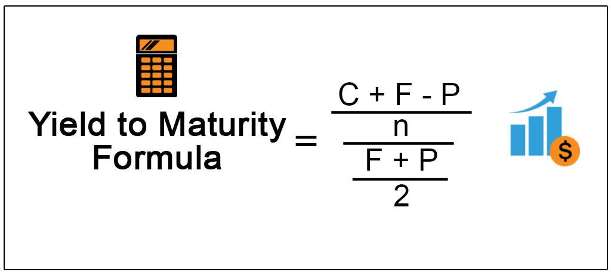

The financial world is a complex system with a diverse array of investment vehicles, each carrying a unique set of risks and potential rewards. Bonds play a pivotal role in any well-rounded investment portfolio. Within this category, discount bonds offer particular opportunities and challenges. Discount bonds are issued at a price lower than their face value, creating an allure for investors focused on future capital appreciation. This type of bond reflects not only market perceptions but also factors like interest rates, inflation, and credit risk, resulting in a challenging valuation process that demands careful analysis.

Understanding discount bonds requires knowledge of several essential concepts, especially the yield to maturity (YTM) metric. YTM represents the total return an investor can anticipate if the bond is held until maturity, considering factors such as the bond's current market price, face value, coupon rate, and the time remaining until it reaches maturity. Investors often rely on YTM to evaluate bond investment opportunities, especially during periods of fluctuating interest rates. While complex, various financial tools are available to assist investors in these calculations, ensuring informed decision-making.



Another critical aspect of investing in discount bonds is appreciation of the inherent risks, such as interest rate risk, credit risk, and liquidity risk. Interest rate fluctuations can significantly affect bond prices and, consequently, investor returns. Credit risk pertains to the issuer's potential default, which can dramatically influence a bond's market value and appeal. Liquidity risk, or the ability to quickly sell bonds without affecting their price, also plays an essential role in strategic financial planning.

In recent years, algorithmic trading has emerged as a transformative force in the bond market, enhancing the speed and precision of trading operations. Algorithms process large datasets to support complex decision-making, thereby reducing human error and optimizing investment results. The increasing adoption of algorithmic trading in bond markets highlights the importance of technological advancements in identifying market inefficiencies and maximizing investment gains.

This article aims to equip investors with comprehensive insights into the intricacies of discount bonds, the calculation of YTM, associated risks, and the growing influence of algorithmic trading. Armed with this knowledge, investors can make well-informed decisions, leveraging cutting-edge tools and strategies to navigate the ever-changing financial landscape effectively.

## Table of Contents

## Understanding Discount Bonds

Discount bonds are financial instruments issued at a price lower than their face or par value. This lower initial cost makes them appealing to investors aiming for potential growth in value over time. The appeal of discount bonds lies in their promise of being redeemed at face value upon maturity, allowing investors to capitalize on the difference between the purchase price and the redemption value.

These bonds are intrinsically linked to market factors such as interest rates, inflation, and credit risk, which influence their pricing. As interest rates fluctuate, the present value of a bond's future cash flows, including coupon payments and redemption value, is affected. For instance, when interest rates rise, the existing bonds' yield becomes less attractive, causing their market price to drop, often leading to them being sold at a discount. Conversely, inflation impacts the purchasing power of the returns generated by the bonds, necessitating a careful assessment by investors.

Several types of discount bonds exist, each offering unique advantages and risks:

1. **Zero-Coupon Bonds**: These bonds do not pay annual or semi-annual interest. Instead, they are issued at a deep discount and redeemed at face value at maturity. The appreciation of the bond's value over time results in return for the investor. Zero-coupon bonds are sensitive to interest rate changes due to the absence of periodic interest payments.

2. **Municipal Bonds**: Issued by local governments, these bonds often come with tax advantages, such as exemption from federal income tax on interest payments. While municipal bonds can offer attractive returns, they also carry credit risk linked to the financial health of the issuing entity.

3. **Corporate Bonds**: These are issued by corporations seeking to raise capital. Corporate bonds may offer higher yields compared to government securities, but they also involve higher credit risk. The likelihood of a corporation defaulting on bond payments must be weighed against the potential returns.

4. **Treasury Bonds**: Issued by national governments, treasury bonds usually carry minimal credit risk, given their backing by the government’s credit. However, they may still be subject to interest rate and inflation risks.

Understanding how these bonds function is essential for optimizing their role in a fixed-income portfolio. Investors must assess the yield-to-maturity (YTM), credit ratings of issuers, prevailing market conditions, and the macroeconomic environment to effectively incorporate discount bonds into their investment strategies. This assessment helps in gauging the potential returns and risks associated with holding these securities until maturity.

## Yield to Maturity (YTM): Calculating Returns

Yield to Maturity (YTM) serves as a pivotal metric in the evaluation of bonds, capturing the total expected return of a bond if it is held until its maturity date. This metric assumes that all coupon payments are reinvested at the same rate as the bond's current yield. To calculate YTM, it is essential to consider several factors: the bond's current market price, its face or par value, the coupon [interest rate](/wiki/interest-rate-trading-strategies), and the time remaining until the bond matures. 

The formula for YTM is not straightforward, as it typically entails solving the following equation for YTM:

$$

P = \sum_{t=1}^{N} \frac{C}{(1 + YTM)^t} + \frac{F}{(1 + YTM)^N} 
$$

Where:
- $P$ is the current price of the bond.
- $C$ represents the annual coupon payment.
- $F$ is the face value of the bond.
- $N$ denotes the number of years to maturity.

Given the complexity of the above equation, which is a non-linear equation involving YTM, investors and analysts often rely on iterative numerical methods or specialized financial calculators to derive this value. Tools and programming languages such as Python offer libraries and functions to compute YTM through approximation techniques like the Newton-Raphson method.

Here is a basic Python implementation to estimate YTM:

```python
def calculate_ytm(price, face_value, coupon_rate, years_to_maturity):
    guess = 0.05  # Initial guess for YTM
    incremental_change = 0.0001  # Incremental change for YTM
    max_iterations = 1000
    iteration = 0

    def bond_price(ytm):
        present_value_coupons = sum([coupon_rate * face_value / (1 + ytm) ** t for t in range(1, years_to_maturity + 1)])
        present_value_face_value = face_value / (1 + ytm) ** years_to_maturity
        return present_value_coupons + present_value_face_value

    while iteration < max_iterations:
        if bond_price(guess) > price:
            guess += incremental_change
        else:
            guess -= incremental_change
        iteration += 1

    return guess

# Example usage
p = 950  # Current price
f = 1000  # Face value
c = 0.05  # Coupon rate (5%)
n = 10  # Years to maturity

ytm = calculate_ytm(p, f, c, n)
print(f"Approximate Yield to Maturity: {ytm:.4f}")
```

Investors frequently leverage the YTM to compare potential bond investments, particularly in fluctuating interest rate environments. Since YTM accounts for all payments received over the life of the bond, it offers a more comprehensive gauge of a bond's potential returns than individual interest payments.

Despite the complexity inherent in calculating YTM, a range of financial tools and technologies now assist investors in efficiently determining this metric. Excel, financial calculators, and various financial software platforms provide built-in functions to quickly evaluate YTM, thereby facilitating informed investment decisions across a spectrum of bond opportunities.

## Risks Associated with Discount Bonds

Discount bonds are subject to various risks that can significantly impact investment outcomes. These risks primarily include interest rate risk, credit risk, and [liquidity](/wiki/liquidity-risk-premium) risk, each presenting unique challenges to investors.

Interest rate risk is one of the most critical factors affecting discount bonds. It arises due to fluctuations in market interest rates, which influence bond prices inversely. When interest rates rise, the market value of existing bonds typically falls, as newer issues offer higher yields. Conversely, when rates decrease, the value of existing bonds tends to increase. For investors holding discount bonds, this risk implies that changes in interest rates could erode the expected returns if they need to sell the bond before its maturity. This relationship is often expressed using the formula for bond price sensitivity, known as duration. Duration measures the bond's price sensitivity to interest rate changes, calculated as:

$$
\text{Duration} = \frac{\sum \left( \frac{t \times C}{(1 + r)^t} \right) + \frac{T \times F}{(1 + r)^T}}{\sum \left( \frac{C}{(1 + r)^t} \right) + \frac{F}{(1 + r)^T}}
$$

where $C$ is the coupon payment, $r$ is the yield, $t$ is the time period, $T$ is the maturity, and $F$ is the face value.

Credit risk refers to the possibility that the bond issuer may default on its payment obligations. The creditworthiness of the issuer is paramount, as a default can lead to a substantial loss of investment. This risk is typically assessed through credit ratings assigned by agencies such as Moody's or Standard & Poor's. Bonds issued by entities with lower credit ratings generally offer higher yields to compensate for the increased risk of default. However, investors must be diligent in understanding the issuer's financial health and external economic factors that may affect its ability to meet debt obligations.

Liquidity risk is associated with the ease of buying or selling bonds in the market without sacrificing price. Discount bonds may not always trade frequently, leading to scenarios where investors find it challenging to sell their holdings promptly at fair market prices. This risk is particularly pronounced in bonds with lower credit ratings or those from smaller issuers, which might not attract a wide range of buyers. The impact of liquidity risk can be severe in times of financial distress or market [volatility](/wiki/volatility-trading-strategies) when the bid-ask spread widens, further eroding potential returns.

Investors must carefully consider these risks, employing strategies such as diversification across issuers and maturities to mitigate potential losses. Understanding the correlation between these risks and broader market conditions is critical for optimizing investment strategies involving discount bonds.

## Algorithmic Trading in Bonds

Algorithmic trading has significantly transformed the bond market by enhancing the efficiency and precision of executing complex trading strategies. Traditionally, bond trading involved manual processes, leading to slower execution times and higher susceptibility to human error. Algorithmic trading addresses these issues by leveraging advanced computational models to process vast datasets and execute trades at optimal conditions.

Algorithms, or "algos," are designed to analyze large volumes of historical and real-time market data. This data analysis allows for the identification of patterns, trends, and anomalies that might not be immediately visible to human traders. By employing techniques such as statistical [arbitrage](/wiki/arbitrage), mean reversion, and [machine learning](/wiki/machine-learning), these trading algorithms can make more informed and objective trading decisions. This minimizes human biases and errors, optimizing investment outcomes by buying or selling bonds at the most advantageous prices.

The adoption of [algorithmic trading](/wiki/algorithmic-trading) in the bond market has been growing, driven by factors such as increased data availability, advancements in computational power, and the need for greater trading accuracy. Traders leveraging algorithmic trading techniques can capitalize on inefficiencies in the bond market more effectively, such as mispricings or latency in market information. For example, algorithms can execute trades in milliseconds, reacting to market changes faster than humanly possible. This speed is crucial in a market where prices can fluctuate rapidly.

A practical understanding of how algorithmic trading functions can provide investors with a significant advantage. For instance, by employing algorithms, traders can structure and execute large orders in smaller, discrete transactions to minimize market impact and manage liquidity. Additionally, aspects like risk management and portfolio optimization can be automated through algorithms, ensuring adherence to predefined risk levels and investment criteria.

For developers or quantitatively inclined investors interested in building their own trading algorithms, Python is a popular choice due to its extensive libraries and frameworks for financial data analysis. Here is a simple example of a moving average crossover strategy in Python, often used in algorithmic trading:

```python
import pandas as pd
import numpy as np

# Assuming 'bond_prices' is a pandas DataFrame with datetime index and a column 'price'
def moving_average_crossover_strategy(bond_prices, short_window=40, long_window=100):
    signals = pd.DataFrame(index=bond_prices.index)
    signals['price'] = bond_prices['price']
    signals['short_mavg'] = bond_prices['price'].rolling(window=short_window, min_periods=1, center=False).mean()
    signals['long_mavg'] = bond_prices['price'].rolling(window=long_window, min_periods=1, center=False).mean()
    signals['signal'] = 0.0
    signals['signal'][short_window:] = np.where(signals['short_mavg'][short_window:] > signals['long_mavg'][short_window:], 1.0, 0.0)
    signals['positions'] = signals['signal'].diff()

    return signals

# Example usage
# bond_prices = fetch_bond_price_data() # this function should return your bond price data in a proper format
# signals = moving_average_crossover_strategy(bond_prices)
# print(signals.tail())
```

This code demonstrates a basic strategy where buy signals are generated when a short-term moving average crosses above a long-term moving average, and sell signals are generated when it crosses below. While simplistic, such strategies form the foundation upon which more complex and refined algorithms can be built.

Algorithmic trading continues to evolve, integrating [artificial intelligence](/wiki/ai-artificial-intelligence) and machine learning to further refine decision-making processes. Investors who grasp the potential of algorithmic trading are well-positioned to leverage these technologies to enhance their trading strategies, improve compliance with investment regulations, and ultimately achieve better financial performance in the bond market.

## Balancing Risks and Returns

Investors in discount bonds must carefully evaluate the interplay between risks and returns to optimize their investment portfolios. Strategic asset allocation forms the backbone of this balancing act by targeting both risk mitigation and return maximization.

One popular technique is bond laddering, which involves purchasing bonds with staggered maturities. This strategy provides a steady cash flow, mitigating reinvestment risk, and providing flexibility in adjusting the portfolio in response to interest rate changes. For instance, if interest rates rise, the proceeds from maturing bonds can be reinvested at higher rates, enhancing portfolio returns. Conversely, if rates decline, the investor still benefits from holding bonds purchased at previous higher rates.

Portfolio diversification further mitigates risks by spreading investments across various bond types, maturities, and issuers. Diversification reduces the impact of any single bond's poor performance on the overall portfolio. For example, a mix of corporate, municipal, and treasury discount bonds can balance higher credit risks with potentially more stable government securities.

Evaluating each bond's yield, maturity, and issuer risk is also essential for maximizing portfolio performance. Yield to Maturity (YTM) serves as a crucial measure, allowing investors to compare the total anticipated returns of different bond offerings. Maturity considerations include the time horizon of the investment and the investor's liquidity needs. Issuer risk assessment involves analyzing the creditworthiness of the bond issuer, often indicated by credit ratings, to ensure the risk of default aligns with the investor's risk tolerance.

The bond market's dynamic nature necessitates vigilant monitoring and periodic portfolio adjustments. Investors must stay informed about macroeconomic trends, such as interest rate forecasts and economic indicators, which can influence bond pricing and yields. Advanced tools, such as financial analytics platforms, can provide real-time data and predictive insights to aid in decision-making.

By employing these strategies and continuously revisiting portfolio compositions, investors can navigate the complex landscape of discount bonds. Balancing risks and returns requires a proactive approach, enabling investors to align their fixed-income investments with broader financial goals while adapting to shifting market conditions.

## Conclusion

Discount bonds offer a compelling investment opportunity, mainly due to their potential for high returns and their strategic importance in constructing a diversified portfolio. These financial instruments trade below their face value, allowing investors to possibly profit from capital appreciation upon maturity.

Understanding key factors such as Yield to Maturity (YTM), interest rate dynamics, and advancements in trading technologies is essential for successful involvement in bond markets. YTM is a crucial metric for evaluating potential returns accurately, offering insights into the bond's anticipated performance when held until maturity. Investors need to remain vigilant regarding interest rate fluctuations, as these have profound implications on bond prices and overall investment returns.

The financial market continually evolves, requiring investors to be informed and proactive. Utilizing advanced tools and strategies is critical for effectively managing risks and capitalizing on investment opportunities. Investment strategies that incorporate algorithmic trading can provide significant advantages. Algorithmic trading automates decision-making processes, reduces human error, and improves investment outcomes by employing sophisticated data analysis.

The intersection of bond investing and algorithmic trading signifies a groundbreaking shift, enabling investors to harness cutting-edge technologies for enhancing portfolio performance. As this integration advances, investors who adapt swiftly are likely to benefit substantially, leveraging both traditional bond principles and modern technological strategies in the complex financial landscape.

## References & Further Reading

[1]: Fabozzi, F. J. (2007). ["Fixed Income Analysis"](https://books.google.com/books/about/Fixed_Income_Analysis.html?id=lujLawVLS3YC). John Wiley & Sons.

[2]: Hull, J. C. (2015). ["Options, Futures, and Other Derivatives"](https://books.google.com/books/about/Options_Futures_and_Other_Derivatives_Gl.html?id=sdg2EAAAQBAJ). Pearson Education.

[3]: [Fabozzi, F. J., & Pollack, I. (2011). "The Handbook of Fixed Income Securities."](https://www.amazon.com/Handbook-Fixed-Income-Securities-Ninth/dp/1260473899) McGraw-Hill Education.

[4]: ["Algorithmic Trading: Winning Strategies and Their Rationale"](https://www.wiley.com/en-us/Algorithmic+Trading%3A+Winning+Strategies+and+Their+Rationale-p-9781118460146) by Ernie Chan

[5]: ["Principles of Risk Management and Insurance"](https://www.pearson.com/en-us/subject-catalog/p/principles-of-risk-management-and-insurance/P200000006028/9780135641293) by George E. Rejda and Michael McNamara