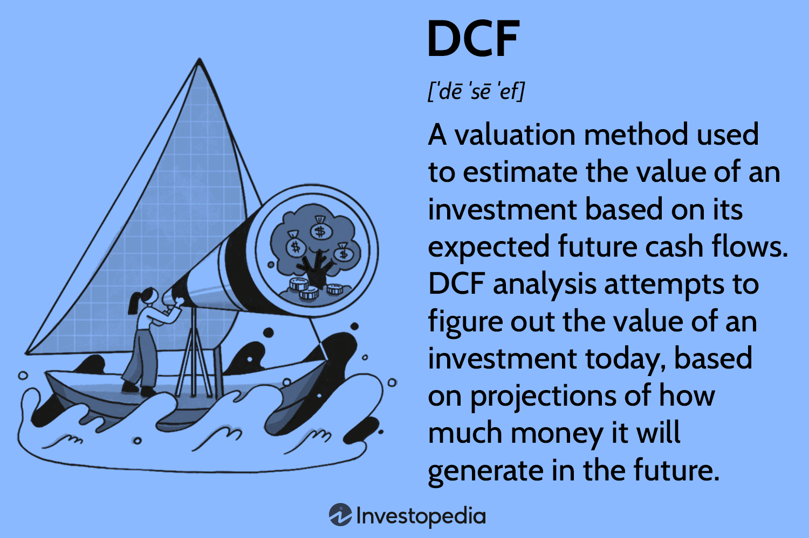

## Table of Contents

## What is a discount broker?

A discount broker is a type of brokerage firm that offers trading services at lower fees compared to traditional full-service brokers. They provide a platform where you can buy and sell stocks, bonds, mutual funds, and other investments, but they usually don't give you advice on what to buy or sell. This means you have to make your own investment decisions, which can be good if you like to be in control and want to save money on fees.

Discount brokers are popular because they make it easier and cheaper for people to invest in the stock market. You can often trade online or through a mobile app, which makes it convenient. Some well-known discount brokers include Robinhood, E*TRADE, and TD Ameritrade. They might offer fewer services than full-service brokers, but for many people, the lower costs and ease of use are worth it.

## How does a discount broker differ from a full-service broker?

A discount broker and a full-service broker are different in how they help you with your investments and how much they charge. A discount broker is like a self-service store where you pick what you want to buy and sell, like stocks or funds. They give you the tools and the platform to do it yourself, but they don't tell you what to do. This means you have to know what you're doing, but it's cheaper because you're not paying for advice.

On the other hand, a full-service broker is more like having a personal shopping assistant. They not only give you the tools to trade but also offer advice and help you make decisions about what to buy or sell. They look at your financial goals and help plan your investments. Because they do more work for you, they charge more in fees. So, if you want someone to guide you and you're okay with paying more, a full-service broker might be better for you.

## What are the main functions of a discount broker?

A discount broker's main job is to let you buy and sell things like stocks, bonds, and mutual funds at a lower cost. They give you a website or an app where you can do all your trading. You get to choose what you want to buy or sell, and they make sure the trade happens. They charge you less than other brokers because they don't give you advice on what to buy or sell.

They also provide tools that can help you make decisions. For example, they might have charts and data about how stocks are doing. But it's up to you to figure out what to do with that information. Discount brokers are great if you want to save money and like making your own choices about your investments.

## Can you explain the typical fee structure of discount brokers?

Discount brokers usually charge less than full-service brokers. Their main fee is called a "commission," which is what you pay every time you buy or sell something like a stock or a fund. Many discount brokers have made their commissions really low, sometimes even zero, to attract more people to use their services. But if they offer zero commissions, they might make money in other ways, like by lending out your stocks or charging for other services.

Besides commissions, discount brokers might also have other fees. For example, there could be fees for moving your money in or out of your account, or for not using your account for a long time. It's a good idea to check what all the fees are before you start using a discount broker, so you know what to expect and can pick the one that's best for you.

## What are the advantages of using a discount broker?

Using a discount broker can save you a lot of money. They charge less than full-service brokers because they don't give you advice on what to buy or sell. Many discount brokers even offer zero commission trades, which means you don't pay anything to buy or sell stocks. This can make a big difference if you trade a lot. Plus, they often have lower fees for things like account maintenance or transferring money.

Another advantage is that discount brokers give you more control over your investments. You get to make all the decisions about what to buy and sell, which can be good if you like to be in charge of your money. They provide tools and information, like charts and data, to help you make smart choices. It's like having a toolbox but you decide how to use the tools. This can be really satisfying if you enjoy learning about investing and managing your own portfolio.

## What are the potential drawbacks of using a discount broker?

One potential drawback of using a discount broker is that you don't get much help or advice. If you're new to investing or not sure about what to do, this can be a problem. You have to make all the decisions yourself, which can be hard and risky if you don't know a lot about the stock market. Discount brokers give you tools and data, but they won't tell you what to buy or sell, so you need to be ready to do your own research and learn.

Another issue is that while discount brokers often have low or no commissions, they might charge other fees that can add up. For example, there might be fees for moving money in or out of your account, or for not using your account enough. It's important to read all the details about what fees they charge so you're not surprised later. Even though the trading costs are low, these other fees can still make it more expensive than you expected.

## How do discount brokers make money?

Discount brokers make money in a few ways, even though they charge low or no commissions for trades. One way they earn money is through payment for order flow. This means they get paid by other companies to send them your trade orders. It's like getting a small fee for each trade you make, but it comes from someone else, not from you directly.

Another way discount brokers make money is through charging other fees. These can include fees for moving money in or out of your account, fees for not using your account enough, or fees for extra services like research tools or margin accounts. Even though the main trading fees might be low, these other fees can add up and help the broker make money.

## What should a beginner look for when choosing a discount broker?

When you're new to investing and looking for a discount broker, it's important to think about a few things. First, consider the fees. Many discount brokers offer low or no commissions for trades, which is great for saving money. But, they might have other fees like charges for moving money or not using your account enough. Make sure you understand all the fees so you don't get surprised later. Also, look at how easy the broker's website or app is to use. If you're just starting out, you'll want something simple and clear that helps you learn as you go.

Another thing to think about is the kind of help and tools the broker offers. Some discount brokers give you access to research tools, educational resources, and even basic advice. This can be really helpful if you're new to investing and want to learn more. Also, check if the broker has good customer support. If you have questions or run into problems, it's nice to know you can get help easily. By considering these things, you can find a discount broker that fits your needs and helps you start investing with confidence.

## Are there any hidden costs associated with discount brokers?

Discount brokers might seem cheap because they offer low or no commissions for buying and selling stocks. But there can be other costs you might not see at first. For example, they might charge you fees for moving money in or out of your account. If you don't use your account for a while, they might also charge you a fee for being inactive. These fees can add up and make your costs higher than you expected.

Another hidden cost can come from something called payment for order flow. This is when the broker gets paid by other companies to send your trade orders to them. While this doesn't cost you money directly, it can affect how your trades are handled. Also, if you use extra services like research tools or margin accounts, there might be extra fees for those. It's a good idea to read all the details about what fees a discount broker charges so you know what to expect.

## How does technology impact the services offered by discount brokers?

Technology has changed a lot about how discount brokers work. Before, you had to call someone to buy or sell stocks. Now, with the internet and smartphones, you can do it all by yourself on a website or an app. This makes trading easier and quicker. Discount brokers use technology to give you tools like charts and data that help you make better choices about your investments. They also use it to keep their costs down, which means they can charge you less for trading.

Because of technology, discount brokers can offer more services without raising their prices. They can give you educational resources, like videos and articles, to help you learn about investing. They also use technology to make their customer service better, like chatbots or online help centers. This means you can get help whenever you need it, without having to wait on the phone. Overall, technology makes discount brokers more useful and affordable for people who want to manage their own investments.

## What regulatory considerations should be taken into account when using a discount broker?

When you use a discount broker, you need to know about the rules that keep your money safe. In the United States, the main rule-maker is the Securities and Exchange Commission (SEC). The SEC makes sure that brokers follow the rules and treat you fairly. They also have something called the Financial Industry Regulatory Authority (FINRA) that watches over brokers to make sure they do things right. These groups make sure that your broker is honest and that your money is protected.

Another important rule to know about is the Securities Investor Protection Corporation (SIPC). This group helps protect your money if your broker goes out of business. They can give you back your cash and securities up to a certain amount, usually up to $500,000, with a $250,000 limit for cash. It's a good idea to check if your discount broker is a member of SIPC. Also, make sure you understand all the rules and agreements with your broker, so you know what to expect and how they will handle your investments.

## How can an expert investor maximize the benefits of using a discount broker?

An expert investor can maximize the benefits of using a discount broker by taking full advantage of the low-cost trading options they offer. Since discount brokers often have low or no commissions, an expert can trade more frequently without worrying about high fees eating into their profits. They can also use the advanced tools and data provided by the broker to make informed decisions quickly. For example, real-time charts, market analysis, and trading algorithms can help an expert investor spot trends and opportunities faster than with a full-service broker.

In addition, expert investors can use the flexibility and control offered by discount brokers to tailor their investment strategies. They can easily switch between different types of investments like stocks, ETFs, and options without needing to consult with a broker. This allows them to react to market changes and adjust their portfolio as needed. By understanding the fee structure and avoiding unnecessary charges, such as inactivity fees, an expert investor can keep their costs down and maximize their returns.

## References & Further Reading

[1]: Malkiel, B. G. (2019). ["A Random Walk Down Wall Street: The Time-Tested Strategy for Successful Investing"](https://yourknowledgedigest.org/wp-content/uploads/2020/04/a-random-walk-down-wall-street.pdf). W. W. Norton & Company.

[2]: Lopez de Prado, M. (2018). ["Advances in Financial Machine Learning"](https://www.amazon.com/Advances-Financial-Machine-Learning-Marcos/dp/1119482089). Wiley.

[3]: Chan, E. P. (2009). ["Quantitative Trading: How to Build Your Own Algorithmic Trading Business"](https://github.com/ftvision/quant_trading_echan_book). Wiley.

[4]: Jansen, S. (2020). ["Machine Learning for Algorithmic Trading"](https://github.com/stefan-jansen/machine-learning-for-trading). Packt Publishing.

[5]: Schwager, J. D. (2012). ["Market Wizards: Interviews with Top Traders"](https://www.amazon.com/Market-Wizards-Jack-D-Schwager/dp/0887306101). Wiley.