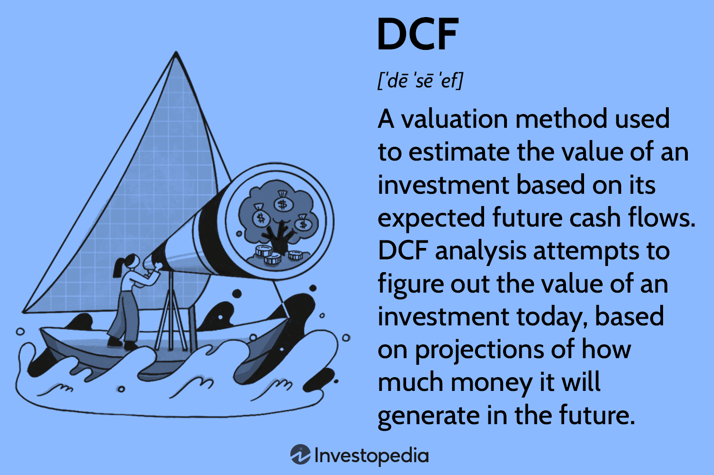

In an increasingly dynamic and competitive market environment, discount sales, pricing strategies, and algorithmic trading have become pivotal components of modern finance. Businesses are constantly seeking ways to optimize their operations and enhance their financial performance, leading to the adoption of these sophisticated techniques. Discount sales and strategic pricing play crucial roles in allowing businesses to attract cost-conscious consumers and maintain a strong market presence. They provide the flexibility to adjust to changes in consumer demand and market conditions, ensuring competitiveness against other players.

At the same time, algorithmic trading has emerged as a revolutionary force in financial markets. It leverages advanced mathematical models and automated systems to execute trades at high speed, capitalizing on small market fluctuations that would be difficult for human traders to exploit. Algorithmic trading not only enhances trading strategies but also increases market efficiency by facilitating large volumes of transactions.



This article explores how businesses can integrate discount sales and pricing strategies with algorithmic trading to form a cohesive business model. The integration of these elements allows for enhanced responsiveness to market changes, optimizing sales, and maximizing profitability. By examining the intersections of marketing, economics, and technology, we aim to provide a comprehensive understanding of how these components can be effectively harnessed in today's economy. This synergy between strategic sales approaches and cutting-edge technology offers a promising avenue for business innovation and growth.

## Table of Contents

## Understanding Discount Sales

Discount sales are a strategic measure often employed by businesses to temporarily reduce the price of products or services. This tactic is primarily used to increase sales volume, attract cost-sensitive customers, or eliminate surplus inventory. The essence of discount sales lies in offering value to customers while balancing the trade-off between lower price points and the resultant impact on profit margins.

Discount sales can attract a broader customer base, especially those who are price-conscious. By providing discounts, companies can enhance their competitive stance, potentially increasing market share. However, if discounts are not implemented with a strategic approach, they may erode profit margins. Businesses must carefully calibrate the depth and duration of discounts to ensure that their financial objectives are met without compromising profitability.

Various types of discount sales are utilized in the market, each with specific objectives and benefits:

1. **Seasonal Discounts**: These are offered during particular times of the year to align with consumer purchasing patterns, such as holiday sales or back-to-school promotions. Seasonal discounts can help in aligning inventory with seasonal demand fluctuations, thereby preventing overstock scenarios.

2. **Bulk Purchase Discounts**: Also known as volume discounts, these involve reducing prices for customers who purchase in large quantities. This strategy encourages higher purchase volumes, which can lead to increased overall sales and potentially lower fulfillment costs per unit.

3. **Clearance Sales**: These are used to sell off excess or outdated inventory. By offering products at significantly reduced prices, businesses can make room for newer stock, thus maintaining a fresh product lineup.

Understanding the implications of discount sales is crucial for crafting successful sales strategies. While discounts can effectively drive demand and engage customers, excessive or poorly planned discounts might lead to a devaluation of the brand's perceived worth. It is essential to approach discount sales with analytical rigor, assessing the potential impacts on profitability and customer perception.

To mitigate the risks associated with discounting, businesses can integrate discount sales with broader pricing strategies that consider consumer behavior, competitive dynamics, and cost structures. Employing sophisticated tools, such as data analytics and demand forecasting, can enhance decision-making processes related to discount sales, enabling businesses to predict optimal pricing models that maximize revenue without sacrificing brand integrity.

## Pricing Strategies and Restrictions

Pricing strategies are essential for businesses aiming to establish competitive price points that align with consumer demand and prevailing market conditions. These strategies serve as critical mechanisms to ensure both profitability and market appeal. Several primary approaches exist, each with its unique method and focus.

Cost-plus pricing is a straightforward method wherein a fixed percentage is added to the production cost to determine the selling price. This strategy ensures that all costs are covered while providing a predictable profit margin. Despite its simplicity, it may not always account for consumer demand or competitor pricing, which can be a limitation in highly competitive markets.

Value-based pricing, on the other hand, sets prices based on the perceived value of the product or service to the consumer rather than on the cost of production. This approach can lead to higher profit margins if the perceived value is significantly greater than the production cost. Implementing value-based pricing effectively requires a deep understanding of customer needs and market willingness.

Competitive pricing involves setting prices based on what competitors are charging. This strategy is particularly effective in markets with little differentiation between products or services. It mirrors the landscape of economic models like Bertrand competition, where firms choose prices simultaneously and non-cooperatively, leading to dynamic interactions in pricing decisions.

However, businesses must also navigate various restrictions and regulations that influence their pricing strategies. Legal constraints may prevent selling below cost, a practice known as predatory pricing, which can lead to anti-competitive behavior and is often scrutinized by regulatory bodies. Companies must ensure compliance with laws such as the Robinson-Patman Act in the United States, which addresses price discrimination.

Balancing these restrictions while setting prices that are attractive yet profitable demands a nuanced approach. Successful companies often employ a mix of pricing strategies, adjusting according to market and regulatory conditions. For instance, during periods of increased competition, a blend of competitive and value-based pricing might be used to maintain market share while highlighting product differentiation.

Strategic pricing decisions hold significant sway over a business's success and market positioning. Effective pricing can enhance a company's brand perception, support entry into new markets, and contribute to long-term profitability. Businesses must continuously evaluate and adjust their pricing strategies to reflect new cost structures, competitor actions, and shifts in consumer demand.

In conclusion, the adept application of pricing strategies, guided by a thorough understanding of both market dynamics and regulatory frameworks, is vital for achieving optimal business outcomes. This strategic focus positions companies to respond agilely to changing market landscapes and maintain competitive advantage.

 to Algorithmic Trading

Algorithmic trading, also known as 'algo trading', represents a sophisticated approach to financial markets where trades are executed using algorithms based on pre-defined criteria. The primary advantage of this practice lies in its ability to perform rapid, high-frequency trading, enabling participants to capitalize on even the smallest market fluctuations efficiently. 

Traditional manual trading often struggles to keep pace with the fast-moving nature of modern financial environments. Here, [algorithmic trading](/wiki/algorithmic-trading) stands out by employing mathematical models and automated systems to execute complex trading strategies at speeds unattainable by human traders. These algorithms, which can include sophisticated statistical methods and [machine learning](/wiki/machine-learning) models, can process vast amounts of market data in real-time, detecting patterns and opportunities as they emerge.

The growth of algo trading has been fueled by its potential to optimize trading performance and contribute to overall market efficiency. Algorithms can be programmed to follow specific strategies, such as [trend following](/wiki/trend-following), [arbitrage](/wiki/arbitrage), or market-making. For example, a simple trend-following strategy might involve coding an algorithm to buy stocks when a short-term moving average crosses above a long-term moving average, and sell when the reverse occurs. 

Furthermore, high-frequency trading ([HFT](/wiki/high-frequency-trading-strategies)) has become a prominent component of algorithmic trading. HFT leverages the capabilities of advanced computing technology to execute a large number of orders at extremely fast speeds, often within microseconds. This can enhance [liquidity](/wiki/liquidity-risk-premium) and reduce bid-ask spreads, contributing to a more efficient market.

Types of algorithmic trading vary widely, including strategies such as:

1. **Statistical Arbitrage**: This involves the use of algorithms to identify pricing inefficiencies between related securities, enabling traders to exploit these discrepancies for profit.

2. **Trend-following Strategies**: These algorithms analyze historical data to identify and trade along prevailing market trends.

3. **Market Making**: This strategy involves placing buy and sell orders to earn the spread between the two, providing liquidity to the markets.

4. **Execution-based Strategies**: These focus on executing large orders in a manner that minimizes market

## How Algo Trading Enhances Pricing Strategies

Algorithmic trading (algo trading) plays a significant role in enhancing pricing strategies by offering sophisticated tools to process and analyze substantial volumes of market data instantaneously. This capability allows businesses to adjust their pricing strategies dynamically, aligning them with current market conditions, which include shifts in supply and demand, competitor pricing, and consumer behavior patterns. The use of algorithms enables the identification of optimal pricing points and the timing of discounts, thereby maximizing sales and profitability.

Algorithms employ quantitative models to analyze historical and real-time data to predict market trends and consumer buying behaviors. With this analytical capability, businesses can forecast price elasticity and demand curves more accurately, allowing for more nuanced and responsive pricing models. For example, machine learning algorithms can be utilized to segment consumer groups based on purchasing behavior, enabling personalized pricing and discount offers. An example of a simple demand forecasting model using Python's machine learning libraries might look as follows:

```python
import pandas as pd
from sklearn.model_selection import train_test_split
from sklearn.ensemble import RandomForestRegressor

# Load data
data = pd.read_csv('sales_data.csv')
X = data[['historical_price', 'competitor_price', 'marketing_spend']]
y = data['sales']

# Split the data
X_train, X_test, y_train, y_test = train_test_split(X, y, test_size=0.2, random_state=42)

# Create and train the model
model = RandomForestRegressor(n_estimators=100, random_state=42)
model.fit(X_train, y_train)

# Predict sales for new data
predicted_sales = model.predict(X_test)
```

This model helps in predicting sales based on historical prices and other relevant variables, aiding the development of pricing strategies that are aligned with market demands.

By continually monitoring market data, algo trading systems can adjust pricing strategies in real-time. This enables businesses to quickly respond to sudden market changes such as a surge in demand or a competitor's price drop, thus maintaining a competitive edge. Moreover, the ability to automate these responses reduces the time and human resources typically required to make strategic pricing decisions.

The implementation of algorithmic trading introduces a level of precision and speed that was previously unattainable through traditional methods. As these systems evolve, they integrate more comprehensive data points – from macroeconomic indicators to social media trends – to refine pricing models even further.

In summary, algorithmic trading equips businesses with powerful tools to enhance their pricing strategies, offering a significant advantage in fast-paced and competitive markets. This approach not only optimizes financial performance but also ensures that pricing remains aligned with both strategic business goals and market realities.

## Challenges and Considerations

Businesses employing discount sales and algorithmic trading strategies must navigate several challenges and considerations to maximize benefits and mitigate risks. 

For discount sales, maintaining brand value is critical. While discounts can attract price-sensitive consumers, excessive or poorly planned discounts may erode the perceived value of a brand. This can lead to a "race to the bottom" scenario, where companies continuously lower prices, impacting profitability and potentially degrading the brand image. Firms must strategically balance sales growth with profitability to avoid these pitfalls. For example, implementing a well-timed seasonal discount or a targeted bulk purchase offer can maintain a brand's prestige while boosting sales.

In algorithmic trading, technical reliability poses significant challenges. Algorithms depend on the seamless functionality of complex systems that process vast amounts of data at high speeds. The sheer [volume](/wiki/volume-trading-strategy) and complexity of data can lead to errors or glitches, which may result in substantial financial losses. Furthermore, the rapid nature of algorithmic trades requires robust infrastructure to ensure low latency and quick execution. Companies often invest in high-speed networks and optimized algorithms to manage these challenges effectively.

Regulatory requirements and ethical considerations are paramount in algorithmic trading. Regulatory bodies have instituted rules to prevent market manipulation and ensure fair trading practices. For instance, algorithms must comply with regulations to avoid triggering market anomalies like "flash crashes." Ethical considerations also play a role, as algorithms must be designed to act in good faith, without exploiting market inefficiencies in a manner that may harm the market ecosystem.

Finally, these strategies necessitate continuous evaluation and adaptation to evolving market conditions. Businesses must constantly monitor market trends, competitive actions, and consumer behavior to refine their discount and trading strategies. This demands a dynamic approach to strategy management, often leveraging advanced data analytics to inform decision-making and maintain a competitive edge.

In conclusion, while the integration of discount sales and algorithmic trading offers substantial advantages, businesses must remain vigilant in managing the associated challenges to harness these strategies effectively.

## Conclusion

The integration of discount sales, pricing strategies, and algorithmic trading represents a powerful approach in today's economy. Leveraging these methodologies allows businesses to remain competitive by adapting quickly to changing market conditions. Discount sales help attract price-sensitive consumers, while sophisticated pricing strategies ensure that prices are set to reflect both consumer demand and market conditions without compromising profitability. Algorithmic trading further enhances these processes by enabling real-time analysis of market data, allowing for dynamic adjustments to pricing strategies that can optimize sales outcomes and bolster efficiency.

The convergence of marketing strategies with advanced technology opens opportunities for substantial innovation and growth. Businesses capable of harnessing this synergy can benefit from increased agility and a more responsive approach to market demands. The use of algorithmic trading, in particular, empowers companies to deploy more nuanced and predictive models that anticipate market movements, leading to a strategic advantage over competitors.

However, the successful application of these strategies requires a deep understanding of their underlying principles and careful planning. Companies must navigate complex market dynamics, regulatory environments, and technological challenges to employ these strategies effectively. This necessitates a commitment to continuous learning and adaptation, as the business landscape is ever-changing.

As the market continues to evolve, agility and informed decision-making become more crucial than ever for business success. Staying current with the latest developments in discount sales, pricing strategies, and algorithmic trading will ensure that businesses do not just survive but thrive in the competitive and dynamic environment of modern finance.

## References & Further Reading

[1]: Bergstra, J., Bardenet, R., Bengio, Y., & Kégl, B. (2011). ["Algorithms for Hyper-Parameter Optimization."](https://proceedings.neurips.cc/paper/2011/file/86e8f7ab32cfd12577bc2619bc635690-Paper.pdf) Advances in Neural Information Processing Systems 24.

[2]: ["Advances in Financial Machine Learning"](https://www.amazon.com/Advances-Financial-Machine-Learning-Marcos/dp/1119482089) by Marcos Lopez de Prado

[3]: ["Evidence-Based Technical Analysis: Applying the Scientific Method and Statistical Inference to Trading Signals"](https://www.amazon.com/Evidence-Based-Technical-Analysis-Scientific-Statistical/dp/0470008741) by David Aronson

[4]: ["Machine Learning for Algorithmic Trading"](https://github.com/stefan-jansen/machine-learning-for-trading) by Stefan Jansen

[5]: ["Quantitative Trading: How to Build Your Own Algorithmic Trading Business"](https://www.amazon.com/Quantitative-Trading-Build-Algorithmic-Business/dp/1119800064) by Ernest P. Chan