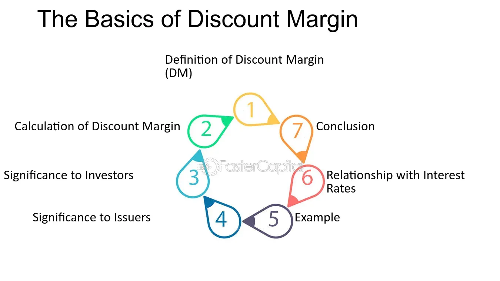

## Table of Contents

## What is the basic definition of Discount Margin?

Discount Margin, often abbreviated as DM, is a financial term used to describe the expected return on a floating-rate security over its life. This return is calculated above the index rate, like LIBOR or the federal funds rate, to which the security's interest payments are tied. Essentially, it's the extra yield that investors demand for holding a floating-rate note instead of a risk-free investment.

The Discount Margin is important because it helps investors understand the risk and potential reward of a floating-rate security. If the security's interest rate resets periodically, the Discount Margin remains constant, providing a consistent measure of the security's profitability. By comparing the Discount Margin with other investment options, investors can make more informed decisions about where to put their money.

## How does Discount Margin differ from other types of margins in finance?

Discount Margin is different from other types of margins in finance because it focuses on floating-rate securities. These are investments where the interest rate changes over time based on a benchmark like LIBOR. The Discount Margin tells you how much extra return you can expect above this changing rate. It's like a premium you get for taking on the risk of these securities. Other margins, like the profit margin in business, look at how much money a company makes after costs, or the margin in trading, which is the money you need to put down to buy stocks or other assets.

Another type of margin that's different from the Discount Margin is the interest rate margin, which is used in banking. This is the difference between the interest rate a bank charges on loans and the rate it pays on deposits. It helps banks make money. Unlike the Discount Margin, which is about the return on a specific type of investment, the interest rate margin is about the overall profitability of a bank's lending activities. So, while all these margins deal with the concept of extra value or profit, they apply to different areas of finance and serve different purposes.

## What are the key components needed to calculate Discount Margin?

To calculate the Discount Margin, you need a few key pieces of information. First, you need to know the cash flows of the floating-rate security, which include the interest payments and the final payment at maturity. These payments change over time because they're based on a benchmark rate like LIBOR, plus the Discount Margin you're trying to figure out. You also need to know the price you're paying for the security, which is usually less than its face value, and the dates when the interest payments are made.

Next, you use these pieces of information to solve for the Discount Margin. You start with a guess for the Discount Margin and then calculate the present value of all the future cash flows using this guess. The present value is what these future payments are worth today, considering the time value of money. If the present value equals the price you're paying for the security, then your guess for the Discount Margin is correct. If not, you adjust your guess and try again until you find the right Discount Margin. This process can be done with a financial calculator or a computer program, making it easier to find the exact Discount Margin.

## Can you explain the formula used to calculate Discount Margin?

The formula to calculate the Discount Margin involves finding the rate that makes the present value of all the future cash flows from a floating-rate security equal to its current market price. The cash flows include the periodic interest payments and the final payment at maturity. These payments are based on a benchmark rate, like LIBOR, plus the Discount Margin you're trying to find. You start with a guess for the Discount Margin, then calculate the present value of the cash flows using this guess. If the present value matches the security's price, your guess is correct. If not, you adjust your guess and try again until you find the right Discount Margin.

This process can be a bit tricky, but it's easier with a financial calculator or a computer program. These tools can quickly solve for the Discount Margin by adjusting the guess until the present value of the cash flows equals the security's price. The formula itself is a bit complicated because it involves solving for the Discount Margin in a way that balances out all the future payments with the price you pay today. But once you understand the basic idea, you can use these tools to find the Discount Margin for any floating-rate security.

## What are the typical applications of Discount Margin in financial markets?

Discount Margin is used a lot in financial markets when people want to figure out how good a floating-rate security is as an investment. These securities have interest payments that change based on rates like LIBOR. The Discount Margin helps investors see how much extra return they can expect above these changing rates. This is important because it shows the risk and reward of holding these securities. If the Discount Margin is high, it might mean the security is riskier but could offer a bigger reward.

Investors also use Discount Margin to compare different floating-rate securities. By looking at the Discount Margins of different securities, they can decide which one might be a better investment. This helps them make smarter choices about where to put their money. For example, if one security has a higher Discount Margin than another, it might be a better deal if the investor is okay with the extra risk. So, Discount Margin is a key tool for anyone trying to navigate the world of floating-rate investments.

## How does Discount Margin affect the pricing of floating-rate securities?

Discount Margin plays a big role in deciding how much a floating-rate security is worth. When people want to buy these securities, they look at the Discount Margin to see how much extra money they can make on top of the changing interest rates. If the Discount Margin is high, it means the security might be riskier, but it also offers a bigger reward. So, a higher Discount Margin can make the security more attractive to some investors, which can drive up its price. On the other hand, if the Discount Margin is low, the security might be seen as less risky but with a smaller reward, which could make it less appealing and lower its price.

Investors use the Discount Margin to compare different floating-rate securities and decide which ones to buy. If one security has a higher Discount Margin than another, it might be a better deal if the investor is okay with the extra risk. This comparison affects how much people are willing to pay for each security. When lots of people want to buy a security because of its high Discount Margin, the price goes up. If fewer people are interested because the Discount Margin is low, the price goes down. So, the Discount Margin helps set the price of floating-rate securities by showing investors the potential extra return they can get.

## What are the common challenges faced when calculating Discount Margin?

Calculating the Discount Margin can be tricky because it involves guessing and checking until you get it right. You need to start with a guess for the Discount Margin, then figure out the present value of all the future payments from the security. If the present value matches the price you're paying for the security, your guess is correct. But if it doesn't match, you have to keep adjusting your guess until it does. This process can take a lot of time and effort, especially if you're doing it by hand.

Another challenge is that the interest payments on floating-rate securities change over time. They're based on a benchmark rate like LIBOR, which can go up or down. This means you have to predict what these rates will be in the future, which is hard to do. If your predictions are off, your calculation of the Discount Margin might not be accurate. This uncertainty about future rates adds another layer of complexity to figuring out the Discount Margin.

## How does the choice of benchmark rate impact the Discount Margin calculation?

The benchmark rate, like LIBOR or the federal funds rate, is really important when you're calculating the Discount Margin. It's the base rate that the interest payments on a floating-rate security are built on. If you choose a different benchmark rate, the interest payments will change, and that changes the Discount Margin too. For example, if you use a benchmark rate that's usually higher, the interest payments will be higher, so the Discount Margin might be lower to keep the total return the same. On the other hand, if you use a benchmark rate that's usually lower, the interest payments will be lower, and the Discount Margin might need to be higher to make up for it.

Choosing the right benchmark rate is tricky because it depends on what's happening in the economy and what investors expect to happen in the future. If the benchmark rate you pick turns out to be different from what actually happens, your calculation of the Discount Margin won't be accurate. This can make it hard to compare different floating-rate securities or decide if one is a good investment. So, it's important to think carefully about which benchmark rate to use and to keep an eye on how it might change over time.

## What role does Discount Margin play in the valuation of mortgage-backed securities?

Discount Margin is important when figuring out how much mortgage-backed securities (MBS) are worth. MBS are investments that are made up of a bunch of home loans. The interest payments on these securities change based on a benchmark rate, like LIBOR, plus the Discount Margin. The Discount Margin shows how much extra return investors can expect on top of the changing interest rates. If the Discount Margin is high, it means the MBS might be riskier, but it also offers a bigger reward. This can make the MBS more attractive to some investors, which can drive up its price.

The choice of benchmark rate also matters a lot when calculating the Discount Margin for MBS. If you use a benchmark rate that's usually higher, the interest payments will be higher, so the Discount Margin might be lower to keep the total return the same. On the other hand, if you use a benchmark rate that's usually lower, the interest payments will be lower, and the Discount Margin might need to be higher to make up for it. This can make it hard to compare different MBS or decide if one is a good investment. So, it's important to think carefully about which benchmark rate to use and to keep an eye on how it might change over time.

## How can investors use Discount Margin to assess the risk of bond investments?

Investors can use Discount Margin to figure out how risky a bond investment might be. When looking at floating-rate bonds, the Discount Margin shows the extra return they can expect on top of the changing interest rates. If the Discount Margin is high, it means the bond might be riskier, but it also offers a bigger reward. This helps investors decide if they're okay with taking on more risk for a chance at higher returns. By comparing the Discount Margins of different bonds, investors can see which ones might be riskier and make smarter choices about where to put their money.

The choice of benchmark rate also plays a big role in how investors assess risk using Discount Margin. The benchmark rate, like LIBOR, is the base rate that the interest payments on floating-rate bonds are built on. If the benchmark rate changes a lot, it can make the Discount Margin harder to predict, adding more risk to the investment. Investors need to think carefully about which benchmark rate to use and keep an eye on how it might change over time. This way, they can better understand the risk and potential reward of their bond investments.

## What advanced techniques can be used to refine Discount Margin calculations?

To make Discount Margin calculations more accurate, investors can use something called Monte Carlo simulations. This fancy technique involves running a bunch of different scenarios to see how the Discount Margin might change with different interest rates. By doing this, investors can get a better idea of how risky the investment might be and how much return they might expect. It's like playing out different futures to see what could happen, which helps them make smarter choices about their investments.

Another advanced way to refine Discount Margin calculations is by using more detailed models of how interest rates might change in the future. These models can take into account things like economic forecasts, inflation rates, and even global events that might affect interest rates. By using these models, investors can get a clearer picture of what the Discount Margin might be in different situations. This helps them understand the risks better and decide if the potential rewards are worth it.

## How has the concept of Discount Margin evolved with changes in financial regulations?

The concept of Discount Margin has changed a bit because of new financial rules. For example, when the LIBOR rate was going away, people had to switch to using other benchmark rates like SOFR. This change affected how Discount Margin was calculated because the new rates were different from LIBOR. Also, new rules about how banks and investors should report their investments made it important to be more careful with Discount Margin calculations. These rules wanted to make sure everyone was being honest and clear about the risks and rewards of their investments.

Even though the basic idea of Discount Margin stayed the same, the way people use it has gotten more complicated. With new technology and better ways to predict interest rates, investors can now use fancy tools like Monte Carlo simulations to make their calculations more accurate. These tools help them understand the risks better and make smarter choices about where to put their money. So, while the rules have made things a bit more complex, they've also helped investors get a clearer picture of what they're investing in.

## What is Understanding Discount Margin?

The Discount Margin (DM) is a crucial metric in the financial landscape, particularly in the valuation of floating-rate securities. It represents the average expected return above the reference rate, which is typically a benchmark interest rate such as LIBOR or SOFR. The DM provides a measure of the risk and expected yield associated with these securities, offering investors a clearer perspective on the potential returns in relation to prevailing market conditions.

In the context of floating-rate securities, which are bonds with variable interest payments linked to a reference rate, the Discount Margin is instrumental. It accounts for the additional yield an investor would receive over the reference rate for taking on the risk associated with the bond. This additional yield, reflected in the DM, compensates for various factors such as credit risk, [liquidity](/wiki/liquidity-risk-premium) risk, and other market variables. A higher DM suggests a higher yield relative to the benchmark rate, indicating increased risk or higher compensation for holding the security.

To illustrate how the Discount Margin impacts bond pricing, consider a floating-rate bond with a coupon payment set at a specific spread over a benchmark rate like LIBOR. If the bond's current market price deviates from its par value, the DM helps investors recalibrate their expectations of yield relative to the market's perception of risk. For example, if a bond is trading below its par value, the DM will be higher than the initial spread, signaling a higher return due to increased perceived risk. Conversely, if the bond trades above par, the DM would decrease, reflecting a lower yield expectation as perceived risk diminishes.

Mathematically, the DM can be approximated by the following formula:

$$
\text{DM} = \frac{\text{Coupon Payment} - \text{Reference Rate}}{\text{Price of the bond relative to par}}
$$

This formula highlights the relationship between the bond's coupon payments, current market price, and the reference rate. By calculating the DM, investors gain insights into how the bond is priced in comparison to its par value, adjusting for market conditions and expected risk.

In summary, the Discount Margin is a vital tool for investors analyzing floating-rate securities, providing essential insights that assist in evaluating bond pricing and making informed investment decisions. Understanding how DM affects bond valuation helps investors navigate the complexities of financial markets, ensuring that their portfolio strategies align with market dynamics and risk profiles.

## What are the methods and formulas for calculating discount margin?

Calculating the Discount Margin (DM) is a crucial exercise in assessing the yield of floating-rate securities relative to market benchmarks. To determine the DM, one must undertake specific steps and apply mathematical formulas to accurately gauge the spread over the reference [interest rate](/wiki/interest-rate-trading-strategies).

### Steps in Calculating Discount Margin

1. **Identify the Security Characteristics**: Understand the specifics of the bond, including coupon payments, reset frequency, and maturity. Floating-rate bonds typically have coupon payments that reset periodically based on a reference rate plus a spread.

2. **Select an Appropriate Benchmark Yield Curve**: Choosing the correct yield curve is vital, as it forms the baseline for calculating the discount rate at which cash flows will be evaluated. This curve should reflect similar maturity and credit quality to the bond in question.

3. **Project Future Cash Flows**: Estimate the bond's future cash flows by adding the estimated spread (initial guess) to the current reference rate, ensuring adjustments are made for the bond's floating rate nature.

4. **Discount the Cash Flows**: Use the discount rates derived from the benchmark yield curve to discount these estimated future cash flows back to their present value. Calculate the sum of these present values to determine the bond's theoretical purchase price.

5. **Iterate to Find the Discount Margin**: Adjust the spread iteratively until the present value of cash flows equals the bond's market price. This spread is the Discount Margin.

### Mathematical Formula for Discount Margin

The equation used in this iterative process can be represented as:

$$

\text{Price} = \sum \frac{C_i}{(1 + r_t + \text{DM})^t} 
$$

Where:
- $\text{Price}$ is the market price of the bond.
- $C_i$ represents the period cash flow.
- $r_t$ is the reference interest rate at time $t$.
- $\text{DM}$ is the discount margin.
- $t$ is each respective time period.

### Importance of the Benchmark Yield Curve

Selecting an appropriate benchmark yield curve is essential because it needs to mirror the maturity and credit characteristics of the bond. An inaccurately chosen benchmark can lead to incorrect DM calculations, affecting investment and trading decisions.

### Example Calculation

Consider a floating-rate bond with the following characteristics:
- Market price: $102
- Maturity: 5 years
- Current reference rate: 3%
- Expected reference rate increase: 0.25% annually
- Current spread: 1%

Calculate the DM such that the present value of cash flows equals the $102 market price. Using Python, the iterative process might look like this:

```python
def calculate_dm(price, cash_flows, reference_rates, maturity):
    dm_guess = 0.01  # Initial assumption for DM
    tolerance = 0.0001 
    max_iterations = 1000

    for _ in range(max_iterations):
        # Calculate present value of cash flows
        present_value = sum(cf / (1 + rr + dm_guess)**t for cf, rr, t in zip(cash_flows, reference_rates, range(1, maturity + 1)))
        if abs(present_value - price) <= tolerance:
            return dm_guess
        dm_guess += (price - present_value) * 0.0001  # Adjust guess using a small factor

    return None  # If no converged solution is found

# Example cash flows, reference rates for each year (simplified)
cash_flows = [3.25, 3.5, 3.75, 4.0, 5.0]
reference_rates = [0.03, 0.0325, 0.035, 0.0375, 0.04]
maturity = 5
price = 102

calculated_dm = calculate_dm(price, cash_flows, reference_rates, maturity)
print(f"Calculated Discount Margin: {calculated_dm:.4%}")
```

This code performs an iterative search for the discount margin that aligns the present value of cash flows with the bond's market price. Such calculations underscore the DM's utility in financial analysis and trading strategies.

## References & Further Reading

[1]: ["Fixed-Income Securities: Valuation, Risk Management and Portfolio Strategies"](https://www.amazon.com/Fixed-Income-Securities-Valuation-Management-Strategies/dp/0470852771) by Pietro Veronesi

[2]: ["The Handbook of Fixed Income Securities"](https://www.amazon.com/Handbook-Fixed-Income-Securities-Ninth/dp/1260473899) by Frank J. Fabozzi

[3]: ["Bond Mathematics: The Theory Behind the Formulas"](https://www.wiley.com/en-us/Bond+Math%3A+The+Theory+Behind+the+Formulas%2C+%2B+Website%2C+2nd+Edition-p-9781118866320) by Donald J. Smith

[4]: Choudhry, M. (2010). ["The Bond and Money Markets: Strategy, Trading, Analysis."](https://www.sciencedirect.com/book/9780750646772/the-bond-and-money-markets) Butterworth-Heinemann.

[5]: Elton, E. J., & Gruber, M. J. (1995). ["Modern Portfolio Theory and Investment Analysis."](https://books.google.com/books/about/Modern_Portfolio_Theory_and_Investment_A.html?id=181CEAAAQBAJ) John Wiley & Sons, Inc.