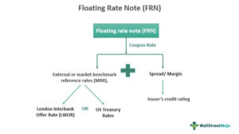

Investment strategies have witnessed substantial transformation with the advent of innovative financial instruments and sophisticated trading technologies. Two components integral to contemporary financial markets are discount notes and algorithmic trading, each offering unique advantages that cater to different investor needs and objectives.

Discount notes are short-term debt instruments, typically issued at a discount to their face value by government entities and corporations. They function similarly to zero-coupon bonds and are characterized by their short maturity periods, often not exceeding one year. These instruments reflect minimal price volatility, which, coupled with the backing of government agencies, makes them a popular choice for risk-averse investors.



On the technological forefront, algorithmic trading has revolutionized how trading operations are conducted. By using complex computer algorithms to automate trading decisions and executions, this method enables the processing of high-volume trades at speeds unattainable by human traders. Algorithms can quickly respond to market conditions based on preset parameters, thereby enhancing trading efficiency, minimizing human error, and supporting consistent decision-making.

This article will introduce the synergetic potential between discount notes and algorithmic trading, which can often be substantial in optimizing investment portfolios. Their interaction can aid investors in maximizing returns while mitigating risks. A thorough grasp of these components empowers investors to make informed decisions and adapt strategically to the ever-changing financial market landscape. Understanding the dynamics of discount notes and the efficiencies offered by algorithmic trading is vital for capitalizing on present and future market opportunities.

## Table of Contents

## What are Discount Notes?

Discount notes are financial instruments that represent short-term debt obligations issued by government agencies or corporations. These notes are sold to investors at a price lower than their face value, hence the term "discount." This discount compensates investors for the absence of periodic interest payments, which distinguishes discount notes from traditional bonds. Upon maturity, typically within a year, the investor receives the full face value of the note, realizing a profit equivalent to the difference between the purchase price and the face value.

The mechanics of discount notes resemble those of zero-coupon bonds. However, while zero-coupon bonds can have long maturities, discount notes focus on providing financing for short durations, usually not exceeding one year. This characteristic makes them an attractive option for investors seeking low-risk, short-term investment vehicles. For issuers, discount notes provide a mechanism to access capital quickly and efficiently, thereby addressing immediate funding needs or liquidity requirements.

Investors are often attracted to discount notes due to their minimal [volatility](/wiki/volatility-trading-strategies). When issued by government agencies, these notes [carry](/wiki/carry-trading) the backing of entities with high credit ratings, further instilling confidence in their safety and stability. For example, in the United States, discount notes issued by government-sponsored enterprises (GSEs) like Fannie Mae or Freddie Mac are considered low-risk due to implied government support.

The absence of periodic interest payments also means that the return on investment from discount notes is predictable over their short life span. This predictability simplifies investment planning, especially for investors looking to manage cash flows with precision. However, it is crucial to note that while discount notes are relatively secure, the trade-off for this reduced risk is typically lower returns compared to more volatile investment options like corporate bonds or stocks.

In summary, discount notes serve as a critical tool for both issuers and investors — providing a quick, secure method for raising capital for issuers, while offering a stable, low-risk investment opportunity for investors.

## Advantages and Disadvantages of Discount Notes

Discount notes offer several distinct advantages that make them a preferred choice for certain investors, primarily due to their inherent stability. Stability is one of the key benefits as these instruments are generally less volatile than other types of securities. Their lower volatility is attributed to the nature of their backing, especially when issued by governmental entities. Such backing assures investors of the issuer's high creditworthiness, thereby positioning discount notes as a low-risk investment option. This characteristic is particularly attractive to risk-averse investors who prioritize capital preservation.

An additional advantage of discount notes is their straightforward profit model. Investors purchase these instruments at a price below their face value, and they receive the face value at maturity, thus realizing a predictable profit margin. This structure is especially advantageous in uncertain economic climates, where predictability can provide significant peace of mind.

However, this stability and predictability come with trade-offs. The low-risk nature of discount notes means they typically yield lower returns compared to high-risk investment opportunities. For investors seeking higher yields, discount notes may not align with their investment goals, as the safety they provide limits potential profitability.

Further, when considering corporate-issued discount notes, there exists an increased risk of default compared to government-issued notes. This elevated risk is due to varying degrees of creditworthiness among corporations. While it is possible to gain higher returns from these corporate-issued notes, they inherently carry greater financial exposure. Therefore, the decision to invest in discount notes issued by corporations rather than government agencies should align with an investor's risk tolerance and tailored investment strategy.

Overall, selecting discount notes requires careful consideration of individual financial goals, risk appetite, and market conditions. Investors who value security and steadiness may find these instruments align with their portfolio strategies, while those seeking high returns must weigh their propensity for risk against the type of discount notes chosen.

## The Role of Algorithmic Trading

Algorithmic trading involves the utilization of computer algorithms to automate trading decisions and executions. This technology allows traders and investors to execute high-[volume](/wiki/volume-trading-strategy) trades at speeds that far surpass human capabilities, effectively enhancing investment strategies. The algorithms operate based on predefined rules that are designed to respond to various market signals, including price movements and economic indicators. By leveraging these automated systems, traders can achieve a high level of efficiency in their trading operations, as the need for manual interventions is significantly reduced. This reduction subsequently minimizes the potential for human error, ensuring that decision-making remains consistent and in line with strategic objectives.

Algorithmic trading serves as a critical tool in modern financial markets, offering substantial advantages in terms of speed and precision. Algorithms can execute trades within milliseconds, allowing traders to capitalize on fleeting market opportunities that would be impossible to act upon manually. Furthermore, algorithmic systems can process vast amounts of market data at once, providing traders with comprehensive analyses that inform better decision-making.

Despite these advantages, [algorithmic trading](/wiki/algorithmic-trading) must be carefully managed to prevent negative impacts on market stability. Poorly designed algorithms or inadequate oversight can lead to unintended consequences, such as market volatility spikes. The infamous "Flash Crash" of 2010 is a prime example of how algorithmic trading can exacerbate market disruptions. Therefore, robust risk management frameworks and continuous monitoring are essential to ensure that algorithmic trading practices contribute positively to market dynamics without causing unintended disturbances.

In summary, algorithmic trading offers a powerful mechanism for executing trades efficiently and accurately, provided that its use is properly calibrated and managed. By harnessing the capabilities of this technology, investors can achieve substantial improvements in their trading operations, driving optimal outcomes in modern financial markets.

## Algorithmic Trading in the Context of Discount Notes

Algorithmic trading, often referred to as algo trading, plays a significant role in enhancing the management and optimization of portfolios that include discount notes. By leveraging computer algorithms, investors can rapidly evaluate market conditions and respond to changes with high precision and speed. This capability is critical for determining the optimal timing for buying or selling discount notes, which do not offer periodic interest payments and are largely affected by yield fluctuations as they approach maturity.

Advanced algorithms are designed to process a vast array of market data, including price movements and economic indicators, allowing them to analyze market sentiment and forecast potential changes in yields for discount notes. For example, [machine learning](/wiki/machine-learning) models may be employed to predict future [interest rate](/wiki/interest-rate-trading-strategies) trends based on historical data, market volatility, and macroeconomic factors. This predictive ability is invaluable for investors seeking to maximize returns while managing risk, as it allows for informed decisions on when to hold or divest from particular discount notes.

Furthermore, integrating algorithmic trading into the management of discount note investments can help maintain the inherent safety of these instruments. By automating the execution of trades, algo trading minimizes the risk of human error and ensures consistent adherence to predefined investment strategies. Properly calibrated algorithms are crucial in mitigating risks associated with market timing and execution errors. For instance, they can be programmed to adjust the timing and volume of trades in response to changing [liquidity](/wiki/liquidity-risk-premium) conditions, thereby reducing the impact of adverse price movements.

In practice, implementing algorithmic trading for discount notes might involve writing Python scripts to automate trading strategies. For example:

```python
import numpy as np

def optimize_trade(decision_data):
    # Simple decision algorithm based on simulated yield forecast
    yield_forecast = model.predict(decision_data)
    if yield_forecast > threshold:
        return 'buy'
    elif yield_forecast < threshold:
        return 'sell'
    else:
        return 'hold'

# Simulated model and decision data
model = your_trained_model()  # Assume a pre-trained model
decision_data = np.array([...])  # Input data for yield forecast

decision = optimize_trade(decision_data)
```

Through these methodologies, investors can achieve a balanced approach by strategically timing their investments in discount notes, thereby enhancing profitability and maintaining the security associated with these low-risk instruments. By embracing algorithm-based strategies, investors can address market dynamics effectively, ultimately contributing to a more robust investment portfolio.

## Conclusion

Discount notes and algorithmic trading are integral components in today's investment landscape. Discount notes, being short-term debt instruments issued at a discount to face value, offer a low-risk investment option, particularly when issued by government bodies. This low-risk characteristic is complemented by algorithmic trading, which provides the ability to exploit market opportunities with precision and efficiency. Through algorithmic strategies, investors can automate trade execution based on real-time market data, allowing for swift response to market changes and reducing human error.

The combination of discount notes and algorithmic trading can lead to optimized investment portfolios. By leveraging algorithmic trading, investors can enhance the management of their discount note holdings, ensuring timely decisions in buying or selling, all while maintaining the inherent safety of these instruments. This integration results in balanced portfolios that aim for stable and profitable returns.

Investors, whether new or experienced, can significantly benefit from understanding and applying these financial tools. Algorithmic trading not only amplifies the potential returns from discount notes but also provides a structured approach to handling market volatility and execution risks. 

As technology continually evolves, keeping abreast of new trading methodologies and tools is essential for maximizing market opportunities. This proactive approach enables investors to adapt their strategies, staying competitive and informed in the dynamically changing financial markets.

## FAQs

### What is the difference between discount notes and zero-coupon bonds?

Discount notes and zero-coupon bonds are both fixed-income securities that are issued at a discount to their face value and do not provide periodic interest payments. The primary distinction lies in their maturity periods and issuers. Discount notes typically have shorter maturity periods, usually up to one year, and are often issued by government agencies and corporations to provide short-term capital. Conversely, zero-coupon bonds have longer maturities, often ranging from one year to several decades, and can be issued by a wider range of entities, including municipalities and corporations. The longer maturity of zero-coupon bonds can lead to greater price volatility compared to discount notes.

### How can algorithmic trading improve investment returns for discount notes?

Algorithmic trading can significantly enhance investment returns for discount notes by automating the process of identifying favorable market conditions. By deploying computer algorithms that analyze market signals such as price movements or economic indicators in real-time, investors can make rapid, informed decisions regarding the buying and selling of discount notes. This automation reduces the probability of manual errors, ensures swift execution, and enables investors to capitalize on short-lived opportunities. Moreover, algorithms can be fine-tuned to evaluate sentiments and trends, forecasting potential yield improvements, thereby contributing to maximizing profits while maintaining low risk.

### Are there any risks associated with algorithmic trading in fixed-income securities?

While algorithmic trading offers efficiency and speed, it is not devoid of risks, particularly in the context of fixed-income securities such as discount notes. One significant risk is the potential for increased market volatility, as high-frequency trading can lead to large swings in prices. Additionally, algorithmic trading systems require precise calibration, as erroneous algorithms can create execution errors resulting in financial losses. There is also the risk of system outages or latency issues, which can adversely affect trade executions. Therefore, continuous monitoring and updating of algorithms are essential to mitigate these risks.

### Can both new and experienced investors benefit from using discount notes in their portfolios?

Both new and experienced investors can benefit from incorporating discount notes into their portfolios. For new investors, discount notes offer a low-risk entry into the investment world, given their minimal volatility and backing by entities with high creditworthiness. These attributes make them an attractive option for conservative investment strategies focused on capital preservation. Experienced investors can leverage discount notes as a stable component of a diversified portfolio, balancing more volatile or riskier assets. Additionally, seasoned investors may use algorithmic trading to optimize the timing and management of discount note investments, potentially enhancing returns.

### What trends are shaping the future of algorithmic trading in financial markets?

The progression of technology is continuously shaping the landscape of algorithmic trading. Key trends include the integration of [artificial intelligence](/wiki/ai-artificial-intelligence) (AI) and machine learning (ML) into trading algorithms, which enhance their ability to analyze large datasets and identify complex patterns. The growth of high-frequency trading, enabled by advances in computing power and network speeds, continues to impact market dynamics. Moreover, the increasing availability of [alternative data](/wiki/best-alternative-data) sources, such as satellite imagery and social media sentiment, provides new inputs for algorithmic models. Regulatory changes and the focus on developing robust risk management frameworks also play a pivotal role in the future of algorithmic trading, especially in ensuring stability and transparency in financial markets.

## References & Further Reading

[1]: ["Advances in Financial Machine Learning"](https://www.amazon.com/Advances-Financial-Machine-Learning-Marcos/dp/1119482089) by Marcos Lopez de Prado

[2]: ["Machine Learning for Algorithmic Trading"](https://github.com/stefan-jansen/machine-learning-for-trading) by Stefan Jansen

[3]: ["Quantitative Trading: How to Build Your Own Algorithmic Trading Business"](https://www.amazon.com/Quantitative-Trading-Build-Algorithmic-Business/dp/1119800064) by Ernest P. Chan

[4]: ["Evidence-Based Technical Analysis: Applying the Scientific Method and Statistical Inference to Trading Signals"](https://www.amazon.com/Evidence-Based-Technical-Analysis-Scientific-Statistical/dp/0470008741) by David Aronson

[5]: Gomber, P., Arndt, B., Lutat, M., & Uhle, T. (2011). ["High-frequency trading"](https://papers.ssrn.com/sol3/papers.cfm?abstract_id=1858626). Wirtschaftsinformatik.

[6]: Treleaven, P., Galas, M., & Lalchand, V. (2013). ["Algorithmic trading review."](https://dl.acm.org/doi/10.1145/2500117) Communications of the ACM.

[7]: Chaboud, A. P., Chiquoine, B., Hjalmarsson, E., & Vega, C. (2014). ["Rise of the machines: Algorithmic trading in the foreign exchange market."](https://www.jstor.org/stable/43612951) Journal of Finance.