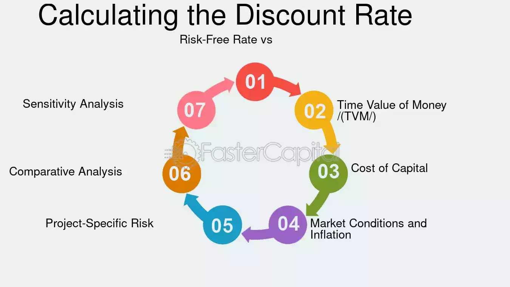

## Table of Contents

## What are discount notes?

Discount notes are a type of short-term debt that companies or governments issue to borrow money. They are called "discount" notes because they are sold at a price lower than their face value. For example, a company might issue a $1,000 note for $950. When the note matures, the buyer gets the full $1,000, making a profit of $50. This difference between the purchase price and the face value is the interest the buyer earns.

These notes usually have a maturity period of less than one year, making them a good option for investors looking for a short-term investment. They are often used by companies to manage their cash flow or to finance short-term projects. Because they are short-term and backed by the issuer's credit, discount notes are considered relatively safe investments, though the level of safety depends on the creditworthiness of the issuer.

## How do discount notes differ from other types of notes?

Discount notes are different from other types of notes mainly because of how they are sold and how they earn money for investors. Unlike other notes that might pay regular interest, discount notes are sold for less than their face value. For example, you might buy a discount note for $950, but when it matures, you get $1,000. The difference, $50, is the interest you earn. This is different from other notes, like coupon notes, which pay interest periodically, usually every six months or a year.

Another difference is that discount notes usually have shorter terms, often less than a year. This makes them good for short-term investments. Other types of notes, like bonds, can have terms that last for many years. Because discount notes are short-term, they are seen as less risky, but this depends on who is issuing them. Companies or governments that issue these notes need to be trusted to pay back the money when the note matures.

## What are the key features of discount notes?

Discount notes are a type of short-term debt that companies or governments use to borrow money. They are called discount notes because they are sold for less than their face value. For example, you might buy a $1,000 note for $950. When the note matures, you get the full $1,000, so you earn $50 as interest. This way of [earning](/wiki/earning-announcement) interest is different from other notes that pay interest regularly.

These notes usually last less than a year, which makes them good for short-term investments. Because they are short-term, they are seen as less risky than longer-term investments, but this depends on how trustworthy the issuer is. Companies and governments that issue these notes need to be reliable to pay back the money when the note matures. So, while discount notes can be a safe way to invest, it's important to check who is issuing them.

## How is the face value of a discount note determined?

The face value of a discount note is the amount of money the buyer will get when the note matures. It's like the final amount promised to the investor. For example, if you buy a discount note with a face value of $1,000, you will receive $1,000 when the note reaches its maturity date, even if you paid less for it initially.

The face value is set by the issuer of the note, which could be a company or a government. They decide on the face value based on how much money they need to borrow and the terms of the note. The face value stays the same throughout the life of the note, but the price you pay to buy it will be lower. This difference between what you pay and the face value is how you earn money from the note.

## What is the discount rate and how is it applied to discount notes?

The discount rate is the percentage difference between the price you pay for a discount note and its face value. For example, if you buy a note for $950 that has a face value of $1,000, the discount rate is 5%. This rate shows how much interest you will earn when the note matures and you get the full face value.

To apply the discount rate to a discount note, the issuer decides on the face value and then calculates the selling price by applying the discount rate. If the face value is $1,000 and the discount rate is 5%, the selling price would be $950. When the note matures, you receive the face value of $1,000, and the $50 difference is your interest earned.

## How do you calculate the purchase price of a discount note?

To calculate the purchase price of a discount note, you start with the face value of the note. The face value is the amount of money you will get when the note matures. Then, you need to know the discount rate. The discount rate is a percentage that shows how much less you pay for the note compared to its face value. For example, if the face value is $1,000 and the discount rate is 5%, you multiply the face value by the discount rate to find out the discount amount. In this case, $1,000 times 5% equals $50.

Next, you subtract the discount amount from the face value to find the purchase price. Using the example from before, if the discount amount is $50, you subtract $50 from the face value of $1,000. This gives you a purchase price of $950. So, you would buy the note for $950 and when it matures, you would get the full $1,000, earning $50 in interest.

## What are the maturity dates typically associated with discount notes?

Discount notes usually have short maturity dates. This means they don't last very long before you get your money back. Most discount notes mature in less than a year. Some might mature in just a few weeks or months.

Because they are short-term, discount notes are good for people who want to invest their money for a little while. They are often used by companies or governments to borrow money quickly and pay it back soon. The exact maturity date is set by the issuer when they create the note, so it can vary, but it's always a short time.

## How can investors assess the yield of a discount note?

To assess the yield of a discount note, investors need to know the purchase price and the face value of the note. The yield is the interest you earn, shown as a percentage of the purchase price. For example, if you buy a note for $950 and its face value is $1,000, you will get $50 when it matures. To find the yield, divide the interest ($50) by the purchase price ($950) and then multiply by 100 to get a percentage. In this case, the yield would be about 5.26%.

It's also important to consider how long you have to wait for the note to mature. The yield is usually shown as an annual rate, even if the note matures in less than a year. If the note matures in 6 months, you would double the yield to get the annual rate. So, if the 6-month yield is 5.26%, the annual yield would be about 10.52%. This helps investors compare the note's return with other investments over a full year.

## What are the risks associated with investing in discount notes?

Investing in discount notes comes with some risks. One main risk is that the issuer might not be able to pay back the money when the note matures. This is called default risk. If the company or government that issued the note runs into financial trouble, you might not get your money back. It's important to check how trustworthy the issuer is before you invest.

Another risk is [interest rate](/wiki/interest-rate-trading-strategies) risk. If interest rates go up after you buy a discount note, other new investments might offer better returns. This could make your discount note less valuable if you want to sell it before it matures. Also, because discount notes usually mature in less than a year, they might not keep up with inflation. If the money you get back at maturity doesn't buy as much as it did when you bought the note, you could lose purchasing power.

## How do market conditions affect the pricing of discount notes?

Market conditions can change how much you pay for a discount note. When interest rates go up, new discount notes will have a higher discount rate to stay competitive. This means you'll pay less for the note, but you'll also get more interest when it matures. On the other hand, if interest rates go down, new discount notes will have a lower discount rate, so you'll pay more for them but get less interest at the end.

The overall economy also plays a role. If people think the economy is doing well, they might be willing to pay more for discount notes because they feel safer about getting their money back. But if the economy is shaky, people might want a bigger discount to feel okay about the risk. So, the price you pay for a discount note can go up or down depending on what's happening in the economy and with interest rates.

## What are some advanced strategies for trading discount notes?

One advanced strategy for trading discount notes is to use them for short-term [liquidity](/wiki/liquidity-risk-premium) management. Investors can buy discount notes when they have extra cash they don't need right away, knowing they will get a good return in a short time. They can then sell these notes before they mature if they need the money back sooner. This is helpful for businesses or individuals who need to manage their cash flow carefully. By watching the market closely, they can buy discount notes when prices are low and sell them when prices go up, making a profit from the difference.

Another strategy is to use discount notes as part of a larger investment portfolio to balance risk. Since discount notes are short-term and usually safer than longer-term investments, they can help reduce the overall risk of a portfolio. Investors might buy discount notes when they think interest rates will go down, because then the value of the notes will go up. They can also use discount notes to hedge against other investments that might be more risky. By carefully choosing when to buy and sell discount notes, investors can take advantage of changes in market conditions to improve their overall investment returns.

## How do tax implications vary for discount notes compared to other investments?

When you invest in discount notes, the way you are taxed can be different from other investments. For discount notes, the interest you earn, which is the difference between what you paid and the face value you get back, is usually taxed as ordinary income. This means you pay taxes on it at your regular income tax rate, just like you would on money you earn from a job. This is different from some other investments, like stocks, where you might pay a lower capital gains tax rate on the profits if you hold them for a long time.

Another thing to know is that with discount notes, you might have to pay taxes on the interest even before you get the money. If you buy a note that matures in more than one year, you might have to report some of the interest each year as it accrues, even though you won't get the money until the note matures. This is called accrual accounting, and it's different from other short-term investments where you only pay taxes when you actually get the interest. It's important to understand these tax rules so you can plan your investments and taxes better.

## References & Further Reading

[1]: ["Advances in Financial Machine Learning"](https://www.amazon.com/Advances-Financial-Machine-Learning-Marcos/dp/1119482089) by Marcos Lopez de Prado

[2]: ["Machine Learning for Algorithmic Trading"](https://github.com/stefan-jansen/machine-learning-for-trading) by Stefan Jansen

[3]: ["Quantitative Trading: How to Build Your Own Algorithmic Trading Business"](https://www.amazon.com/Quantitative-Trading-Build-Algorithmic-Business/dp/1119800064) by Ernest P. Chan

[4]: ["Evidence-Based Technical Analysis: Applying the Scientific Method and Statistical Inference to Trading Signals"](https://www.amazon.com/Evidence-Based-Technical-Analysis-Scientific-Statistical/dp/0470008741) by David Aronson

[5]: Gomber, P., Arndt, B., Lutat, M., & Uhle, T. (2011). ["High-frequency trading"](https://papers.ssrn.com/sol3/papers.cfm?abstract_id=1858626). Wirtschaftsinformatik.

[6]: Treleaven, P., Galas, M., & Lalchand, V. (2013). ["Algorithmic trading review."](https://dl.acm.org/doi/10.1145/2500117) Communications of the ACM.

[7]: Chaboud, A. P., Chiquoine, B., Hjalmarsson, E., & Vega, C. (2014). ["Rise of the machines: Algorithmic trading in the foreign exchange market."](https://www.jstor.org/stable/43612951) Journal of Finance.